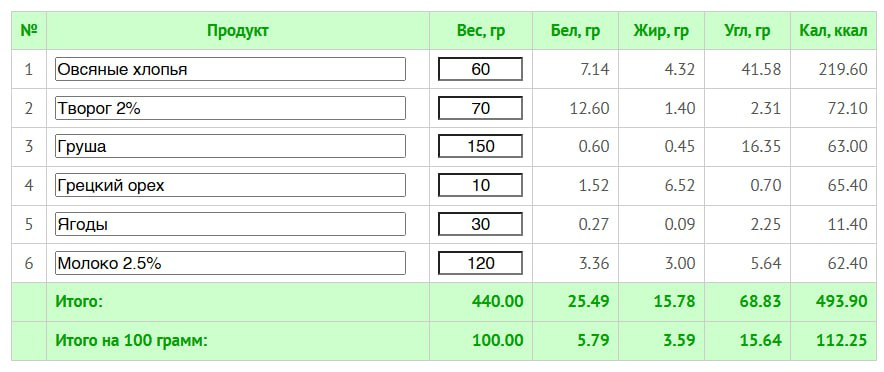

# Авторская овсянка

> Тип: **рецепт** · примерное время: **3 мин**

<!-- step_id: day-07-recipe-author-oatmeal; day: 7; source: telegram-export-message-40 -->

Это моя базовая овсянка. Граммовки ниже — не строгий рецепт, а отправная точка. Калорийность подбирайте под размер вашего привычного завтрака.

## Продукты

- овсяные хлопья — 60 г;
- молоко 2,5% — 120 г;
- рассыпчатый творог 2% — 70 г;
- груша или другой фрукт — 150 г;
- грецкий орех — 10 г;
- ягоды — 30 г.

## БЖУ

## Делай раз. Выберите хлопья

Я использую один из четырёх вариантов:

- «Селяночка» 5 злаков;
- «Геркулес Традиционный»;
- «Геркулес Традиционный» и «Селяночка» 50/50;
- «Геркулес Традиционный» и гречневые хлопья 75/25.

## Делай два. Сварите кашу

1. Смешайте хлопья с молоком один к одному по объёму — примерно один к двум по весу.
2. Переложите в сковороду с большим плоским дном.
3. Под крышкой доведите до первого кипения и сразу выключите огонь.
4. Оставьте на пару минут, затем снова доведите до первого кипения и выключите огонь.
5. Всего доведите кашу до кипения 2–3 раза, делая между нагревами паузы. Ориентируйтесь на готовность по вашим ощущениям.

Я довожу до первого кипения три раза, каждый раз выключаю огонь и оставляю под крышкой на три минуты. Найдите своё время.

В итоге всё молоко впитается в кашу, а не выкипит.

## Делай три. Соберите тарелку

Добавьте творог, орехи, ягоды и фрукт. Грушу можно заменить любым другим фруктом, положить прямо в кашу или съесть отдельно после неё.

