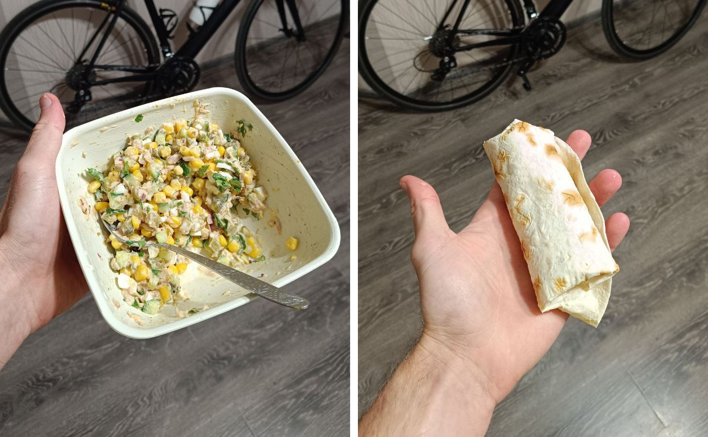

# Вызывайте тунца

> Тип: **рецепт** · примерное время: **9 мин**

<!-- step_id: day-07-recipe-tuna-family; day: 7; source: https://principled-cuticle-21b.notion.site/149585213bab80d6bdbdfab145d5ec06 -->

Давайте сразу к делу. Три рецепта из консервированного тунца, которые легко собираются из того, что завалялось дома, в очень сбалансированные, вкусные и низкокалорийные блюда.

Два попроще, один чуть повыпендрёжнее. Погнали.

Во всех трёх рецептах тунец используется **только в собственном соку**, ни в коем случае не в масле.

## Салат с тунцом и майонезом

Классика.

### Продукты

- тунец — 100 г;
- кукуруза — 100 г;
- яйца — 100 г;
- свежий огурец — 100 г;
- солёный огурец — 40 г;
- белый лук — 40 г;
- зелёный лук — 20 г;
- мацони — 10 г;
- майонез — 10 г;
- дижонская горчица — 5 г;
- чёрный перец — 1 г;
- чеснок — 1 г.

Внимание на БЖУ. Они идеальны =)

Если банка тунца не кратна 100 г, положите любое количество: средняя калорийность салата примерно равна калорийности тунца.

Мацони можно заменить греческим йогуртом или лёгким майонезом. Главное, чтобы итоговая калорийность не уехала далеко от исходной.

Главный совет по приготовлению: вся нарезка должна быть мелкой, размером с кукурузину или чуть крупнее. А тунец — не в труху, а кусочками. Не покупайте тот, который похож на мокрую солому: ищите хоть что-то похожее на кусочки.

Слева салат в миске. Справа — тот же салат, завёрнутый в обычный круглый лаваш диаметром 25 см. Самому салату чуть-чуть не хватает углеводов, поэтому с лавашом будет в самый раз.

## Салат с тунцом и оливковым маслом

Это мой личный фаворит.

### Продукты

- консервированная фасоль без жидкости — 220 г;
- тунец — 120 г;
- помидор без жидкой сердцевины — 120 г;
- красный лук — 60 г;
- солёный огурец — 30 г;
- сладкий перец — 30 г;
- сельдерей — 30 г;
- зелёный лук — 15 г;
- оливковое масло — 15 г;
- уксус — 5 г;
- соль — 3 г;
- чёрный перец — 1 г;
- чеснок — 1 г.

Здесь работает принцип идеальной калории: средняя калорийность салата — около 100 ккал на 100 г. При этом он сбалансирован по БЖУ и может быть полноценным приёмом пищи, в котором достаточно знать вес порции.

Что важно:

1. Помидор режем не как в обычный салат, а как для сальсы: удаляем жидкую сердцевину, а внешнюю оболочку нарезаем мелко, примерно с кукурузину или горошину. Вес указан уже без сердцевины.
2. Сельдерей и сладкий перец взаимозаменяемы. Можно использовать оба или один в двойном количестве. Задача — хруст, ничего больше.
3. Красный лук меньше горчит. Обычный не советую.
4. Уксус можно заменить двойным количеством лимонного сока.
5. Хорошим тоном будет добавить немного оливок.
6. Фасоль взвешиваем без жидкости и промываем под проточной водой.

## Жареный рис с тунцом. Внезапно

Не скажу, что это мой любимый рецепт, но вы точно должны его разок попробовать.

### Продукты

- яйцо — 100 г;
- тунец — 100 г;
- чёрный или дикий рис — 60 г в сухом виде;
- чеснок — 10 г;
- зелёный лук — 10 г плюс немного для подачи;
- оливковое масло — 5 г;
- свежий чили — 5 г;
- соевый соус — 5 г;
- рыбный соус — 5 г;
- сахар — 5 г;
- уксус — 5 г.

Соевый соус, рыбный соус, сахар и уксус собираются в один большой мегасоус)) Точные граммовки здесь всё равно придётся подгонять: я не знаю, какой у вас соус. Начните с моих значений и экспериментируйте.

1. Заранее сварите 60 г сухого риса.
2. Чеснок, свежий острый перец и белую часть зелёного лука отправьте на горячую сковороду с оливковым маслом.
3. Дайте им три-четыре минуты подружиться и отдать вкус маслу.
4. Добавьте готовый чёрный рис. С обычным тоже сработает, но цельнозерновой здесь отлично раскрывается и не мешает.
5. На соседней конфорке сделайте самый неаккуратный омлет на свете.
6. Когда рис прогреется и начнёт чуть-чуть подгорать, добавьте тунца. Жарьте, пока не выпарится случайно попавшая из банки влага.
7. В самом конце полейте мегасоусом, добавьте мелко нарезанный омлет и зелёную часть лука.

Калорийность легко регулировать: убавлять или добавлять по 10 г риса и по одному яйцу. Так порцию можно поместить практически в любой план питания.
