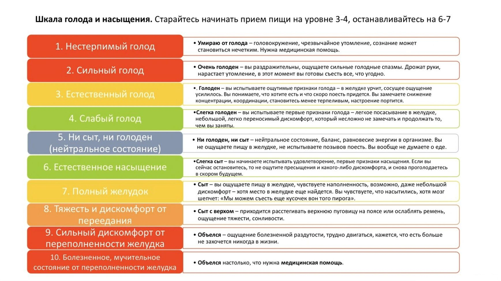
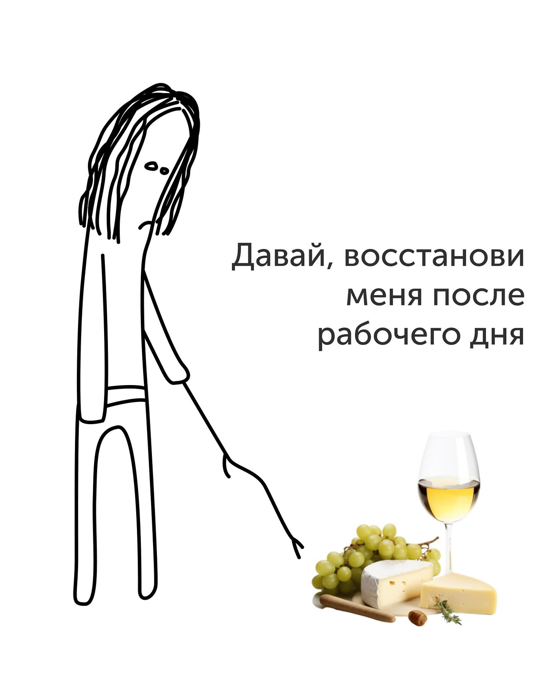
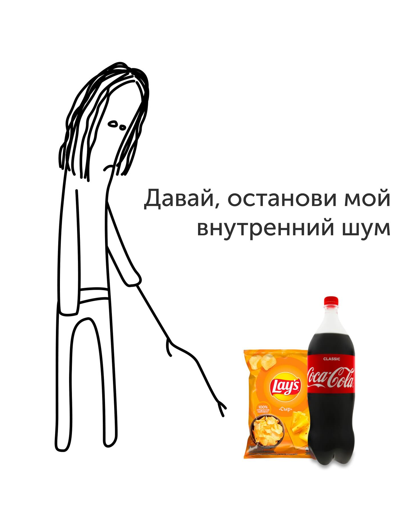
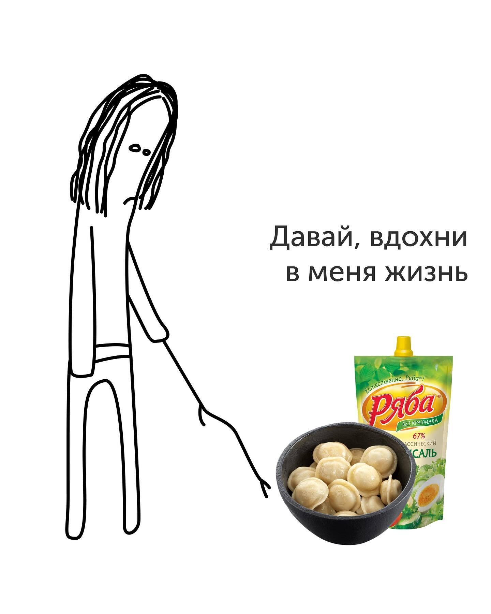
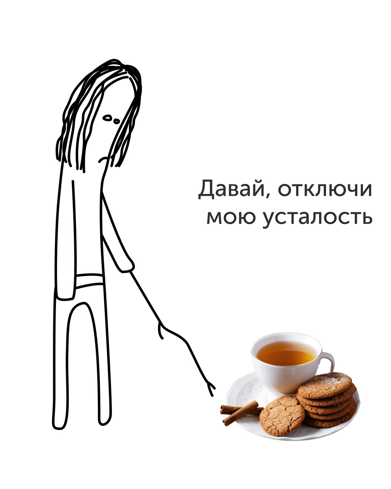
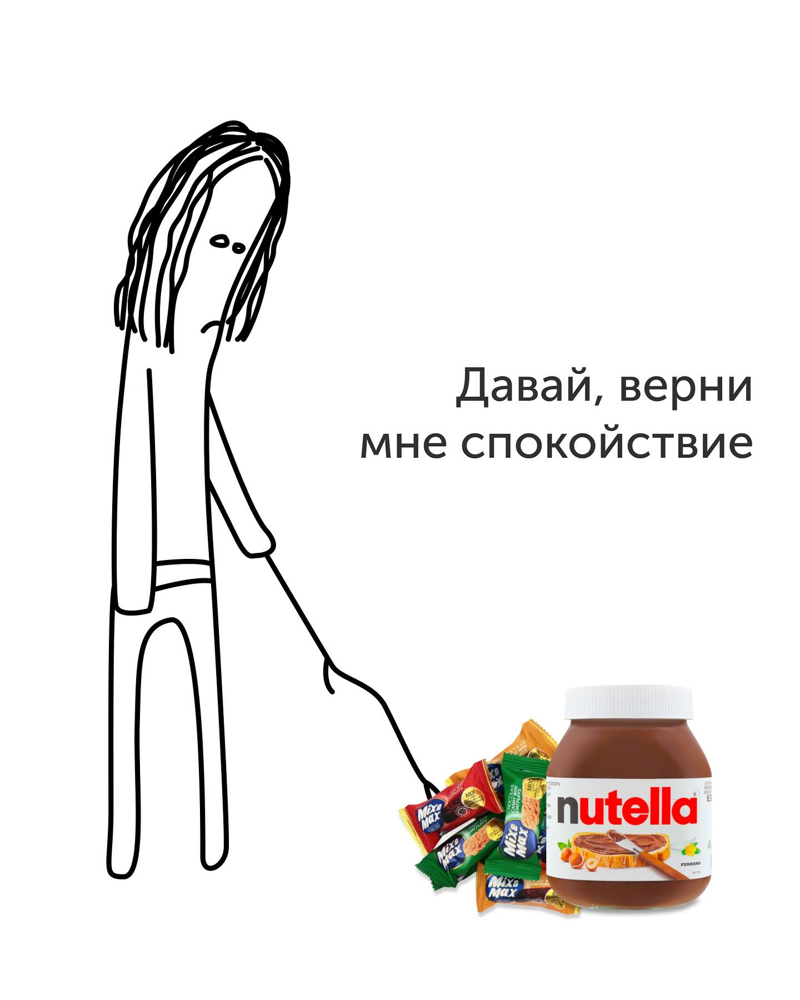

# Гайд по эмоциональному голоду

> Тип: **статья** · примерное время: **11 мин**

<!-- step_id: day-09-article-01; day: 9; source: 67-emotional-hunger-guide.md -->

Начнём с небольшого конспекта по итогам видео:

**Голод**

**Физиологический**

- Объективный
- Чрезмерный (несоответствующий дефициту калорий)

**Эмоциональный**

- Аппетит
- Попытка купировать эмоции

## Физиологический голод

**Объективный голод** — это голод, который пропорционален дефициту калорий. Если дефицит небольшой, голод обычно тоже остаётся небольшим и терпимым. Если дефицит огромный и неадекватный, голод, скорее всего, тоже будет неадекватным, но это нормально. В общем виде он соответствует тому, насколько организму не хватает энергии: чем больше дефицит, тем сложнее его игнорировать.

**Чрезмерный голод** — это физиологический голод, который оказывается заметно сильнее, чем можно было бы ожидать от вашего дефицита калорий. Чаще всего к этому приводит несбалансированное питание по ходу дня и недели, слишком большие перерывы между едой или такие приёмы пищи, после которых насыщения надолго не хватает. Поэтому прежде чем искать у себя глубокие психологические причины, нужно проверить, нормально ли вы вообще ели.

## Эмоциональный голод

**Аппетит** — это желание конкретной еды, вкуса или определённого удовольствия. Вам не просто хочется поесть: вам нужен именно бургер, шоколад, хруст, сливочный вкус или какое-то совершенно определённое блюдо. При этом аппетит не связан с тем, что у вас стресс и его как-то надо заесть именно бургером.

Сам по себе аппетит не является проблемой. Проблема начинается, если аппетит у вас возникает только к условной вредятине, а здоровая еда не вызывает никаких приятных ожиданий. Именно поэтому в системе рецептов мы учимся понимать, чего вы хотите от еды, менять вкусовые предпочтения и получать нужные впечатления не только от случайных продуктов, схваченных по первому импульсу. Вернитесь к материалу **«Как получать от еды то, что вы хотите»**.

**Попытка купировать эмоции** — желание с помощью еды заглушить стресс, тревогу, злость, грусть, скуку, одиночество или усталость; наградить себя, переключиться после тяжёлого дня или просто поставить в нём точку.

И вот с последним есть нюанс: пищевых способов решения этой проблемы не существует. А то, что вы что-то чем-то заедаете, — лишь временные костыли, которые не решают основную проблему. Поэтому с моей стороны «лечение» тоже будет лишь симптоматическим. Об этом — во второй части статьи.

## Шкала голода и сытости

> [!NOTE]
> Не забывайте, что любой голод — это чувство, и оно не обязано с первых признаков сразу приводить к действиям. Чтобы научиться видеть грани голода и реагировать на них по-разному, используйте шкалу голода и сытости.

Желательно помечать в дневнике или хотя бы в голове, какой именно голод стал основной причиной желания поесть: физиологический или эмоциональный. Физиологический голод по ощущениям не всегда получится уверенно разделить на объективный и чрезмерный. А вот при эмоциональном полезно отдельно отмечать, был ли это аппетит или попытка купировать эмоции.

## Итого: наша задача с голодом и сытостью

**Со стороны уровня голода** — учиться игнорировать первые лёгкие позывы, на которые и не надо реагировать, и не пропускать момент, когда мы уже пересекли все красные линии дикого голода.

**Объективный физиологический голод** — наш друг, если вы не перегибаете с дефицитом калорий. Он показывает, когда нам реально нужно поесть.

**Чрезмерный физиологический голод** должен возникать как можно реже. Для этого мы используем принципы сбалансированного питания и работы с пищевым поведением из первой части мастер-класса.

**Физиологическая сытость** не делится на отдельные виды: она отвечает и на объективный, и на чрезмерный голод. Нам нужно, чтобы физиологическая сытость приходила как можно быстрее после окончания приёма пищи, а то и прямо во время него. За это отвечают пищевые привычки. Мы их коснёмся ещё чуть дальше по ходу мастер-класса.

**Эмоциональный голод в виде аппетита** может возникать — и пусть. Наша задача не убрать аппетит, а сделать так, чтобы он появлялся не только к вредной, но и к здоровой еде. **Эмоциональная сытость по аппетиту** тоже должна приходить не только от вредной еды. Как этого добиться, мы как раз разбирали в материале **«Как получать от еды то, что вы хотите»** в системе рецептов.

А вот **попытка купировать эмоции** устроена сложнее. Еда может временно притупить состояние, но далеко не всегда решает ту задачу, из-за которой вы к ней потянулись. Поэтому сначала нужно убедиться, что вы действительно пытаетесь заесть эмоцию, затем понять, чего именно хотите от еды, и только после этого выбирать ответ.

## Шаг первый. Убедитесь, что вы действительно пытаетесь заесть эмоции

Перед тем как искать глубокие психологические причины, спросите себя:

- Когда я последний раз нормально ел?
- Это был полноценный приём пищи или кофе, случайный батончик и обещание поесть позже?
- Было ли сегодня достаточно обычной еды, а не только перекусов?
- Не было ли сегодня слишком больших перерывов между едой?
- Не пытаюсь ли я держать слишком большой дефицит калорий?
- Как давно я вообще нахожусь в дефиците? Если идёт уже восьмая неделя подряд, возможно, накопившийся голод вполне закономерен.
- Не худею ли я быстрее, чем планировал?
- Это желание появилось постепенно или вспыхнуло за несколько секунд?
- Мне подошла бы сейчас обычная еда или нужен только один конкретный продукт?
- Не запрещал ли я себе весь день именно тот продукт, который теперь не выходит из головы?
- Что произошло прямо перед тем, как захотелось есть?
- Что я сейчас чувствую: усталость, скуку, тревогу, злость, обиду, одиночество?
- Еда должна решить какую-то проблему или просто на время отвлечь меня от неё?
- Не сработал ли внешний сигнал: увидел еду, почувствовал запах, открыл доставку, прошёл мимо привычного места?

Иногда нормальный физиологический голод накладывается на тяжёлый день, а сверху добавляется аппетит к конкретной еде. Но в процессе ответов на эти вопросы, думаю, вам станет яснее причина этой тяги.

А если после этих вопросов вы понимаете: «Да, я сейчас пытаюсь именно заесть своё состояние», — переходите к следующему шагу.

## Шаг второй. Поймите, что именно вы хотите получить от еды

Не бегите к холодильнику просто потому, что привыкли делать это сразу. Вставьте между импульсом и действием небольшую паузу и попробуйте объяснить самому себе, как именно еда должна сейчас помочь.

Сначала оцените желание по шкале голода и сытости:

- Насколько оно сильное?
- Какое количество еды, как вам кажется, понадобится, чтобы стало легче?
- Что должно измениться после того, как вы поедите?

А затем разберите саму задачу:

- Какую эмоцию я пытаюсь приглушить?
- Какую проблему я пытаюсь заесть?
- Какого состояния мне сейчас не хватает?
- Мне нужно успокоиться, отвлечься, согреться или почувствовать награду?
- Мне нужно ощущение наполненного рта, живота или просто занять руки?
- Мне хочется долго жевать, хрустеть или сам поход от холодильника туда и обратно уже будет сменой деятельности и позволит переключиться?
- Мне нужен сладкий, солёный, сливочный, горячий или какой-то другой конкретный вкус?
- Мне нужен сам продукт или привычный ритуал вокруг него, который вы выстраивали годами?
- Почему это должна быть именно такая еда?
- Как я пойму, что еда выполнила свою задачу?

Возможно, вы обнаружите, что вам не хватает тепла и хочется держать в руках большую горячую кружку. Или что вы хотите занять руки и рот, чтобы хотя бы полчаса ни о чём не думать. Еда могла стать привычной наградой или единственным понятным способом поставить точку в рабочем дне — не потому, что другого решения нет, а потому, что другого вы в этой ситуации пока не пробовали.

Если пропустить эти вопросы, всё снова сведётся к привычному импульсу и рейду по холодильнику. Понять, что именно вы хотите получить от еды, — первый шаг к тому, чтобы заедание меньше вредило похудению или со временем вообще перестало быть вашим единственным ответом на эмоции.

## Шаг третий. Может ли ту же задачу выполнить другая еда?

Можно ли получить нужное ощущение с помощью здоровой или хотя бы менее вредной еды?

Если вам нужно долго хрустеть и занимать руки, вместо чипсов может сработать мини-морковь. Она тоже хрустит, её тоже можно есть по одной. Другой вариант — попкорн с небольшим количеством жира: он не обязан быть идеальной едой, но может занять руки на те же полчаса и оказаться заметно легче привычной пачки снеков.

Если вам не хватает тепла и уюта, обязательно ли нужен полулитровый раф или латте с сиропом? Возможно, ту же часть задачи выполнит горячий чай, чай с подсластителем или чёрный кофе с подсластителем.

Если хочется набить живот и жевать до тех пор, пока голова наконец не выключится, может ли вместо торта с этой задачей справиться обычный полноценный приём пищи? Даже если вы наедитесь им очень плотно, сбалансированная еда часто даст большой объём и насыщение за меньшее количество калорий.

Если хочется именно вредности, не обязательно отдавать ей весь приём пищи. Оставьте ей часть места, а остальное доберите нормальной едой. Сначала полноценный ужин, затем шоколад. Большая тарелка обычной еды и несколько кусочков пиццы. Фрукты, йогурт и тот десерт, который вам действительно хотелось.

Задача этого шага — не доказать, что шоколад можно магически заменить огурцом. Иногда хочется именно шоколад, и тогда вы можете съесть шоколад. Но между «идеально полезно» и «смести всё, что лежит на кухне» существует много промежуточных вариантов. Если новая еда не суперздоровая, а просто менее вредная и лучше управляемая, это уже подходит.

## Шаг четвёртый. Можно ли получить нужное состояние вообще без еды?

Теперь задайте тот же вопрос ещё раз, но уберите из него еду: каким непищевым способом можно получить хотя бы часть нужных ощущений, которые вы перечислили выше?

- Если вы устали — примите душ, переоденьтесь, выпейте тёплый чай, полежите десять минут, сделайте самомассаж стоп, шеи или воротниковой зоны.
- Попросите партнёра помассировать вам ноги или плечи, сделать оральные ласки. Купите массажёр для головы, масло для самомассажа, зажгите ароматическую свечу или включите музыку, которая действительно вас расслабляет.
- Если скучно — нужен не отдых, а стимул: выйдите из дома, включите музыку, займитесь руками, смените комнату.
- Если одиноко — яблоко проблему не решит. Напишите человеку, позвоните или выйдите туда, где есть люди.
- Если хочется награды — награда должна ощущаться наградой. Это может быть покупка, игра, сериал, освобождённый вечер или просьба к партнёру посидеть с детьми.
- Если еда ставит точку в рабочем дне — придумайте другой ритуал перехода: прогулку, душ, смену одежды, музыку по дороге домой.
- Если вы злитесь или тревожитесь — иногда сначала нужно выписать всё на бумагу, поговорить с человеком, решить конкретную проблему или хотя бы признать, что сейчас вы её не решите.

Это не меню, из которого нужно выбрать любой пункт. Сначала определите задачу. Устали — отдыхайте. Скучно — ищите стимул. Одиноко — ищите человека, а не печенье. И только потом выбирайте конкретное действие.

## Шаг пятый. Подготовьте опорную точку заранее

Если один и тот же сценарий повторяется на работе, дома или по дороге между ними, не надо каждый раз изображать внезапность.

Вернитесь к материалу **«Принцип опорных точек»** и подготовьте под эту ситуацию пищевой или непищевой ответ. Не случайную полезную еду, а решение конкретной задачи: «Когда после этого совещания я хочу заесть стресс, у меня под рукой будет вот это».

Можно оставить на работе не конфеты, а более подходящую еду. Можно заранее собрать дома приём пищи, который даст нужный объём в желудке, тепло в руках или хруст на зубах. Можно договориться с партнёром, что после особенно тяжёлого дня он на двадцать минут заберёт детей, пока вы примете душ и придёте в себя.

> [!NOTE]
> Сформулируйте план одним предложением: **«Если произойдёт вот это, сначала я сделаю вот это, а затем при необходимости съем вот это»**.

## Шаг шестой. Если всё равно хотите гадость — съешьте гадость

Допустим, случилось: вы не просто прочитали всё, что выше, но и выполнили нормальную подготовку. Ответили на вопросы, разобрали прошлые ситуации, придумали пищевой и непищевой ответ и были уверены, что в следующий момент икс сделаете всё иначе.

А потом случился следующий момент икс — и ничего из этого не сработало.

> Расслабьтесь. Если всё равно хотите съесть гадость, разрешите себе и съешьте. Можно даже сказать вслух: **«Сейчас я выбираю это съесть, а в следующий раз я просто снова пройдусь по протоколу»**.

Возьмите то, что выбрали, положите нормальную порцию на тарелку и сделайте еду отдельным действием. Не стойте у холодильника и не доедайте из упаковки между делом, если можете этого избежать.

После этого не надо наказывать себя голодом, отрабатывать еду тренировкой или объявлять весь день испорченным. Просто пообещайте, что в следующий раз попробуете ещё раз пойти другой дорогой.

Вот и всё. Всем чмоки и до завтра!

## Источники

- [The role of emotion in eating behavior and decisions](https://pubmed.ncbi.nlm.nih.gov/38130967/)
- [Emotional Eating Under Negative Affect: A Narrative Review from the Perspectives of Emotion Regulation and Reward Processes in Food Choice](https://pubmed.ncbi.nlm.nih.gov/42280473/)
- [Reproducibility, power and validity of visual analogue scales in assessment of appetite sensations in single test meal studies](https://pubmed.ncbi.nlm.nih.gov/10702749/)
- ['Mindful eating' for reducing emotional eating in patients with overweight or obesity in primary care settings: A randomized controlled trial](https://pubmed.ncbi.nlm.nih.gov/36397211/)
- [Effects of mindfulness-based interventions on obesogenic eating behaviors: A systematic review and meta-analysis](https://pubmed.ncbi.nlm.nih.gov/39489689/)
- [An exploratory component analysis of emotion regulation strategies for improving emotion regulation and emotional eating](https://pubmed.ncbi.nlm.nih.gov/32087282/)
- [Do implementation intentions help to eat a healthy diet? A systematic review and meta-analysis of the empirical evidence](https://pubmed.ncbi.nlm.nih.gov/21056605/)
- [Emotional Eating Interventions for Adults Living With Overweight and Obesity: A Systematic Review and Meta-Analysis of Behaviour Change Techniques](https://pubmed.ncbi.nlm.nih.gov/39763344/)
- [Treatment - Binge eating disorder](https://www.nhs.uk/mental-health/conditions/binge-eating/treatment/)
