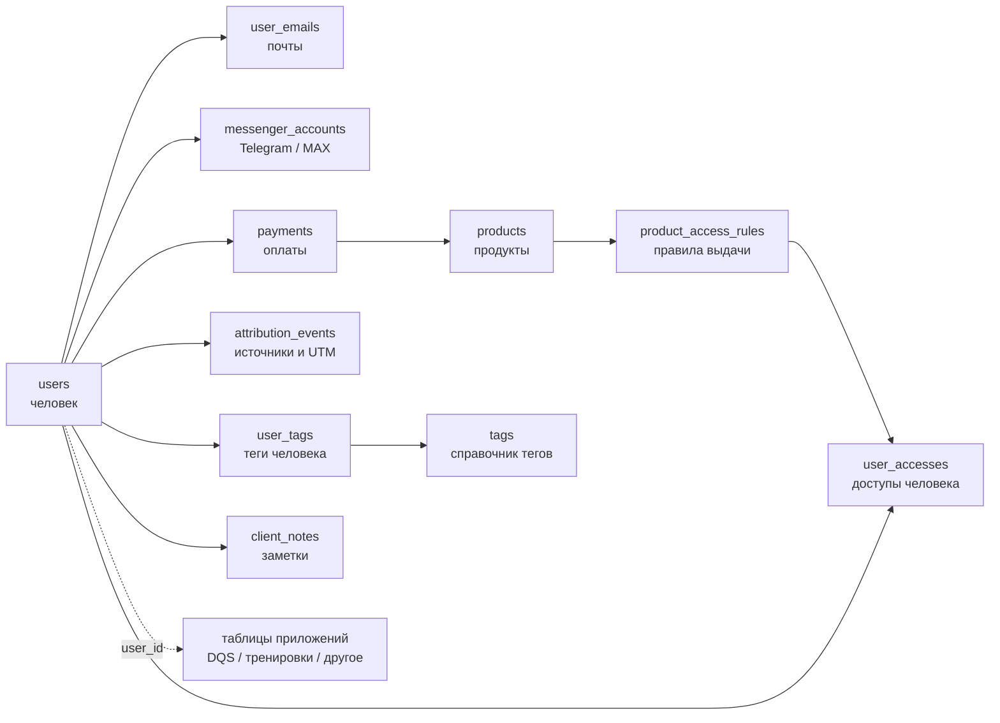

# Паспорт данных Edabalans CRM

Этот документ отвечает на четыре вопроса:

1. Где хранится конкретный вид данных.
2. Как таблицы связаны между собой.
3. Что можно менять вручную, а что заполняется только автоматически.
4. Как добавлять DQS, тренировки и другие приложения, не ломая CRM.

Документ не содержит персональных данных и должен обновляться в той же задаче,
в которой меняется структура PostgreSQL.

## 1. Главная идея

В центре находится `users`: одна строка — один реальный человек. У человека есть
постоянный `users.id`, который называется `user_id` во всех связанных таблицах.

Email, Telegram, оплаты, доступы, теги, заметки и результаты приложений не
складываются в одну строку с сотнями колонок. Каждый тип данных живёт в своей
таблице и ссылается на одного человека через `user_id`. CRM-админка собирает эти
таблицы в одну карточку клиента.

## 2. Путь новых данных

1. Tilda или Telegram находит человека по нормализованному email либо ID
   мессенджера.
2. Если человека ещё нет, создаётся строка в `users`.
3. Контакт добавляется в `user_emails` или `messenger_accounts`.
4. Покупка создаётся в `payments` и связывается с `products`.
5. `product_access_rules` определяет, какие записи создать в `user_accesses`.
6. UTM и источник записываются отдельными событиями в `attribution_events`.
7. Админка показывает всё это как одну карточку, но физически данные остаются
   разделёнными и пригодными для дальнейшего развития.

## 3. Таблицы CRM-ядра

### `users` — человек

Главная запись клиента. Здесь лежат `id`, отображаемое имя, статус, дата первого
появления, происхождение данных (`data_origin`) и ссылка на основную запись, если
дубль когда-либо объединён.

- `legacy_import` означает, что клиент перенесён из старых Google-таблиц и его
  исторические сведения могут быть неполными.
- `native` означает, что клиент создан новой системой после переключения API.

- Родитель для почти всех клиентских таблиц.
- Не хранит покупки, Telegram или результаты приложений внутри одной строки.
- Имя разрешено исправлять через CRM.
- `access_review_status` хранит очередь восстановления старого доступа:
  `waiting_registration`, `pending`, `completed`, `conflict` или `not_required`.
- `tilda_access_status` отдельно фиксирует ручную проверку группы Tilda; это не новый
  тип доступа и не заменяет `user_accesses`.

### `user_emails` — почты человека

Хранит исходный и нормализованный email, признак основного адреса, статус
проверки, источник и дату первого появления.

- Связь: `user_emails.user_id -> users.id`.
- Нормализованный email уникален и используется для поиска клиента.
- Один человек в будущем может иметь несколько адресов.
- При ручной привязке CRM запрещает присоединять email, уже занятый другим `user_id`.

### Исторические покупки и суммы

`payments` является единственной таблицей покупок. `paid` означает денежную операцию
с известными платёжными данными, `confirmed` — достоверный исторический факт покупки,
у которого сумма или дата могут быть неизвестны. `processing` всегда остаётся на
ручной проверке. Ни `confirmed`, ни старый тег сами по себе не выдают доступ.

### Архив тегов

Старые назначения в `user_tags` не удаляются. `tags.status=archived` скрывает
устаревший тег из обычной карточки; `merged` направляет несколько старых написаний в
одно каноническое название; `review` оставляет неоднозначный тег на доске разбора.
Источники переносятся в `attribution_events`, а текущая подписка хранится в
`messenger_accounts.subscription_status` и должна обновляться живой проверкой бота.

### `user_phones` — телефоны человека

Хранит исходный и нормализованный номер, источник и признак основного номера.

- Связь: `user_phones.user_id -> users.id`.
- Телефон из старого LeadTeh сохраняется как контакт, но не используется для
  автоматического объединения людей.

### `messenger_accounts` — аккаунты мессенджеров

Хранит платформу (`telegram`, позднее `max`), внутренний ID платформы, username,
имя, даты первого/последнего появления и источник связи.

- Связь: `messenger_accounts.user_id -> users.id`.
- Пара «платформа + platform_user_id» уникальна.
- Telegram-движок не хранится здесь: здесь хранится только связь с человеком.

### `payments` — неизменяемая история оплат

Одна строка — одна операция оплаты. Хранит внешние ID заказа и платежа, клиента,
продукт, сумму, валюту, статус, платёжную систему, даты, форму, referer и исходный
payload источника.

В обычной CRM показываются нормальное название продукта из `products` и сумма в
отдельных полях. Длинная исходная строка Tilda сохраняется в
`payments.product_name_raw` только для технической сверки и в интерфейсе не
мешает.

- Связи: `payments.user_id -> users.id`, `payments.product_id -> products.id`.
- Повторный webhook не создаёт вторую оплату с тем же внешним ID.
- Старую оплату не переписывают вручную: исправления делаются отдельной
  контролируемой операцией.

### `attribution_events` — путь и источники

Хранит отдельные события привлечения: источник, UTM-метки, реферальный код,
landing URL и время события.

- Связь: `attribution_events.user_id -> users.id`.
- У человека может быть много касаний, поэтому это не набор колонок в `users`.

### `tags` и `user_tags` — сегменты

`tags` — единый справочник тегов. `user_tags` связывает тег с человеком и хранит
источник назначения.

- Связи: `user_tags.user_id -> users.id`, `user_tags.tag_id -> tags.id`.
- Один и тот же тег нельзя дважды назначить одному человеку.
- Ручные теги можно добавлять из карточки клиента.
- Название тега может быть русским, содержать пробелы и свободно переименовываться.
- `category` разделяет ручные пометки, подписку, контентные действия, рассылки,
  источники, исторические сигналы о покупке, лотерею и служебные теги.
- `status=ignored` скрывает ненужный тег без удаления назначений.
- При объединении `merged_into_tag_id` указывает на основной тег. Старые
  назначения сохраняются, поэтому объединение обратимо.

Покупка остаётся фактом в `payments`, даже если из LeadTeh импортирован
исторический тег `МК Оплатил`. Такой тег можно использовать для поиска и сверки,
но он сам не создаёт оплату или доступ.

### `client_notes` — заметки владельца

Хранит текст заметки, автора и время создания.

- Связь: `client_notes.user_id -> users.id`.
- Заметки добавляются из CRM и не перезаписывают исходные данные клиента.

## 4. Продукты и доступы

### `products` — что было продано

Справочник продуктов с постоянным кодом, понятным названием и статусом.

### `product_aliases` — названия продукта во внешних системах

Связывает точное историческое название из Tilda/Google/другого источника с
нормальным продуктом из `products`.

- Связь: `product_aliases.product_id -> products.id`.
- Позволяет не размножать продукты из-за разных текстов в формах.

### `resources` — что фактически получает клиент

Справочник выдаваемых возможностей: мастер-класс, рецепты, консультация,
сопровождение, калории, приложение тренировок и будущие ресурсы.

Необновляемые старые материалы Tilda представлены отдельными ресурсами
`ACCESS_MASTERCLASS_LEGACY` и `ACCESS_CALORIES_LEGACY`. Они намеренно не заменяют
актуальные `ACCESS_MASTERCLASS` и `ACCESS_CALORIES`: наличие старого права не открывает
новые материалы.

### `product_access_rules` — продукт превращается в набор доступов

Связывает продукт с ресурсами и может иметь даты начала/окончания правила.

- Связи: к `products` и `resources`.
- Именно здесь зафиксировано историческое правило: старый «Стандартный» до
  20.08.2026 включает калории, новый — нет.

### `user_accesses` — что разрешено конкретному человеку

Факт выдачи ресурса: кому, что, по какой оплате, когда выдано, когда истекает или
отозвано.

- Связи: к `users`, `resources` и при покупке к `payments`.
- Приложения должны проверять эту таблицу через API, а не читать текст тарифа.

## 5. Технический контроль

### `import_batches`

Один запуск импорта: источник, статус, начало, окончание и итоговые счётчики.

### `legacy_import_records`

Журнал каждой исходной строки Google-таблиц: откуда пришла, импортирована ли,
почему требует проверки, с каким пользователем и оплатой связана. Нужен для
аудита и безопасного повторного импорта.

Каноничный снимок Tilda Members Area также хранится здесь с источником вида
`tilda_members_YYYYMMDDTHHMMSS`. В `raw_payload` сохраняются исходные группы, статус
аккаунта, даты регистрации/активности и точный список сопоставленных ресурсов. Сам CSV
и персональные данные не помещаются в GitHub.

`import_batches` и `legacy_import_records` пока не удаляются: до переключения
Tilda, Telegram и приложений они позволяют доказать полноту переноса и безопасно
повторить его. После подтверждённого переключения их можно архивировать и удалить
отдельной обратимой миграцией. В повседневной CRM эти таблицы не показываются.

### `user_merge_events`

История контролируемого объединения дублей: какая запись вошла в какую и почему.

### `alembic_version`

Техническая отметка версии схемы. Её не редактируют вручную.

## 6. Представления NocoDB

`crm_users_view` — удобный сводный список клиентов.

`crm_payments_view` — удобный сводный список оплат.

Представления ничего не копируют и не являются отдельным источником истины. Они
показывают результат соединения основных таблиц. NocoDB подключена в режиме
чтения, чтобы случайно не повредить структуру.

## 7. Как добавляются приложения

DQS, тренировки, карточка метаболизма и другие приложения получают собственные
таблицы. В них обязательно есть `user_id -> users.id`.

Пример будущего блока DQS:

- `dqs_assessments`: одна попытка заполнения, дата, итоговый балл, версия анкеты;
- `dqs_answers`: ответы внутри конкретной попытки;
- обе таблицы связаны с `users`, но не добавляют сотни колонок в CRM-ядро.

Пример блока тренировок:

- `training_programs`, `training_sessions`, `training_exercises`,
  `training_sets`;
- клиент определяется тем же `user_id`;
- CRM может показать краткую сводку, а подробный журнал остаётся в своём разделе.

Перед созданием таблиц нового приложения сначала фиксируются его сущности,
история изменений и правила удаления. Затем создаётся Alembic-миграция,
обновляется этот документ и только после этого код публикуется на сервере.

## 8. Что где разрешено менять

| Данные | Где менять | Правило |
|---|---|---|
| Имя клиента | CRM | Можно исправлять |
| Заметки и ручные теги | CRM | Можно добавлять |
| Названия, группы и объединение тегов | CRM → «Теги» | Исходные назначения сохраняются |
| Оплаты | Webhook/API | Вручную не переписывать |
| Доступы | Правила продукта/API | Не редактировать напрямую в NocoDB |
| Структура таблиц | Alembic в GitHub | Не менять через NocoDB |
| Сырые данные импорта | Только чтение | Нужны для аудита |
| Данные приложений | API соответствующего приложения | Всегда связаны через `user_id` |

## 9. Неподвижные правила архитектуры

1. PostgreSQL — единственный источник истины автоматизированного контура.
2. Один человек имеет один основной `users.id`.
3. Email нормализуется перед поиском; регистр букв не создаёт нового человека.
4. Оплаты и история событий не превращаются в перезаписываемые поля клиента.
5. Права проверяются по `user_accesses`, а не по названию тарифа.
6. NocoDB не управляет схемой и не заменяет CRM.
7. Изменение схемы выполняется только Alembic-миграцией из GitHub.
8. Новая таблица документируется здесь одновременно с её созданием.
