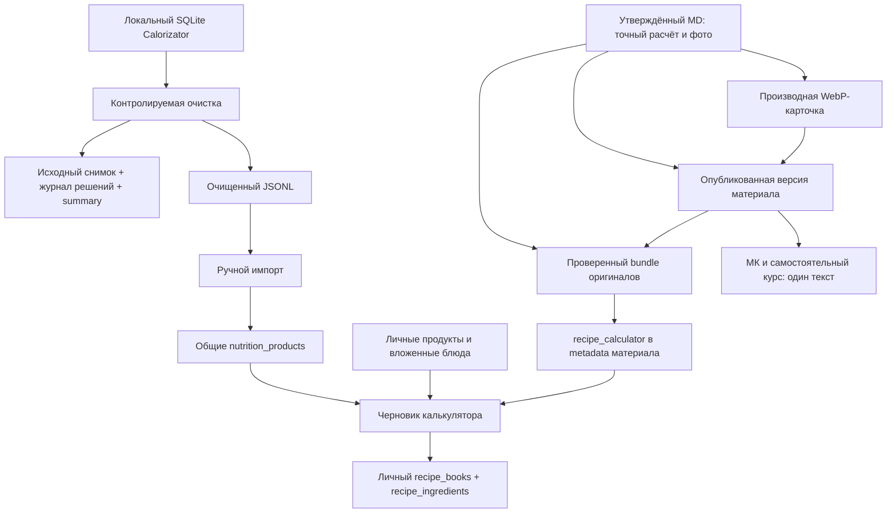

# Контур рецептов

Статус: `current`  
Модуль: `products.recipes`  
Проверено: 03.10.2026

Это вход для любого чата, который работает с продуктами и КБЖУ, рецептом,
его материалом, карточкой, приложением или доступом. Контур связывает существующие
модули; каждый факт остаётся у своего владельца. Рабочая папка другого чата,
handoff и изображение не заменяют канон или действующую опубликованную версию.

## Что здесь называется каталогом

| Объект | Назначение и источник |
|---|---|
| Каталог продуктов | Ингредиенты на 100 г: очищенный общий набор и личные продукты. Правила и история обработки — [база продуктов](../../backend/data/recipe_catalog/README.md). |
| Встроенный каталог приложения | Авторские оригиналы с полным расчётом, прикреплённые к опубликованным материалам. Человек открывает черновик и сохраняет личную версию. |
| «Мои рецепты» | Сохранённые блюда текущего пользователя; могут использоваться как ингредиенты других его блюд. |
| Полный каталог материалов | Одна статья МК `day-15-recipes-part-2`, тематические группы и ссылки на отдельные рецепты/семьи вариантов и способы обработки. В самостоятельном курсе переиспользуется как «Все рецепты». |
| Первая подборка | Статья дня 7 с ограниченной подборкой и ссылками на те же материалы дня 15; пополнение полного каталога не расширяет её автоматически. |

Калькулятор предназначен для разработки рецепта и исследования вклада
ингредиентов, а не для дневника питания. Готовые итоги человек переносит в своё
приложение учёта вручную. Учебный курс и калькулятор — самостоятельные поверхности.

## Маршрут по задаче и владельцы

| Что меняем или выясняем | Сначала открыть | Владелец |
|---|---|---|
| Приложение, вычисление, сохранение, оригиналы, обучение | [Контракт приложения и курса](modules/catalog/products.recipes.md) | `products.recipes` |
| Источник продуктов, звёздочка, бренды, объединение, среднее, исключение, импорт/возврат | [README базы](../../backend/data/recipe_catalog/README.md) и журнал решений соответствующей Git-ревизии | `products.recipes` |
| Состав и точный расчёт авторского блюда, рабочий MD, вид карточки | [Материалы и карточки](../../content/masterclass/recipes/README.md) | `products.masterclass.course` |
| Авторский текст, разрешения редактуры, согласование | [Редакционная система](EDITORIAL_PRODUCT_SYSTEM.md), [протокол работы](CONTENT_COLLABORATION_STANDARD.md), общий `edabalans-writer` и [специализация рецептов](../../content/author-voice/skill/edabalans-recipes/SKILL.md) | `platform.content` |
| Фото, графика, новый визуальный вариант | [Единый центр «Художник»](../../content/design-workflow/image-generation-protocol.md), затем стандарт карточки | `platform.web_design`; данные блюда остаются у владельца материала |
| Структура МК, опубликованная статья и её версии | [Материалы курса](modules/catalog/products.masterclass.course.md) | `products.masterclass.course`; общий каталог/версии — `platform.content` |
| Кабинет, вход, ресурс приложения, право курса | [Платформа приложений](../APPLICATION_PLATFORM.md), [правила доступа](ACCESS_RULES.md), затем контракт recipes | `products`, `platform.auth`, `platform.commerce` |
| Название продукта, домен или контакт | [Идентичность проекта](PROJECT_IDENTITY.md) → действующий каталог | `products.catalog` |
| Выпуск, backup и восстановление | [Операции](../OPERATIONS.md) | операционный контур проекта |

Точный ownership файлов и связи принадлежат [registry](../modules.toml).
Детальные API, таблицы и символы показывает generated inventory. Новый чат выбирает
нужную ветку таблицы, читает её источники и обновляет владельца факта; второй
стандарт расчёта, голоса, изображений или доступа не создаёт.

## Путь данных

База ингредиентов и точный авторский расчёт — разные входы. Оригинал переносит
вклад своих исходных строк, даже если названия похожи на общий каталог. При
загрузке оригинала нельзя подменять его состав средними из поиска или извлекать
коэффициенты из округлённой картинки.

## Открытие и права

Рабочий прямой вход калькулятора — `https://edabalans.ru/recipes`; совместимый
адрес — `/recipe-calculator`. Он использует существующий loader, браузерный
нативный вход или Telegram Mini App и единый `user_id`. Выдача HTML оболочки сама
по себе не подтверждает доступ к данным: API проверяет сессию и ресурс `recipes`.

| Поверхность | Действующий договор |
|---|---|
| Калькулятор, общий поиск, личные блюда и оригиналы | Ресурс `recipes`; сведения пользователя определяются сессией. |
| Самостоятельный учебный курс, включая подробную статью по ссылке из оригинала | `ACCESS_RECIPES`, отдельный маршрут курса, действующая публикация и ограничения материала. |
| Полный каталог внутри МК | Правила дня/прогресса МК и `ACCESS_RECIPES` каталога. Прямое открытие его вложенного рецепта имеет отдельные правила из стандарта материалов. |

Покупка или выдача одного права не превращается в другое. Калорийный курс
выдаёт сопутствующий ресурс калькулятора по общей платформе, но это не обещает
полный учебный курс рецептов. Ссылка в примечании ведёт через его resolver
`/lk?open=recipes:day-15-recipe-*` и сохраняет проверку доступа.
Первый туториал, его серверное событие, повторное открытие и тестовый режим
ПК/Телефон описаны в контракте приложения; эти настройки не выдают новых прав.

## Где хранятся данные и доказательства

| Слой | Хранилище и смысл |
|---|---|
| Входная пищевая база | Локальный `data/calorizator/calorizator.sqlite`; читается без записи, не включается в Git. |
| Принятый набор и решения очистки | Четыре версионируемых файла `backend/data/recipe_catalog/`; это вход импортёра, не выгрузка личных данных. |
| Продукты приложения | PostgreSQL `nutrition_products`: общий владелец `NULL` либо конкретный пользователь; значения на 100 г. |
| Сохранённые личные блюда | PostgreSQL `recipe_books`: владелец, название, выход, порция, примечания, версия и мягкое удаление; `recipe_ingredients`: состав, граммы и один источник строки. |
| Авторская рабочая основа | Утверждённый MD, исходные фото/скриншоты и архив в приватной авторской сборке; адреса текущего пакета и генератора — в стандарте материалов. |
| Опубликованный текст | Общий каталог `ContentItem`/версии материала, активная структура курса в `managed_documents`. Рабочий MD и JSON сборки не считаются автоматически опубликованными. |
| Оригинал для вычисления | Namespace `recipe_calculator` в metadata того же материала: версия публикации, hash утверждённого MD, активность и точные строки. |
| Опубликованная картинка | Ассет курса в `content/masterclass/editorial/assets/15-recipes/…`; выдача по `/course-assets/masterclass/media/…`. PNG-мастер остаётся локальным. |
| Завершение первого обучения | Событие `recipes_tutorial_completed` по `user_id` в существующем журнале `MasterclassEvent`. |
| Проверка и выпуск | Приватные bundle/отчёты/evidence вне Git под `D:/Codex`; Git и CI определяют версию кода, deployed SHA и smoke — фактический выпуск. |

### Как отвечать «что и когда меняли»

Для продукта искать его `source_url` в исходном снимке и `curation-log.jsonl`,
затем группу/новый `canonical_source_url` в активном наборе. Поля журнала и
восстановление описывает README базы. Историю разных сборок брать из Git
соответствующих файлов и скрипта; hash в `summary.json` связывает сборку с SQLite.
Журнал фиксирует решения конкретной сборки, а не время скачивания и не все
операции production. Вывод импортёра сообщает created/updated/deactivated;
отчёт применения сохраняется в evidence выпуска. Отдельного постоянного
SQL-журнала каждой правки продуктового каталога сейчас нет.

У материалов есть версии публикации; у структуры курса — её редакции. Bundle,
hash MD и отчёт синхронизации объясняют, из какой основы загружены оригиналы.
Metadata оригиналов обновляется вручную, это не отдельный архив всех редакций.
У личного блюда `version` защищает от одновременного сохранения, но не является
историей содержимого с откатом. Событие туториала не используется как журнал
редактирования рецептов. Нельзя обещать такие журналы по наличию счётчика версии.

## Согласование изменений между частями

Изменение общего набора проходит очистку, проверку решений и контролируемый
импорт; файлы в новом backend-образе сами не меняют PostgreSQL. Для правки
авторского рецепта сначала обновляют его утверждённую основу, точный расчёт и
производные карточки, затем публикуют материал и отдельно синхронизируют оригинал.
Деплой приложения не публикует авторскую статью и не применяет bundle оригиналов.

Оригинал с несовпадающей версией материала скрывается из встроенного каталога
до повторной синхронизации. Материал без полного исходного БЖУ остаётся
неактивным для калькулятора. Обычный пост «Способ обработки продуктов» может
быть доступен в учебном каталоге без расчётной карточки.

Уже сохранённая личная копия оригинала содержит точные снимки строк и переживает
обновление оригинала. Связь с обычным личным продуктом или вложенным блюдом
остаётся живой; их редактирование влияет на расчёт использующих их блюд.
Правила замены общего среднего и скрытия источника — в README базы и контракте.

При изменении цветов/таблицы сверяют приложение со стандартом карточки.
Растровый экспорт и интерактивный UI имеют разные средства ввода, но одно
значение цветов, точных вкладов и итогов. Изменение CSS само по себе не
перегенерирует опубликованные WebP. Авторский текст, оформление и вычислительные
данные согласуют по владельцам из маршрутной таблицы.

## Проверка готовности

Для нового рецепта нужны утверждённый MD и архив основы, проверенный точный
расчёт либо явно неизвестные данные, готовые карточки и ассеты по их стандарту,
редакционная проверка, опубликованная версия материала и правильное место в
общем каталоге. Если рецепт должен открываться в калькуляторе, дополнительно
проверяют bundle, его ожидаемую версию/hash, активность и итог чтения оригинала.

Для каталога продуктов проверяют связь исходника и summary, соответствие
журнала активному набору, профильные проверки очистки/импорта и восстановление.
Production-операции проходят существующие правила backup/разрешений; эта
документация не означает запуска импорта, публикации текста или генерации фото.

Для приложения проверяют доступ и приватность, точный расчёт, сохранение/
конфликт версий, зависимости источников, оригиналы и обучение. Изменённый UI
проверяют на телефоне; профильные browser/API проверки находятся у модуля.
Меняющийся перечень рецептов и количество продуктов берут из опубликованного
runtime/summary, а не поддерживают вторым списком в документации.
