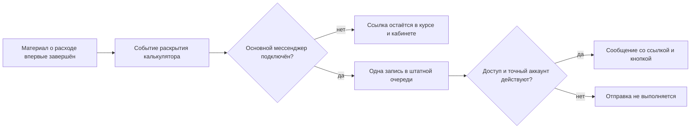

# Исполняемый контур Калорийного курса

Статус: `current`
Состояние внедрения: трёхмодульная редакция реализована локально и проходит приёмку.
Начальная migration применена; дополнительная migration часового пояса ожидает выпуска.
Владелец содержания: Сергей Воронцов
Модуль: `products.calories`

## Вход и доступ

Курс запускается внутри существующего личного кабинета. Backend получает
`user_id` из штатной сессии кабинета, проверяет действующий `ACCESS_CALORIES`
и завершение Мастер-класса. Переданный в URL email не является удостоверением
личности. Курс не создаёт второй вход или свою сессию.

До выполнения обоих условий запуска — все видимые статьи опубликованы и
`launchReady = true` — пользовательские course API отвечают
`course_preparing`. Поэтому прямой URL не обходит закрытую карточку кабинета и
не показывает редакционные заглушки участнику.

Прямые ссылки используют `calories_stage` и `calories_material`. Кабинет сначала
проверяет доступ, затем открывает приложение `calories-course` и передаёт ему
маршрут. Адрес возврата очищается от параметров обоих курсов.

## Правила прохождения

1. Этап 1 открывается при первом запуске.
2. Обязательные шаги этапа завершаются сверху вниз явным действием читателя.
3. После всех обязательных шагов открывается чек-лист задания.
4. Этап завершается после всех обязательных галочек.
5. Следующий этап открывается в 06:00 следующих календарных суток после более
   поздней местной даты открытия/завершения текущего этапа. Правило едино с МК;
   часовой пояс сохраняется при первом открытии и не меняется от перезагрузки.
6. При первой фиксации этапа сохраняются ID обязательных шагов и заданий активной
   редакции. Скрытие материала не ломает уже начатое прохождение.
7. Структура и обычные статьи версионируются отдельно.
8. Материал о расходе второго модуля ведёт в существующее приложение
   `metabolism`; оно использует то же состояние калькулятора, что и вне курса.
   Пользовательский API калькулятора проверяет завершение Мастер-класса и действующий
   `ACCESS_CALORIES`: купленный Калорийный курс не открывает инструмент раньше своей
   очереди. Карточка приложения в ЛК показывает условие до разблокировки.
   Персональный `fully_unlocked` для `ACCESS_CALORIES` открывает калькулятор без
   ожидания завершения Мастер-класса, но не заменяет
   действующее право и согласия. Ремонт курса этим правилом не снимается.

## Данные

- `managed_document_versions`, ключ `calories` — редакции структуры;
- `content_items` и `content_item_versions`, источник
  `calories-course-materials` — статьи;
- `course_stage_progress` — открытие, часовой пояс, задание, галочки и завершение этапа;
- `course_step_progress` — завершённые шаги;
- `course_events` — идемпотентные факты прохождения.

Все три таблицы прохождения содержат `course_code`, чтобы не создавать новый тип
таблиц для каждого будущего этапного курса. Сейчас их первый владелец —
`products.calories`.

## API

- `GET /api/calories/course/manifest?email=...` — активная структура;
- `GET /api/calories/course?email=...` — доступность и прогресс;
- `GET /api/calories/course/materials?email=...&step_id=...` — опубликованный текст
  запрошенного материала в пределах доступных этапов, без загрузки всего корпуса;
- `POST /api/calories/course/days/{stage}/open` — открыть этап;
- `POST /api/calories/course/days/{stage}/steps/{index}/complete` — завершить шаг;
- `POST /api/calories/course/days/{stage}/task/open` — открыть задание;
- `PUT /api/calories/course/days/{stage}/checks/{index}` — сохранить галочку.

Внешний путь пока сохраняет слово `days`, потому что клиентская оболочка общая с
Мастер-классом; предметный payload одновременно отдаёт `stages` и совместимый
алиас `days`. В интерфейсе пользователь видит только этапы.

## События и сообщения

Runtime записывает:

- `calories_course_opened`;
- `calories_stage_opened`;
- `calories_material_completed`;
- `calories_stage_assignment_opened`;
- `calories_stage_completed`;
- `calories_course_completed`.

События не содержат дневник, вес или ответы пользователя. После первого завершения
материала с `revealApp = metabolism` создаётся штатный `app_revealed_metabolism`:
калькулятор становится виден в меню приложений бота. В выбранный основной
подключённый мессенджер ставится одна `metabolism_app_link` через существующий
dispatcher уведомлений. Повторное завершение не создаёт повторную отправку.
Если мессенджер не подключён, автоматического сообщения нет; ссылка остаётся
в материале и кабинете, после подключения калькулятор доступен в меню бота.

Текст дословно утверждён владельцем 25.09.2026. Редактируемый слот
`tpl_postpurchase_metabolism_app_link` и граф `calories_service_delivery` создаёт
`telegram-bot/service/app/calorie_application_delivery.py`; повторный seed не
переписывает редакторский текст или граф. Dispatcher повторно проверяет
`ACCESS_CALORIES` и точный связанный аккаунт назначения; сообщение не уходит
в другой мессенджер. Старым участникам при deploy ничего не рассылается.

Автопроверки: повторное завершение, отсутствие/отзыв права, точный получатель,
чужая платформа, идемпотентный seed, сохранение редакторской правки и отсутствие
повторной доставки. Реальным участникам тестовые сообщения не отправляются.

## Публикация материалов

Обычная статья публикуется через общий административный API курса с
`course_code = calories` либо `tools/publish_course_material.py --course calories`.
Публикация статьи не меняет структуру и прогресс. До готовности всех текстов курс
остаётся закрытым. Старый пятиэтапный manifest в базе не обновляется заменой seed:
переход на три модуля выполняется отдельной версией структуры после проверки,
что старое прохождение никто не начал. При наличии прогресса нужна отдельная
согласованная карта переноса, а не обнуление данных.

Кабинет считает курс готовым только когда опубликованы все видимые статьи и в
активной структуре включён `launchReady`. Статический каталог держит продукт
закрытым по умолчанию; вычисляемая готовность применяется только к карточке
Калорийного курса. Переключатель находится в редакторе структуры, а список курсов
показывает число опубликованных статей.

Migration `20260828_0028` создала таблицы прогресса и событий; на production она
уже применена. `20260925_0048` добавляет сохраняемый часовой пояс; владелец разрешил
её выпуск 25.09.2026 вместе с проверенным курсом.

## Программа и оформление

Принятая редакция от 25.09.2026: три модуля, 12 учебных статей и три завершающих
материала. Состав, стабильные ID, порядок и формулировки чек-листов принадлежат
активной структуре; исходная версия для выпуска — `content/calories/course/course.json`.

В меню сразу показаны названия материалов, сгруппированные под прописными
названиями модулей. Отдельных страниц дня нет. Цвета скобочек по порядку:
фиолетовый, золотой, зелёный. Типографика, тема и навигация наследуются из МК.

Учебные статьи заканчиваются заголовком «Что я хочу от вас после прочтения этого
материала» и коротким обычным списком. Завершающие материалы содержат сохраняемые
галочки без зелёного контейнера; они открываются после обязательных статей и
не требуют отдельной отметки «прочитано» перед собственным чек-листом.

«Что дальше» содержит сначала задания последнего модуля, затем заключение и
существующий универсальный блок предложений кабинета. Это не отдельный пункт меню.
Межкурсовые ссылки и окно описания — по §17 `../masterclass/COURSE_STRUCTURE_CONTRACT.md`.
Они не включают продажу незаконченного тренировочного курса.
