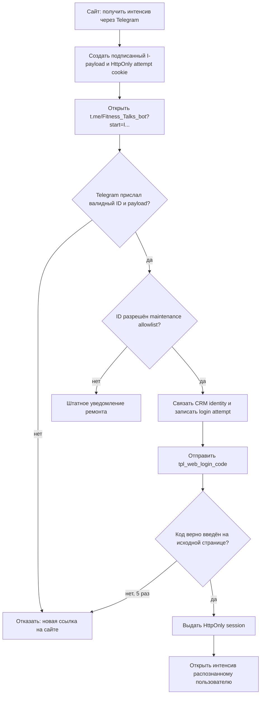

# Вход в бесплатный интенсив через Telegram

## Назначение и граница

Пользователь начинает на открытой странице без email и пароля, подтверждает себя
в `@Fitness_Talks_bot` и возвращается на сайт распознанным. Модуль владеет только
короткой попыткой входа и браузерной сессией интенсива. Welcome, рассылки,
содержание дней и привязка уже известного участника Мастер-класса остаются в
соседних модулях.

## Контракт

1. Сайт создаёт HMAC-подписанный payload `I…` со случайным nonce и сроком 15 минут.
2. В payload нет email, `user_id`, Telegram ID или другого открытого идентификатора.
3. Telegram передаёт боту `/start I…` вместе с фактическим Telegram ID.
4. Consumer проверяет подпись и срок, использует существующую CRM-идентичность,
   записывает результат и отправляет шестизначный код в Telegram.
5. Пользователь вводит код на исходной странице. Пять ошибок блокируют попытку;
   в базе хранится только SHA-256 кода.
6. Только после верного кода сайт выдаёт суточную HttpOnly-сессию и удаляет cookie
   попытки. Пересланный deep link без кода не даёт сессию исходному браузеру.
7. Поддельная, истёкшая и повторно использованная ссылка вход не создаёт.

Успешное подтверждение отправляет опубликованный редакционный слот
`tpl_web_login_code`; ошибки также используют опубликованные системные слоты. В maintenance-режиме обработка доступна только ID из
серверного allowlist; остальные получают штатное уведомление ремонта.

## Ошибки и данные

- секрет подписи берётся только из `APP_AUTH_SECRET` runtime;
- в таблице хранится SHA-256 nonce, но не открытый deep-link payload;
- Telegram ID и связь с `user_id` являются постоянными персональными данными;
- откат кода не требует удаления добавочной таблицы;
- очистка истёкших попыток может выполняться отдельной эксплуатационной задачей,
  но не влияет на корректность входа.

## Проверка

- валидный payload связывает фактический Telegram ID и браузерную попытку;
- подделанный, просроченный и повторный payload ничего не связывает;
- другой браузер без attempt cookie не получает результат;
- maintenance allowlist не расширяется;
- страница после подтверждения показывает пользователя и открывает материал.
