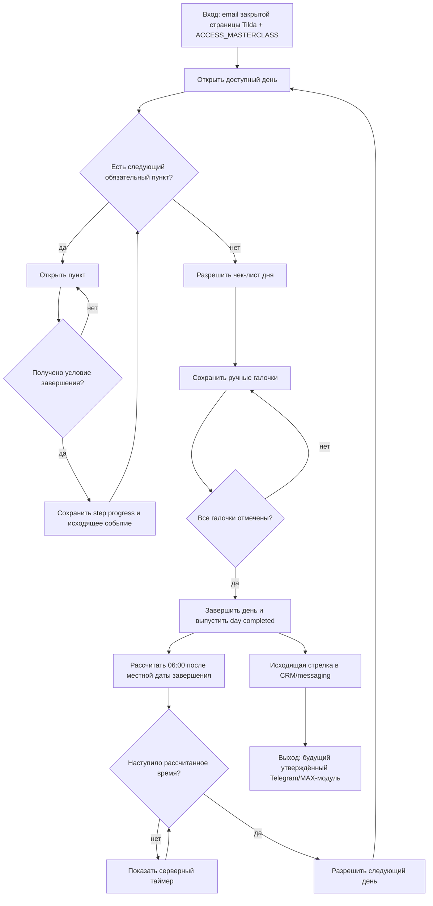

# Исполняемый контур 21-дневного Мастер-класса

Статус: `current_deployed_launch_integration`
Владелец содержания: Сергей Воронцов
Проверено: 24.08.2026
Источники: решение владельца 23.08.2026, `README.md`,
`../../../plans/MASTERCLASS_WEB_APP_SPEC.md`,
`COURSE_DESIGN_SYSTEM.md`, `COURSE_STRUCTURE_CONTRACT.md`,
`COURSE_VISUAL_SYSTEM.md`,
`../telegram/POST_PURCHASE_MASTERCLASS.md`

## Назначение и граница

Одна закрытая страница Tilda Members Area загружает общий серверный личный
кабинет. Из него участник открывает приложение курса без перехода на отдельную
физическую страницу Tilda. Tilda определяет email текущего участника, а право на
запуск подтверждается только ресурсом `ACCESS_MASTERCLASS` и актуальными покупками
в PostgreSQL.
Отдельных паролей, групп курса и второй таблицы пользователей не создаётся.

На переходном этапе повторный код на почту не запрашивается. Загрузчик не разрешает
ручной ввод email для защищённых приложений: он либо получает email из закрытой
страницы Members Area, либо просит открыть приложение из личного кабинета. Это
сознательно менее сильная граница идентификации, чем серверная сессия; при будущем
уходе с Tilda она заменяется, не меняя `user_id`, покупки и прогресс.

Технически загрузчик сначала читает штатный профиль Tilda Members Area через
`tma__getProfileObjFromLS()` и его поле `login`, затем ждёт до пяти секунд окончания
инициализации Tilda. Сохранённый самим приложением email не используется вместо
текущего Tilda-профиля, чтобы на общем устройстве не открыть данные прошлого
участника.

Контур хранит прогресс, проверяет порядок, рассчитывает открытие дней и выпускает
идемпотентные доменные события. Он не отправляет Telegram/MAX-сообщения сам.

На странице курса используется собственная кнопка возврата в личный кабинет;
плавающий круглый userbar Tilda скрыт. Бренд курса — «Похудение — это есть!».

## Правила прохождения

1. День 1 открывается при первом подтверждённом запуске курса.
2. Внутри дня обязательные пункты проходят сверху вниз. День 1 начинается с
   отдельного обязательного визуального туториала по оглавлению, навигации,
   заданиям и открытию следующих дней. Туториал показывает адаптированный макет
   интерфейса для телефона или компьютера и не является текстовой статьёй.
   Программа Мастер-класса рассказывается во вступительном видео и не создаёт
   отдельного обязательного пункта. Завершённые пункты можно открывать повторно.
3. Статья завершается только явной кнопкой `Прочитано`; простое открытие не
   считается завершением.
4. Анкета завершается после сохранения/отправки, DQS — после первого успешного
   серверного сохранения дневника, финальное саморевью — после отправки. Рецепты и
   выделенный оффер завершают шаг после открытия отдельного экрана.
5. Чек-лист дня становится доступен только после всех обязательных пунктов дня.
6. Галочки сохраняются на сервере по отдельности. День завершён, когда чек-лист
   открыт и отмечены все обязательные пункты.
7. Для каждого впервые открытого дня браузер передаёт серверу IANA-часовой пояс
   участника. Если день завершён до 00:00 в этом поясе, день `N+1` открывается в
   ближайшие 06:00. Если день завершён после полуночи либо остался незавершённым к
   полуночи, открытие переносится на 06:00 следующего календарного дня.
8. Сервер хранит время в UTC и рассчитывает расписание сам. Перезагрузка и
   повторное открытие страницы не меняют зафиксированный для дня часовой пояс и
   не сбрасывают таймер.
9. Пустые редакционные карточки остаются обычными обязательными материалами, пока
   не заменены финальным содержанием.
10. Изображения сохраняются на исходных местах внутри авторских статей. В галерею
    они собираются только у явно помеченного справочного материала DQS; сам факт
    наличия нескольких изображений не включает слайдер автоматически.

## Персональные предложения

Выделенный пункт предложения входит в общую очередь дней 1, 15, 17, 19 и 21.
Popup дней 15 и 17 только предупреждает о рецептах следующего дня: закрытие popup
не завершает пункт. После открытия выделенного материала frontend открывает
`masterclass-offers` с серверным placement-маркером. Ассортимент, исключение уже
купленного, цена и срок вычисляются backend.

## Данные

- `masterclass_day_progress`: первое открытие, IANA-часовой пояс дня, открытие
  чек-листа, галочки и завершение дня;
- `masterclass_step_progress`: завершённые обязательные пункты по индексу;
- `masterclass_events`: идемпотентные исходящие события для CRM/messaging;
- существующие `user_offers`, `offer_stages`, `user_accesses` остаются
  единственными источниками предложений и прав.
- `masterclass_test_profiles`: изолированное ускорение владельца; не является
  клиентской настройкой и не меняет покупки.

## API

- `GET /api/masterclass/course/manifest?email=...` — текущая версия, 21 день и
  исполняемый порядок шагов;
- `GET /api/masterclass/course?email=...` — программа доступности и прогресс;
- `GET /api/masterclass/course/content/{asset_name}?email=...` — разрешённый
  текстовый материал из whitelist манифеста;
- `POST /api/masterclass/course/days/{day}/open` — первое/повторное открытие;
- `POST /api/masterclass/course/days/{day}/steps/{index}/complete` — завершение
  следующего обязательного пункта;
- `POST /api/masterclass/course/days/{day}/task/open` — открытие задания;
- `PUT /api/masterclass/course/days/{day}/checks/{index}` — состояние галочки.

Все методы принимают email, определённый загрузчиком на закрытой странице Tilda,
сопоставляют его с внутренним `user_id` и повторно проверяют
`ACCESS_MASTERCLASS`. Email выбирает человека, но не выдаёт право на продукт.

## Исходящие стрелки в messaging backend

Сайт только записывает следующие события. Они являются входами будущего
утверждённого Telegram/MAX-модуля:

- `masterclass_course_opened`;
- `masterclass_day_opened`;
- `masterclass_article_completed`;
- `task_opened`;
- `task_acknowledged`;
- `masterclass_day_completed`;
- `dqs_opened`;
- `recipes_part_1_opened`;
- `recipes_part_2_opened`;
- `closing_review_opened`;
- `day_1_offer_opened`;
- `day_15_offer_opened`;
- `day_17_offer_opened`;
- `day_19_offer_opened`;
- `day_21_offer_opened`;
- `masterclass_completed`.

Каждое событие содержит серверный `event_id`, `user_id`, тип, время, день и индекс
пункта в безопасных `details`. Ответы анкет и содержимое дневника в событие не
копируются. Повтор запроса возвращает существующий результат и не создаёт вторую
стрелку.

После подтверждённой активности backend также ставит отложенный outbox-сигнал
`course_stalled_72h`; новый факт активности делает старый сигнал неактуальным при
отправке. При создании ограниченного окна предложения ставится
`sales_last_chance_due` примерно на `expires_at - 12h`. Сайт эти записи не отправляет.

## Ошибочные состояния

- email не найден на закрытой странице Tilda — приложение просит вернуться в
  Members Area и не предлагает ручной ввод;
- нет `ACCESS_MASTERCLASS` — `403` и возврат к покупке/поддержке;
- попытка пропустить пункт — `409`, состояние не меняется;
- попытка открыть ранний день — `409` с серверной причиной и временем;
- неизвестный день, индекс или галочка — `404/422`;
- повтор идентичного действия — успешный идемпотентный ответ.

## До фактической отправки ботом

Исходящие события готовы как контракт, но dispatcher остаётся выключенным. Для
Telegram/MAX отдельно утверждаются тексты, условия, задержки и исполняемый граф по
`../telegram/MODULE_DEVELOPMENT_STANDARD.md`. Сайт не хранит копию этих правил.
