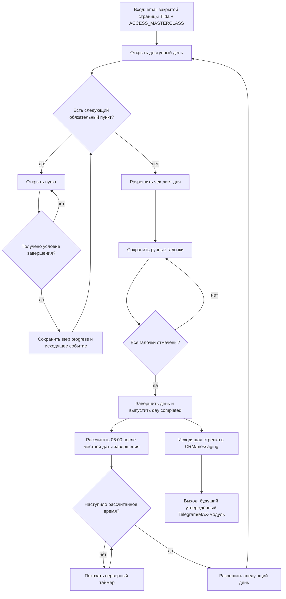

# Исполняемый контур 20-дневного Мастер-класса

Статус: `current`
Состояние внедрения: runtime развёрнут; продолжается launch-интеграция.
Владелец содержания: Сергей Воронцов
Проверено: 25.08.2026
Источники: решение владельца 23.08.2026, `README.md`,
`../../../plans/MASTERCLASS_WEB_APP_SPEC.md`,
`COURSE_DESIGN_SYSTEM.md`, `COURSE_STRUCTURE_CONTRACT.md`,
`COURSE_VISUAL_SYSTEM.md`,
`../telegram/POST_PURCHASE_MASTERCLASS.md`

## Назначение и граница

Личный кабинет на `https://edabalans.ru/lk` загружает приложение курса после
проверки собственной серверной сессии. Право на запуск подтверждается ресурсом
`ACCESS_MASTERCLASS` и актуальными покупками в PostgreSQL. Email страницы,
query-параметра или localStorage не открывает данные другого человека.

Контур хранит прогресс, проверяет порядок, рассчитывает открытие дней и выпускает
идемпотентные доменные события. Он не отправляет Telegram/MAX-сообщения сам.

При открытии курса frontend сразу запрашивает только структуру и пользовательский
прогресс. Опубликованные редакторские версии подгружаются параллельно, но не
блокируют первый экран. Резервный файл конкретного материала загружается только
при его открытии и затем повторно используется в текущей сессии; загрузка всех
материалов двадцати дней до первой отрисовки запрещена.

На странице курса используется собственная кнопка возврата в личный кабинет.
Бренд курса — «Похудение — это есть!». Одна страница ЛК также является точкой
входа для прямых ссылок:
`course_day` и необязательный `course_material` сначала обрабатывает внешний
кабинет, затем приложение курса восстанавливает доступный день и материал. При
отсутствии доступа кабинет остаётся в каталоге; отдельные страницы Tilda не
создаются. Если доступный по времени день ещё не открывался, переход по прямой
ссылке фиксирует его первое открытие тем же серверным методом, что и обычный выбор
в оглавлении. Адрес возврата в кабинет очищается от обоих параметров курса.

## Правила прохождения

1. День 1 открывается при первом подтверждённом запуске курса.
2. Внутри дня обязательные пункты проходят сверху вниз. Пункт с
   `required: false` можно пропустить: он не блокирует задание, завершение дня и
   следующий обязательный пункт. День 1 начинается с обязательной текстовой
   статьи «Как пользоваться Мастер-классом»: она объясняет личный кабинет,
   оглавление, последовательное открытие дней, краткую программу, связь и
   консультации. Отдельный визуальный туториал интерфейса не используется.
   Программа также кратко обозначена в этой статье; вступительное видео остаётся
   отдельным контекстным материалом. Завершённые пункты можно открывать повторно.
3. Статья завершается только явной кнопкой `Прочитано`; простое открытие не
   считается завершением.
4. Анкета завершается после сохранения/отправки. Шаг DQS завершается после
   прохождения встроенного туториала до последнего экрана. Заполнять строки для
   завершения материала не требуется. Приложение остаётся открытым: участник сам
   возвращается в день 4 и видит открытое задание. Финальное саморевью завершается
   после отправки. Рецепты и
   выделенный оффер завершают шаг после открытия отдельного экрана.
5. Чек-лист дня становится доступен только после всех обязательных пунктов дня;
   необязательные пункты в этот расчёт не входят.
6. Галочки сохраняются на сервере по отдельности. День завершён, когда чек-лист
   открыт и отмечены все обязательные пункты.
7. Для каждого впервые открытого дня браузер передаёт серверу IANA-часовой пояс
   участника. Если день завершён до 00:00 в этом поясе, день `N+1` открывается в
   ближайшие 06:00. Если день завершён после полуночи либо остался незавершённым к
   полуночи, открытие переносится на 06:00 следующего календарного дня.
8. Сервер хранит время в UTC и рассчитывает расписание сам. Перезагрузка и
   повторное открытие страницы не меняют зафиксированный для дня часовой пояс и
   не сбрасывают таймер.
9. Пустые редакционные карточки остаются обычными обязательными материалами, пока
   не заменены финальным содержанием.
10. Изображения сохраняются на исходных местах внутри авторских статей. В галерею
    они собираются только у явно помеченного справочного материала DQS; сам факт
    наличия нескольких изображений не включает слайдер автоматически.
11. Прежний шаг первого дня «Привязать мессенджер» скрыт: новый покупатель получает
    Telegram/MAX-переход при выдаче собственного личного кабинета. Скрытый шаг
    сохраняет свою позицию в исторической структуре и не открывается из меню или
    по старой прямой ссылке.
12. Внутренние пункты рецептурной подборки могут иметь статус `soon`. Такой пункт
    показывается с плашкой «Скоро», не открывается по нажатию и имеет
    `required: false`, поэтому не блокирует прохождение дня или курса.

## Персональные предложения

Выделенный пункт предложения входит в общую очередь дня 1, рецептурных эпизодов
6–8 и 14–16, саморевью дня 19 и финального дня 20. В днях 8 и 16 предложение
необязательно и не блокирует следующий день. После открытия выделенного
материала frontend открывает `masterclass-offers` с серверным placement-маркером.
Ассортимент, исключение уже купленного, цена и срок вычисляются backend.

Предложение первого дня показывает раннюю цену, но само по себе не запускает
временное окно и всегда возвращает `expires_at = null`: ни срок, ни таймер в дне 1
не показываются даже после запуска той же ценовой ступени позднее. В текущей
20-дневной программе первое реальное окно `early` запускает placement
`recipes-part-1-gate` в дне 6. Повторы в днях 7–8 не перезапускают срок. Второе
окно запускает `recipes-part-2-gate` в дне 14, а дни 15–16 продолжают то же
окно. Старые placement-коды `day-15-offer` и `day-17-offer` остаются только для
совместимости; сама страница дня 1 триггером не является.

## Данные

- `masterclass_day_progress`: первое открытие, IANA-часовой пояс дня, открытие
  чек-листа, стабильные ID обязательных элементов на момент открытия, галочки и
  завершение дня;
- `masterclass_step_progress`: завершённые обязательные пункты по индексу;
- `managed_document_versions`: активная и предыдущие ревизии структуры курса;
- `content_items` и `content_item_versions` внутреннего источника
  `masterclass-course-materials`: независимо публикуемые версии обычных статей;
- `masterclass_events`: идемпотентные исходящие события для CRM/messaging;
- существующие `user_offers`, `offer_stages`, `user_accesses` остаются
  единственными источниками предложений и прав.
- `masterclass_test_profiles`: изолированное ускорение владельца; не является
  клиентской настройкой и не меняет покупки.

### Вводное медиа дня

У дня есть только два редакторских значения: `videoId` и `image`. Если заполнено
`videoId`, runtime показывает видео; если оно пустое, но есть `image`, показывает
картинку; если пусты оба — не показывает медиа. Поле `media` сохраняется в
структуре для совместимости и редактор рассчитывает его сам.

Короткий ID Boomstream и его страница просмотра открываются через iframe
Boomstream. Прямая HTTPS-ссылка, оканчивающаяся на `.mp4`, открывается через
собственный плеер. Картинка служит обложкой для прямого MP4. Поле `timings`
хранит пары `["мм:сс", "название раздела"]`: в редакторе каждая пара вводится
одной строкой `00:00 — название`. У собственного плеера они становятся
кликабельным содержанием, у Boomstream показываются раскрывающимся списком под
видео. Видео в шапке не является отдельным материалом и не участвует в очереди
прохождения.

Скрытый через редактор материал остаётся на прежнем месте массива, но не выдаётся
как видимый/обязательный шаг клиенту. Поэтому существующие индексы прогресса не
сдвигаются. Добавление, удаление и перестановка материалов выполняются только
отдельной задачей с миграцией зависимостей.

## API

- `GET /api/masterclass/course/manifest?email=...` — текущая версия, 20 дней и
  исполняемый порядок шагов;
- `GET /api/masterclass/course?email=...` — программа доступности и прогресс;
- `GET /api/masterclass/course/content/{asset_name}?email=...` — разрешённый
  исходный текстовый fallback из whitelist манифеста;
- `GET /api/masterclass/course/materials?email=...` — опубликованные в БД версии
  обычных видимых статей уже открытых или доступных к открытию дней по `step.id`;
  frontend отдаёт им приоритет над fallback-файлами, но при временной ошибке этого
  запроса продолжает открывать встроенные материалы;
- `GET /course-assets/masterclass/media/{asset_path}` — публичные изображения
  опубликованных статей только из разрешённого каталога `source-current/assets`;
- `POST /api/masterclass/course/days/{day}/open` — первое/повторное открытие;
- `POST /api/masterclass/course/days/{day}/steps/{index}/complete` — завершение
  следующего обязательного пункта;
- `POST /api/masterclass/course/days/{day}/task/open` — открытие задания;
- `PUT /api/masterclass/course/days/{day}/checks/{index}` — состояние галочки.

Все методы принимают email, определённый загрузчиком на закрытой странице Tilda,
сопоставляют его с внутренним `user_id` и повторно проверяют
`ACCESS_MASTERCLASS`. Email выбирает человека, но не выдаёт право на продукт.
Повторный пользовательский вход, почтовый код и отдельная `app_session` в этом
контуре запрещены без новой явно согласованной задачи владельца.

Редакторский API `GET/PUT /admin/api/courses/masterclass-21/materials/{step_id}`
создаёт версию только одного обычного материала. Он не публикует манифест курса и
не меняет прогресс. История доступна через суффикс `/versions`, восстановление —
через `/versions/{version}/restore`. Локальный клиент для ИИ-писателя —
`tools/publish_course_material.py`; после первоначального выпуска механизма его
обычные вызовы не требуют Git, tests или deploy.

Полная согласованная редакция из `content/masterclass/editorial/` публикуется
командой `python -m scripts.publish_masterclass_editorial --publish` внутри backend.
Она создаёт новую версию структуры, синхронизирует названия и видимый состав
материалов, скрывает не вошедшие старые шаги без удаления и публикует отдельные
версии обычных статей.

## Исходящие стрелки в messaging backend

Сайт только записывает следующие события. Они являются входами будущего
утверждённого Telegram/MAX-модуля:

- `masterclass_course_opened`;
- `masterclass_day_opened`;
- `masterclass_article_completed`;
- `task_opened`;
- `task_acknowledged`;
- `masterclass_day_completed`;
- `dqs_opened`;
- `app_revealed_dqs`;
- `app_revealed_strength`;
- `app_revealed_metabolism`;
- `app_revealed_recipes`;
- `recipes_part_1_opened`;
- `recipes_part_2_opened`;
- `closing_review_opened`;
- `day_1_offer_opened`;
- `day_15_offer_opened`;
- `day_17_offer_opened`;
- `day_19_offer_opened`;
- `day_21_offer_opened`;
- `masterclass_completed`.

Каждое событие содержит серверный `event_id`, `user_id`, тип, время, день и индекс
пункта в безопасных `details`. Ответы анкет и содержимое дневника в событие не
копируются. Повтор запроса возвращает существующий результат и не создаёт вторую
стрелку.

События `app_revealed_*` не выдают доступ. Они только разрешают Telegram/MAX
показать уже приобретённое приложение в «Моих приложениях». Материал курса пишет
событие при открытии соответствующего инструмента; отсутствие события скрывает
кнопку, но не меняет `user_accesses`.

После подтверждённой активности backend также ставит отложенный outbox-сигнал
`course_stalled_72h`; новый факт активности делает старый сигнал неактуальным при
отправке. При создании ограниченного окна предложения ставится
`sales_last_chance_due` примерно на `expires_at - 12h`. Сайт эти записи не отправляет.

## Ошибочные состояния

- email не найден на закрытой странице Tilda — приложение автоматически
  перенаправляет на `/members/login` и не предлагает ручной ввод;
- нет `ACCESS_MASTERCLASS` — `403` и возврат к покупке/поддержке;
- попытка пропустить пункт — `409`, состояние не меняется;
- попытка открыть ранний день — `409` с серверной причиной и временем;
- неизвестный день, индекс или галочка — `404/422`;
- повтор идентичного действия — успешный идемпотентный ответ.

## До фактической отправки ботом

Исходящие события готовы как контракт, но dispatcher остаётся выключенным. Для
Telegram/MAX отдельно утверждаются тексты, условия, задержки и исполняемый граф по
`../telegram/MODULE_DEVELOPMENT_STANDARD.md`. Сайт не хранит копию этих правил.
