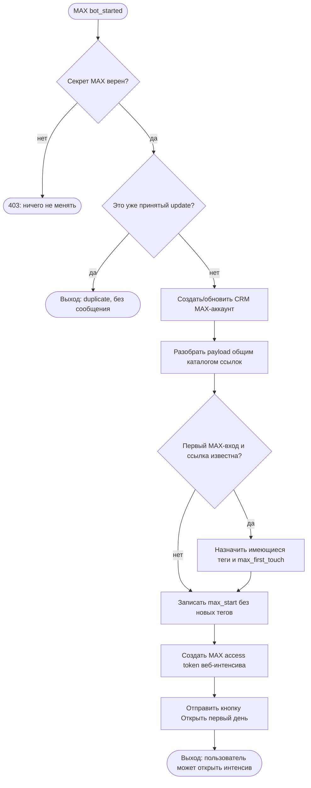

# MAX: старт, идентификация и атрибуция

## Назначение и граница

Это первый и намеренно узкий MAX-модуль. Он принимает событие `bot_started`,
создаёт или обновляет общий CRM-аккаунт человека, разбирает уже существующий
код ссылки и фиксирует первое касание. После этого MAX выдаёт персональную
ссылку на веб-интенсив, привязанную к MAX-аккаунту человека.

В модуль не входят отдельная MAX-версия Welcome, проверка подписки на MAX-канал,
таймеры, посты, медиа, рассылки, вручную созданные MAX invite-ссылки и запуск
послепокупочной цепочки. Сам интенсив исполняется общим web-runtime.

## Входной контракт

- MAX отправляет HTTPS webhook `bot_started` на `/bot/max/webhook`.
- Сервер принимает запрос только с точным `X-Max-Bot-Api-Secret`.
- Из события используются `user.user_id`, имя и username, `payload`, timestamp.
- Код `payload` читается тем же каталогом `tg_tracking_links` и aliases, что и
  Telegram. Это не второй каталог: физическое имя таблицы пока историческое,
  но её продуктовая роль — общий каталог коротких ссылок.

## Исполняемый порядок

1. Проверить секрет webhook. Неверный или отсутствующий секрет получает `403`.
2. Пропустить любой тип события, кроме `bot_started`: он не создаёт контакт и не
   отправляет сообщение.
3. По устойчивому отпечатку события проверить `tg_update_receipts`. Повтор
   события заканчивается без второй отправки.
4. Найти либо создать `messenger_accounts(platform=max, platform_user_id)` и
   общий CRM `users`. Время первого входа — `first_seen_at`.
5. Разобрать payload через общий каталог ссылок. Неизвестный старый код безопасно
   ведёт в корень: тег не создаётся и не угадывается.
6. Только при первом MAX-входе по известной ссылке назначить уже существующие
   канонические теги, создать `max_first_touch` в `attribution_events`.
7. Сохранить факт каждого MAX-старта в `attribution_events`.
   Одновременно записать совместимое событие `start_first`/`start_repeat` в
   `tg_tracking_events`; UTM и `yclid` берутся из одноразовой session, созданной
   переходом `/go/{code}?to=max`.
8. Создать access token с максимальным сроком предъявления два года и
   `platform=max`, затем персональную ссылку `/intensive/start?i=...`. При первом
   открытии web-runtime атомарно погашает bearer token и заменяет его HttpOnly
   session cookie; повторное предъявление ссылки отклоняется.
9. Не отмечать `main_scenario_seen_at` и не запускать Telegram sequence.
10. До внешнего вызова сохранить receipt, пользователя, событие и
    детерминированный access token со статусом доставки `pending`.
11. Отправить сообщение с inline-кнопкой «Открыть первый день» и отметить
    доставку `sent`. Если ответ MAX потерян или пришла ошибка, повтор webhook
    отправляет ту же самую рабочую ссылку, не создавая второго лида или токена.

## Выходы и ошибки

- Нормальный выход: пользователь и источник сохранены, отправлена персональная
  кнопка входа в интенсив.
- Повтор успешно доставленного webhook: `duplicate`, повторной отправки нет.
- Повтор webhook после неопределённого результата доставки повторно отправляет
  ту же ссылку и завершает pending-доставку.
- Неверный секрет: `403`, данные не меняются.
- Неизвестный payload: пользователь сохранён, но атрибуция и теги не
  придумываются.
- Ошибка отправки MAX не подтверждает webhook; уже сохранённый receipt остаётся
  `pending`, чтобы MAX повторил доставку той же ссылки. Отдельный outbox
  понадобится до массовых/длинных цепочек.

## Данные и владельцы фактов

| Факт | Источник истины |
| --- | --- |
| MAX-идентичность | `messenger_accounts` (`platform=max`) |
| Общий клиент | `users` |
| Теги | `tags`, `user_tags` |
| Первое касание | `attribution_events` |
| Каталог коротких кодов | `tg_tracking_links`, aliases и связи тегов |
| Идемпотентность webhook | `tg_update_receipts` |
| Общая маркетинговая воронка и offline-конверсии | `tg_tracking_events` |

## Исполняемая схема

## Проверка

1. Валидный `bot_started` создаёт `messenger_accounts.platform=max`, выдаёт
   access token веб-интенсива, но не запускает Telegram run и не меняет
   `main_scenario_seen_at`.
2. Старт по известному `Bxxxx` назначает уже существующий тег один раз.
3. Повтор одного webhook не создаёт второе сообщение.
4. Неверный и пустой секрет не принимаются.
5. Неизвестный payload не создаёт новых тегов.
6. Переход `go. → MAX` сохраняет `yclid`, а первый старт становится кандидатом
   на цель Метрики `bot_start` без двойной отправки webhook.
