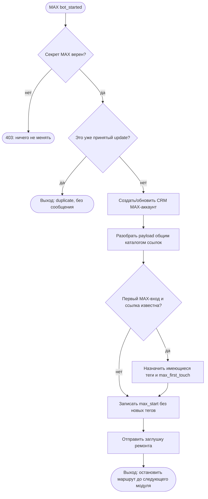

# MAX: старт, идентификация и атрибуция

## Назначение и граница

Это первый и намеренно узкий MAX-модуль. Он принимает событие `bot_started`,
создаёт или обновляет общий CRM-аккаунт человека, разбирает уже существующий
код ссылки и фиксирует первое касание. После этого MAX отправляет только
заглушку ремонта и останавливается.

В модуль не входят Welcome, бесплатный интенсив, проверка подписки на MAX-канал,
таймеры, посты, медиа, рассылки, вручную созданные MAX invite-ссылки и запуск
послепокупочной цепочки. Они будут следующими отдельными модулями.

## Входной контракт

- MAX отправляет HTTPS webhook `bot_started` на `/bot/max/webhook`.
- Сервер принимает запрос только с точным `X-Max-Bot-Api-Secret`.
- Из события используются `user.user_id`, имя и username, `payload`, timestamp.
- Код `payload` читается тем же каталогом `tg_tracking_links` и aliases, что и
  Telegram. Это не второй каталог: физическое имя таблицы пока историческое,
  но её продуктовая роль — общий каталог коротких ссылок.

## Исполняемый порядок

1. Проверить секрет webhook. Неверный или отсутствующий секрет получает `403`.
2. Пропустить любой тип события, кроме `bot_started`: он не создаёт контакт и не
   отправляет сообщение.
3. По устойчивому отпечатку события проверить `tg_update_receipts`. Повтор
   события заканчивается без второй отправки.
4. Найти либо создать `messenger_accounts(platform=max, platform_user_id)` и
   общий CRM `users`. Время первого входа — `first_seen_at`.
5. Разобрать payload через общий каталог ссылок. Неизвестный старый код безопасно
   ведёт в корень: тег не создаётся и не угадывается.
6. Только при первом MAX-входе по известной ссылке назначить уже существующие
   канонические теги, создать `max_first_touch` в `attribution_events`.
7. Сохранить факт каждого MAX-старта в `attribution_events`.
8. Не отмечать `main_scenario_seen_at` и не запускать `tg_sequences`: ремонт не
   считается просмотром Welcome.
9. Отправить фиксированную заглушку ремонта. Человек остаётся сохранён в CRM для
   будущей рассылки после снятия ремонта.

## Выходы и ошибки

- Нормальный выход: пользователь и источник сохранены, отправлена заглушка,
  дальнейший маршрут остановлен.
- Повтор webhook: `duplicate`, повторной отправки нет.
- Неверный секрет: `403`, данные не меняются.
- Неизвестный payload: пользователь сохранён, но атрибуция и теги не
  придумываются.
- Ошибка отправки MAX не подтверждает webhook и не сохраняет receipt: MAX делает
  повторную попытку. Отдельный outbox понадобится до массовых/длинных цепочек.

## Данные и владельцы фактов

| Факт | Источник истины |
| --- | --- |
| MAX-идентичность | `messenger_accounts` (`platform=max`) |
| Общий клиент | `users` |
| Теги | `tags`, `user_tags` |
| Первое касание | `attribution_events` |
| Каталог коротких кодов | `tg_tracking_links`, aliases и связи тегов |
| Идемпотентность webhook | `tg_update_receipts` |

## Исполняемая схема

## Проверка

1. Валидный `bot_started` создаёт `messenger_accounts.platform=max`, но не
   запускает Telegram run и не меняет `main_scenario_seen_at`.
2. Старт по известному `Bxxxx` назначает уже существующий тег один раз.
3. Повтор одного webhook не создаёт второе сообщение.
4. Неверный и пустой секрет не принимаются.
5. Неизвестный payload не создаёт новых тегов.
