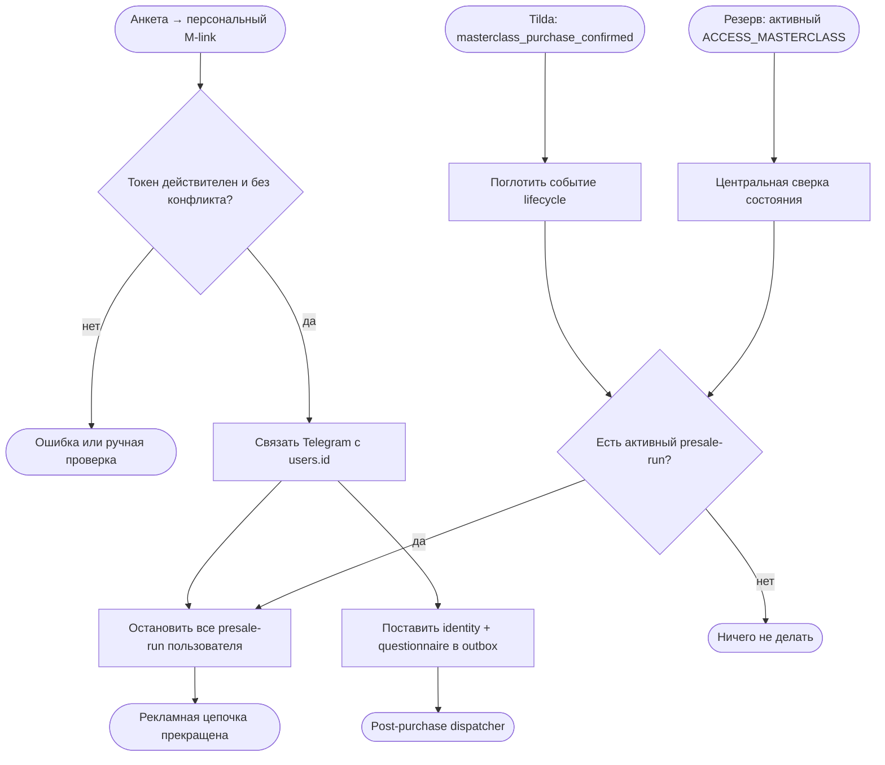

# Системное правило жизненного цикла: покупатель мастер-класса

Статус: `deployed_test_bot / postpurchase_test_only`
Владелец содержания: Сергей Воронцов  
Проверено: 23.08.2026

## Назначение и граница

Это переиспользуемое системное правило, а не отдельная контентная цепочка. Оно
заменяет конструкторскую схему, где перед каждым рекламным постом стоял блок
`has_product`.

Единый факт — активный доступ CRM `ACCESS_MASTERCLASS`. Как только Telegram
надёжно связан с таким `user_id`, все активные/ожидающие run до покупки
останавливаются. Post-purchase сообщения создаются конкретными доменными
событиями в outbox; отключённая sequence `postpurchase_masterclass` не запускается
целиком.

## Входы

1. `masterclass_purchase_confirmed`: обработчик подтверждённой оплаты Tilda
   записал доменное событие после выдачи `ACCESS_MASTERCLASS`.
2. `messenger_link_confirmed`: пользователь погасил персональный M-link после
   анкеты или из интерфейса мастер-класса.
3. Активный `ACCESS_MASTERCLASS` появился у уже связанного Telegram-пользователя.
   Scheduler централизованно сверяет этот факт как страховку от потерянного или
   пришедшего раньше события.
4. Повторный `/start` владельца мастер-класса — дополнительный пользовательский
   вход, но не основной механизм остановки.

## Исполнение

- `customer_lifecycle.stop_presale_runs_for_user()` завершает active/waiting run
  `start_attribution_entry`, `welcome_intensive` и `prepurchase_nurture` для всех
  Telegram-контактов одного `users.id`.
- В `tg_sequence_runs.context.stopped_reason` записывается причина; новые теги и
  отдельная таблица не создаются.
- `consume_masterclass_link()` связывает `messenger_accounts` и `tg_contacts` с
  CRM-пользователем, фиксирует `messenger_link_confirmed`, останавливает presale и
  идемпотентно ставит два сообщения: данные клиента и его анкету.
- `tilda_service.record_masterclass_purchase_event()` создаёт одно событие на
  подтверждённый платёж, который выдал доступ к мастер-классу; Telegram lifecycle
  поглощает это событие идемпотентно.
- `reconcile_masterclass_presale_runs()` выполняет одно глобальное правило перед
  обработкой due-run. Поэтому проверок покупки внутри каждого рекламного шага нет.
- Новая опубликованная версия `prepurchase_nurture` содержит только задержки,
  сообщения и STOP. Уже запущенные старые версии не переписываются, но также
  останавливаются общим правилом.

## Анкета и персональная ссылка

После отправки onboarding-анкеты web-приложение вызывает
`POST /api/masterclass/messenger-links`. Ответ содержит одноразовый deep link с
payload `M...`, сроком 15 минут. В URL нет email. После успешного погашения бот
отправляет:

1. `tpl_postpurchase_identity`: email, Telegram, тариф мастер-класса, дату покупки
   и ссылку на кабинет;
2. `tpl_postpurchase_questionnaire`: ответы с человекочитаемыми названиями
   вопросов и просьбу переслать сообщение Сергею.

В интерфейсе дня отдельная кнопка мессенджера остаётся запасным входом: она
создаёт тот же токен и не вводит второй контракт.

## Блок-схема

## Файлы и данные

| Назначение | Источник |
|---|---|
| Единое правило остановки | `telegram-bot/service/app/customer_lifecycle.py` |
| Событие подтверждённой покупки | `backend/app/tilda_service.py:record_masterclass_purchase_event` |
| Погашение M-link и постановка двух сообщений | `telegram-bot/service/app/masterclass_link.py` |
| Сверка перед due-run | `telegram-bot/service/app/main.py:scheduler_loop` |
| Чистый граф основной рассылки | `telegram-bot/service/app/seed.py` |
| Рендер данных клиента и анкеты | `telegram-bot/service/app/masterclass_dispatch.py` |
| Генерация токена | `POST /api/masterclass/messenger-links` |
| CRM-факт покупки | `user_accesses` + `resources.code=ACCESS_MASTERCLASS` |
| Активные цепочки | `tg_sequence_runs` |
| Очередь сообщений | `masterclass_notifications` |

## Обязательные проверки

1. M-link нельзя использовать дважды, а конфликт не перепривязывает клиента.
2. Успешный M-link останавливает все presale-run CRM-пользователя и ставит ровно
   два сообщения.
3. Уже связанный пользователь с новым `ACCESS_MASTERCLASS` останавливается общей
   сверкой без повторного `/start`.
4. Повторная сверка идемпотентна.
5. Опубликованный `prepurchase_nurture` не содержит `has_product` перед постами.
6. Анкета показывает названия вопросов, а тариф берётся из платежа, создавшего
   `ACCESS_MASTERCLASS`, а не из случайной последней покупки.
