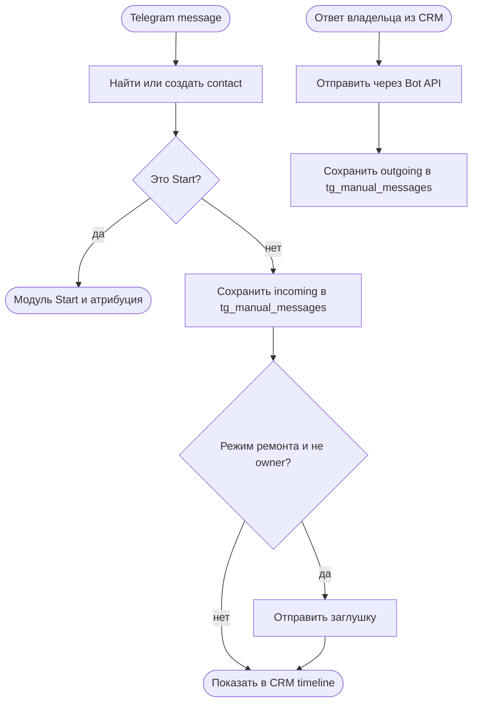
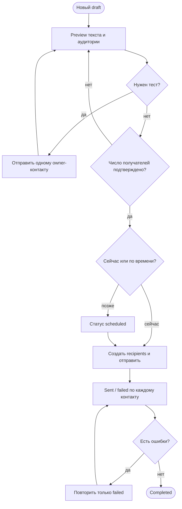

# Telegram: входящие сообщения и разовые рассылки

Статус: `current`
Владелец содержания: Сергей Воронцов
Проверено: 24.08.2026

## Границы

Это два служебных модуля вокруг основного графа бота. Они не двигают Welcome,
не меняют покупки и не создают новые теги.

### Входящая переписка

Любое обычное сообщение пользователя, не являющееся обработанной командой Start,
сохраняется в существующей `tg_manual_messages` с `direction=in`, статусом
`received` и Telegram message ID. Это действует и в режиме ремонта: пользователь
получает заглушку, а его текст остаётся виден владельцу. Ответ из карточки человека
записывается в ту же таблицу с `direction=out` и отправляется через Bot API.

Лента человека объединяет входящие/ручные сообщения, автоматические доставки
sequence и разовые рассылки. Отметка «прочитано» не показывается: Telegram Bot API
её не предоставляет.

### Разовая рассылка

Каждая рассылка — неизменяемый после запуска черновик с отдельным контентом.
Последовательность: создать draft → увидеть точное число получателей → при желании
отправить тест одному owner-контакту → подтвердить найденное число → отправить или
запланировать → посмотреть результаты → повторить только неудачные доставки.
Повторное использование текста делается копией в новый draft, история не меняется.

Первая версия сегментирует по статусу contact и выбранным Telegram ID. В режиме
ремонта любой сегмент дополнительно физически ограничен owner allowlist. Поэтому
до снятия ремонта массовая отправка клиентам невозможна даже при ошибке оператора.

## Источники данных и код

| Назначение | Источник |
|---|---|
| контакты | `tg_contacts` |
| входящие и ручные ответы | `tg_manual_messages` |
| контент рассылки | `tg_content_items` |
| карточка рассылки | `tg_broadcasts` |
| результат по человеку | `tg_broadcast_recipients` |
| автоматические сообщения в timeline | `tg_sequence_runs`, `tg_step_deliveries` |
| приём update, API и доставка | `telegram-bot/service/app/main.py` |
| админка | `telegram-bot/service/static/app.js` |

Авторские тексты и медиа заполняет владелец. Изменение сегментации, правил
доставки или графа требует обновить этот документ и тесты в том же коммите.
