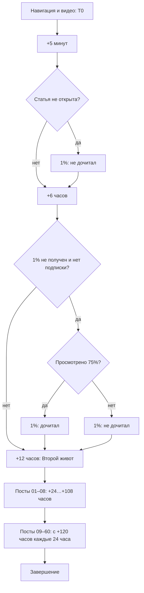

# Рассылка после единой статьи

Владельцы: `messaging.telegram.intensive` — первые часы,
`messaging.telegram.prepurchase` — 60 позиций; движок и API — `messaging.telegram.engine`.

## Подтверждённые требования 10.10.2026

Вход сохраняет покупки, стопы, технические доступы и защиту от повторного webhook.
Навигация → закрепление только Telegram → первое обычное видео с кнопкой
«Читать прямо сейчас». Повторный вход — отдельный полный оригинал видео-поста
с припиской о сайте, без кнопки и повторной навигации. MAX имеет свои оригиналы,
навигатор отправляется, но не закрепляется. Покупателю — отдельная памятка.

T0 — успешная первоначальная отправка видео. Повторный вызов не меняет T0.

| Время от T0 | Сообщение | Условие |
|---|---|---|
| +5 минут | 1% — статья не дочитана | Статья вообще не открыта |
| +6 часов | 1% — один из двух самостоятельных файлов | Ещё не получал семейство 1%; Telegram — подтверждённо не подписан; MAX — без проверки подписки |
| +12 часов | Второй живот | Нет покупки/блокировки/стопа, семейство не получено |
| +24…+108 часов | Посты 01–08, каждые 12 часов | Нормальная очередь |
| +120 часов и далее | Посты 09–60, каждые 24 часа | Нормальная очередь |

75% **просмотренной площади** статьи (`viewed_percent`) считается «дочитал» для
этой ветки. Максимальная глубина скролла и клики не заменяют этот показатель.
Сайт владеет фактами открытия/чтения. Проверки перед сообщением сохраняются в CRM:
подписка, статья открыта, максимальный процент чтения, персональная главная открыта,
предыдущее отправленное семейство. Это связь по времени, не доказательство причинности.

До конца четвёртого дня (+96 часов) Telegram отправляет полные сообщения.
Начиная с пятого дня подписанным — полный вариант, неподписанным — короткий
со ссылкой на конкретный пост канала. При неизвестной подписке — полный.
MAX всегда получает полный вариант в боте. Покупка/блок/стоп проверяются вновь
перед фактической доставкой.

## Оригиналы и публикация

Единая папка — `D:\Codex\work\edabalans-materials`. Файл инструкции и индекс
рассылки находятся в ней; тексты в Git не копируются. 60 номеров — стабильные
редакционные позиции, три независимых оригинала на позицию. Входные сообщения
хранятся отдельно, включая полный повторный вариант, а не правило дописывания.

Служебная информация находится после текста. Существующая верхняя шапка
совместима. Публикатор исключает метаданные из тела, компилирует MD при публикации
и сохраняет готовый HTML в `tg_content_items`; отправка MD не компилирует.
Ссылки: `[Название]({{personal_intensive_url}})`,
`[Описание МК]({{personal_masterclass_url}})`,
`[Пост]({{personal_channel_post_732_url}})`. Персонализацию делает существующий
генератор в момент отправки, а не редактор/владелец. Одно имя переменной в тексте
и кнопке даёт одну персональную ссылку.

Тело, состоящее только из `[[SKIP]]`, означает: ничего не отправлять в этот срок.
Следующий срок не сдвигается. Пустой файл, ошибка, неподтверждённый текст или
потерянное медиа не являются молчаливым пропуском: публикация/доставка показывает ошибку.

У семейства стабильный ID, общий для вариантов, площадок и поздней редактуры.
Успешная доставка фиксируется событием `campaign_family_sent` с уникальным
`campaign:user:family`. Старые контентные теги не являются фактом новой доставки
и не удаляются. Замена текста/порядка не отменяет получения семейства.
Заполнение новой темой уже пройденного номера ставит её в `campaign_pending`
существующего активного run. В ближайший очередной срок бот проходит тот же
platform/subscription gate, проверяет семейство и возвращается к прежнему номеру
и сроку. Публикация не ускоряет срок и не запускает paused/архивные runs.

## Проверка и запуск

Публикация текстов **не включает** рассылку. Подготовка графа не запускает людей.
Накопленный пул остаётся на паузе. Отдельное действие владельца разрешает новые
входы; возобновление старого пула не подразумевается.

Кнопка «Проверить первые 5 дней» отправляет владельцу основным Telegram-ботом
все фактически заполненные варианты первых пяти дней, включая вход/повтор/покупателя,
без ожиданий и служебных подписей. Пустые позиции не присылаются. Нет run,
назначения контентных тегов или изменения реального прогресса. API ограничивает
получателей известными аккаунтами владельца и хранит квитанции теста.

Ошибки отправки используют существующий retry/dead-letter движка; тест не
пересылает неопределённый результат вслепую. Видео всегда `supports_streaming`.
Длинная подпись к фото доставляется как фото и полный текст следующим сообщением,
без сокращения авторского оригинала.

Проверки: граф и сроки; обе ветки 75%; раннее получение без дубля +6h;
skip без схлопывания срока; дедупликация семьи между платформами; покупка/стоп;
публикация из MD с защитой версии; тест только владельцу без run/семейных квитанций.
