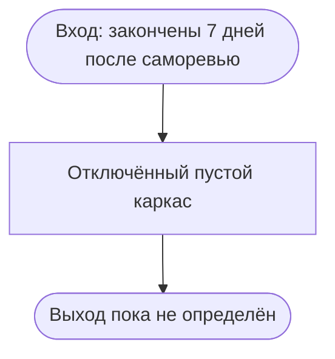

# Telegram: рассылка после завершения мастер-класса

Статус: `implemented_disabled_skeleton / content planned`  
Владелец содержания: Сергей Воронцов  
Проверено: 24.08.2026

## Зафиксированная граница

`postmasterclass_nurture` — отдельный будущий модуль, который начинается только
после полного завершения `postpurchase_masterclass`, включая семь дней после
первого открытия итогового саморевью. Его нельзя смешивать с тремя сообщениями
этой семидневной части.

Сейчас у модуля нет утверждённых сообщений, периодичности или предложения.
Создаётся только отключённый пустой исполняемый каркас, чтобы вход/выход был виден
на общей карте. Он не запускается и ничего не отправляет.

Перед наполнением требуется отдельное утверждение назначения, расписания,
сегментов, выхода и текстов по `MODULE_DEVELOPMENT_STANDARD.md`.
