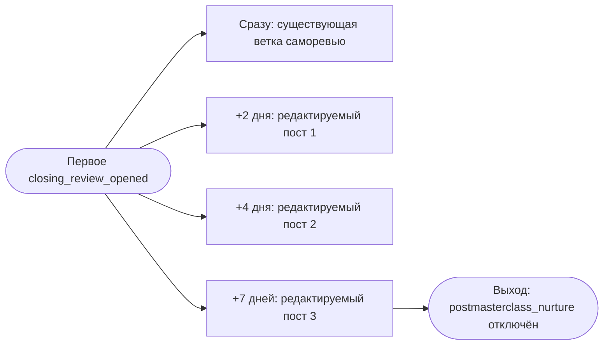
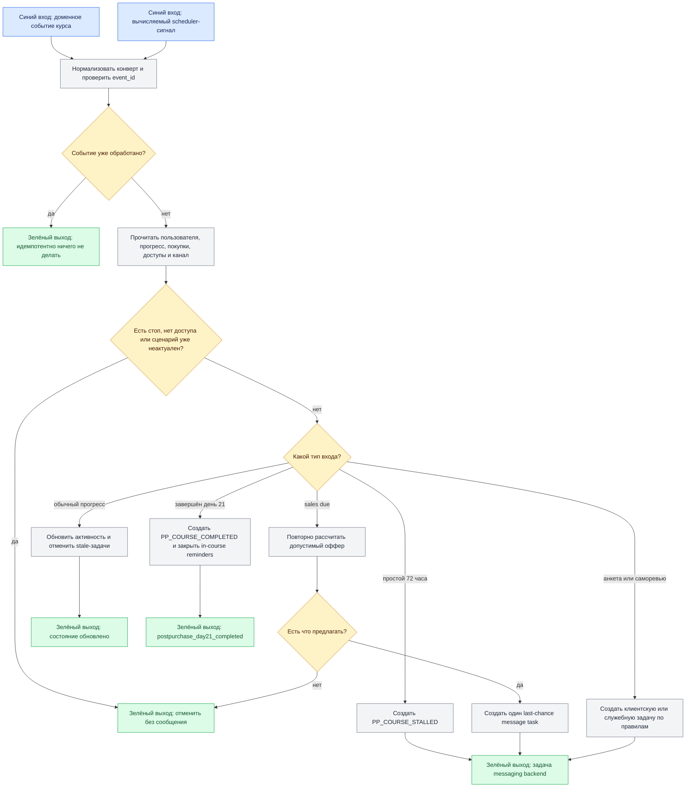

# Telegram: цепочки после покупки и во время мастер-класса

Статус: `deployed_test_only` — каноническая схема, одноразовая привязка,
восемь редакционных слотов, outbox-dispatcher и изолированный ускоренный режим
развёрнуты на тестовом Telegram-боте. Массовая отправка запрещена настройкой
`POSTPURCHASE_TEST_ONLY=true` до сквозного прогона владельца.
Владелец содержания: Сергей Воронцов  
Проверено: 25.08.2026
Источники: решение владельца от 22.08.2026,
`../masterclass/README.md`, `../../../plans/PRODUCTS_AND_OFFERS.md`,
`../../PRODUCTS.md`, `../../../TAG_RULES.md`

## Границы модуля

Это не одна длинная неразличимая рассылка, а три связанные цепочки:

1. **Welcome после покупки** — анкета, привязка мессенджера, подтверждение данных.
2. **Сопровождение во время мастер-класса** — DQS, две рецептурные точки,
   условные напоминания и персональные допродажи.
3. **Семь дней после саморевью** — часть того же модуля: отсчёт начинается при
   первом открытии итогового саморевью; на 2-й, 4-й и 7-й день предусмотрены три
   редактируемых сообщения.

Отдельный `postmasterclass_nurture` начинается только после этой недели и сейчас
остаётся пустым отключённым каркасом.

Канонический код модуля — `postpurchase_masterclass`. Его граф остаётся отключён
как самостоятельная sequence: сообщения запускаются только конкретными outbox-
событиями сайта, а не линейным проигрыванием всей цепочки подряд.

## Назначение, входы и выходы

Результат модуля: после подтверждённой покупки прекратить продающую цепочку до
покупки, связать клиента с мессенджером, сопровождать его в контрольных точках
мастер-класса и не предлагать уже купленное.

Остановка цепочек до покупки реализуется не повторяющимися условиями перед
постами, а единым системным правилом из
`CUSTOMER_LIFECYCLE_TECHNICAL_SPEC.md`: M-link останавливает presale сразу, а
центральная сверка `ACCESS_MASTERCLASS` страхует уже связанного пользователя.

Входы:

- подтверждённая покупка мастер-класса;
- `messenger_link_confirmed` после безопасного deep link;
- первое открытие DQS;
- первая/вторая точки рецептов;
- открытие и отправка саморевью.

Выходы:

- нормальное завершение сопровождения;
- переход в отдельный будущий дожим после мастер-класса;
- ручная проверка конфликта Telegram/CRM;
- ожидание привязки канала без потери события;
- остановка по ручному стоп-тегу.

## Где владелец редактирует сообщения

В Telegram-админке открыть **Цепочки → После покупки мастер-класса**. Там уже
создан упорядоченный редакционный черновик:

1. данные клиента после привязки;
2. анкета для личной пересылки Сергею;
3. одно бережное напоминание после 72 часов без серверной активности;
4. две ветки последнего напоминания действующего оффера: рецептов нет / рецепты
   уже куплены, но остались подходящие продукты;
5. две заготовки саморевью: консультация куплена / не куплена;
6. финальное недельное предложение.

Этот редакционный набор приводится к новой программе по дням и становится единым
источником пользовательских сообщений во время программы и трёх сообщений
недели после первого открытия саморевью.

Текст правится прямо в макете сообщения. Задержки открываются отдельными блоками.
К сообщению можно прикрепить изображение, видео, аудио или видеокружок. Известный
текст уже внесён. Граф модуля имеет статус `disabled`, потому что он служит картой
редакционных окон, а не второй исполняемой логикой. Отправка выполняется событийным
dispatcher.
Окончательные авторские тексты можно заменить позже без изменения структуры
модуля. До этого каждый слот содержит короткий безопасный рабочий текст без
квадратных скобок и незаполненных ссылок.

Утверждённая замена двух стартовых сообщений на объединённую сводку и отдельную
инструкцию, а также напоминания в 18:00 и после 72 часов без активности зафиксированы в
[`MASTERCLASS_TELEGRAM_ONBOARDING_AND_DAY_OPEN_DRAFT.md`](../../../plans/MASTERCLASS_TELEGRAM_ONBOARDING_AND_DAY_OPEN_DRAFT.md).
Документ имеет статус `approved_requirements` и является основанием текущего
production-выпуска.

### Редакционные окна и их подписи

В админке показываются одиннадцать клиентских окон и два служебных состояния. Над
каждым редактором неизменяемо отображаются триггер, точное условие, отмена и
доступные переменные. Владелец меняет только текст/медиа; бизнес-условия остаются
read-only и меняются вместе с графом и тестами.

| Код | Получатель | Триггер и условие | Отмена/пропуск |
|---|---|---|---|
| `PP_IDENTITY` | клиент | успешно погашена одноразовая ссылка и Telegram связан с `user_id` | конфликт CRM, истёкший/повторный токен |
| `PP_QUESTIONNAIRE` | клиент | сразу после `PP_IDENTITY`, стартовая анкета существует | анкеты нет — показать понятную пустую сводку, не падать |
| `PP_DAY_UNOPENED_18H` | клиент | в 18:00 местного времени новый доступный день ещё не открыт | день уже открыт, завершение курса, стоп-тег, нет доступа |
| `PP_COURSE_STALLED` | клиент | 72 часа нет новой серверной активности незавершённого курса | новая активность, завершение курса, стоп-тег, нет доступа |
| `PP_EARLY_MISSING` | клиент | `sales_last_chance_due`, этап `early/second`, рецепты не куплены | покупка, возврат, нет допустимого предложения |
| `PP_EARLY_OWNED` | клиент | тот же сигнал, рецепты куплены, но есть другой допустимый продукт | всё куплено или предложение запрещено |
| `PP_REVIEW_OWNED` | клиент | отправлено саморевью, консультация уже куплена | нет активного доступа к Мастер-классу |
| `PP_REVIEW_MISSING` | клиент | отправлено саморевью, консультация не куплена и есть допустимое предложение | покупка/возврат/нет предложения |
| `PP_FINAL_OFFER` | клиент | `sales_last_chance_due`, этап `last_week`, остались допустимые продукты | всё куплено, окно истекло, стоп-тег |
| `PP_OWNER_ONBOARDING` | CRM-карточка | стартовая анкета отправлена | повтор события обновляет состояние, но не создаёт дубль |
| `PP_OWNER_REVIEW` | CRM-карточка | итоговое саморевью отправлено | повтор события обновляет состояние, но не создаёт дубль |

Два `PP_OWNER_*` в первом запуске не обязаны писать Сергею отдельное Telegram-
сообщение: они отображаются в карточке клиента как состояние и ссылка на ответы.

## Техническое состояние

Backend не создаёт автоматического сообщения по `dqs_opened`: это только событие
прогресса. Для бездействия, последних часов оффера и саморевью планировщик Telegram читает только
просроченные `pending`-записи, ищет активный связанный контакт, заново читает
`user_accesses` и только затем выбирает редакционный блок. Поэтому покупка между
открытием страницы и отправкой сообщения сразу меняет ветку, а повторное открытие
не создаёт дубль.

Переключатель `POSTPURCHASE_DISPATCH_ENABLED` включает чтение очереди. Пока рядом
установлен `POSTPURCHASE_TEST_ONLY=true`, dispatcher пропускает всех, кроме явно
ускоренного тестового профиля. URL общей
страницы предложений задаётся серверным `MASTERCLASS_OFFERS_URL`, а не хранится в
каждом тексте.

Dispatcher отправляет только опубликованный непустой редакционный блок. `draft`,
архив, квадратная редакционная заглушка, неразрешённая переменная или пустой URL
не могут попасть клиенту: задача остаётся видимой с диагностическим статусом.

## Семь дней после первого открытия саморевью

Якорь — серверное событие `closing_review_opened`, созданное только при первом
открытии итогового саморевью. Повторное открытие не переносит сроки и не создаёт
дубли. В обычном режиме из него ставятся три outbox-записи: +2, +4 и +7 дней. В
изолированном ускоренном профиле владельца они приходят через 10, 20 и 30 секунд
при стандартном тестовом интервале. Перед каждой отправкой dispatcher заново
проверяет действующий `ACCESS_MASTERCLASS`.



Тексты хранятся в `tg_content_items`, сроки — в
`masterclass_notifications.due_at`, источник события — в `masterclass_events`.
Код постановки находится в `backend/app/masterclass_routes.py`, повторная
проверка и отправка — в `telegram-bot/service/app/masterclass_dispatch.py`.

## Ускоренный режим владельца

В админке Мастер-класса для выбранного клиента доступен обратимый режим быстрой
проверки. Он сокращает только серверные таймеры дней и due-сигналов этого клиента,
не меняет цены, покупки, права и расписание остальных участников. Доступны:

- выбрать клиента и включить/выключить галочку «Ускоренный режим»;
- сбросить только прогресс Мастер-класса и созданные им тестовые уведомления;
- увидеть текущий день, следующий обязательный пункт, анкету, привязанный канал и
  последние доставки;
- пройти все 21 день и ветки сообщений примерно за 15–20 минут.

Production-рассылки другим клиентам при таком тесте остаются выключенными.

## Общий маршрут

```text
подтверждена покупка мастер-класса
  → остановить цепочку до покупки
  → ждать прохождения онбординга в Tilda
  → заполнена начальная анкета
  → привязать Telegram/MAX по одноразовому токену
  → подтвердить email и показать сводку
  → первое использование DQS
  → день 6: запустить первое фиксированное окно предложения; дни 7–8 только повторно показывают его
  → за 24 часа до конца: условное напоминание первого эпизода
  → день 14: запустить второе фиксированное окно предложения; дни 15–16 только повторно показывают его
  → за 24 часа до конца: условное напоминание второго эпизода
  → день 19: саморевью и основное финальное окно
  → сразу после review.expires_at автоматически запустить последнюю семидневную ступень
  → день 21: только показать остаток уже идущего периода
  → при консультации уведомить Сергея
  → через семь дней оставить стандартные цены и остановить автоматическую цепочку
```

## Каноническая схема требований

Эта схема описывает продуктовый путь. Исполняемый граф и схема в админке обязаны
повторять её, а не хранить дополнительные скрытые развилки.

```mermaid
flowchart TD
  A[Подтверждена покупка мастер-класса] --> B[Остановить цепочку до покупки]
  B --> C[Ждать анкеты в Tilda]
  C --> D[Сохранить ответы по одному]
  D --> E[Создать 15-минутную ссылку M...]
  E --> F{Токен действителен и не использован?}
  F -- нет --> X1[Ошибка ссылки: создать новую]
  F -- да --> G{Telegram уже связан с другим CRM-клиентом?}
  G -- да --> X2[Ручная проверка без перепривязки]
  G -- нет --> H[Связать аккаунт и записать messenger_link_confirmed]
  H --> I[Показать данные клиента и анкету для личной пересылки]

  I --> I1[День 1: временное предложение без публичного срока]
  I1 --> J[Первое открытие DQS: только событие прогресса]
  J --> L[День 6: первое фиксированное окно]
  L --> M[Дни 7–8: повторный показ того же окна]
  M --> N{Есть доступ к рецептам?}
  N -- да --> O[Открыть первую рецептурную часть]
  N -- нет --> P[Показать актуальный оффер]
  O --> Q[За 24 часа до expires_at: повторно проверить состояние]
  P --> Q
  Q --> R{В текущем окне не было покупки и остался допустимый оффер?}
  R -- да --> S[Единственное напоминание первого окна]
  R -- нет --> T[Ничего не отправлять]

  S --> U[День 14: второе фиксированное окно]
  T --> U
  U --> V[Дни 15–16: повторный показ того же окна]
  V --> W{Есть доступ ко второй части?}
  W -- да --> X[Открыть вторую рецептурную часть]
  W -- нет --> Y[Показать актуальный оффер]
  X --> Z[За 24 часа до expires_at: повторно проверить состояние]
  Y --> Z
  Z --> AA{В текущем окне не было покупки и остался допустимый оффер?}
  AA -- да --> AB[Единственное напоминание второго окна]
  AA -- нет --> AC[Ничего не отправлять]

  AB --> AD[День 19: саморевью]
  AC --> AD
  AD --> AE{Консультация куплена?}
  AE -- да --> AF[Уведомить Сергея о готовности и формате]
  AE -- нет --> AG[Консультация отдельно или пакет всё вместе]
  AF --> AH[Review expires_at: автоматически начать последнюю неделю]
  AG --> AH
  AH --> AI[Семь суток независимо от открытия дня 21]
  AI --> AJ[Стандартные цены и остановка автоматического дожима]

  classDef input fill:#dbeafe,stroke:#2563eb,color:#172554;
  classDef condition fill:#fef3c7,stroke:#d97706,color:#451a03;
  classDef output fill:#dcfce7,stroke:#16a34a,color:#14532d;
  classDef error fill:#fee2e2,stroke:#dc2626,color:#7f1d1d;
  classDef tech fill:#f3f4f6,stroke:#6b7280,color:#1f2937;
  class A,I1,J,L,U,AD,AH input;
  class F,G,N,R,W,AA,AE condition;
  class AF,AJ output;
  class X1,X2 error;
  class B,D,E,H,P tech;
```



## Каноническая событийная матрица

Это бизнес-контракт между программой мастер-класса, CRM/Core и ботом. Его входные
точки уже отражены в отключённой версии графа в админке. Тексты остаются
редакционными черновиками, поэтому граф нельзя публиковать до отдельного решения.

| Событие | Изменение серверного состояния | Что показывает сайт | Задача бота |
|---|---|---|---|
| `onboarding_questionnaire_completed` | Сохранить анкету и возможность привязки мессенджера | Подтверждение и безопасные ссылки Telegram/MAX | После привязки показать сводку; продающую цепочку до покупки уже остановить |
| `day_1_offer_opened` | Установить ступень `welcome` без `expires_at`, только один раз | «Что ещё можно купить»; актуальные недостающие продукты; без даты, со словами, что скидка не будет действовать вечно | Ничего автоматически не отправлять |
| `dqs_opened` | Записать только идемпотентный прогресс | DQS | Ничего автоматически не отправлять |
| `recipes_part_1_offer_opened` | При первом открытии placement `recipes-part-1-gate` в дне 6 создать одно окно `early` на `72h`; запланировать проверку на `expires_at - 24h` | Рецепты, а если они куплены — следующий допустимый продукт, прежде всего «Калорийный» | Пока не отправлять; ждать последней проверки |
| Повтор `recipes-part-1-gate` в днях 7–8 | Записать прогресс без изменения `started_at`/`expires_at` | Текущее состояние того же окна либо следующая уже наступившая цена | Новую задачу не создавать |
| `recipes_part_1_opened` | Записать прогресс без изменения таймера | Бесплатное введение; затем рецепты по доступу либо актуальный оффер | Ничего не отправлять только из-за повторного открытия |
| `early_last_chance_due` | Повторно прочитать покупки, возвраты, доступы и текущую ступень | — | Если осталось релевантное предложение — одно сообщение; иначе отменить без отправки |
| `early_offer_expired` | Перевести цену на `second`, но оставить ступень без нового `expires_at` | Более высокая цена; без обратного отсчёта; «Скидка не будет действовать вечно» | Ничего не отправлять |
| `recipes_part_2_offer_opened` | При первом открытии placement `recipes-part-2-gate` в дне 14 создать одно окно `second` на `72h`; запланировать проверку на `expires_at - 24h` | Второе предложение; купленное исключить | Пока не отправлять; ждать последней проверки |
| Повтор `recipes-part-2-gate` в днях 15–16 | Записать прогресс без изменения `started_at`/`expires_at` | Текущее состояние того же окна либо следующая уже наступившая цена | Новую задачу не создавать |
| `recipes_part_2_opened` | Записать прогресс без изменения таймера | Бесплатное введение; затем вторая часть по доступу либо актуальный оффер | Ничего не отправлять только из-за открытия |
| `second_last_chance_due` | Повторно прочитать покупки, возвраты, доступы и текущую ступень | — | Если осталось релевантное предложение — одно сообщение; иначе отменить без отправки |
| `second_offer_expired` | Перевести цифровые цены на `review`, но не запускать новый таймер и не открывать консультацию | Более высокая цифровая цена без таймера; консультация скрыта | Ничего не отправлять |
| `closing_review_opened` | Зафиксировать открытие анкеты саморевью; ценовое окно не создавать | Форма саморевью | Использовать отдельные сервисные правила саморевью, не подменяя sales due |
| `day_19_offer_opened` | При первом открытии блока предложения создать окно `review` на `72h`, сразу зафиксировать последующий `last_week` и назначить sales due на `expires_at - 24h` | Консультация и допустимые следующие шаги с учётом уже купленного | До due ничего не отправлять; повтор материала срок не меняет |
| `sales_last_chance_due` (`stage=review`) | Повторно проверить окно, любую покупку в нём, возвраты и доступы | — | Если окно актуально и покупок в нём не было — одно сообщение по ветке консультации; иначе отменить |
| `closing_review_submitted` | Сохранить ответы; не менять `started_at` окна | Подтверждение отправки | При купленной консультации уведомить Сергея о готовности и формате; без неё не дублировать уже показанный оффер |
| `day_21_offer_opened` | Только зарегистрировать просмотр; не менять ни одно окно | Показать остаток текущего `review`/`last_week` либо уже наступившие стандартные цены | Новую задачу и новый таймер не создавать |
| `review_offer_expired` | Автоматически включить заранее зафиксированное окно `last_week` на `168h` от `review.expires_at`, независимо от прогресса | Отдельные продукты с небольшой скидкой; максимального пакета нет | Использовать единственную due-задачу этого окна |
| `last_week_offer_expired` | Перевести на `standard`, закрыть автоматические пакетные предложения | Только отдельные продукты по стандартным ценам | Остановить автоматический дожим |
| `offer_purchase_confirmed` | Сразу обновить покупки/доступы, пересчитать карточки и навсегда отменить sales due текущего окна | Уже купленное исчезает; доступ открывается, следующий товар может быть показан только на сайте | Не создавать и не отправлять другое рекламное сообщение в рамках того же окна |

Общее правило для всех строк: повтор того же события не меняет таймер и не
создаёт вторую задачу. Открытие старой страницы всегда читает текущее состояние
сервера и не может вернуть предыдущую цену.

## Как сайт запускает бот

Самописные лекции отправляют доменные события в CRM/Core. Telegram-сервис не
получает содержимое статей и не вычисляет прогресс самостоятельно: он читает
только due-очередь, актуальные права и редакционный шаблон.
должен опрашивать Tilda и угадывать прогресс по тегам. Он подписывается на события
общей платформы и создаёт/продвигает запуск нужной опубликованной версии цепочки.

Событие должно содержать минимум:

- `event_id` для защиты от повтора;
- `user_id`;
- тип события;
- время сервера;
- источник (`masterclass`, конкретный модуль/страница);
- безопасные метаданные этапа без ответов анкеты в логах отправки.

Анкеты хранятся в профильных таблицах CRM. В событии передаётся только ссылка на
результат/ID, а не полный медицинский или персональный текст.

## Приёмник сигналов курса и недели после саморевью

Статус подраздела: `current`. Outbox-dispatcher реализован в
`telegram-bot/service/app/masterclass_dispatch.py`; опубликованные тексты и
production-флаг массовой отправки по-прежнему управляются отдельно.

Это не новый глобальный модуль. Внутри `postpurchase_masterclass` действует один
входной слой: он принимает готовые due-факты от Core, проверяет текущее состояние
и создаёт контролируемую задачу messaging backend. Сам frontend никогда не
передаёт команду «отправь такой текст» и не содержит Telegram-шаблоны.

Граница слоя заканчивается на седьмой день после первого `closing_review_opened`.
После этого начинается отдельный отключённый `postmasterclass_nurture`.

### Два источника входов

1. **Фактические доменные события** создаются действиями человека: покупка,
   анкета, привязка Telegram, открытие дня, завершение материала, сохранение DQS,
   открытие предложения, саморевью и завершение курса.
2. **Вычисляемые сигналы** создаёт серверный scheduler из текущего состояния:
   человек не заходил 72 часа, подходит срок последнего напоминания оффера,
   истекло ценовое окно. Браузер не создаёт такие сигналы и не определяет время.

Минимальный конверт входа:

```json
{
  "event_id": "uuid",
  "event_type": "course_stalled_72h",
  "user_id": "uuid",
  "occurred_at": "server ISO datetime",
  "source": "masterclass",
  "course_version": "2026-08-23.1",
  "details": {
    "day": 8,
    "step_index": 0,
    "placement": null
  }
}
```

В `details` передаются только безопасные идентификаторы. Ответы анкет, дневник,
медицинский текст, email, открытый deep-link token и готовый текст сообщения туда
не помещаются.

### Обязательная проверка перед любой реакцией

Приёмник не доверяет состоянию на момент создания события. Непосредственно перед
созданием задачи и ещё раз перед отправкой он читает:

- активен ли пользователь и не объединён ли он с другим `user_id`;
- есть ли ручной стоп модуля;
- какой Telegram/MAX привязан и какой канал выбран основным;
- не завершён ли уже курс и не вернулся ли человек после сигнала простоя;
- текущий день, следующий незавершённый шаг и время последней активности;
- актуальные покупки, возвраты, `user_accesses`, ступень и срок оффера;
- состояние начальной анкеты, DQS и саморевью;
- не была ли такая реакция уже создана или отправлена.

### Каталог сигналов и заготовок сценариев

| Входной сигнал | Условие запуска сценария | Заготовка реакции | Выход/остановка |
|---|---|---|---|
| `masterclass_purchase_confirmed` | Подтверждена оплата и есть доступ | `PP_WELCOME_PURCHASED`: коротко подтвердить покупку, дать кнопку страницы Мастер-класса; прежнюю продающую цепочку остановить | Ждать анкету/привязку; повтор покупки не создаёт второе welcome |
| `onboarding_questionnaire_completed` | Анкета отправлена | Если канал ещё не связан — сохранить ожидающее действие без сообщения; после связи перейти к `PP_PROFILE_CONNECTED` | Не копировать ответы в событие или сообщение |
| `messenger_link_confirmed` | Токен погашен без конфликта | `PP_PROFILE_CONNECTED`: подтвердить связь, показать безопасную краткую сводку и кнопку «Открыть Мастер-класс» | При конфликте — ручная проверка без клиентской рассылки |
| `masterclass_course_opened` | Первый подтверждённый вход | Отметить активность; автоматическое сообщение не требуется | Используется как точка отсчёта наблюдения |
| `masterclass_day_opened` | Открыт доступный день | Отметить активность и отменить незавершённое напоминание о простое | Не писать человеку на каждый день |
| `masterclass_article_completed` / `task_opened` / `task_acknowledged` / `masterclass_day_completed` | Сервер принял последовательное действие | Обновить активность и текущую позицию, отменить устаревший `stalled` | Автоматическое сообщение не требуется |
| `course_stalled_72h` | 72 часа нет серверной активности, курс не завершён, есть незавершённый шаг | `PP_COURSE_STALLED`: одно короткое напоминание с названием текущего дня и кнопкой прямого возврата | Отменить, если человек вернулся, завершил курс, потерял доступ или установлен стоп |
| `dqs_opened` | Только открытие DQS | Записать активность; ничего не отправлять | Не считать выполнением задания |
| `dqs_first_entry_saved` | Первое успешное серверное сохранение DQS | `PP_DQS_FIRST_SAVE` — необязательная заготовка поддержки; окончательный текст и необходимость отправки утвердить отдельно | Повторные сохранения не запускают сценарий |
| `day_1_offer_opened` | Открыта обзорная витрина | Только состояние ступени; сообщения нет | Не напоминать о продаже без отдельного due-сигнала |
| `recipes_part_1_offer_opened` | В дне 6 запущено первое окно и назначен `early_last_chance_due` | Пока ничего не отправлять | Ждать due либо покупку; повторы в днях 7–8 ничего не переносят |
| `early_last_chance_due` | До конца окна 24 часа и релевантная покупка всё ещё отсутствует | `PP_EARLY_LAST_CHANCE`: один тизер и персональная ссылка на витрину | Покупка любого товара этого окна, возврат, потеря доступа или неактуальная ступень отменяют отправку |
| `recipes_part_1_opened` | Первая рецептурная часть открыта | Отметить активность; отдельного сообщения нет | Доступ и экран определяет сайт |
| `recipes_part_2_offer_opened` | В дне 14 запущено второе окно и назначен `second_last_chance_due` | Пока ничего не отправлять | Ждать due либо покупку; повторы в днях 15–16 ничего не переносят |
| `second_last_chance_due` | До конца второго окна 24 часа и осталось допустимое предложение | `PP_SECOND_LAST_CHANCE`: один тизер и персональная ссылка | Не повторять уже купленное; покупка любого товара окна отменяет задачу целиком |
| `recipes_part_2_opened` | Вторая рецептурная часть открыта | Отметить активность; отдельного сообщения нет | Доступ и экран определяет сайт |
| `closing_review_opened` | Открыто приложение саморевью | Отметить активность; не писать автоматически | Ожидать отправку формы |
| `closing_review_submitted` | Ответы сохранены | `PP_REVIEW_RECEIVED`: подтверждение клиенту; если консультация куплена — отдельное служебное уведомление Сергею со ссылкой на CRM-карточку | Без консультации не дублировать уже показанную продажу |
| `day_19_offer_opened` | Открыто предложение после саморевью | Запустить `review` один раз, зафиксировать последующий `last_week`, назначить один sales due за 24 часа до конца | Повтор не продлевает таймер и не создаёт вторую задачу |
| `sales_last_chance_due`, `stage=review` | До конца review 24 часа, окно актуально и покупок в нём не было | Один актуальный шаблон по наличию консультации | Покупка любого товара окна, возврат, потеря доступа или истечение отменяют отправку |
| `day_21_offer_opened` | Открыта пассивная точка показа | Показать остаток уже идущего периода | Не создавать окно, задачу или скрытый второй граф |
| `offer_purchase_confirmed` | Подтверждена покупка любого предложения | Отменить все неактуальные sales-задачи; при необходимости отправить только сервисное подтверждение доступа | Никогда не продолжать старый оффер |
| `masterclass_completed` | Завершено задание дня 21 | Остановить напоминания о прохождении курса | Не отменять уже поставленные сообщения дня 2/4/7 после саморевью |

### Правила сигнала простоя

- `course_stalled_72h` вычисляется по последней серверной активности курса, а не
  по открытой вкладке и не по локальному времени телефона.
- Первый порог-заготовка — 72 часа. Другие интервалы не добавляются молча.
- На один непрерывный эпизод простоя разрешено не более одного сообщения.
- Возврат к любому подтверждённому действию закрывает эпизод. Новый эпизод может
  появиться только после новой активности и следующих 72 часов тишины.
- В сообщении разрешены текущий день, название следующего шага и серверная ссылка
  возврата. Медицинские ответы и детали дневника запрещены.
- Тихие часы, повторный порог и окончательный текст остаются вопросами для
  утверждения исполняемого графа.

### Правила продажных реакций

- Открытие карточки продажи не равно команде немедленно писать в Telegram.
- Сообщения запускают только отдельные `*_last_chance_due`, вычисленные из
  неизменяемого `expires_at`.
- Перед отправкой заново проверяются текущее окно, покупки, возвраты и доступы.
  Любая покупка в этом окне окончательно отменяет его sales due; другой продукт
  может появиться на сайте, но новое Telegram-сообщение этого окна запрещено.
- Текст не содержит собственной цены. Кнопка ведёт на серверную персональную
  витрину, где цена проверяется ещё раз.
- Одно окно создаёт максимум одно последнее напоминание.

### Выходы приёмного слоя

- `message_task_created` — создана идемпотентная задача конкретного шаблона;
- `message_task_cancelled` — задача стала неактуальна до отправки;
- `message_sent` — адаптер подтвердил доставку;
- `message_failed_retryable` — временная ошибка и безопасный повтор;
- `message_failed_permanent` — канал недоступен, дальнейшие попытки прекращены;
- `support_notification_created` — служебное уведомление Сергею;
- `manual_review_required` — конфликт идентичности или данных;
- `postpurchase_day21_completed` — нормальный выход из контура дней 1–21.



### Правило дальнейших изменений

Не создавать второй приёмник, журнал событий или каталог реакций. Изменения
вносятся в существующие outbox, dispatcher, `masterclass_triggers.py` и их
отражение в админке; production-отправка включается только отдельным разрешением.

## Привязка Telegram и MAX

После анкеты приложение запрашивает одноразовые короткоживущие deep-link токены.
Каждый токен связан с `user_id`, каналом и назначением `link_account`.

```text
приложение → получить token → t.me/bot?start=<token>
бот → погасить token → связать messenger account → показать email для подтверждения
```

Открытый email не помещается в URL. Повторно использованный, истёкший или чужой
токен не связывает аккаунт. Если клиент подключил оба канала, история связи едина,
но правило выбора основного канала уведомлений ещё нужно утвердить.

Зафиксированный контракт 23.08.2026:

- backend route: `POST /api/masterclass/messenger-links`;
- Telegram start payload: `M` + криптографически случайная base64url-строка без
  `=`; итоговая длина не более 32 символов;
- TTL — 15 минут;
- в БД хранится только SHA-256 hash в канонической таблице
  `messenger_link_tokens`, открытого токена в БД и логах нет;
- повторная генерация инвалидирует предыдущий активный токен для того же
  `user_id/platform/purpose`;
- назначение всегда `link_account`; `tg_tracking_sessions` для этой задачи не
  используется;
- генерация, Telegram-consumer и событие `messenger_link_confirmed` реализованы;
- успешное погашение сразу останавливает все presale-run CRM-пользователя и
  ставит два идемпотентных сообщения `identity` и `questionnaire`;
- при конфликте с другим содержательным CRM-клиентом consumer обязан отправить
  случай на ручную проверку, а не перепривязывать аккаунт молча;
- погашение токена не запускает disabled/draft sequence напрямую: опубликованный
  post-purchase модуль подключается отдельным dispatcher после утверждения.

## Правила рецептурных эпизодов и напоминаний

Первое открытие `recipes-part-1-gate` в дне 6 один раз запускает окно `early` на
72 часа. Показы того же placement в днях 7–8 читают прежние `started_at` и
`expires_at` и не продлевают срок. Единственное напоминание планируется ровно за
24 часа до `expires_at` и отменяется при покупке любого товара текущего окна.

Та же схема повторяется для второго эпизода: первое открытие
`recipes-part-2-gate` в дне 14 запускает окно `second` на 72 часа, а показы в
днях 15–16 используют тот же срок. Единственное напоминание второго окна также
планируется за 24 часа до `expires_at` и отменяется при покупке.

Перед каждым показом и каждой отправкой CRM/Core заново проверяет покупки, права,
возвраты и активные офферы.

Варианты:

1. Рецептов нет — предложить рецепты и доступные пакеты.
2. Рецепты есть, но остались другие продукты — предложить только недостающие.
3. Из релевантного осталась консультация — сделать упор на консультацию.
4. Всё куплено или нет допустимого предложения — ничего не отправлять.

Точный ассортимент, цены и приоритеты определяет общий модуль продуктов и офферов.
Telegram отправляет короткий тизер и ссылку на серверную персональную страницу.
Покупка любого предложения меняет последующую ветку без перезапуска таймера.

Первое временное предложение показывается в день 1 без запуска таймера. Первая
полноценная рецептурная точка начинается в дне 6 и повторяется в днях 7–8;
вторая начинается в дне 14 и повторяется в днях 15–16. До саморевью консультация не
показывается и не продвигается ботом. На саморевью запускается основное финальное
окно на 72 часа: консультация отдельно либо единственный
максимальный пакет «вообще всё вместе». На последней семидневной ступени пакет
исчезает, а недостающие продукты доступны отдельно с небольшой скидкой. После неё
остаются только отдельные продукты по стандартным ценам и автоматический дожим
прекращается.

`last_week.started_at` всегда равен `review.expires_at`. Последняя неделя
начинается автоматически и длится ровно 168 часов, даже если участник ещё не
дошёл до дня 21. День 21 только показывает остаток действующего периода и ничего
не запускает.

Каждое окно имеет неизменяемые серверные `started_at` и `expires_at`. После
`early` и `second` цена переходит на следующую ступень, а новое окно ждёт своей
контрольной точки. После `review` окно `last_week` начинается автоматически; по
его истечении автоматически остаются стандартные цены без скидки и таймера.
Повторное открытие старого материала ничего не продлевает.

Оплата не использует отдельные ссылки. Серверная страница предложения вызывает
корзину Tilda на текущей странице командой `#order:Название=Цена`; на странице
должен находиться блок корзины `ST100`. Название, состав и цена формируются только
сервером из активной версии каталога, а не принимаются из браузера как источник
истины.

## Отложенная ежедневная рассылка

Ежедневные мотивационные видеокружки примерно через 12 часов не входят в текущий
модуль сопровождения. Они будут отдельно спроектированы и добавлены в бота позже.
Не создавать сейчас двадцать скрытых задержек внутри post-purchase графа.

## Итоговая анкета и связь с Сергеем

`closing_review_submitted` сохраняет ответы и создаёт уведомление в служебном чате
Сергея. Если консультация куплена, уведомление содержит готовность клиента и
выбранный формат. Если не куплена, клиенту показывается персональный оффер.

Кнопка «Отправить Сергею» может одним действием:

1. подтвердить отправку анкеты;
2. сохранить запись в CRM;
3. послать Сергею ботом структурированную сводку и ссылку на карточку клиента;
4. отметить уведомление доставленным или показать ошибку для повтора.

Это не отправляет сообщение от имени клиента в личный диалог. Сергей получает
служебное уведомление и сам начинает/продолжает личную переписку.

## Защита от лишних сообщений

- каждый бизнес-триггер обрабатывается идемпотентно;
- перед каждой отправкой повторно проверяются покупки и стоп-условия;
- покупка мастер-класса единым lifecycle-правилом останавливает Welcome и основную
  рассылку до покупки; `has_product` перед каждым рекламным постом запрещён;
- ручной тег `Стоп - После покупки мастер-класса` останавливает этот модуль;
- подключение двух мессенджеров не должно по умолчанию дублировать одно уведомление;
- все тексты, задержки и ветки видны на карте и редактируются как версия цепочки;
- ответы анкет не копируются в технические теги.

## Что ещё требуется для ТЗ реализации

- завершить редакционное наполнение канонической программы в `content/masterclass/course/course.json`;
- утвердить названия событий из канонической матрицы и сопоставить их с placement
  Tilda;
- основной канал при подключённых Telegram и MAX;
- окончательные тексты/медиа двух последних напоминаний, саморевью и последней
  недели;
- продуктовая матрица каждой допродажи;
- отдельная логика дожима консультации после мастер-класса;
- правила коммуникаций для калорий и тренировок.

## Обязательные сценарии проверки

1. Повтор одного события не создаёт вторую отправку и не переносит таймер.
2. Истёкшая или повторно использованная ссылка не связывает Telegram.
3. Конфликт двух содержательных CRM-клиентов уходит на ручную проверку.
4. Отсутствие привязанного Telegram оставляет уведомление ожидающим, не теряет его.
5. Покупка между событием и отправкой меняет ветку на актуальную.
6. Уже купленный продукт и записи консультаций при купленной консультации не
   предлагаются.
7. Старый экран Tilda не возвращает прежнюю скидку и не продлевает таймер.
8. Ручной стоп-тег завершает дальнейшие отправки этого модуля.
9. Ошибка Telegram сохраняется в журнале и допускает безопасный повтор.
10. Черновой/disabled граф не отправляет реальные сообщения.
11. `dqs_opened` не создаёт Telegram-уведомление в текущем модуле.
12. Напоминание каждого ценового окна создаётся не более одного раза на
    `expires_at - 24h` и отменяется после покупки любого товара этого окна.
13. Истечение 72-часового окна повышает цену, но не создаёт новый таймер.
14. На ступени без таймера API не возвращает выдуманный `expires_at`, а интерфейс
    показывает только сообщение, что скидка не будет действовать вечно.
15. `last_week` автоматически начинается в `review.expires_at` и длится 168
    часов независимо от открытия дня 21; день 21 не меняет срок.
16. После `last_week_offer_expired` пакет и скидка исчезают, повторный вход
    показывает только стандартные отдельные цены.

## Отложенные, но обязательные доработки

- указать production Telegram-бота и служебный чат для анкет/саморевью;
- добавить окончательные тексты текущих условных сообщений через админку;
- добавить MAX вторым адаптером, не дублируя сообщения в двух каналах;
- синхронизировать персональные таймеры офферов с плановыми контрольными точками:
  в идеальном прохождении окно текущей цены должно завершаться непосредственно
  перед открытием следующей ступени, а отставание участника не должно возвращать
  прежнюю скидку или запускать таймер заново.
