# Telegram: цепочки после покупки и во время мастер-класса

Статус: `approved_requirements` — владелец утвердил каноническую схему и обязательные
сценарии проверки; редакционные блоки и CRM-события подключены, отправка намеренно
выключена до отдельного утверждения исполняемого графа и production-запуска
Владелец содержания: Сергей Воронцов  
Проверено: 23.08.2026  
Источники: решение владельца от 22.08.2026,
`../masterclass/README.md`, `../../../plans/PRODUCTS_AND_OFFERS.md`,
`../../PRODUCTS.md`, `../../../TAG_RULES.md`

## Границы модуля

Это не одна длинная неразличимая рассылка, а три связанные цепочки:

1. **Welcome после покупки** — анкета, привязка мессенджера, подтверждение данных.
2. **Сопровождение во время мастер-класса** — DQS, рецепты, контроль темпа,
   напоминания/похвала и персональные допродажи.
3. **После завершения мастер-класса** — итоговая анкета, консультация и отдельный
   дожим для тех, кто её не купил.

Рабочие коды цепочек будут утверждены в техническом ТЗ. Существующую черновую
`postpurchase_masterclass` нельзя публиковать как готовую только на основании этого
описания: в ней пока нет согласованных текстов, точных интервалов и полной программы.

## Назначение, входы и выходы

Результат модуля: после подтверждённой покупки прекратить продающую цепочку до
покупки, связать клиента с мессенджером, сопровождать его в контрольных точках
мастер-класса и не предлагать уже купленное.

Входы:

- подтверждённая покупка мастер-класса;
- `messenger_link_confirmed` после безопасного deep link;
- первое открытие DQS;
- первая/вторая точки рецептов;
- контрольная точка темпа;
- открытие и отправка саморевью.

Выходы:

- нормальное завершение сопровождения;
- переход в отдельный будущий дожим после мастер-класса;
- ручная проверка конфликта Telegram/CRM;
- ожидание привязки канала без потери события;
- остановка по ручному стоп-тегу.

## Где владелец редактирует сообщения

В Telegram-админке открыть **Цепочки → После покупки мастер-класса**. Там уже
создан упорядоченный редакционный черновик:

1. данные клиента после привязки;
2. анкета для личной пересылки Сергею;
3. поддержка через 6 часов после первого открытия DQS;
4. две заготовки после первой точки рецептов: доступа нет / доступ есть;
5. две заготовки контроля темпа: отстал / идёт по графику;
6. сообщение второй точки рецептов;
7. две заготовки саморевью: консультация куплена / не куплена;
8. финальное недельное предложение.

Текст правится прямо в макете сообщения. Задержки открываются отдельными блоками.
К сообщению можно прикрепить изображение, видео, аудио или видеокружок. Известный
текст уже внесён, неизвестный обозначен квадратными скобками. Сейчас модуль
принудительно имеет статус `disabled`: редактор работает, отправка людям — нет.
Telegram username, служебный чат Сергея и окончательные тексты подключаются позже
без изменения структуры модуля.

## Техническое состояние

Backend создаёт записи в `masterclass_notifications` для первого открытия DQS,
первой и второй точек рецептов и саморевью. Планировщик Telegram читает только
просроченные `pending`-записи, ищет активный связанный контакт, заново читает
`user_accesses` и только затем выбирает редакционный блок. Поэтому покупка между
открытием страницы и отправкой сообщения сразу меняет ветку, а повторное открытие
не создаёт дубль.

Переключатель `POSTPURCHASE_DISPATCH_ENABLED` по умолчанию `false`. До его включения
очередь видна в `/admin/masterclass`, но клиентам ничего не отправляется. URL общей
страницы предложений задаётся серверным `MASTERCLASS_OFFERS_URL`, а не хранится в
каждом тексте.

## Общий маршрут

```text
подтверждена покупка мастер-класса
  → остановить цепочку до покупки
  → ждать прохождения онбординга в Tilda
  → заполнена начальная анкета
  → привязать Telegram/MAX по одноразовому токену
  → подтвердить email и показать сводку
  → первое использование DQS
  → поддерживающее сообщение
  → открыта первая точка рецептов
  → через 60 минут проверить покупки и выбрать оффер
  → контроль темпа: напомнить либо похвалить
  → через сутки повторно проверить доступные предложения
  → открыта вторая точка рецептов
  → завершён мастер-класс и итоговая анкета
  → при консультации уведомить Сергея
  → без консультации запустить отдельную цепочку через 1–2 дня
```

## Каноническая схема требований

Эта схема описывает продуктовый путь. Исполняемый граф и схема в админке обязаны
повторять её, а не хранить дополнительные скрытые развилки.

```mermaid
flowchart TD
  A[Подтверждена покупка мастер-класса] --> B[Остановить цепочку до покупки]
  B --> C[Ждать анкеты в Tilda]
  C --> D[Сохранить ответы по одному]
  D --> E[Создать 15-минутную ссылку M...]
  E --> F{Токен действителен и не использован?}
  F -- нет --> X1[Ошибка ссылки: создать новую]
  F -- да --> G{Telegram уже связан с другим CRM-клиентом?}
  G -- да --> X2[Ручная проверка без перепривязки]
  G -- нет --> H[Связать аккаунт и записать messenger_link_confirmed]
  H --> I[Показать данные клиента и анкету для личной пересылки]

  I --> J[Первое открытие DQS]
  J --> K[Через 6 часов: поддержка или кружок]
  K --> L[Первая точка рецептов]
  L --> M{Есть доступ к рецептам?}
  M -- да --> N[Открыть часть 1 или показать техническую заглушку]
  M -- нет --> O[Показать рецепты и выгодный цифровой комплект]
  N --> P[Через 60 минут заново проверить доступы]
  O --> P
  P --> Q{Осталось релевантное предложение?}
  Q -- да --> R[Отправить один подходящий тизер со ссылкой]
  Q -- нет --> S[Ничего не отправлять]

  R --> T[Контроль темпа]
  S --> T
  T --> U{Отставание больше двух дней?}
  U -- да --> V[Напоминание]
  U -- нет --> W[Похвала]
  V --> Y[Вторая точка рецептов и новое окно]
  W --> Y
  Y --> Z[Саморевью]
  Z --> AA{Консультация куплена?}
  AA -- да --> AB[Уведомить Сергея о готовности и формате]
  AA -- нет --> AC[Показать консультацию и подходящий комплект]
  AB --> AD[Завершить сопровождение]
  AC --> AE[Последняя неделя: один цифровой комплект и отдельные продукты]
  AE --> AF[Стандартные цены и остановка автоматического дожима]

  classDef input fill:#dbeafe,stroke:#2563eb,color:#172554;
  classDef condition fill:#fef3c7,stroke:#d97706,color:#451a03;
  classDef output fill:#dcfce7,stroke:#16a34a,color:#14532d;
  classDef error fill:#fee2e2,stroke:#dc2626,color:#7f1d1d;
  classDef tech fill:#f3f4f6,stroke:#6b7280,color:#1f2937;
  class A,J,L,T,Y,Z input;
  class F,G,M,Q,U,AA condition;
  class AD,AF output;
  class X1,X2 error;
  class B,D,E,H,P tech;
```



## Как сайт запускает бот

Самописные лекции отправляют доменные события в CRM/Core. Telegram-сервис не
должен опрашивать Tilda и угадывать прогресс по тегам. Он подписывается на события
общей платформы и создаёт/продвигает запуск нужной опубликованной версии цепочки.

Событие должно содержать минимум:

- `event_id` для защиты от повтора;
- `user_id`;
- тип события;
- время сервера;
- источник (`masterclass`, конкретный модуль/страница);
- безопасные метаданные этапа без ответов анкеты в логах отправки.

Анкеты хранятся в профильных таблицах CRM. В событии передаётся только ссылка на
результат/ID, а не полный медицинский или персональный текст.

## Привязка Telegram и MAX

После анкеты приложение запрашивает одноразовые короткоживущие deep-link токены.
Каждый токен связан с `user_id`, каналом и назначением `link_account`.

```text
приложение → получить token → t.me/bot?start=<token>
бот → погасить token → связать messenger account → показать email для подтверждения
```

Открытый email не помещается в URL. Повторно использованный, истёкший или чужой
токен не связывает аккаунт. Если клиент подключил оба канала, история связи едина,
но правило выбора основного канала уведомлений ещё нужно утвердить.

Зафиксированный контракт 23.08.2026:

- backend route: `POST /api/masterclass/messenger-links`;
- Telegram start payload: `M` + криптографически случайная base64url-строка без
  `=`; итоговая длина не более 32 символов;
- TTL — 15 минут;
- в БД хранится только SHA-256 hash в канонической таблице
  `messenger_link_tokens`, открытого токена в БД и логах нет;
- повторная генерация инвалидирует предыдущий активный токен для того же
  `user_id/platform/purpose`;
- назначение всегда `link_account`; `tg_tracking_sessions` для этой задачи не
  используется;
- генерация уже реализована, Telegram-consumer и событие
  `messenger_link_confirmed` ещё не подключены;
- при конфликте с другим содержательным CRM-клиентом consumer обязан отправить
  случай на ручную проверку, а не перепривязывать аккаунт молча;
- погашение токена не запускает disabled/draft sequence напрямую: опубликованный
  post-purchase модуль подключается отдельным dispatcher после утверждения.

## Правила допродажи после открытия рецептов

Первое событие `recipes_part_1_opened` планирует проверку `+60 минут`.
В момент отправки, а не в момент открытия страницы, CRM/Core заново проверяет
покупки, права, возвраты и активные офферы.

Варианты:

1. Рецептов нет — предложить рецепты и доступные пакеты.
2. Рецепты есть, но остались другие продукты — предложить только недостающие.
3. Из релевантного осталась консультация — сделать упор на консультацию.
4. Всё куплено или нет допустимого предложения — ничего не отправлять.

Точный ассортимент, цены и приоритеты определяет общий модуль продуктов и офферов.
Telegram отправляет короткий тизер и ссылку на серверную персональную страницу.
Покупка любого предложения меняет последующую ветку без перезапуска таймера.

Первый максимальный цифровой оффер показывается серверной лекцией на второй день.
До саморевью консультация не показывается и не продвигается ботом. Через 3–4 дня
после первой части рецептов первое окно закрывается. Перед второй частью рецептов
бот ведёт на второе предложение сроком 72 часа. На саморевью запускается третье
72-часовое предложение: консультация отдельно и вторично максимальный пакет.
После него ещё неделю остаётся один компактный комплект недостающих цифровых
продуктов с небольшой выгодой и до двух приоритетных отдельных вариантов. Затем
остаются только отдельные продукты по стандартным ценам и автоматический дожим
прекращается.

Оплата не использует отдельные ссылки. Серверная страница предложения вызывает
корзину Tilda на текущей странице командой `#order:Название=Цена`; на странице
должен находиться блок корзины `ST100`. Название, состав и цена формируются только
сервером из активной версии каталога, а не принимаются из браузера как источник
истины.

## Контроль темпа

На следующей контрольной точке backend сравнивает фактический последний прогресс с
плановой датой конкретного участника:

- задержка больше двух дней — ветка напоминания;
- нет задержки — ветка похвалы;
- спустя сутки — новая проверка недостающих покупок и одна из четырёх веток выше.

Плановая дата считается на сервере от персонального старта/предыдущего этапа, а не
от времени браузера. Повторные открытия не должны заново запускать таймеры.

## Итоговая анкета и связь с Сергеем

`closing_review_submitted` сохраняет ответы и создаёт уведомление в служебном чате
Сергея. Если консультация куплена, уведомление содержит готовность клиента и
выбранный формат. Если не куплена, клиенту показывается персональный оффер.

Кнопка «Отправить Сергею» может одним действием:

1. подтвердить отправку анкеты;
2. сохранить запись в CRM;
3. послать Сергею ботом структурированную сводку и ссылку на карточку клиента;
4. отметить уведомление доставленным или показать ошибку для повтора.

Это не отправляет сообщение от имени клиента в личный диалог. Сергей получает
служебное уведомление и сам начинает/продолжает личную переписку.

## Защита от лишних сообщений

- каждый бизнес-триггер обрабатывается идемпотентно;
- перед каждой отправкой повторно проверяются покупки и стоп-условия;
- покупка мастер-класса останавливает вступительную продающую цепочку;
- ручной тег `Стоп - После покупки мастер-класса` останавливает этот модуль;
- подключение двух мессенджеров не должно по умолчанию дублировать одно уведомление;
- все тексты, задержки и ветки видны на карте и редактируются как версия цепочки;
- ответы анкет не копируются в технические теги.

## Что ещё требуется для ТЗ реализации

- программа мастер-класса по дням и контрольным точкам;
- точное событие завершения каждого этапа;
- основной канал при подключённых Telegram и MAX;
- окончательные тексты/медиа и интервалы;
- продуктовая матрица каждой допродажи;
- отдельная логика дожима консультации после мастер-класса;
- правила коммуникаций для калорий и тренировок.

## Обязательные сценарии проверки

1. Повтор одного события не создаёт вторую отправку и не переносит таймер.
2. Истёкшая или повторно использованная ссылка не связывает Telegram.
3. Конфликт двух содержательных CRM-клиентов уходит на ручную проверку.
4. Отсутствие привязанного Telegram оставляет уведомление ожидающим, не теряет его.
5. Покупка между событием и отправкой меняет ветку на актуальную.
6. Уже купленный продукт и записи консультаций при купленной консультации не
   предлагаются.
7. Старый экран Tilda не возвращает прежнюю скидку и не продлевает таймер.
8. Ручной стоп-тег завершает дальнейшие отправки этого модуля.
9. Ошибка Telegram сохраняется в журнале и допускает безопасный повтор.
10. Черновой/disabled граф не отправляет реальные сообщения.

## Отложенные, но обязательные доработки

- указать production Telegram-бота и служебный чат для анкет/саморевью;
- добавить окончательные тексты и видеокружки через админку;
- добавить MAX вторым адаптером, не дублируя сообщения в двух каналах;
- синхронизировать персональные таймеры офферов с плановыми контрольными точками:
  в идеальном прохождении окно текущей цены должно завершаться непосредственно
  перед открытием следующей ступени, а отставание участника не должно возвращать
  прежнюю скидку или запускать таймер заново.
