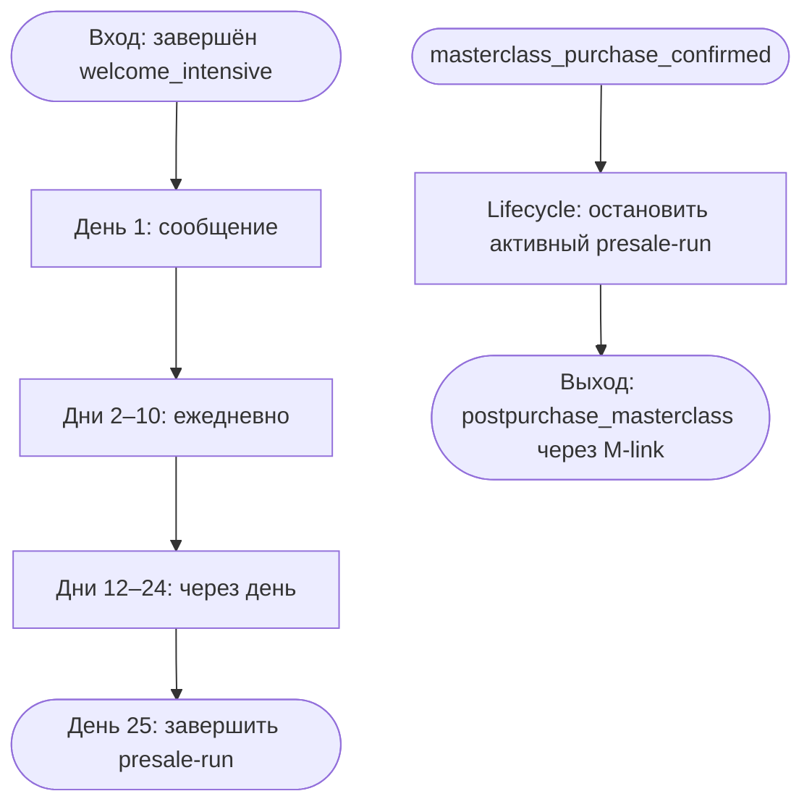

# Telegram: основная рассылка до покупки

Статус: `implemented_not_deployed`  
Владелец содержания: Сергей Воронцов  
Проверено: 24.08.2026

## Назначение и граница

Модуль `prepurchase_nurture` получает пользователя только после завершения
`welcome_intensive` и последовательно отправляет полезные и продающие материалы
до покупки мастер-класса. Внутри карточек нет повторяющихся проверок покупки:
подтверждённая покупка является централизованным lifecycle-событием, которое
останавливает активный presale-run и передаёт пользователя в
`postpurchase_masterclass`.

В модуль входят только расписание, 17 редактируемых сообщений и нормальное
завершение на 25-й день. Не входят разовые рассылки, лотерея, опросы и логика
после покупки.

## Расписание

- дни 1–10 — по одному сообщению ежедневно в одно и то же время;
- дни 12, 14, 16, 18, 20, 22 и 24 — по одному сообщению через день;
- день 25 — техническое завершение без сообщения;
- тексты, медиа и подписи кнопок редактируются в админке;
- задержки, связи и условия доступны только для чтения и меняются через канон,
  исполняемый граф и тесты;
- фото, обычное видео или голосовое сообщение отправляются вместе с подписью и
  кнопкой одним Telegram-сообщением. Видеокружок технически не поддерживает
  подпись в Telegram и поэтому является отдельным сообщением.

## Входы, выходы и ошибки

Вход: зелёный выход `welcome_intensive` после четвёртого дня и финальной задержки.

Выходы:

1. `masterclass_purchase_confirmed` — lifecycle останавливает run с причиной
   `masterclass_purchase_confirmed`; дальнейшая связь идёт через персональный
   M-link модуля после покупки.
2. День 25 без покупки — run завершается, новые сообщения не планируются.
3. Ошибка доставки — сохраняется в delivery/run и видна в админке; граф не
   перескакивает через неотправленный обязательный шаг молча.

## Каноническая схема

Каждый прямоугольник расписания разворачивается в админке до конкретных
`DELAY → MESSAGE` блоков. Событие покупки не дублируется ромбом перед каждым
сообщением.

## Данные и исполнение

| Что | Где |
|---|---|
| Цепочка и версии | `tg_sequences`, `tg_sequence_versions` |
| Шаги и связи | `tg_sequence_steps`, `tg_sequence_edges` |
| Тексты и медиа | `tg_content_items` |
| Текущий run и следующий срок | `tg_sequence_runs` |
| Доставки | `tg_step_deliveries` |
| Исполняемый граф | `telegram-bot/service/app/seed.py` |
| Выполнение шагов | `telegram-bot/service/app/engine.py` |
| Централизованная остановка | `telegram-bot/service/app/customer_lifecycle.py` |

## Обязательные тесты

1. В новой версии ровно 17 сообщений и STOP на 25-й день.
2. Дни 1–10 имеют суточный интервал, дни 12–24 — двухсуточный.
3. В графе нет `has_product` перед сообщениями.
4. Покупка останавливает активный run идемпотентно.
5. Текст, медиа и кнопка изменяются без изменения графа.
6. Ускоренный тест сокращает время только выбранного пользователя.
