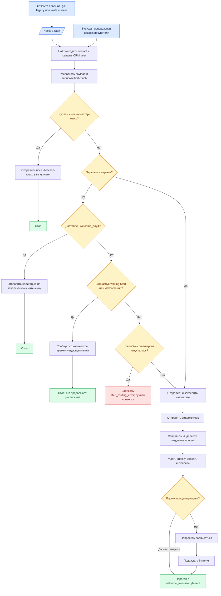

# Глобальный модуль «Старт и атрибуция»

Статус: `implemented / testing before deploy`
Владелец содержания: Сергей Воронцов  
Проверено: 22.08.2026

Это канон первого глобального модуля Telegram-бота. Он отвечает на один вопрос:
что должно произойти от открытия ссылки и нажатия Start до передачи человека на
первый день интенсива либо до конечного ответа повторному пользователю.

## 1. Граница модуля

В модуль входят:

1. создание или импорт правила ссылки;
2. распознавание прямой, короткой, legacy- или channel-invite ссылки;
3. поиск/создание Telegram-контакта и связь с общим CRM `user_id`;
4. сохранение first-touch источника без перезаписи повторным Start;
5. проверка покупки именно мастер-класса;
6. определение первого или повторного посещения;
7. проверка факта доставки четвёртого дня и состояния Welcome run;
8. для нового человека: навигационный пост и закреп, видеокружок, приветственный
   пост «Сделайте похудение проще», кнопка `Начать интенсив`, заглушка проверки
   подписки и fail-open через пять минут;
9. выход в отдельный модуль `welcome_intensive`, первый шаг которого — День 1.

В модуль **не входят** восемь материалов Welcome, основная рассылка до покупки и
послепродажная цепочка. Они являются отдельными глобальными модулями.

Повторный `/start` никогда не перескакивает delay, не отправляет следующий пост
досрочно и не создаёт второй run.

## 2. Все входы

- обычный `/start` без payload;
- bot/go/legacy-ссылка с payload;
- подтверждённое вступление по channel invite;
- в будущем — одноразовая ссылка уже купившего человека из checkout.

Неизвестный payload безопасно трактуется как обычный корневой старт: событие
сохраняется для диагностики, но выдуманный источник или тег не создаётся.

## 3. Канонический порядок проверок

1. Найти или создать контакт и общий CRM user.
2. Распознать payload, разрешённый route и first-touch источник.
3. Атомарно записать первое посещение. Повторное посещение не меняет first-touch.
4. Проверить подтверждённую покупку/право именно мастер-класса. Рецепты, калории,
   консультация и другие продукты этой проверке не равны.
5. Если мастер-класс куплен — остановить активные Start/Welcome/pre-purchase run,
   отправить `tpl_start_has_masterclass` и закончить.
6. Если мастер-класс не куплен — проверить, первое ли это посещение.
7. При первом посещении запустить внутреннюю стартовую последовательность:
   навигация → закреп → кружок → приветствие → ожидание кнопки.
8. При повторном посещении проверить доставку `welcome_day4`.
9. Если День 4 доставлен — отправить `tpl_start_intensive_complete` и закончить.
10. Если День 4 не доставлен — найти active/waiting run именно
    `welcome_intensive` (также учитывается ожидание кнопки в стартовой
    последовательности).
11. Если run существует — отправить `tpl_start_intensive_waiting` с фактическим
    временем следующего шага; сам run не менять.
12. Если run отсутствует — проверить, запускалась ли текущая новая Welcome-версия.
13. Если не запускалась — восстановить нормальный путь с начала стартовой
    последовательности.
14. Если запускалась, но run потерян и День 4 не доставлен — записать
    `start_routing_error`, ничего пользователю не отправлять и оставить случай для
    ручной проверки.

## 4. Внутренняя последовательность нового пользователя

Она хранится как техническая sequence `start_attribution_entry`, но в админке
показывается одной карточкой глобального модуля, а не как четвёртая пользовательская
рассылка.

1. `start_navigation` — отправить `tpl_start_navigation_pin`.
2. Попытаться закрепить отправленное сообщение через `pinChatMessage`. Ошибка
   закрепления не должна останавливать путь.
3. `start_circle` — отправить видеокружок знакомства.
4. `start_offer` — отправить `tpl_start_welcome_offer` с кнопкой
   `Начать интенсив`.
5. `start_wait_button` — ждать callback; автоматического перехода до кнопки нет.
6. `start_subscription` — проверить подписку. В тестовом боте это отключённая
   заглушка, поэтому ветка проходит дальше.
7. Для будущей реальной проверки: при отсутствии подписки отправить
   `start_subscription_reminder`, дать повторную попытку и через пять минут
   продолжить в любом случае.
8. Передать управление в `welcome_intensive`. Его первый контентный шаг —
   `welcome_day1`.

## 5. Ответы повторному пользователю

### Мастер-класс уже куплен

Контент: `tpl_start_has_masterclass`. Сообщает, что интенсив больше не нужен,
предлагает двигаться по мастер-классу и при необходимости написать
`@FitnessSergey`. После ответа Start-модуль ничего не запускает.

```text
Привет! У вас уже есть мой Мастер-класс по организации питания и здоровых отношений с едой.

Интенсив вам больше не нужен, потому что в Мастер-классе все эти темы разбираются более подробно и в деталях.

Если приобрели Мастер-класс недавно, то не отвлекайтесь, двигайтесь по программе Мастер-класса и Калорийного курса после него и да прибудет с вами похудение.

Если вам нужна консультация после Мастер-класса и по любым другим вопросам пишите мне в личные сообщения → @FitnessSergey
```

### Интенсив ещё идёт

Контент: `tpl_start_intensive_waiting`. Показывает фактические
`{{next_message_at}}` и `{{wait_interval}}`. Если человек ещё не нажал кнопку,
напоминает воспользоваться уже отправленной кнопкой. Существующий run продолжает
своё расписание без изменений.

```text
Интенсив уже идёт 👍

Следующий материал придёт {{next_message_at}} — осталось примерно {{wait_interval}}.
А пока можете почитать мой Telegram-канал: {{channel_link}}.
```

### Все четыре дня получены

Контент: `tpl_start_intensive_complete`. Даёт навигацию по завершённому интенсиву,
ссылку на материалы и предложение мастер-класса. Ничего не перезапускает.

```html
💥 <b>Похудение состоит не из силы воли, а из десятков маленьких навыков.</b>

Освойте как можно больше навыков, чтобы вам понадобилось как можно меньше силы воли!

Читайте <a href="https://похудение-это-есть.рф/intensiv">бесплатный интенсив «Последнее похудение»</a>. Теперь все материалы собраны на одной странице на моём сайте!

А если вам близок мой подход к похудению и вы готовы перейти от теории к практике — читайте программу моего <a href="https://похудение-это-есть.рф">Мастер-класса по изменению питания и пищевых привычек</a>.

Любые вопросы — просто напишите мне в личные сообщения @FitnessSergey
```

## 6. Тексты первого входа

### Навигация и закреп

Контент: `tpl_start_navigation_pin`. После успешной отправки backend сохраняет
Telegram message ID и вызывает `pinChatMessage`. Текущая редакция:

```html
📌 <b>Навигация!</b>

1️⃣ Для связи по любым вопросам — @FitnessSergey

2️⃣ Начните с <a href="https://telegram.me/Fitness_Talks_bot?start=527c52b9-6c37-4fd8-95f5-eb213cd4dd14">бесплатного интенсива «Последнее похудение»</a>

3️⃣ Если понравится мой подход — присоединяйтесь к Мастер-классу по изменению питания и пищевых привычек: похудение-это-есть.рф

4️⃣ Не забудьте подписаться на <a href="https://telegram.me/Fitness_Talks">основной Telegram-канал</a> 👇
```

### Видеокружок

Контент: `tpl_entry_circle`, тип Telegram `video_note`. Сам файл загружается в
редакторе справа: выбрать блок кружка → `Загрузить медиа` → тип
`Видеокружок` → сохранить.

### Приветствие и кнопка

Контент: `tpl_start_welcome_offer`; конфигурация кнопки хранится на шаге
`start_offer`, callback — `start_intensive`. Текст не сокращается до одной строки:

```html
<b>Сделайте похудение проще</b> 💅

✅ Вместо ограничений — баланс
✅ Вместо ПП-рецептов — пищевые привычки
✅ Вместо уменьшения еды — увеличение насыщения
✅ Вместо калорий — дневник питания по фото
✅ Вместо погони за цифрами на весах — изменение образа жизни

Читайте бесплатный интенсив «Последнее похудение» на моём сайте:
<b>https://похудение-это-есть.рф/intensiv</b>

<b>Часть #1</b> — План успешного похудения и главные ошибки в самом его начале. Почему похудение начинается не с голода и что изменить в питании, чтобы лучше насыщаться?!

<b>Часть #2</b> — Как и зачем вести дневник питания БЕЗ калорий, что такое здоровое и нездоровое пищевое поведение, примеры реальных дневников и задания.

<b>Часть #3</b> — Что такое «Вредная еда» на самом деле? Почему вам не стоит бояться «вредностей» из магазина и что реально вредит вашему здоровью.

<b>Часть #4</b> — Почему почти все пользуются учётом калорий не так, как надо, а потом жалуются, что без подсчёта набирают всё обратно? Насколько нужны тренировки для похудения и как их посчитать!

<b>У вас появится чёткое понимание:</b>

✍️ На какие важные вещи вы раньше не обращали внимания и каким должен быть план похудения сейчас.

✍️ Каких навыков вам не хватает, чтобы сделать похудение проще и какие первые шаги вы можете сделать уже сегодня!

Открывайте интенсив: <b>https://похудение-это-есть.рф/intensiv</b>

Не забудьте подписаться на мой Telegram-канал: <a href="https://t.me/Fitness_Talks/260">Похудение — это есть!</a>, чтобы не пропускать новые посты.
```

### Напоминание о подписке

Контент: `tpl_start_subscription_reminder`. В тестовом боте ветка не исполняется,
потому что проверка отключена. Для чистового бота предусмотрен текст с кнопкой в
канал, повторная проверка и обязательный fail-open через пять минут.

## 7. Выходы

- `masterclass_owned` — пост покупателю, затем стоп;
- `intensive_complete` — навигация по завершённому интенсиву, затем стоп;
- `waiting` — сообщение о следующем материале, существующий run живёт дальше;
- `start_routing_error` — запись ошибки, ручной разбор, без сообщения;
- `welcome_intensive` — зелёная стрелка в отдельный модуль из восьми сообщений.

## 8. Данные и исполняющие файлы

| Что | Где |
|---|---|
| Telegram account и связь с CRM | `messenger_accounts`, `tg_contacts` |
| факт первого посещения | `messenger_accounts.main_scenario_seen_at` |
| first-touch и события | `tg_tracking_events`, link/alias/tag tables |
| покупки и права | общие CRM payments/products/access tables |
| состояние цепочек | `tg_sequence_runs`, `tg_step_deliveries` |
| тексты сообщений | `tg_content_items` |
| последовательность нового Start | `tg_sequences` и version/step/edge tables, код `start_attribution_entry` |
| выбор повторной ветки | `telegram-bot/service/app/start_router.py` |
| исполняемый sequence-движок | `telegram-bot/service/app/engine.py` |
| создание системных шагов и контента | `telegram-bot/service/app/seed.py` |
| структурированный граф для админки | `telegram-bot/service/app/graph.py` |
| API карты и редактора | `telegram-bot/service/app/main.py` |
| визуализация/редактор | `telegram-bot/service/static/app.js` |

## 9. Каноническая блок-схема



Админка обязана рисовать эту структуру из тех же узлов, которые обслуживает
backend. Клик по сообщению открывает справа редактор связанного
`tg_content_items`; условие показывает проверяемый факт и обе ветки.

## 10. Приёмочные сценарии

1. первый вход без покупки → навигация, закреп, кружок, приветствие, кнопка;
2. кнопка → заглушка подписки → `welcome_day1`;
3. повторный Start до кнопки → напоминание, без пропуска;
4. повторный Start при активном Welcome → фактическое ожидание, без пропуска;
5. повторный Start после `welcome_day4` → навигация по интенсиву;
6. покупатель при первом или повторном Start → покупательский пост и стоп;
7. неизвестный payload → корневой Start без выдуманного тега;
8. потерянный run → событие ошибки без запуска второй цепочки;
9. ошибка закрепления → остальная стартовая последовательность продолжается;
10. повторная ссылка не перезаписывает first-touch.

## 11. Специальный вход покупателя до первого Telegram Start

Если человек купил мастер-класс на сайте до первого входа в Telegram и его
Telegram account уже связан с тем же CRM user, обычная проверка покупки сразу
выбирает покупательскую ветку. Если связи ещё нет, source-тега недостаточно.

Запланирован короткоживущий одноразовый непрозрачный token, созданный checkout для
конкретного CRM `user_id`. Он должен проверяться по hash, сроку и одноразовости,
не содержать email/Telegram ID в URL, связать аккаунт с существующим user и затем
вернуться в обычную проверку покупки. Этот вход показан на карте, но его генерация
на сайте ещё не подключена.

## 12. Честно отложено

- настоящая проверка подписки на основном боте; сейчас заглушка;
- генерация одноразовой checkout-ссылки покупателя;
- живой Telegram-прогон после production deploy.
