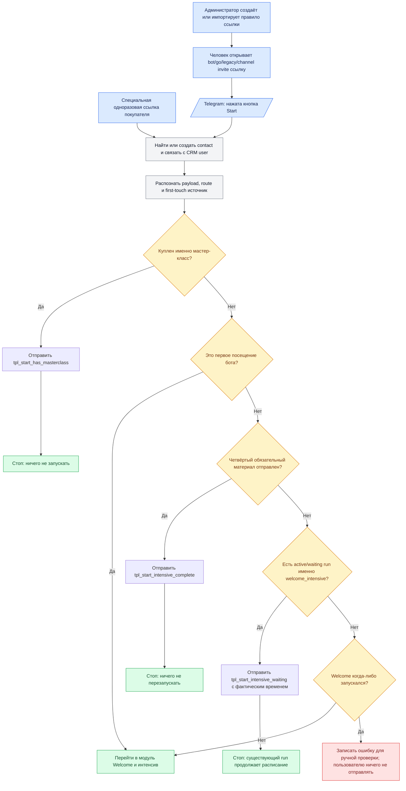

# Глобальный модуль «Старт и атрибуция»

Статус: `approved_requirements / partially_implemented`  
Владелец содержания: Сергей Воронцов  
Проверено: 22.08.2026  
Источники: сообщения владельца, `LEAD_ENTRY_OWNER_REQUIREMENTS.md`,
`LEAD_ENTRY_TECHNICAL_SPEC.md`, `../../../plans/TELEGRAM_START_LINKS_SPEC.md`,
`../../../TELEGRAM_BOT_CURRENT_LOGIC.md`

Этот документ — человеко- и машиночитаемый канон единого глобального модуля. Он
объединяет создание/распознавание источника, первый `/start`, повторный `/start`,
проверку мастер-класса и выбор конечного выхода. Детальные требования к ссылкам и
атрибуции находятся в `LEAD_ENTRY_OWNER_REQUIREMENTS.md` и
`LEAD_ENTRY_TECHNICAL_SPEC.md` как подмодуль этого глобального процесса.

## 1. Граница модуля

Модуль начинается раньше Telegram-сообщений. В него входят:

```text
создание/импорт правила ссылки
→ публикация прямой, go., legacy или channel invite ссылки
→ открытие ссылки человеком
→ Telegram /start либо подтверждённое вступление в канал
→ идентификация человека и атрибуция
→ выбор стартовой ветки
```

Отдельный вход — специальная одноразовая ссылка для человека, который купил
мастер-класс до первого открытия Telegram-бота. Она сначала должна связать Telegram
account с существующим CRM `user_id`, а затем войти в общую проверку покупки.

После атрибуции модуль проверяет покупку именно мастер-класса, состояние текущего
Welcome run и факт завершения четвёртого обязательного материала. Рецепты,
калории, консультация и другие отдельные покупки не считаются покупкой
мастер-класса.

Модуль заканчивается после одного из четырёх исходов:

1. покупателю мастер-класса отправлен отдельный системный пост; ничего нового не
   запускается;
2. знакомому участнику незавершённого интенсива отправлено время следующего
   сообщения; существующий run продолжает жить по своему расписанию;
3. завершившему четыре дня отправлена навигация/предложение мастер-класса; ничего
   нового не запускается;
4. управление передано через зелёный выход в отдельный глобальный модуль
   `Welcome и первая часть интенсива`.

Навигационный закреп, видеокружок, пост «Сделайте похудение проще», кнопка
`Начать интенсив`, проверка подписки и последующие материалы уже **не входят** в
этот модуль. Они начинаются после выхода `Запустить Welcome` и описываются в
`WELCOME_INTENSIVE.md`.

Ни один повторный `/start` не перескакивает delay, не отправляет очередной день
досрочно и не создаёт второй run той же цепочки.

## 2. Канонический порядок

1. Принять обычный `/start`, распознанную bot/go/legacy ссылку, подтверждённый
   channel invite либо специальный одноразовый token покупателя.
2. Найти/создать Telegram contact и связать его с общим CRM `user_id`.
3. Распознать источник. Неизвестный payload записать для диагностики и безопасно
   трактовать как обычный корневой старт без выдуманного источника.
4. Атомарно определить первое/повторное посещение. Только при первом распознанном
   контакте назначить существующие first-touch теги. Повторный `/start` источник
   не перезаписывает.
5. Получить разрешённый root/exception route, но не позволять исключению обходить
   проверку покупки мастер-класса.
6. **Куплен ли мастер-класс?** Проверяется именно подтверждённое право/покупка
   мастер-класса в общей CRM, а не Telegram-тег и не покупка другого продукта.
7. Если мастер-класс куплен — остановить активные Welcome/pre-purchase run,
   отправить `tpl_start_has_masterclass` и завершить модуль.
8. Если мастер-класс не куплен — проверить `is_first_bot_visit`.
9. Если это первый вход — передать управление через выход `Запустить Welcome`.
   Сам Welcome внутрь текущей схемы не раскрывать.
10. Если пользователь знакомый — проверить, отправлен ли четвёртый обязательный
    материал/пост Welcome-интенсива.
11. Если четвёртый материал отправлен — отправить
    `tpl_start_intensive_complete` и завершить модуль.
12. Если четвёртый материал не отправлен — проверить наличие именно активного или
    ожидающего run модуля `welcome_intensive`, а не любого run пользователя.
13. Если такой Welcome run есть — отправить `tpl_start_intensive_waiting`,
    подставив фактические дату, время и оставшийся интервал из
    `tg_sequence_runs.next_action_at`; run не менять.
14. Если активного/ожидающего Welcome run нет — проверить, запускал ли человек
    именно текущую новую версию Welcome когда-либо. Исторический LeadTeh Welcome
    не считается запуском новой рассылки: старые пользователи должны получить её.
15. Если Welcome никогда не запускался — передать управление через выход
    `Запустить Welcome`.
16. Если Welcome раньше запускался, но четвёртый материал не отправлен и run
    отсутствует — записать структурированную ошибку для ручной проверки и ничего
    пользователю не отправлять.

Проверка покупки имеет приоритет и для первого, и для повторного входа. Поэтому
человек, впервые открывший бот уже после покупки мастер-класса, не должен получать
обычный интенсив, если его Telegram account достоверно связан с CRM-покупателем.

## 3. Ветка «мастер-класс уже куплен»

Код контента в PostgreSQL: `tpl_start_has_masterclass`.

```text
Привет! У вас уже есть мой Мастер-класс по организации питания и здоровых отношений с едой.

Интенсив вам больше не нужен, потому что в Мастер-классе все эти темы разбираются более подробно и в деталях.

Если приобрели Мастер-класс недавно, то не отвлекайтесь, двигайтесь по программе Мастер-класса и Калорийного курса после него и да прибудет с вами похудение.

Если вам нужна консультация после Мастер-класса и по любым другим вопросам пишите мне в личные сообщения → @FitnessSergey
```

До ответа активные Welcome/pre-purchase run останавливаются. После отправки этот
стартовый router ничего больше не запускает. Действующая послепродажная цепочка,
если она уже существует отдельно, продолжает работать по своему состоянию.

## 4. Ветка «интенсив ещё идёт»

Код контента в PostgreSQL: `tpl_start_intensive_waiting`.

```text
Интенсив уже идёт 👍

Следующий материал придёт {{next_message_at}} — осталось примерно {{wait_interval}}.
А пока можете почитать мой Telegram-канал: {{channel_link}}.
```

`next_message_at` и `wait_interval` вычисляются backend из фактического
`tg_sequence_runs.next_action_at`. Текст не должен обещать выдуманное время.
`channel_link` редактируется как настройка/переменная контента. Если run ожидает
кнопку «Начать интенсив», вместо времени бот напоминает нажать уже отправленную
кнопку.

После ответа router завершён. Scheduler продолжает существующую цепочку без
перестановки `current_step_key` и `next_action_at`.

## 5. Ветка «четыре дня завершены»

Код контента в PostgreSQL: `tpl_start_intensive_complete`.

```html
💥 <b>Похудение состоит не из силы воли, а из десятков маленьких навыков.</b>

Освойте как можно больше навыков, чтобы вам понадобилось как можно меньше силы воли!

Читайте <a href="https://похудение-это-есть.рф/intensiv">бесплатный интенсив «Последнее похудение»</a>. Теперь все материалы собраны на одной странице на моём сайте!

А если вам близок мой подход к похудению и вы готовы перейти от теории к практике — читайте программу моего <a href="https://похудение-это-есть.рф">Мастер-класса по изменению питания и пищевых привычек</a>.

Любые вопросы — просто напишите мне в личные сообщения @FitnessSergey
```

В нынешней редакции факт завершения — успешная доставка четвёртого обязательного
материала интенсива, а не просто четыре календарных дня после регистрации. Для
будущей по-дневной версии к посту добавляется оглавление/навигация по четырём дням.

После ответа router ничего не перезапускает. Продолжающаяся отдельная цепочка
полезных и продающих постов остаётся на своём расписании.

## 6. Выход «Запустить Welcome»

Это не внутренний блок текущего модуля, а зелёная стрелка в глобальный модуль
`welcome_intensive`. Выход используется в двух случаях:

1. человек впервые вошёл, мастер-класс у него не куплен;
2. человек знакомый, четвёртый материал не отправлен, активного/ожидающего Welcome
   run нет и нет признаков, что Welcome когда-либо запускался.

В следующий модуль передаются найденные `user_id`/`contact_id`, результат
атрибуции, причина входа (`first_visit` или `recover_never_started`) и выбранный
разрешённый маршрут. После передачи текущий модуль заканчивается.

Навигационный пост и закреп, видеокружок, приветствие «Сделайте похудение проще»,
кнопка `Начать интенсив`, проверка подписки и материалы интенсива описываются только
в `WELCOME_INTENSIVE.md`. Их нельзя дублировать внутри стартовой схемы.

## 7. Первый вход покупателя по специальной ссылке

Есть отдельная реальная ситуация: человек купил мастер-класс на сайте до первого
запуска Telegram-бота и затем открывает бот из письма/страницы покупки.

Если Telegram account уже достоверно связан с тем же `users.id`, обычная проверка
покупки сразу выбирает ветку покупателя. Если связи ещё нет, простой source-код
недостаточен: требуется короткоживущий одноразовый непрозрачный link token,
созданный для конкретного CRM `user_id` после покупки. При `/start` token:

1. проверяется по hash, сроку и одноразовости;
2. связывает Telegram account с существующим `user_id`;
3. не содержит email, Telegram ID и другие персональные данные в открытом URL;
4. после связи запускает обычную проверку покупки;
5. не является произвольным обходом бизнес-условий.

Фактическая интеграция генерации такого token в checkout/Tilda пока не сделана и
не входит в уже завершённый модуль атрибуции источника.

## 8. Что хранится где

- связь Telegram с человеком: `messenger_accounts`, `tg_contacts`;
- факт первого посещения: `messenger_accounts.main_scenario_seen_at`;
- покупки и продукты: общие `payments`, `products`/доступы CRM;
- состояние и расписание интенсива: `tg_sequence_runs`, `tg_step_deliveries`;
- редактируемые системные посты: `tg_content_items`;
- стартовая точка и конфигурация маршрута: `tg_bot_routes`;
- welcome/интенсив: `tg_sequences`, `tg_sequence_versions`,
  `tg_sequence_steps`, `tg_sequence_edges`;
- вычисление текущей фактической ветки: Telegram service; после завершения
  реализации порядок решений должен читаться картой из зарегистрированной
  конфигурации, а не оставаться скрытым набором `if`.

## 9. Обязательная карта

Для каждого модуля и каждой цепочки админка должна показывать блок-схему из тех же
структурированных узлов и связей, которые использует backend:

- прямоугольник — действие/пост;
- ромб — условие и точное название проверяемого факта;
- подписанная стрелка — результат условия;
- конечный блок — что отправлено, что продолжает работать и что новый router не
  запускает.

Текстовое описание и карта не являются двумя независимыми источниками. Backend
отдаёт структурированный граф; UI рисует его; документация фиксирует смысл тех же
узлов. Изменение условия требует одновременно обновить исполнение, карту, тест и
этот канон.



## 10. Фактическая готовность на 22.08.2026

Уже работает как подмеханизм модуля:

- модуль 1 определяет источник и первое/повторное посещение;
- повторный `/start` не ускоряет run;
- ожидание умеет взять интервал из `next_action_at`;
- завершение сейчас определяется доставкой шага четвёртого дня;
- пять согласованных системных текстов заведены в библиотеку `tg_content_items`:
  навигационный закреп, welcome, покупатель, ожидание и завершённый интенсив.

Реализовано и покрыто автоматическими тестами:

- покупка мастер-класса или активное право проверяются до первого/повторного
  Welcome;
- покупка останавливает активный Welcome/pre-purchase run;
- системные тексты покупателя, ожидания и завершения исполняются из библиотеки;
- повторный `/start` не меняет `current_step_key` и `next_action_at`;
- потерянное состояние записывается как `start_routing_error`, без сообщения;
- правила исполняются из зарегистрированного `START_ROUTER_RULES`, а админка
  показывает те же условия и выходы;
- в карточке пользователя есть безопасный предпросмотр «Что ответит Start».

Отложена только генерация одноразовой ссылки покупателя из сайта/checkout. Уже
связанный с CRM покупатель корректно определяется обычным `/start`. Отдельный
глобальный модуль Welcome остаётся следующим этапом и не входит в эту границу.

## 11. Матрица приёмочного тестирования

Сначала все ветки прогоняются в админке на выбранном тестовом пользователе без
ожидания реальных суток:

1. известная ссылка + первый вход + нет мастер-класса → `Запустить Welcome`;
2. неизвестный payload + первый вход → корневой маршрут без выдуманных тегов →
   `Запустить Welcome`;
3. специальная покупательская ссылка → связь с CRM → пост покупателя → стоп
   (автоматический тест router готов; checkout-интеграция отложена);
4. повторный вход + мастер-класс куплен → пост покупателя → стоп;
5. повторный вход + День 4 отправлен → пост завершения → стоп;
6. повторный вход + День 4 не отправлен + active/waiting Welcome run → пост
   ожидания; `current_step_key` и `next_action_at` не меняются;
7. повторный вход + День 4 не отправлен + run нет + Welcome никогда не запускался
   → `Запустить Welcome`;
8. повторный вход + День 4 не отправлен + run нет + Welcome запускался → ошибка в
   ручной разбор; Telegram-сообщение не отправляется;
9. повторный вход по новой ссылке не меняет first-touch теги;
10. разрешённая exception-ссылка не обходит проверку мастер-класса.

После автоматических тестов выполняется один живой прогон на тестовом Telegram-
пользователе: очистка только его тестового состояния, ускоренный Welcome, повторный
`/start` в ожидании и после имитации завершения.

## 12. Зафиксированные решения для реализации

1. `Welcome когда-либо запускался` означает существование run именно текущей новой
   версии `welcome_intensive`. Старые LeadTeh-теги не заменяют этот факт: прежние
   пользователи должны получить новую рассылку.
2. Покупка мастер-класса определяется каноническим правом на продукт в CRM,
   появившимся после подтверждённой покупки; Telegram-тег покупку не доказывает.
3. Обнаружение покупки останавливает активные Welcome/pre-purchase run, чтобы
   человеку не продолжали приходить сообщения до покупки.

Продуктовых вопросов, блокирующих техническую реализацию этого модуля, больше нет.
