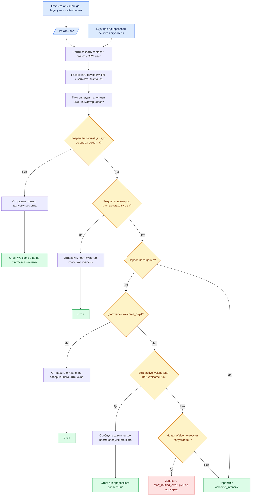

# Глобальный модуль «Старт и атрибуция»

Статус: `current`
Состояние внедрения: production maintenance; контент заполнен частично.
Владелец содержания: Сергей Воронцов  
Проверено: 25.08.2026

Это канон первого глобального модуля Telegram-бота. Он отвечает на один вопрос:
что должно произойти от открытия ссылки и нажатия Start до передачи человека на
первый день интенсива либо до конечного ответа повторному пользователю.

## 1. Граница модуля

В модуль входят:

1. создание или импорт правила ссылки;
2. распознавание прямой, короткой, legacy- или channel-invite ссылки;
3. поиск/создание Telegram-контакта и связь с общим CRM `user_id`;
4. сохранение first-touch источника без перезаписи повторным Start;
5. проверка покупки именно мастер-класса;
6. определение первого или повторного посещения;
7. проверка факта доставки четвёртого дня и состояния Welcome run;
8. выход в отдельный модуль `welcome_intensive`. Навигационный закреп, кружок,
   приветствие, кнопка и проверка подписки являются уже первыми блоками Welcome.

В модуль **не входят** восемь материалов Welcome, основная рассылка до покупки и
послепродажная цепочка. Они являются отдельными глобальными модулями.

Повторный `/start` никогда не перескакивает delay, не отправляет следующий пост
досрочно и не создаёт второй run.

### Временный production-предохранитель

Пока владелец заполняет тексты и вручную проверяет сценарии, действует один
глобальный maintenance allowlist. Он останавливает пользовательские сообщения и
цепочки, но не должен терять источник человека или связь с покупателем:

1. Telegram contact и единый CRM user создаются или обновляются всегда.
2. Start payload/M-link и first-touch источник распознаются до заглушки; выбранные
   теги и связь Telegram с уже существующим покупателем сохраняются.
3. До заглушки тихо определяется факт покупки именно мастер-класса. Никакое
   пользовательское сообщение на этом этапе ещё не отправляется.
4. Полная логика разрешена только Telegram ID из
   `TELEGRAM_MAINTENANCE_ALLOWED_USER_IDS`.
5. У остальных contact получает статус `maintenance_waitlist`, а в
   `tg_tracking_events` пишется `maintenance_contact`.
6. Пользователь получает редактируемый `tpl_maintenance_notice`; ни ответ
   покупателю, ни Start-router, ни Welcome, ни broadcast, ни post-purchase
   доставка дальше не исполняются.
7. Факт `main_scenario_seen_at` не выставляется только из-за заглушки: после снятия
   ремонта человек без начатого Welcome должен попасть в нормальный первый Welcome,
   а не в ошибочную ветку повторного пользователя.
8. После окончания ремонта список можно выбрать по статусу
   `maintenance_waitlist`, уведомить о запуске и только затем снять режим.

Переключатель — `TELEGRAM_MAINTENANCE_MODE`. Это временная защитная граница, а не
отдельная пользовательская цепочка и не новый тег.

## 2. Все входы

- обычный `/start` без payload; для owner-тестирования слова `start` и `старт`
  без payload нормализуются в ту же команду;
- bot/go/legacy-ссылка с payload;
- подтверждённое вступление по channel invite;
- одноразовая M-ссылка уже купившего человека из анкеты/личного кабинета.

Неизвестный payload безопасно трактуется как обычный корневой старт: событие
сохраняется для диагностики, но выдуманный источник или тег не создаётся.

## 3. Канонический порядок проверок

1. Найти или создать контакт и общий CRM user.
2. Распознать payload/M-link, разрешённый route и first-touch источник.
3. Сохранить первый распознанный источник и его теги без перезаписи повторным
   Start.
4. Тихо определить подтверждённую покупку/право именно мастер-класса. Рецепты, калории,
   консультация и другие продукты этой проверке не равны.
5. Проверить maintenance allowlist. Если доступ запрещён — отправить только
   `tpl_maintenance_notice`, не отмечать Welcome начатым и закончить обработку.
6. Для разрешённого пользователя атомарно записать первое полноценное посещение.
7. Если мастер-класс куплен — остановить активные Welcome/pre-purchase run,
   отправить `tpl_start_has_masterclass` и закончить.
8. Если мастер-класс не куплен — проверить, первое ли это полноценное посещение.
9. При первом посещении передать управление в `welcome_intensive`.
10. При повторном посещении проверить доставку `welcome_day4`.
11. Если День 4 доставлен — отправить `tpl_start_intensive_complete` и закончить.
12. Если День 4 не доставлен — найти active/waiting run именно
    `welcome_intensive`. Ожидание кнопки также является состоянием этого run.
13. Если run существует — отправить `tpl_start_intensive_waiting` с фактическим
    временем следующего шага; сам run не менять.
14. Если run отсутствует — проверить, запускалась ли текущая новая Welcome-версия.
15. Если не запускалась — восстановить нормальный путь с начала Welcome.
16. Если запускалась, но run потерян и День 4 не доставлен — записать
    `start_routing_error`, ничего пользователю не отправлять и оставить случай для
    ручной проверки.

## 4. Ответы повторному пользователю

### Мастер-класс уже куплен

Контент: `tpl_start_has_masterclass`. Сообщает, что интенсив больше не нужен,
предлагает двигаться по мастер-классу и при необходимости написать
`@FitnessSergey`. После ответа Start-модуль ничего не запускает.

```text
Привет! У вас уже есть мой Мастер-класс по организации питания и здоровых отношений с едой.

Интенсив вам больше не нужен, потому что в Мастер-классе все эти темы разбираются более подробно и в деталях.

Если приобрели Мастер-класс недавно, то не отвлекайтесь, двигайтесь по программе Мастер-класса и Калорийного курса после него и да прибудет с вами похудение.

Если вам нужна консультация после Мастер-класса и по любым другим вопросам пишите мне в личные сообщения → @FitnessSergey
```

### Интенсив ещё идёт

Контент: `tpl_start_intensive_waiting`. Показывает фактические
`{{next_message_at}}` и `{{wait_interval}}`. Если человек ещё не нажал кнопку,
напоминает воспользоваться уже отправленной кнопкой. Существующий run продолжает
своё расписание без изменений.

```text
Посты интенсива приходят вам по расписанию 👍

Выше в этом чате уже находятся закреплённая навигация, видеокружок, описание
интенсива и все открытые на данный момент материалы.

Следующий материал придёт {{next_message_at}} — осталось примерно {{wait_interval}}.
Пока ждёте, можете почитать мой Telegram-канал: {{channel_link}}.
```

### Все четыре дня получены: оглавление завершённого интенсива

Контент: `tpl_start_intensive_complete`. Это не общий закреп и не сообщение
новичку. Оно начинается словами «Сделайте похудение проще», содержит краткое
описание четырёх дней и четыре ссылки на соответствующие части сайта. Точные URL
частей заполняются владельцем в редакторе контента. Ничего не перезапускает.

```html
<b>Сделайте похудение проще</b> 💅

Вы уже получили все четыре части интенсива. Теперь к ним можно возвращаться в удобном порядке:

1️⃣ <a href="https://похудение-это-есть.рф/intensiv#rec2044592871">Часть #1</a> — план успешного похудения и главные ошибки в самом начале.

2️⃣ <a href="https://похудение-это-есть.рф/intensiv#rec2044598581">Часть #2</a> — дневник питания без калорий и здоровое пищевое поведение.

3️⃣ <a href="https://похудение-это-есть.рф/intensiv#rec2044741621">Часть #3</a> — что такое «вредная еда» на самом деле.

4️⃣ <a href="https://похудение-это-есть.рф/intensiv#rec2044744291">Часть #4</a> — калории, тренировки и сохранение результата.

А если вам близок мой подход к похудению и вы готовы перейти от теории к практике — читайте программу моего <a href="https://похудение-это-есть.рф">Мастер-класса по изменению питания и пищевых привычек</a>.

Любые вопросы — просто напишите мне в личные сообщения @FitnessSergey
```

## 5. Выходы

- `masterclass_owned` — пост покупателю, затем стоп;
- `intensive_complete` — навигация по завершённому интенсиву, затем стоп;
- `waiting` — сообщение о следующем материале, существующий run живёт дальше;
- `start_routing_error` — запись ошибки, ручной разбор, без сообщения;
- `welcome_intensive` — зелёная стрелка в отдельный Welcome-модуль.

## 6. Данные и исполняющие файлы

| Что | Где |
|---|---|
| Telegram account и связь с CRM | `messenger_accounts`, `tg_contacts` |
| факт первого посещения | `messenger_accounts.main_scenario_seen_at` |
| first-touch и события | `tg_tracking_events`, link/alias/tag tables |
| покупки и права | общие CRM payments/products/access tables |
| состояние цепочек | `tg_sequence_runs`, `tg_step_deliveries` |
| тексты сообщений | `tg_content_items` |
| выбор повторной ветки | `telegram-bot/service/app/start_router.py` |
| исполняемый sequence-движок | `telegram-bot/service/app/engine.py` |
| создание системных шагов и контента | `telegram-bot/service/app/seed.py` |
| структурированный граф для админки | `telegram-bot/service/app/graph.py` |
| API карты и редактора | `telegram-bot/service/app/main.py` |
| визуализация/редактор | `telegram-bot/service/static/app.js` |

## 7. Каноническая блок-схема



Админка обязана рисовать эту структуру из тех же узлов, которые обслуживает
backend. Клик по сообщению открывает справа редактор связанного
`tg_content_items`; условие показывает проверяемый факт и обе ветки.

## 8. Приёмочные сценарии

1. первый вход без покупки → передача в Welcome;
2. Welcome начинает навигацию, закреп, кружок, приветствие и кнопку;
3. повторный Start до кнопки → напоминание, без пропуска;
4. повторный Start при активном Welcome → фактическое ожидание, без пропуска;
5. повторный Start после `welcome_day4` → навигация по интенсиву;
6. покупатель при первом или повторном Start → покупательский пост и стоп;
7. неизвестный payload → корневой Start без выдуманного тега;
8. потерянный run → событие ошибки без запуска второй цепочки;
9. ошибка закрепления → остальная стартовая последовательность продолжается;
10. повторная ссылка не перезаписывает first-touch.

## 9. Специальный вход покупателя до первого Telegram Start

Если человек купил мастер-класс на сайте до первого входа в Telegram и его
Telegram account уже связан с тем же CRM user, обычная проверка покупки сразу
выбирает покупательскую ветку. Если связи ещё нет, source-тега недостаточно.

Короткоживущая одноразовая M-ссылка реализована. Backend создаёт её для
конкретного CRM `user_id` только из подтверждённой app-session. В БД хранится SHA-256,
токен одноразовый и действует 15 минут. Telegram Start погашает его, связывает
аккаунт с существующим user и передаёт факт покупки в центральное lifecycle-правило.

## 10. Честно отложено

- настоящая проверка подписки на основном боте; сейчас заглушка;
- подключение M-ссылки в фактический production checkout и живой прогон;
- перевод с тестового бота на основного только после отдельного разрешения.
