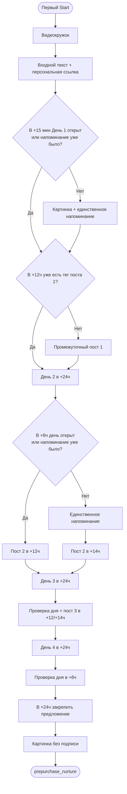

# Глобальный модуль «Welcome и четырёхдневный интенсив»

Статус: `current`
Состояние внедрения: `implemented`.
Владелец содержания: Сергей Воронцов
Проверено: 05.09.2026

## 1. Назначение и граница

Модуль выдаёт новому пользователю персональный вход в бесплатный интенсив,
открывает следующие части раз в 24 часа, напоминает об одном непрочитанном дне,
отправляет три промежуточных материала и после финального предложения передаёт
человека в `prepurchase_nurture`. Один опубликованный граф исполняется через
Telegram- или MAX-адаптер в зависимости от платформы контакта.

До входа Start-router уже определил пользователя, источник первого касания и
наличие мастер-класса. Покупателя мастер-класса сюда не пускают. Покупка во время
прохождения централизованно завершает presale-run по правилам customer lifecycle.
Тексты самих web-страниц, доступ к дням и публичное оглавление принадлежат модулю
`products.intensive`, а не мессенджеру.

В MAX используется тот же текст, расписание, контентные теги и проверки открытий.
Telegram-подписка там не проверяется, поэтому выбирается полная внутриботовая
версия промежуточного материала без создания Telegram subscription-тега.
Попытка закрепления финального сообщения выполняется только в Telegram.
Существующие MAX-пользователи не включаются в цепочку задним числом: она
начинается с их следующего явного входа в бота.

## 2. Входы и варианты повторного старта

Первый допустимый `/start` отправляет два сообщения:

1. видеокружок `tpl_entry_circle`;
2. один из согласованных входных текстов с персональной кнопкой «Открыть
   интенсив»: обычный `tpl_intensive_entry_default` либо вариант для
   Яндекс.Директа `tpl_intensive_entry_yandex`.

Персональная ссылка не содержит открытый Telegram ID. Она ведёт через серверный
код `/i/<code>`, связывает открытие с CRM-пользователем и показывает текущий
доступный день. После отправки входа создаётся Welcome-run; День 1 считается
выданным этим входом и уже доступен на сайте.

Повторный `/start` не перезапускает расписание:

- активный run → `tpl_intensive_entry_continue` с фактическим временем следующего
  сообщения;
- День 4 уже выдан → `tpl_intensive_entry_delivered`;
- старый участник прежней версии без активного нового run →
  `tpl_intensive_entry_legacy_update`, все четыре дня открыты;
- подтверждённый покупатель → `tpl_start_masterclass_owned`, presale-run
  останавливается.

## 3. Исполняемая последовательность

1. После входа тихо проверить подписку и сохранить результат аналитики.
2. В +15 минут от первого входа проверить в `course_stage_progress`, открыт ли
   День 1. Если нет и тег `Пост - Маленькие шаги` ещё не назначен, отправить
   картинку и единственное напоминание с кнопкой непрочитанной части.
3. В +12 часов проверить тег `Пост - Висцеральный жир`. Если тега нет, выбрать
   подписанную/неподписанную версию первого промежуточного материала, отправить
   её и назначить тег только после успешной доставки.
4. Ровно в +24 часа от первого входа отправить День 2.
5. В +8 часов после Дня 2 проверить его открытие. Если он не открыт и единственное
   напоминание ещё не использовано, отправить его.
6. Второй промежуточный материал приходит в +12 часов без напоминания или в +14
   часов после напоминания. Перед отправкой проверяется тег `Пост - На 1% лучше!`;
   подписанная версия получает картинку и прямую кнопку на пост
   `Fitness_Talks/734`.
7. Ровно в +24 часа после Дня 2 отправить День 3. Повторить восьмичасовую проверку
   и правило +12/+14 часов для материала `Пост - Пирамида похудения`. В
   неподписанная версия содержит прямую ссылку на `Fitness_Talks/328`.
8. Ровно в +24 часа после Дня 3 отправить День 4. В +8 часов применить то же
   правило единственного напоминания.
9. Ровно в +24 часа после Дня 4 отправить и попытаться закрепить
   `tpl_intensive_masterclass_pin` с персональной кнопкой Мастер-класса. Сразу
   после него отправить картинку «Худеть будем?» без подписи.
10. Передать человека в `prepurchase_nurture`.

Все сроки дней привязаны к фактической отправке предыдущего дня. Промежуточный
пост и напоминание не сдвигают следующий день. Ошибка закрепления финального
поста не останавливает цепочку.

## 4. Подписка, теги и защита от повторов

Проверка подписки выполняется тихо после входа, после каждого дня и вокруг
промежуточных материалов. Она влияет только на выбор полного либо ссылочного
варианта материала и на аналитику; доступ к интенсиву не блокируется. Ошибка
Telegram API сохраняется как неизвестное состояние и идёт по безопасной
неподписанной ветке.

Обе версии одного материала имеют разные content items, но один канонический тег:

| Материал | Тег | ID |
|---|---|---|
| Единственное напоминание | `Пост - Маленькие шаги` | `5f56aba0-74be-49af-bec9-c2799b260411` |
| Первый промежуточный пост | `Пост - Висцеральный жир` | `bb40957b-f598-4562-a096-7e06a4479058` |
| Второй промежуточный пост | `Пост - На 1% лучше!` | `e602d751-7ecf-4d75-9dac-d62c88276845` |
| Третий промежуточный пост | `Пост - Пирамида похудения` | `c767ab6a-45d6-41bc-808e-d0d11f0ef358` |

Тег назначается только после успешной отправки. `user_tags.created_at` хранит
дату первого получения и повторной отправкой не затирается. Найденный тег означает
пропуск соответствующего материала без изменения расписания. Отправка и открытие
ссылки — разные факты: доставка хранится в `tg_step_deliveries`, переход — в
tracking events персонального redirect.

## 5. Сообщения и переменные

Редактируемый источник согласованных сообщений —
`work/free-intensive-rebuild/bot-messages/*.md`. Сборщик
`tools/build_intensive_bot_content.py` создаёт deploy-производную
`telegram-bot/service/app/generated_intensive_content.py`; вручную её не правят.

Разрешённые runtime-переменные:

- `{{personal_intensive_url}}`;
- `{{personal_masterclass_url}}`;
- `{{next_message_at}}`;
- `{{wait_interval}}`;
- `{{unopened_day_number}}`.

Ссылки из бота в Telegram-канал всегда прямые: `t.me/Fitness_Talks/<номер>`.
Наш сайт между ботом и каналом не используется. Исключение возможно только после
отдельной явной просьбы владельца для конкретного места. Сейчас используются
посты `260`, `698`, `732`, `734` и `328`.

## 6. Ошибочные и неполные состояния

- Не найден канонический тег → сообщение не дублируется; run переводится в
  ошибку после сохранения результата отправки для ручной проверки.
- Не удалось прочитать прогресс дня → production обязан иметь применённую
  миграцию; ошибку нельзя выдавать за открытие дня.
- Telegram временно не отправил сообщение → доставка остаётся `failed`, run
  можно безопасно повторить без дубля уже успешных шагов.
- Не удалось закрепить финальный пост → записать ошибку закрепления и продолжить.
- Maintenance не допускает пользователя → вход и due-run не исполняются для него.

## 7. Схема

## 8. Данные и владельцы

| Факт | Источник |
|---|---|
| граф, версии, шаги и run | `tg_sequences`, `tg_sequence_versions`, `tg_sequence_steps`, `tg_sequence_runs` |
| успешные/неуспешные доставки | `tg_step_deliveries` |
| тексты и медиа | `tg_content_items` |
| открытые части | `course_stage_progress`, `course_code='intensive'` |
| подписка и переходы | `tg_tracking_events`, `messenger_accounts.subscription_status` |
| контентные теги | `tags`, `user_tags`, `docs/TAG_RULES.md` |
| start-routing | `telegram-bot/service/app/start_router.py` |
| исполняемый граф | `telegram-bot/service/app/seed.py` |
| выполнение | `telegram-bot/service/app/engine.py` |

## 9. Критерии готовности

- первый вход отправляет кружок и правильный входной текст, затем создаёт один run;
- повторный вход не перезапускает и не сдвигает расписание;
- Дни 2–4 приходят через 24 часа от предыдущего дня;
- напоминание приходит не более одного раза за весь Welcome и только для
  неоткрытого дня;
- промежуточный материал с уже существующим тегом пропускается;
- все персональные ссылки разрешаются без незаменённых `{{variables}}`;
- переходы на посты `698`, `732`, `734`, `328` ведут прямо в Telegram без
  промежуточной tracking-страницы;
- финальный пост отправляется через 24 часа после Дня 4, попытка закрепления не
  блокирует картинку и переход в presale;
- покупка в любой момент останавливает presale-run централизованно;
- полная симуляция обеих веток и owner-тест проходят до отключения maintenance.
