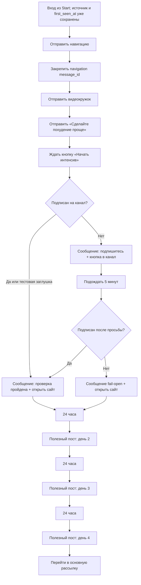

# Глобальный модуль «Welcome и первые дни»

Статус: `approved requirements / implementation in progress`
Владелец содержания: Сергей Воронцов
Проверено: 22.08.2026

## 1. Назначение и граница

Welcome начинается после зелёного выхода стартового router. Start уже определил
источник, сохранил дату первого посещения, связал Telegram с CRM, проверил покупку
мастер-класса и решил, что человеку нужен новый Welcome.

В Welcome входят:

1. навигационный пост и попытка закрепить его;
2. видеокружок знакомства;
3. большой пост «Сделайте похудение проще» с кнопкой `Начать интенсив`;
4. ожидание нажатия кнопки;
5. проверка подписки, представленная отдельным условием и редактируемыми
   сообщениями результата;
6. открытие текущего интенсива на сайте;
7. три последующих полезных поста — по одному в следующие дни;
8. выход в основную регулярную рассылку. Первый продающий пост уже принадлежит
   следующему модулю и приходит на пятый день.

В Welcome не входят распознавание источника, повторный `/start`, ответ уже
купившему и дальнейшая регулярная продажа.

## 2. Текущая первая редакция

Содержательная часть Welcome — четыре дня:

| День | Блок | Смысл |
|---:|---|---|
| 1 | `welcome_offer` + успешная проверка | описание интенсива и ссылка на единый интенсив на сайте |
| 2 | `welcome_day2` | редактируемый полезный пост-заготовка |
| 3 | `welcome_day3` | редактируемый полезный пост-заготовка |
| 4 | `welcome_day4` | редактируемый полезный пост-заготовка; после доставки Welcome завершён |
| 5 | `hard_sale_1` | уже первый пост отдельной основной рассылки |

Между содержательными днями — 24 часа. Тихих часов нет: расчёт идёт от времени
входа конкретного человека. Повторный Start расписание не ускоряет.

## 3. Будущая редакция

Когда интенсив будет перенесён внутрь бота, текущий сайт-пост заменяется на семь
контентных сообщений:

```text
День 1 интенсива
→ промежуточный пост 1
→ День 2 интенсива
→ промежуточный пост 2
→ День 3 интенсива
→ промежуточный пост 3
→ День 4 интенсива
→ выход в основную рассылку
```

Продажа после Дня 4 всё равно остаётся в следующем модуле. Это изменение не должно
возвращать Start, Welcome и регулярную рассылку в одну большую цепочку.

## 4. Тексты и медиа

### Навигационный закреп — `tpl_start_navigation_pin`

```html
📌 <b>Навигация!</b>

1️⃣ Для связи по любым вопросам — @FitnessSergey

2️⃣ Начните с <a href="https://telegram.me/Fitness_Talks_bot?start=527c52b9-6c37-4fd8-95f5-eb213cd4dd14">бесплатного интенсива «Последнее похудение»</a>

3️⃣ Если понравится мой подход — присоединяйтесь к Мастер-классу по изменению питания и пищевых привычек: похудение-это-есть.рф

4️⃣ Не забудьте подписаться на <a href="https://telegram.me/Fitness_Talks">основной Telegram-канал</a> 👇
```

После отправки backend вызывает `pinChatMessage` с `chat_id` и полученным
`message_id`. Ошибка закрепления фиксируется, но не должна останавливать Welcome.
Ссылки в тексте позже заменяются через редактор контента.

### Видеокружок — `tpl_entry_circle`

Тип отправки: `video_note`. Исходный LeadTeh-файл перед deploy скачивается в
закрытое runtime-хранилище сервера, а не читается постоянно по временной ссылке:

```text
https://storage.leadteh.ru/bots/245278/blocks/47706805/085d5a44-e8a9-43bd-8a23-681240ea5ca8.mp4
```

Полная подписанная исходная ссылка хранится только в рабочем контексте/закрытых
операционных данных и не считается постоянным публичным хранилищем.

### Пост после кружка — `tpl_start_welcome_offer`

```html
<b>Сделайте похудение проще</b> 💅

✅ Вместо ограничений — баланс
✅ Вместо ПП-рецептов — пищевые привычки
✅ Вместо уменьшения еды — увеличение насыщения
✅ Вместо калорий — дневник питания по фото
✅ Вместо погони за цифрами на весах — изменение образа жизни

Читайте бесплатный интенсив «Последнее похудение» на моём сайте: <b>https://похудение-это-есть.рф/intensiv</b>

<b>Часть #1</b> — План успешного похудения и главные ошибки в самом его начале. Почему похудение начинается не с голода и что изменить в питании, чтобы лучше насыщаться?!

<b>Часть #2</b> — Как и зачем вести дневник питания БЕЗ калорий, что такое здоровое и нездоровое пищевое поведение, примеры реальных дневников и задания.

<b>Часть #3</b> — Что такое «Вредная еда» на самом деле? Почему вам не стоит бояться "вредностей" из магазина и что реально вредит вашему здоровью.

<b>Часть #4</b> — Почему почти все пользуются учётом калорий не так как надо, а потом жалуются, что без подсчёта набирают всё обратно? Насколько нужны тренировки для похудения и как их посчитать!

<b>У вас появится чёткое понимание:</b>

✍️ На какие важные вещи вы раньше не обращали внимания и какой должен быть план похудения сейчас.

✍️ Каких навыков вам не хватает, чтобы сделать похудение проще и какие первые шаги вы можете сделать уже сегодня!!

Открывайте интенсив: <b>https://похудение-это-есть.рф/intensiv</b>

Не забудьте подписаться на мой Telegram-канал: <a href="https://t.me/Fitness_Talks/260">Похудение — это есть!</a>, чтобы не пропускать новые посты.
```

Внизу находится callback-кнопка `Начать интенсив`. Прямая ссылка в тексте может
открываться без проверки; проверка выполняется только при нажатии кнопки.

## 5. Проверка подписки как блоки графа

Проверка не должна быть спрятана в одном неясном Python `if`. На карте видны:

1. условие `Подписан на канал?`;
2. ветка `Да` → редактируемое сообщение `tpl_subscription_passed` с кнопкой
   `Открыть интенсив` на `https://похудение-это-есть.рф/intensiv`;
3. ветка `Нет` → редактируемое сообщение `tpl_subscription_failed` с кнопкой в
   канал;
4. задержка пять минут;
5. повторная проверка;
6. при успехе → `tpl_subscription_passed`;
7. при повторном отказе → редактируемое `tpl_subscription_fail_open` со ссылкой
   на интенсив; Welcome продолжает работу в любом случае.

В тестовом боте реальный API-check пока отключён. Условие возвращает `Да`, но оба
ответа и обе ветки уже существуют в графе и видны в админке. Настоящая проверка
подключается на чистовом боте, где бот является администратором канала.

## 6. Исполняемая блок-схема



Проверка покупки мастер-класса выполняется перед последующими содержательными
сообщениями. Если покупка появилась, Welcome останавливается и дальнейшие посты до
покупки не отправляются.

## 7. Данные и файлы

| Что | Где |
|---|---|
| sequence и версия | `tg_sequences`, `tg_sequence_versions`, код `welcome_intensive` |
| исполняемые блоки | `tg_sequence_steps` |
| стрелки и ветки | `tg_sequence_edges` |
| тексты/медиа | `tg_content_items` |
| run и фактическое расписание | `tg_sequence_runs` |
| доставки и `message_id` | `tg_step_deliveries` |
| дата первого посещения | `messenger_accounts.main_scenario_seen_at` |
| исходное создание графа | `telegram-bot/service/app/seed.py` |
| исполнение графа | `telegram-bot/service/app/engine.py` |
| Telegram API и закреп | `telegram-bot/service/app/telegram.py` |
| карта и редактор контента | `telegram-bot/service/app/graph.py`, `static/app.js` |

## 8. Роль админки

Админка не является источником бизнес-логики. Источник логики — версионируемый
исполняемый граф и его тесты. Админка читает этот граф и позволяет:

- увидеть порядок, условия, задержки и выходы;
- нажать только на контентный блок и изменить текст/медиа;
- изменить задержку в разрешённом поле;
- не создавать произвольные скрытые ветки, которые отсутствуют в каноне и тестах.

Это нормальная архитектура серверного бота: сложная логика меняется через
код/спецификацию и проверяется тестами, а редактор используется для контента.
