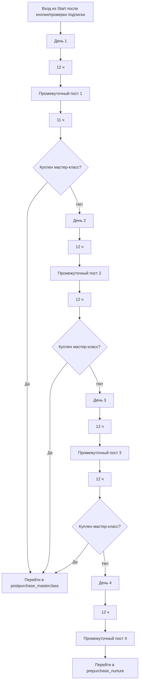

# Глобальный модуль «Welcome: четыре дня интенсива»

Статус: `implemented skeleton / testing before deploy`
Владелец содержания: Сергей Воронцов  
Проверено: 22.08.2026

## Граница

Модуль начинается **с первого дня интенсива**, после выхода стартового модуля.
Атрибуция, навигационный закреп, кружок, приветствие, кнопка и стартовая проверка
подписки сюда не входят.

Модуль содержит ровно восемь редактируемых сообщений:

| № | Ключ | Смысл | Задержка перед сообщением |
|---:|---|---|---:|
| 1 | `welcome_day1` | День 1 интенсива | сразу |
| 2 | `welcome_day1_mid` | промежуточный пост | 12 часов |
| 3 | `welcome_day2` | День 2 интенсива | 11 часов |
| 4 | `welcome_day2_mid` | промежуточный пост | 12 часов |
| 5 | `welcome_day3` | День 3 интенсива | 12 часов |
| 6 | `welcome_day3_mid` | промежуточный пост | 12 часов |
| 7 | `welcome_day4` | День 4 интенсива | 12 часов |
| 8 | `welcome_day4_mid` | завершающий промежуточный пост | 12 часов |

Перед очередными материалами движок проверяет покупку мастер-класса. При покупке
Welcome прекращается и управление передаётся покупательскому маршруту. После
восьмого сообщения без покупки запускается отдельный модуль
`prepurchase_nurture`.

## Данные и редактор

- sequence: `welcome_intensive`;
- шаги/интервалы/ветки: `tg_sequence_steps`, `tg_sequence_edges`;
- версии: `tg_sequence_versions`;
- тексты и медиа: `tg_content_items`;
- состояние человека: `tg_sequence_runs`, `tg_step_deliveries`.

В админке это отдельная карточка «Welcome: 8 сообщений». Она не должна включать
стартовую атрибуцию или основную рассылку. Клик по сообщению открывает справа поле
текста, форматирование, кнопки и загрузку медиа.

## Честное состояние

Механика, интервалы, переход в основную цепочку и восемь контентных ячеек готовы.
Тексты дней и промежуточных постов остаются редактируемыми заготовками владельца.
