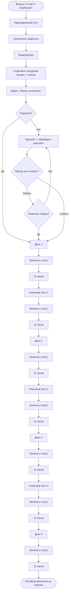

# Глобальный модуль «Welcome и четырёхдневный интенсив»

Статус: `current`
Состояние внедрения: production maintenance; live-проверка подписки включена;
контент заполнен частично.
Владелец содержания: Сергей Воронцов
Проверено: 25.08.2026

## 1. Назначение и граница

Модуль получает только нового пользователя через зелёный выход модуля «Старт и
атрибуция». К этому моменту профиль найден, источник первого касания и дата первого
полноценного посещения сохранены. Уже известный владелец мастер-класса отсеивается
Start-router, а покупка во время прохождения обрабатывается общим lifecycle-событием.
До первого сообщения этого модуля пользователю ничего не отправляется, кроме
временной заглушки ремонта, если она включена.

Внутри Welcome находятся навигационный закреп, кружок, превью, кнопка запуска,
мягкая проверка подписки, четыре дня интенсива, три промежуточных полезных поста и
переход в основную рассылку. Здесь и в следующем модуле нет проверки покупки
между постами: `CUSTOMER_LIFECYCLE_TECHNICAL_SPEC.md` централизованно завершает
run сразу после определения `ACCESS_MASTERCLASS`.

## 2. Последовательность

1. Отправить общую навигацию `tpl_start_navigation_pin` с кнопкой перехода в
   канал и попытаться закрепить именно это сообщение.
2. Отправить видеокружок `tpl_entry_circle`.
3. Отправить превью `tpl_start_welcome_offer`, начинающееся словами «Сделайте
   похудение проще». В тексте нет ссылки на интенсив;
   первая выдача начинается callback-кнопкой `Начать интенсив`.
4. Ждать callback `start_intensive` без автоматического тайм-аута.
5. Проверить подписку на основной канал.
6. Если подписан — без промежуточного сообщения сразу отправить День 1.
7. Если не подписан — отправить редактируемый
   `tpl_start_subscription_reminder`. Ссылка на канал находится в тексте, подпись
   callback-кнопки `Проверить ещё раз` редактируется отдельно от её действия.
8. Повторная кнопка снова запускает ту же проверку. Отказ возвращает к той же
   просьбе и той же кнопке. Первый пятиминутный срок при повторах не сдвигается.
9. Через пять минут после первой просьбы выполнить fail-open и сразу отправить
   День 1. Отдельного сообщения «проверка пройдена» или «продолжаем без подписки»
   нет.
10. После Дня 1 выдержать 11 часов и отправить полезный пост 1.
11. Через 12 часов отправить День 2. Он приходит через 23 часа после Дня 1.
12. Далее чередовать паузы по 12 часов: полезный пост 2, День 3, полезный пост 3,
    День 4.
13. После Дня 4 выдержать 12 часов и передать пользователя в
    `prepurchase_nurture`. Его первый продающий пост отправляется сразу после
    входа; он не принадлежит Welcome.

После каждого из семи содержательных постов выполняется тихая проверка подписки.
Она ничего не отправляет и не меняет маршрут, а только дописывает событие.

## 3. Аналитика подписки

Новые таблицы и новые виды тегов не создаются. Каждая проверка пишет `subscription_check` в
`tg_tracking_events`: `run_id`, `step_key`, `stage`, `subscribed` (`true`, `false`
или `null` для заглушки) и `outcome`:

- `already_subscribed`;
- `subscribed_after_prompt`;
- `not_subscribed_initially`;
- `not_subscribed_after_prompt`;
- `not_subscribed_at_check`;
- `not_checked_placeholder`.

Пятиминутный обход пишет `subscription_fail_open` с
`outcome=remained_unsubscribed_after_prompt`. Актуальный известный результат также
обновляет существующие `messenger_accounts.subscription_status`,
`subscription_checked_at` и приводит существующие канонические теги `Подписан`,
`Не подписан`, `Отписался` к одному актуальному состоянию. Эти события являются
источником будущего timeline.

Стадии: `before_day1`, `after_prompt`, `after_day1`, `after_mid1`, `after_day2`,
`after_mid2`, `after_day3`, `after_mid3`, `after_day4`.

Основной бот является администратором `@Fitness_Talks`; живой `getChatMember` и
право `can_invite_users` проверены 24.08.2026. Ошибка Telegram/API сохраняется как
`subscribed=null` и работает fail-open, а не выдаётся за реальную подписку.

## 4. Исполняемая блок-схема

## 5. Данные и исходники

| Назначение | Источник |
|---|---|
| sequence, версия, шаги, стрелки | `tg_sequences`, `tg_sequence_versions`, `tg_sequence_steps`, `tg_sequence_edges` |
| тексты и медиа | `tg_content_items` |
| состояние и пятиминутный срок | `tg_sequence_runs.status`, `next_action_at`, `context` |
| отправки | `tg_step_deliveries` |
| история подписки | `tg_tracking_events` |
| актуальный статус | `messenger_accounts.subscription_status`, `subscription_checked_at` |
| видимый канонический статус | `user_tags` → `Подписан` / `Не подписан` / `Отписался` |
| создание версии графа | `telegram-bot/service/app/seed.py` |
| выполнение, callback и timeout | `telegram-bot/service/app/engine.py` |
| карта и редактор | `telegram-bot/service/app/graph.py`, `telegram-bot/service/static/app.js` |

## 6. Роль админки

Логика, стрелки и задержки читаются из исполняемого графа и доступны только для
просмотра. В контентном блоке можно менять текст, медиа и подпись первой кнопки;
`callback_data`, URL и маршрут не изменяются. Это оставляет редактор удобным для
работы без ИИ и защищает логику от случайной поломки.

## 7. Критерии готовности живой версии

- обе ветки подписки сходятся в `welcome_day1`;
- повторная кнопка не продлевает исходные пять минут;
- День 1 приходит без служебного сообщения об успехе/обходе;
- задержки равны 11/12/12/12/12/12/12 часам;
- внутри Welcome нет `has_product`;
- после каждого содержательного поста сохраняется событие проверки;
- после deploy пройдены ускоренный и живой тест обеих веток.
