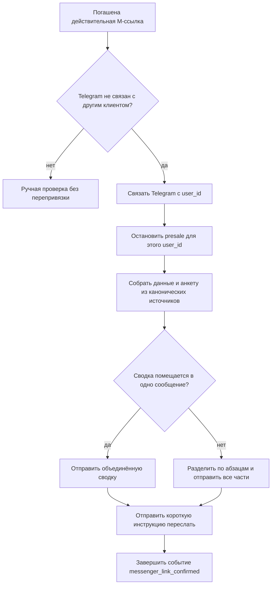
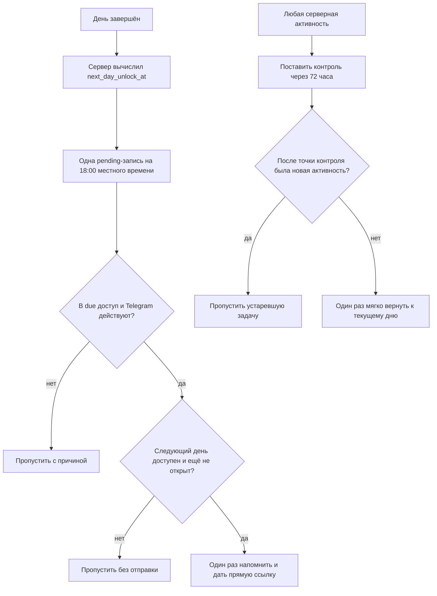

# Telegram после привязки и при открытии нового дня

Статус: `implemented_test_only` — поведение утверждено владельцем и реализовано
24.08.2026; код выпускается в production, а внешняя доставка остаётся ограничена
`POSTPURCHASE_TEST_ONLY=true` до обязательного сквозного ручного прогона 21 дня.
Владелец решения: Сергей Воронцов
Подготовлено: 24.08.2026
Связанный модуль: `postpurchase_masterclass`

## 1. Зачем меняется текущая схема

Сейчас после погашения ссылки Telegram ставятся две отдельные записи: данные
участника и анкета. Название тарифа берётся из сырого `payments.product_name_raw`,
поэтому исторические варианты видны человеку как разные тарифы. Ссылка на личный
кабинет по умолчанию указывает на старую страницу Members, а подтверждение привязки
обещает «отдельные сообщения».

Целевой вариант оставляет две пользовательские отправки, но меняет их смысл:

1. одна объединённая сводка с данными участника и всей анкетой;
2. короткая человеческая инструкция переслать сводку автору.

## 2. Канонические источники данных

| Поле | Источник | Правило показа |
|---|---|---|
| Почта | основная активная запись `user_emails` | исходное написание email |
| Telegram | связанный `crm_messenger_accounts` / контакт | `@username`, иначе понятное «username не указан» |
| Тариф | нормализованный продукт подтверждённой покупки | `MASTERCLASS_BASIC` → «Минимальный»; `MASTERCLASS_RECIPES` → «Стандартный»; `MASTERCLASS_CONSULT` → «С консультацией» |
| Дата покупки | `paid_at`, затем `source_event_at`, затем `created_at` подтверждённого платежа | `ДД.ММ.ГГГГ`; отсутствие даты является диагностикой импорта, а не нормальным пользовательским вариантом |
| Доступ | действующее право `ACCESS_MASTERCLASS` | проверка перед постановкой и перед отправкой; отдельной строкой «доступ к мастер-классу» не дублируется |
| Личный кабинет | серверный `MASTERCLASS_ACCOUNT_URL` | `https://похудение-это-есть.рф/lk`, не Members Area |
| Анкета | последний запуск `questionnaire_runs.kind='onboarding'` и его ответы | порядок вопросов определяется каноническим списком анкеты, а не временем сохранения |

Тариф нельзя определять по сумме или по произвольному сырому названию платежа.
Исторический alias сначала переводится в стабильный код продукта, затем код — в
пользовательское название единого каталога.

## 3. Первое сообщение: объединённая сводка

Рабочий шаблон, авторский текст можно позже изменить в Telegram-админке без
изменения графа:

```html
👉 <b>Данные участника мастер-класса</b>

<b>Почта:</b> {{email}}
<b>Telegram:</b> @{{telegram_username}}
<b>Тариф:</b> {{masterclass_tariff}}
<b>Дата покупки:</b> {{purchase_date}}
<b>Личный кабинет:</b> <a href="{{account_url}}">открыть ЛК</a>

👉 <b>Анкета участника</b>

{{questionnaire_formatted}}
```

`questionnaire_formatted` строится по каноническому порядку вопросов. Каждый
элемент имеет вид:

```html
<b>Вредные привычки:</b>
Ответ участника

<b>Тренировки:</b>
Ответ участника
```

Коды вопросов человеку не показываются. Заголовки экранируются и выделяются
жирным, ответы экранируются как пользовательский текст. Если сводка длиннее лимита
Telegram, отправщик делит её по границам абзацев на несколько последовательных
частей. Все части имеют один `notification_id` и общий ключ дедупликации; повторный
запуск не присылает половину сводки заново.

## 4. Второе сообщение: инструкция

Рабочий шаблон:

```html
Telegram привязан.

Если в почте, тарифе или других данных выше есть ошибка, напишите мне — я всё поправлю.

👆 Перешлите мне в личные сообщения сообщение выше с вашими данными и анкетой. Если Telegram разделил длинную анкету на несколько сообщений, перешлите все части.
```

Текст ведётся от первого лица. Формулировки «Сергею» и просьба самостоятельно
менять привязанный email не используются.

## 5. Исполняемый порядок после утверждения



Новая схема заменяет текущие `messenger_identity` и
`messenger_questionnaire` одной составной доставкой сводки и одной доставкой
инструкции. Старые опубликованные слоты нельзя оставлять параллельно, иначе клиент
получит дубли.

## 6. Уведомления о возвращении в Мастер-класс

Это отдельное решение, не часть привязки Telegram. Оно технически возможно без
клиентского таймера: после завершения дня сервер уже хранит точный
`next_day_unlock_at` по часовому поясу участника.

Утром в 06:00 сообщение не отправляется. При вычислении времени открытия
следующего дня сервер одновременно вычисляет 18:00 того же дня в сохранённом
IANA-часовом поясе участника.

Контракт первого напоминания:

- при первом назначении `next_day_unlock_at` поставить одну outbox-запись
  `course_day_unopened_18h` на 18:00 местного времени дня открытия;
- перед отправкой повторно проверить действующий `ACCESS_MASTERCLASS`, привязанный
  Telegram, отсутствие `/stop`, фактическую доступность следующего дня и то, что
  этот день ещё ни разу не открыт;
- дать прямую ссылку вида `{{course_url}}?course_day=N`;
- повторное завершение, перезагрузка или повторное открытие дня не меняют due и не
  создают дубль;
- после единственной отправки новых напоминаний по этому дню не создавать, даже
  если участник так и не открыл его;
- ускоренный тестовый профиль использует тот же граф и только сокращённый due;
- текст хранится отдельным редактируемым слотом Telegram-админки.

Рабочий текст:

```html
Привет! Вам уже доступен день {{day_number}} — «{{day_title}}». Он открылся
сегодня в 06:00 по вашему времени, но вы его ещё не открыли. Просто напоминаю:
<a href="{{day_url}}">перейти к дню</a>.
```

Отдельно после 72 часов без любого нового серверного действия создаётся одно
напоминание о простое. Активность после постановки отменяет его при повторной
проверке. День-два пропуска считаются нормальными и отдельных сообщений не
создают. После новой активности новый 72-часовой контроль может быть поставлен
снова от новой точки активности.

Рабочий текст:

```html
Вы давно не заходили в Мастер-класс. Сейчас у вас открыт день {{day_number}} —
«{{day_title}}». День-два пропустить — нормально, но не откладывайте надолго,
чтобы не выпадать из ритма. <a href="{{day_url}}">Продолжить Мастер-класс</a>.
```



## 7. Технический контракт реализации

- `payments` остаётся неизменяемым журналом продаж и хранит сырой параметр
  `product_name_raw`; нормализованный продукт берётся по `payments.product_id`.
- `products` хранит семейство продукта и пользовательское название тарифа;
  `user_accesses` по-прежнему отдельно отвечает только за действующие права.
- Личный кабинет и CRM-карточка строят список приобретённых продуктов из
  подтверждённых платежей, а не из тегов или набора доступов.
- Статус привязки читается по `crm_messenger_accounts.linked_at`. Материал
  «Привязать мессенджер» нельзя завершить созданием ссылки: кнопка «Продолжить»
  появляется только после фактического погашения ссылки ботом.
- `course_day_unopened_18h` дедуплицируется по `user_id + day_number`; перед
  отправкой проверяет отсутствие `masterclass_day_progress` для целевого дня.
- `course_stalled_72h` привязан к конкретному событию активности и перед отправкой
  проверяет отсутствие более позднего события.
- граф админки строится из `masterclass_triggers.py`; новые окна не хранятся
  отдельной ручной копией.

Ошибки привязки не обходятся автоматической галочкой. Если Telegram и MAX у
участника отсутствуют, материал показывает ссылку «написать мне» и Сергей вручную
определяет дальнейшее действие.
