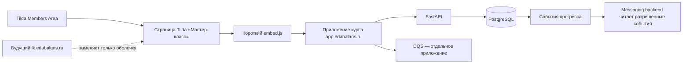

# Серверное приложение мастер-класса в Tilda Members Area

Статус: `approved_requirements / technical draft`  
Владелец содержания: Сергей Воронцов  
Зафиксировано: 23.08.2026  
Область: сайт, мастер-класс, DQS, граница событий для messaging backend

## 1. Решение владельца

Первым продуктом реализуется только серверная страница мастер-класса. Не строить
сейчас весь собственный личный кабинет и не переносить все продукты одновременно.

На переходном этапе:

- Tilda остаётся публичным сайтом, Members Area, регистрацией и оболочкой входа;
- в Members Area существует физическая страница Tilda «Мастер-класс»;
- страница содержит короткий постоянный загрузчик приложения;
- оглавление, дни, статьи, задания, прогресс и проверки доступа работают на сервере;
- DQS остаётся отдельным приложением и отдельной страницей/точкой входа;
- рецепты, калории и тренировки позднее получают собственные страницы Tilda с тем
  же загрузчиком и отдельным кодом приложения;
- после появления всех продуктов их можно объединить общей серверной страницей
  «Мои программы» без переделки внутренних приложений.

Production-страницы, группы и опубликованные материалы Tilda не переключать и не
удалять до отдельного подтверждения владельца.

## 2. Что входит в первый этап

1. Одна физическая страница Tilda «Мастер-класс» внутри Members Area.
2. Один короткий T123-загрузчик с `app.edabalans.ru`.
3. Мобильное серверное приложение мастер-класса:
   - общее оглавление всех дней;
   - отдельный адрес каждого дня, материала и большого задания;
   - вводный блок дня;
   - статьи и перелистывание;
   - мораль/вывод дня;
   - задание;
   - серверный прогресс;
   - открытие следующего дня по правилам;
   - внутренние ссылки на другие материалы и приложения.
4. Проверка личности, покупки и доступности этапа через FastAPI/PostgreSQL.
5. События прогресса для последующего чтения messaging backend.
6. Первый импорт материалов из HTML Tilda без скачивания изображений.

## 3. Что не входит в первый этап

- общий серверный каталог всех продуктов;
- собственная замена Tilda Members Area;
- собственные платежи и касса;
- вход только через Telegram или MAX;
- перенос изображений из Tilda CDN в Object Storage;
- визуальный редактор всей логики курса;
- рекламные баннеры между абзацами и произвольные всплывающие продажи;
- кнопки «отправить себе в Telegram/MAX»;
- реализация новых Telegram-модулей.

Допускаются только отдельно зафиксированные popup-тизеры в днях 15 и 17: они
сообщают о завтрашнем рецептурном разделе, не содержат цены и не заменяют
выделенный материал предложения внутри дня. Последние два пункта остаются идеями
для отдельного проектирования. Приложение
только создаёт канонические события; решение об отправке и тексты сообщений не
дублируются в сайте.

## 4. Переходная и будущая архитектура



При отказе от Tilda меняется оболочка входа и каталог программ. Адреса материалов,
контент, прогресс, покупки, доступы и внутренний `user_id` остаются серверными.

## 5. Tilda и страницы продуктов

В ближайшей версии допустимы отдельные физические страницы Tilda:

- «Мастер-класс»;
- «Система рецептов»;
- «Калории»;
- «Тренировки»;
- «DQS»;
- «Разборы».

На каждой находится один и тот же загрузчик и декларативный код приложения, например:

```html
<div data-edabalans-app="masterclass-course"></div>
<script src="https://app.edabalans.ru/embed.js"></script>
```

Весь большой frontend не копируется в Tilda. Разница страниц задаётся только
`data-edabalans-app`. Позднее общая страница «Мои программы» загружает каталог и
ведёт в те же приложения.

## 6. Идентификация и доступ

Tilda Members Area — удобная оболочка, но не доказательство права на продукт.

1. Загрузчик пытается определить email участника Tilda.
2. На переходном этапе повторной почтовой авторизации нет: email принимается из
   закрытой страницы Members Area, ручной ввод в приложении запрещён.
3. FastAPI сопоставляет email с внутренним `user_id`.
4. PostgreSQL проверяет `user_accesses` и этап открытия ресурса.
5. Прямая ссылка вне Members Area не позволяет вручную указать чужой email и
   просит открыть приложение из личного кабинета Tilda.
6. В URL нельзя помещать email, `user_id`, ответы DQS или права доступа.

После отказа от Tilda потребуется более сильная собственная идентификация. Не
отправлять пользователю постоянные пароли. Предпочтительная будущая схема:

- основной passwordless-вход по одноразовому коду/ссылке на email;
- после безопасной привязки — дополнительный вход через Telegram или MAX;
- email сохраняется как резервный канал восстановления, пока не утверждён другой
  независимый способ восстановления;
- потеря или блокировка мессенджера не должна навсегда лишать клиента покупки.

## 7. Адреса внутри одного приложения

Физические HTML-страницы для каждого поста не создаются. Один frontend отображает
структурированный контент по устойчивым адресам:

```text
/course/masterclass
/course/masterclass/day/5
/course/masterclass/day/5/bzhuk
/course/masterclass/day/5/task
/tools/dqs
```

Требования:

- обновление браузера сохраняет текущий материал;
- кнопки «Назад» и «Вперёд» работают штатно;
- разрешённый адрес можно сохранить в закладки;
- закрытый день не открывается по прямой ссылке;
- после повторного входа человек возвращается на исходный адрес;
- внутренние ссылки используют постоянный `slug`, а не заголовок или номер записи БД.

## 8. То, что владелец заполняет для дня

Не показывать владельцу технический паспорт с лишними полями. Для сборки дня
достаточно:

1. номер дня;
2. короткий заголовок в оглавлении, например «Понимаем основу»;
3. вводная фраза/обещание дня;
4. примерное общее время;
5. вводный блок: видео, картинка или текст;
6. небольшой текст после вводного блока;
7. посты дня в нужном порядке;
8. необязательная «Мораль дня»;
9. задание;
10. завлекающий анонс следующего дня.

Количество материалов, список форматов, технический тип дня, режим задания,
правила доступа, состояние публикации и другие служебные признаки владелец руками
не заполняет. Их движок выводит из структуры либо хранит как системные данные.
Отдельный визуальный акцент для рецептурных дней назначается при сборке программы.

Дни рецептурной практики имеют отдельный спокойный цвет в оглавлении даже в
закрытом состоянии. Цвет сообщает тип дня, но не доказывает покупку или доступ.

## 9. Структура дня

Одинаковая базовая композиция:

1. номер, заголовок, вводная фраза и оценка времени;
2. вводный блок — видео, картинка или текст; визуальное медиа имеет скругление;
3. короткий приветственный текст;
4. кнопки материалов дня;
5. статьи с перелистыванием;
6. при настроенной точке продаж — отдельный выделенный дополнительный материал;
7. необязательный блок «Мораль дня»;
8. компактная карточка задания;
9. в самом низу — таймер, причина блокировки и следующий день.

Большое задание не разворачивается огромной простынёй внутри дня. Карточка содержит
краткое действие, а кнопка ведёт на `/day/{n}/task`. Условия завершения могут быть:

- явное подтверждение «прочитано»;
- отмеченный короткий чек-лист;
- сохранение записи в DQS;
- отдельное серверное событие;
- отсутствие обязательного задания.

## 10. Открытие дней и прогресс

Первое успешное открытие доступного дня создаёт идемпотентное `day_opened` и
фиксирует `first_opened_at`. Следующий день открывается, когда одновременно:

1. прошло 20 часов от `first_opened_at` предыдущего дня;
2. все обязательные материалы дня пройдены по порядку;
3. выполнено настроенное условие завершения предыдущего дня.

Внутри дня доступен первый незавершённый материал и уже завершённые материалы.
Материал ниже по списку остаётся закрытым, пока не завершён предыдущий. Обычная
статья завершается явной нижней кнопкой «Прочитано», приложение — согласованным
событием открытия или сохранения. Простое открытие и закрытие статьи не считается
завершением.

Выделенный дополнительный материал в днях 1, 15, 17, 19 и 21 входит в ту же
последовательность. Popup дней 15 и 17 можно закрыть, но он ничего не завершает:
карточка предложения остаётся в дне, и задание не открывается до её просмотра.

Повторное открытие не перезапускает таймер. Время и выполнение проверяет сервер,
а не браузер. Для диагностики нужен административный ускоренный режим, не
доступный клиенту. Ручное открытие администратором требует причины и сохраняется
в журнале.

Открытие спойлера само по себе не считается доказательством выполнения, если для
дня настроено более конкретное действие.

## 11. DQS

DQS не встраивается как длинный раздел статьи и не меняет свой рабочий дизайн.

- теоретический материал о DQS находится в мастер-классе;
- отдельная акцентная карточка в дне сразу открывает приложение DQS на весь экран;
- инструкция по получению таблицы не оформляется отдельной статьёй;
- задание по заполнению DQS находится только в блоке задания дня и не дублируется
  в списке материалов;
- постоянная прямая ссылка на приложение может вести в `/tools/dqs`;
- в Members Area может существовать отдельная физическая страница Tilda «DQS»;
- доступ к DQS появляется после согласованного этапа мастер-класса либо по отдельному
  праву продукта;
- пользователь может сохранить адрес DQS и добавить страницу на домашний экран;
- после действия DQS приложение создаёт событие, понятное мастер-классу;
- данные DQS не передаются в URL;
- возврат ведёт в исходный день мастер-класса.

Добавление полноценного PWA и push-уведомлений не требуется для первого запуска.

## 12. Модель контента и внутренние ссылки

Первому движку достаточно следующих типов блоков:

- `heading`;
- `paragraph`;
- `list`;
- `image`;
- `gallery`;
- `video_embed`;
- `audio_embed`;
- `callout`;
- `takeaway`;
- `copyable`;
- `internal_link`;
- `app_link`;
- `task_summary`.

Внутренняя ссылка хранит не сырой URL и не цену, а цель:

```text
target_type = article / recipe / app
target_code = plate_rule / oatmeal / dqs
```

Сервер проверяет доступ. При отсутствии права показывает нейтральную плашку
ограничения или страницу продукта. Рекламные баннеры между абзацами и зашитые в
текст цены в текущую версию не входят. Единственные автоматические popup —
согласованные тизеры перед рецептами в днях 15 и 17.

## 13. Первый импорт HTML Tilda и изображения

Первый проход должен быть быстрым и экономным:

1. владелец передаёт HTML страниц;
2. импорт извлекает текст, порядок, ссылки, подписи, изображения и видео-вставки;
3. для изображений читаются в том числе `src`, `srcset`, `data-original`, lazy-load
   атрибуты и фоновые URL;
4. изображения не скачиваются и не загружаются в Object Storage;
5. материал временно использует прямой URL Tilda CDN;
6. исходный HTML сохраняется локально как источник миграции, без персональных данных;
7. владелец вручную передаёт соответствия видео после выбора/перезаписи роликов.

Присланный владельцем пример Tilda CDN проверен 23.08.2026: сервер отвечает
`200 OK`, `Content-Type: image/jpeg`, CORS разрешён. Временный hotlink технически
работает. Риск: удаление или замена исходного ассета в Tilda может сломать картинку.

Второй отдельный этап, только по явной задаче владельца:

- скачать исходники по сохранённым URL;
- удалить дубликаты по hash;
- оптимизировать размеры;
- загрузить в отдельное хранилище контента;
- заменить ссылки автоматически;
- проверить каждую страницу;
- не смешивать контент с backup и не хранить тяжёлые медиа в Git.

## 14. Редакционная политика первого импорта

Первый draft собирается максимально близко к исходнику.

Разрешено без отдельного согласования:

- исправить явные опечатки и технические артефакты HTML;
- добавить заголовки для читаемости без изменения смысла;
- поправить старый номер дня;
- убрать или нейтрально исправить фразу «завтра», если после перестановки она стала
  неверной;
- добавить техническую внутреннюю ссылку;
- вынести существующую мысль в `takeaway`;
- вынести существующее действие в карточку задания.

Не разрешено молча:

- менять авторскую позицию и тон;
- сокращать содержательные аргументы;
- добавлять новые медицинские или продуктовые утверждения;
- придумывать обещания следующего дня;
- существенно переписывать статью.

Существенные предложения собираются отдельным списком, без остановки всего импорта.
Материал проходит состояния `source → draft → review → published`, опубликованная
версия сохраняется для отката.

## 15. Административное редактирование

Inline-редактирование возможно и не требует второй независимой админки, если
ограничить первый набор действий:

- администратор видит тот же интерфейс, что клиент;
- режим редактирования включается только из защищённой административной сессии;
- по клику можно изменить текст, заголовок, подпись и URL изображения;
- изменения всегда сохраняются в draft;
- отдельные кнопки: «Предпросмотр», «Опубликовать», «Отменить», «Вернуть версию»;
- опубликованный текст нельзя незаметно перезаписывать напрямую;
- каждое изменение журналируется;
- условия открытия, события, маршруты и права в простом редакторе только читаются.

Настройки уровня курса:

- защита выделения текста по умолчанию `on/off`;
- исключения для конкретного материала или блока;
- блок `copyable` всегда разрешает выделение и имеет кнопку «Скопировать»;
- изменение глобальной настройки обратимо и журналируется.

Отключение выделения, контекстного меню и `Ctrl+C` считается только бытовым
ограничением, а не настоящей защитой. Серверная сессия и проверка доступа остаются
обязательными.

## 16. События сайта и граница Telegram/MAX

Сайт может создавать идемпотентные события:

- `course_opened`;
- `day_opened`;
- `article_opened`;
- `task_opened`;
- `task_acknowledged`;
- `day_completed`;
- `dqs_opened`;
- `dqs_first_entry_saved`;
- `day_1_offer_opened`;
- `day_15_offer_opened`;
- `day_17_offer_opened`;
- `day_19_offer_opened`;
- `day_21_offer_opened`;
- `course_stalled` как вычисляемое состояние, а не клиентская кнопка;
- `course_completed`.

Сайт не отправляет Telegram-сообщение самостоятельно. Messaging backend читает
событие и актуальные покупки/доступы, после чего отдельный утверждённый модуль
решает, отправлять ли напоминание. Тексты, задержки, исключения и граф этого модуля
проектируются в Telegram-чате по
`MODULE_DEVELOPMENT_STANDARD.md` и не копируются в ТЗ сайта.

Будущая кнопка «Отправить себе» также создаёт запрос серверу, но не содержит
логики Telegram или MAX во frontend.

## 17. Мобильный приоритет

- первый контрольный размер — телефон;
- оглавление открывается на весь экран;
- кликабельные области не меньше 44 px;
- видео и изображения адаптируются по ширине;
- статьи имеют крупный шрифт и короткую строку;
- навигация между материалами доступна большим пальцем;
- таймер и следующий день находятся только внизу дня;
- компьютер добавляет постоянное боковое оглавление и административные действия,
  не меняя структуру контента.

## 18. Зафиксированное направление дизайна

Основное направление — `warm`: тёплый бежевый фон, тёмное меню,
терракотовый акцент. Переключателя тем в пользовательском интерфейсе нет.
Палитра хранится в централизованных CSS-переменных, поэтому её можно заменить
без изменения структуры материалов и логики приложения.

Бренд в шапке приложения — `Похудение — это есть!`, по названию основного сайта,
а не «Еда — баланс» и не сокращённое `похудение.рф`.

Блок «Мораль дня» необязательный. Если он есть, это обычный заголовок и текст,
а не цветная плашка.

В верхней части дня показывается одна строка «Время на изучение ≈ N минут» без
тегов формата и количества материалов. Время считается автоматически как
продолжительность видео плюс объём текста при ориентире 240 слов в минуту и
округляется до пяти минут.

В первом дне после обычных материалов отдельным акцентным пунктом открывается
существующее приложение `onboarding-questionnaire` на весь экран. Привязка
Telegram или MAX не является финальным экраном анкеты: она показывается
следующим самостоятельным пунктом на главном экране дня. Пользователь сначала
заполняет анкету, затем выбирает мессенджер.

Карточка каждого материала содержит название, одно предложение о содержании и
расчётное время без подписи «чтение». Изображения не прерывают текст: импортёр
собирает их в отдельный свайпаемый слайдер внизу статьи с кнопками, счётчиком и
управлением жестом. На телефоне слайдер выходит до краёв экрана; текст сохраняет
безопасные поля. Навигация внизу статьи: предыдущий материал, оглавление,
следующий материал.

Нижний блок следующего дня вертикальный: номер, название и анонс; затем таймер
и кнопка. Пока 20 часов не истекли, интерфейс не напоминает о незавершённом
задании. Если срок прошёл, но ручные галочки не поставлены, объяснение причины
появляется только после попытки открыть следующий день.

Оставшееся до открытия время показывается по центру внутри компактного
красно-оранжевого прямоугольника со скруглёнными краями, как в первой версии
прототипа. Под таймером находится одна кнопка состояния или перехода.

## 19. Реалистичный объём первого запуска

За одну–две рабочие ночи целиться в:

- production-каркас одного мастер-класса;
- Tilda loader;
- серверную сессию и проверку права на мастер-класс;
- оглавление и несколько первых реальных дней;
- серверный прогресс и базовое правило 20 часов;
- мобильную вёрстку;
- импорт текстов с прямыми Tilda CDN URL;
- тестовый/административный ускоренный режим.

Не обещать в тот же объём собственную замену Tilda, все продукты, полноценный
inline-редактор, перенос всех медиа и новый Telegram-модуль.

## 20. Критерии приёмки первого этапа

1. Прямая ссылка на закрытый день не обходит серверное правило.
2. Повторное открытие дня не сбрасывает 20 часов.
3. Прогресс сохраняется на другом устройстве после входа тем же пользователем.
4. На телефоне доступны оглавление, статьи, задание и навигация без горизонтальной
   прокрутки.
5. День рецептов визуально отличается, но цвет не заменяет проверку права.
6. Большое задание открывается отдельным экраном.
7. DQS открывается отдельно и возвращает пользователя в мастер-класс.
8. HTML-импорт не скачивает изображения на первом проходе.
9. Изменение материала не меняет условия доступа и события.
10. Ни одно production-действие Tilda или Telegram не включается без явного
    подтверждения владельца.
11. Нельзя открыть второй незавершённый материал, пока не завершён первый.
12. Закрытие popup предложения не засчитывает выделенный материал и не открывает
    задание дня.
