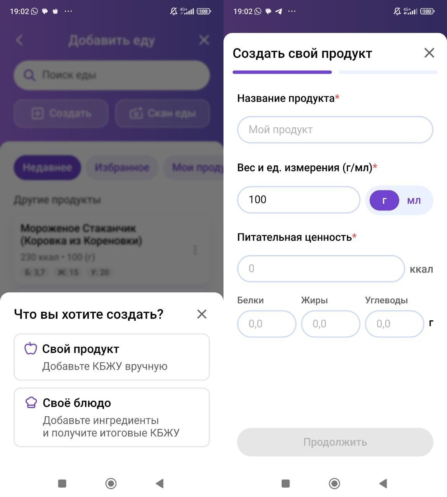
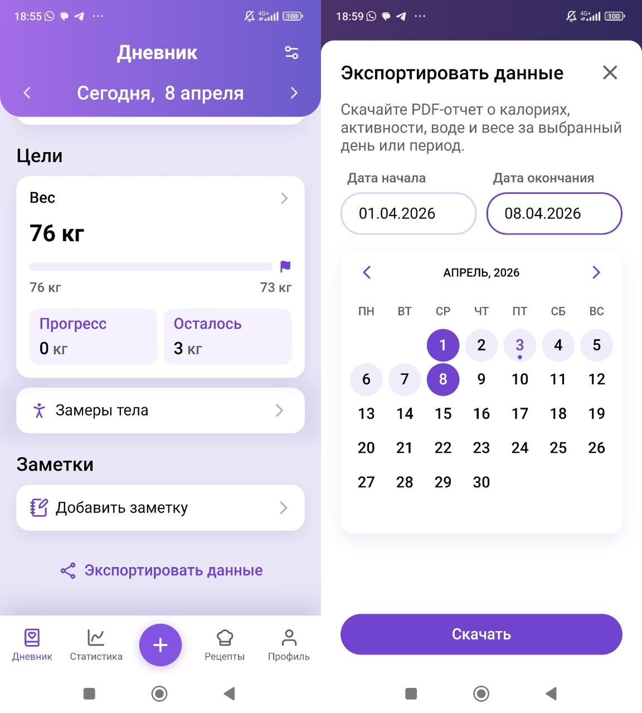

Приложение для учёта калорий должно экономить вам время, а не превращать ужин в дополнительную смену на работе. Если ради тарелки еды нужно сорок минут тыкать в разные окна, высчитывать усушку в столбик, а потом ещё искать свой рецепт среди чужих — большинство людей выберет бутерброд. И я их прекрасно понимаю.

Поэтому в этом курсе мы не будем изучать пять приложений и сравнивать цвет кнопок. Нам нужен один рабочий инструмент, в котором можно:

- Найти продукт и проверить его данные.
- Создать собственный продукт.
- Собрать и сохранить рецепт.
- Исправить ошибочную запись.
- Посмотреть дневник за нужный период.
- Выгрузить его отдельным файлом.

Сейчас для этого я использую приложение **«Худеем вместе»**. Название — пожалуй, единственная его слабая сторона))

Скачать его можно в [App Store](https://apps.apple.com/ru/app/%D1%81%D1%87%D0%B5%D1%82%D1%87%D0%B8%D0%BA-%D0%BA%D0%B0%D0%BB%D0%BE%D1%80%D0%B8%D0%B9-%D1%85%D1%83%D0%B4%D0%B5%D0%B5%D0%BC-%D0%B2%D0%BC%D0%B5%D1%81%D1%82%D0%B5/id889574511), [Google Play](https://play.google.com/store/apps/details?id=ru.hudeem.adg&hl=ru) или [RuStore](https://www.rustore.ru/catalog/app/ru.hudeem.adg). Ссылки не реферальные, приложение мне реально просто нравится.

## Почему именно оно

До недавнего времени я скрипел зубами, но всё равно советовал FatSecret. Не потому, что он был прекрасен, а потому, что позволял выгружать нормальный отчёт. Потом выгрузка начала отваливаться, само приложение — глючить, а у меня в личных сообщениях накопилась целая жалобная книга.

У «Худеем вместе» сошлись вещи, которые для курса действительно важны:

- Приложение бесплатное и без рекламы.
- В нём простой интерфейс, где не нужно проходить квест ради обычной записи.
- Свои продукты и рецепты хранятся отдельно, а не тонут среди сотен чужих вариантов.
- Рецепт можно собрать и откалибровать на одном экране.
- Дневник можно выгрузить за выбранный период.

Последний пункт не мелочь. Вы несколько недель взвешиваете еду, разбираетесь с рецептами, собираете наблюдения — а потом меняете телефон, удаляете приложение или теряете аккаунт. И вся эта работа исчезает. Отдельный файл с дневником может пригодиться и через год, если вам снова понадобится проверить питание.

## Что приложение делает, а что — нет

Приложение хорошо считает то, что вы в него внесли. На этом его полномочия заканчиваются.

Норму калорий мы не берём из первого всплывшего калькулятора. Расход, дефицит, тренировки и изменение рациона тоже будем разбирать отдельно. Красивый кружок с БЖУ не знает, почему вы голодны вечером, насколько вам удобно готовить и что происходит с вашим весом.

:::note [Важно]
На первом этапе приложение нужно только для записи фактически съеденной еды и выгрузки дневника. В исследованиях мобильного самоконтроля результат был связан не с одной установкой приложения, а с тем, [насколько регулярно человек действительно вёл записи](https://pubmed.ncbi.nlm.nih.gov/30816851/). Не принимайте рекомендации приложения по калориям, воде, шагам и темпу похудения за назначение курса.
:::

## Найти и проверить продукт

Самый простой сценарий: вы взвесили продукт, нашли его в поиске и добавили в нужный приём пищи.

Но база приложения — не священное писание. Её наполняют обычные пользователи, поэтому у одной и той же овсянки в упаковке может быть 350 ккал на 100 г, а в приложении — 380. Для продукта в упаковке главным источником остаётся сама упаковка.

Порядок такой:

1. Найдите продукт по названию или штрихкоду.
2. Сверьте калорийность и БЖУ с этикеткой.
3. Проверьте единицу измерения: 100 г, одна штука, порция или вся упаковка.
4. Только после этого укажите фактический вес и добавьте продукт.

[НУЖЕН АКТУАЛЬНЫЙ СКРИНШОТ: поиск продукта, проверка карточки и добавление в приём пищи]

Если продукт покупаете регулярно, а в базе его нет или данные не совпадают, проще один раз создать свой. В приложении для этого отдельно выбираются **«Свой продукт»** и **«Своё блюдо»**.

Для собственного продукта переносите данные с упаковки: название, вес или единицу измерения, калорийность и БЖУ. Не надо каждый раз искать «что-то похожее» и заново гадать, насколько оно похоже.

## Добавить еду и исправить запись

Записывайте еду туда, где вы потом сможете её нормально найти. Завтрак, обед и ужин — это ваши запланированные приёмы пищи, даже если один из них случился в машине или выглядел как бутерброд. Всё, что вы сознательно добавили к этому приёму — напиток, фрукт, десерт, — остаётся рядом с ним.

То, что произошло между приёмами пищи по отдельному импульсу, записывайте в перекусы. Позже это поможет увидеть не только сумму калорий, но и сам рисунок дня: где была нормальная еда, а где началось кусочничество.

[НУЖЕН АКТУАЛЬНЫЙ СКРИНШОТ: добавление еды в приём пищи]

Ошиблись с весом, выбрали не тот продукт или записали еду не туда — исправьте запись. Не нужно оставлять ошибку только потому, что боитесь «сломать статистику». Ценность дневника как раз в том, что он должен быть похож на реальность.

[НУЖЕН АКТУАЛЬНЫЙ СКРИНШОТ: редактирование и удаление записи]

## Сохранить рецепт

Если блюдо состоит из нескольких ингредиентов и будет повторяться, соберите его как своё блюдо. Добавьте ингредиенты в сыром или сухом виде, укажите вес готового блюда и сохраните рецепт.

Приложение покажет калорийность и БЖУ всего блюда, 100 граммов и одной порции.

В этом материале вам достаточно понять, **где** создаётся и хранится рецепт. Как считать разные блюда, что делать с общей кастрюлей и зачем нужен вес после приготовления — разберём отдельным большим шагом. Там как раз начинается всё самое интересное: беляши, плов, овсянка, усушка, уварка и попытка не сойти с ума.

## Когда записывать

Есть три сценария: записать сразу, вспомнить всё вечером или внести предполагаемую еду заранее. Начинайте с первого.

Лучший момент — во время приготовления, до еды или сразу после неё. Так меньше шансов забыть масло, напиток, пару орехов и кусок, который «вообще не считается». А ещё вы не пытаетесь вечером восстановить весь день по археологическим остаткам в памяти.

Если записать сразу совсем не получается, сделайте фотографию или короткое аудио с продуктами и примерным весом. Это занимает несколько секунд и даёт вечером хоть какую-то опору. Но [фотография — страховка, а не полноценная замена дневнику](https://pubmed.ncbi.nlm.nih.gov/39315492/): мелочи и порции всё равно начинают исчезать.

Заранее вносить можно только то, что действительно уже собрано: контейнер на работу, фиксированный набор снеков, готовая порция. Не записывайте в дневник человека, которым вы планировали стать завтра.

> Записали, потом поели. Сделал дело — ешь смело.

## Выгрузить дневник

В актуальном приложении экспорт находится в дневнике. Выберите период и скачайте PDF-отчёт с калориями, активностью, водой и весом.

[НУЖЕН АКТУАЛЬНЫЙ СКРИНШОТ: где открыть дневник и перейти к экспорту в текущей версии приложения]

После первых записей сразу сделайте пробную выгрузку за один день. Не ждите конца этапа, чтобы обнаружить, что вы искали не ту кнопку или в отчёт попало не то, что ожидали.

## Что сделать сейчас

1. Установите «Худеем вместе».
2. Найдите один продукт в упаковке и сверьте его с этикеткой.
3. Создайте один собственный продукт.
4. Добавьте обычный приём пищи и затем исправьте в нём одну запись.
5. Создайте пробное блюдо из двух-трёх ингредиентов.
6. Выгрузите дневник за один день.

Пока не надо подгонять питание под цифру, назначать себе дефицит и срочно улучшать меню. Сейчас задача гораздо прозаичнее: научиться нормально записывать то, что уже происходит.

## Источники

- [Comparing Self-Monitoring Strategies for Weight Loss in a Smartphone App: Randomized Controlled Trial](https://pubmed.ncbi.nlm.nih.gov/30816851/)
- [Use of a Smartphone App for Weight Loss Versus a Paper-Based Dietary Diary in Overweight Adults: Randomized Controlled Trial](https://pubmed.ncbi.nlm.nih.gov/32735225/)
- [The test-retest reliability and validity of food photography and food diary analyses](https://pubmed.ncbi.nlm.nih.gov/39315492/)
- [The Dietary Intervention to Enhance Tracking with Mobile Devices (DIET Mobile) Study: A 6-Month Randomized Weight Loss Trial](https://pubmed.ncbi.nlm.nih.gov/28600833/)
