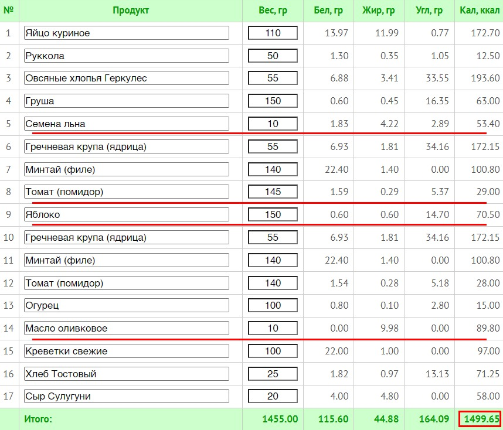
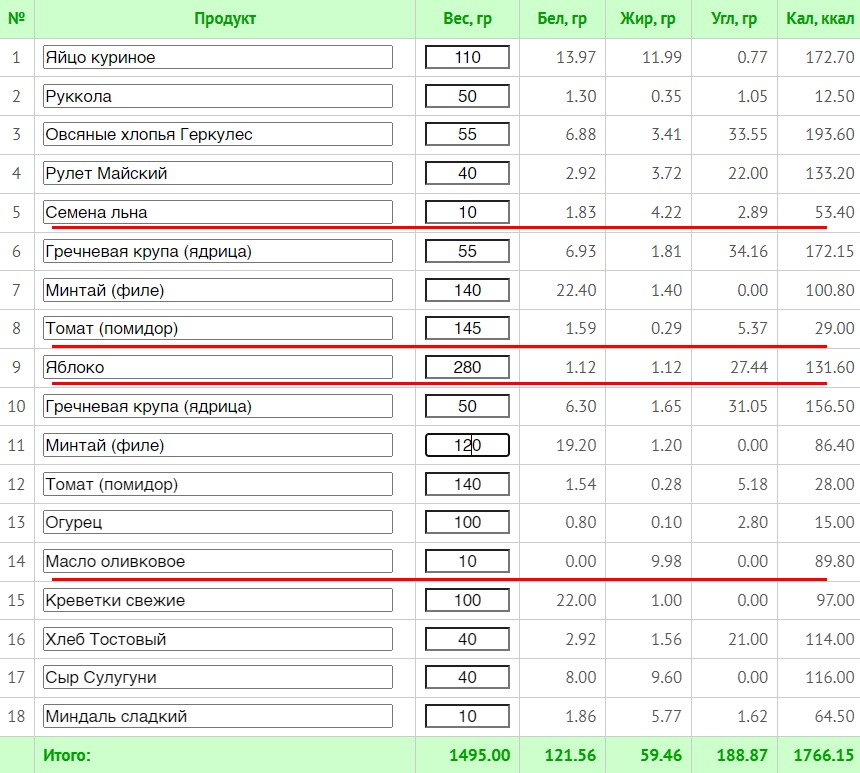

После предыдущего разбора у вас должен появиться не список запрещённых продуктов, а несколько конкретных мест, где рацион можно проверить.

Не «убрать жирное». Не «есть меньше сладкого». Не «начать правильно питаться».

А, например:

- масло автоматически попадает в три блюда за день;
- завтрак небольшой и невкусный, поэтому через час начинается охота за сладким;
- любимый соус важен, но его порция никогда не измерялась;
- в обеде нет нормальной белковой основы;
- сладкий кофе нужен утром, а второй пьётся просто за компанию;
- вечерняя порция большая, потому что до неё весь день был собран из обрывков.

С такими наблюдениями уже можно работать. И для этого не нужно составлять новое меню с чистого листа.

## Не рисуйте себе новую жизнь

Составление меню — далеко не первая вещь, которой следует заняться.

Нам не нужны две крайности: ни рацион с креветками, единорогами и радугой, взятый из головы, ни готовое меню из интернета, даже если его написал уважаемый человек и сверху поставил печать «для похудения».

Чужой рацион может не подходить под вашу калорийность, вкусы, график, бюджет, семью и умение готовить. А самостоятельно нарисованное идеальное питание часто отрывается от реальности ещё до первой закупки.

Поэтому основой остаётся ваш текущий рацион. Мы не заменяем его целиком. Мы вносим **два-четыре точечных изменения**, каждое из которых решает понятную задачу.

:::note [Главное ограничение этапа]
Сейчас мы не назначаем дефицит и не пытаемся срочно снизить калорийность любой ценой. Мы учимся управлять своей обычной едой: сохранять нужные функции и убирать то, что мешает.
:::

## Полный порядок действий

В голосовом материале у меня получилась цепочка:

1. Оцениваем.
2. Анализируем.
3. Добавляем.
4. Вытесняем.
5. Закрепляем.

Я пытался подобрать красивую аббревиатуру, но ничего приличного не вышло. Поэтому оставим как есть. Порядок важнее красоты.

### Оцениваем

Для этого и нужен дневник. Не память о том, как вы обычно питаетесь, не фотография одного прекрасного завтрака, а семь обычных дней.

### Анализируем

Смотрим, что происходит с продуктами, рецептами и днями. Находим повторяющиеся источники калорий и понимаем, какую функцию каждый выполняет.

### Добавляем

Сначала закрываем то, чего в рационе не хватает: нормальную еду, белковую основу, гарнир, овощи, объём, удобный приём пищи, вкус.

### Вытесняем

Когда нужная еда заняла своё место, часть случайного и бесполезного становится не нужна сама. В контролируемом эксперименте увеличение овощной части блюда снижало общую калорийность только тогда, когда [овощи заменяли часть другой еды, а не просто добавлялись сверху](https://pubmed.ncbi.nlm.nih.gov/20147467/). Что-то можно уменьшить, заменить или убрать без ощущения, что у вас отняли половину жизни.

### Закрепляем

Изменение должно пережить обычную неделю: работу, магазин, усталость, семейный ужин, ресторан и день, когда готовить вообще не хочется.

Если новый вариант держится только пока вы заряжены мотивацией, это не решение. Это временное представление.

## Почему сначала добавляем

Когда люди видят лишние калории, первая мысль обычно одна: что удалить?

Но если убрать вредную или бесполезную еду из рациона, где и так не хватает нормальной, пустое место не останется пустым. Его займёт другая случайная еда. Или человек несколько дней потерпит, а потом вернёт всё обратно с запасом.

Поэтому самая важная задача — не составить список вредного и немедленно его вычеркнуть. Сначала надо понять, **чего полезного и просто нормального не хватает, чтобы функции еды встали на свои места**.

Здоровая еда должна закрывать:

- базовую энергию;
- насыщение;
- белок, клетчатку и другие нужные компоненты;
- удобные привычные приёмы пищи;
- часть удовольствия;
- возможность нормально поесть, а не героически терпеть.

Тогда вредной и бесполезной еде остаётся одна честная функция — намеренное удовольствие. Не необходимость срочно наесться вечером. Не награда за пустую гречку с грудкой. Не попытка собрать обед из шоколадки и кофе. Просто удовольствие.

> Есть для удовольствия — нормально. Есть без удовольствия еду, которая ещё и не решает ни одной нужной задачи, — вот это уже странно.

## Пять способов изменить рацион

Для каждого выбранного места у нас есть пять действий:

1. Удалить лишнее.
2. Добавить нужное.
3. Заменить компонент.
4. Изменить порцию.
5. Перестроить рецепт.

Иногда хватит одного действия. Иногда два работают вместе. Но если вы применяете сразу все пять ко всему дню, вы опять составляете новое меню, только делаете вид, что корректируете старое.

## 1. Удалить лишнее

Удалять проще всего то, что:

- не даёт заметного удовольствия;
- не насыщает;
- не помогает приготовить или съесть нормальную еду;
- появилось по привычке;
- повторяется несколько раз;
- можно убрать без дальнейшей компенсации.

Хороший пример — второй сладкий напиток за день, который пьётся уже не ради вкуса. Или масло, добавленное по привычке в блюдо, где сочность даёт соус. Или несколько печений после первых двух, когда вкус уже перестал замечаться.

Плохой кандидат — единственная любимая сладость, которую вы осознанно оставили для удовольствия. Удалить её легко на бумаге. Потом придётся выяснять, почему рацион стал унылым и откуда взялось желание наградить себя в пятницу всем отделом кондитерских изделий.

Перед удалением спросите:

> Если я это уберу, чем закроется функция продукта?

Если функция не нужна — прекрасно. Если останется дырка, сначала разберитесь с ней.

## 2. Добавить нужное

Добавление кажется странным действием в курсе о калориях. Но именно оно часто уменьшает хаос в питании.

Примеры:

- добавить белковую основу к завтраку, после которого быстро возвращается голод;
- добавить нормальный гарнир в обед, чтобы вечером не пытаться вернуть себе всю недополученную энергию;
- добавить овощи, зелень или фрукт для объёма и вкуса;
- добавить простой соус, чтобы полезная еда перестала быть наказанием;
- добавить запланированную сладость, если без неё весь день превращается в ожидание «срыва»;
- добавить удобный вариант еды в дорогу, чтобы не зависеть от первой попавшейся витрины.

Добавление работает, если продукт действительно решает найденную проблему. Просто прикрутить салат к прежнему рациону «потому что полезно» — ещё не анализ.

## 3. Заменить компонент

Замена нужна не ради таблички «плохой продукт → хороший продукт». Она должна сохранять функцию.

Если вы любите сладкий шоколадный творожок, замена на сухой обезжиренный творог неравноценна. На упаковках есть молочные продукты, но в жизни один был сладостью и удовольствием, а второй стал наказанием ложкой.

Нормальная замена отвечает на четыре вопроса:

1. Она решает ту же задачу?
2. Нравится не сильно меньше?
3. Доступна по цене и в обычном магазине?
4. Её реально использовать с той же частотой?

Например, глазированный сырок меньшей жирности может оказаться более удачной сладостью, чем «фитнес-батончик»: меньше калорий на вашу порцию, нормальный вкус, дешевле и не требует изображать полезный обед.

Или вместо жирной масляной заправки можно сделать соус на греческом йогурте или мацони с горчицей, чесноком и специями. Но только если вам действительно вкусно. Если новый соус хочется выбросить вместе с салатом, экономия не состоялась.

## 4. Изменить порцию

Иногда продукт вообще не надо менять. Нужно перестать считать размер порции природной константой.

Можно:

- оставить шоколад, но взять ту порцию, вкус которой вы действительно замечаете;
- оставить сыр в бутерброде, но один раз проверить, меняется ли что-то от меньшего куска;
- оставить любимый соус, но отмерять его, а не наливать до внутреннего чувства справедливости;
- уменьшить часть гарнира, если его много, но не выкидывать из еды углеводы целиком;
- разделить большую ресторанную порцию, если вторая половина уже не приносит ни голода, ни удовольствия.

Уменьшение должно быть достаточно большим, чтобы что-то изменить, но не настолько, чтобы блюдо перестало выполнять свою функцию.

Три грамма кокоса не спасут рацион. Но и удалять весь шоколад из каши, если именно ради него вы эту кашу любите, — не великая стратегия.

## 5. Перестроить рецепт

Рецепт меняют, когда проблема создаётся не одним продуктом, а соотношением компонентов.

В овсянке можно сохранить молоко, шоколад и орехи, но поменять их доли. В супе — уменьшить масло в зажарке, не превращая его в воду с грустной морковью. В домашнем бургере — оставить котлету и булку, добавить овощи, поменять соус и решить, нужна ли рядом картошка.

Смысл не в том, чтобы сделать блюдо максимально низкокалорийным. Смысл — получить **лучший обмен** за выбранную калорийность: больше насыщения, объёма, вкуса или удобства без потери того, ради чего вы вообще это едите.

## Не прыгайте через пять ступеней

В исходном видео была картинка: двойной чизбургер, картошка, бекон и молочный коктейль постепенно превращались в курицу на гриле, картофель, салат и воду.

Если заставить человека сразу перепрыгнуть с первой картинки на последнюю, начнутся вполне разумные вопросы:

- Где взять гриль?
- Как приготовить курицу, чтобы она не была сухой?
- Зачем возиться с сальсой?
- Почему я должен пить воду, если люблю сладкий напиток?
- И где вообще в этом всём моя прежняя еда?

Это не саботаж. Между двумя вариантами лежат навыки, рецепты, закупки, привычка к другому вкусу и несколько бытовых решений. Их нельзя установить одним волевым усилием.

Промежуточные шаги могут быть такими:

1. Оставить бургер и картошку, заменить молочный коктейль на напиток без калорий или воду.
2. Добавить овощи или салат, ничего больше не меняя.
3. Уменьшить картошку или убрать бекон.
4. Научиться делать дома один вкусный вариант мяса.
5. Подобрать соус, который не превращает еду в наказание.

Иногда вы всё равно выберете самый первый вариант целиком. И это нормально, если он остаётся одним эпизодом внутри нормального рациона, а не ежедневным способом закрыть голод и усталость.

## Проверяем цену каждого изменения

Изменение не считается хорошим только потому, что сократило калории. После каждого решения пройдите шесть проверок.

### Насыщение

Не стало ли еды слишком мало? Не убрали ли вы основу, оставив одни символические овощи и силу воли? Что происходит через час, два и до следующего приёма пищи?

### Удовольствие

Осталось ли в блюде то, ради чего вы его любили? Замечаете ли вы вкус? Не появилась ли мысль «потерплю до выходных»?

### Цена

Не стала ли новая версия в два раза дороже? Разовое приобретение можно пережить. Ежедневный продукт должен помещаться в реальный бюджет.

### Время

Сколько минут и действий добавилось? Если новый завтрак требует сорока минут вместо пяти, он должен быть настолько прекрасен, чтобы вы действительно были готовы это повторять.

### Доступность

Есть ли продукты в ближайшем магазине? Можно ли приготовить без специальной техники? Есть ли запасной вариант?

### Социальная жизнь

Можно ли продолжать есть с семьёй, ходить в кафе и встречаться с друзьями? Или новая схема работает только в герметичной комнате рядом с кухонными весами?

:::note [Критерий нормального изменения]
После правки рацион должен стать не только «лучше по цифрам», но и **реальнее для повторения**. Если калорий стало меньше, а голода, раздражения, затрат и бытовой возни — больше, изменение требует доработки.
:::

## Пример 1. Невкусный завтрак и вечернее сладкое

### Что происходит сейчас

Утром — небольшая каша на воде. Есть её не хочется, но «так полезнее». Днём питание расползается, вечером появляется большая сладость.

### Плохое решение

Ещё сильнее уменьшить кашу и запретить сладкое.

### Нормальная проверка

Сначала перестроить завтрак: добавить молоко, фрукт, белковую опору или немного любимого топпинга. Сохранить сладкое, но посмотреть, изменится ли его роль и количество, когда первая половина дня перестанет быть пищевым наказанием.

### Что проверяем

- нравится ли завтрак;
- насколько он насыщает;
- возникает ли прежняя охота за сладким;
- не стало ли приготовление слишком сложным.

## Пример 2. Салат, который незаметно стал калорийным

### Что происходит сейчас

Большая миска овощей, сыр, орехи, масло и ещё готовый соус. Человек уверен, что основа дня лёгкая, потому что ел салат.

### Плохое решение

Убрать сыр, орехи, масло и соус одновременно. Получится миска овощей, которую человек не хотел до правки и тем более не захочет после.

### Нормальная проверка

Понять, какие добавки создают вкус. Оставить одну-две важные, а в остальных уменьшить порцию или убрать дублирование. Возможно, сыр и йогуртовый соус дают достаточно вкуса, а масло уже ничего не добавляет.

### Что проверяем

- сохранилась ли сочность;
- наедаетесь ли;
- не требуется ли потом «нормально поесть»;
- насколько изменилась фактическая сумма рецепта.

## Пример 3. Еда в дороге

### Что происходит сейчас

Каждый рабочий день человек покупает выпечку и сладкий кофе. Не потому, что мечтает именно о них, а потому что это быстро, рядом и не требует контейнера.

### Плохое решение

Совет «берите курогрудку и гречку из дома» без контейнера, времени и желания.

### Нормальная проверка

Сохранить функцию удобства. Найти один реальный вариант в том же магазине или собрать повторяемый перекус, который можно взять за минуту. Сладкий кофе пока оставить, если он важен как ритуал.

### Что проверяем

- можно ли повторять решение пять дней;
- не дороже ли оно;
- не появляется ли голод раньше;
- не нужна ли сумка, холодильник и новая профессия повара.

## Пример 4. Любимая сладость каждый день

### Что происходит сейчас

После обеда человек ест сладкое и действительно его любит. Калории заметны, но порция стабильная, приём осознанный, продолжения не хочется.

### Решение

Оставить.

Да, именно так. Не каждое заметное место дневника требует вмешательства. Иногда разбор нужен, чтобы перестать резать то, что работает, и найти менее ценное место.

## Один старый пример изменения дня

В прежней версии курса рацион сначала выглядел примерно так:

Потом в нём уменьшили некоторые порции, добавили яблоко, сыр, хлеб, немного миндаля и сладкий рулет вместо груши. Получилась другая сумма и другой баланс:

Самое ценное здесь не конкретное меню и не цифра калорийности. Копировать этот день не надо. Полезен принцип: **мы не переписали весь рацион, а подвинули несколько компонентов и каждый раз смотрели, что изменилось**.

Сладкий рулет вместо груши не обязан быть «полезной заменой». В той конкретной конструкции он добавлял калории и удовольствие там, где недобор мог сделать план невыполнимым. В другой ситуации решение было бы другим.

## Таблица точечных изменений

Возьмите две-четыре точки из прошлого материала и заполните таблицу.

| Что происходит сейчас | Одно изменение | Зачем | Что может сломаться | Как проверю |
| --- | --- | --- | --- | --- |
| Масло добавляется в кашу, сковороду и салат | Уменьшить только в салате | Убрать повторяющийся источник, который почти не замечаю | Салат станет сухим | 7 дней: вкус, желание доесть, общая порция |
| После маленького завтрака быстро хочется сладкого | Добавить белковую основу и фрукт | Проверить насыщение и удовольствие | Завтрак станет слишком большим или долгим | Голод до обеда, время готовки, желание сладкого |
| Ежедневный батончик покупается ради «белка» | Сравнить с любимым сырком меньшей жирности | Сохранить сладость и удобство, проверить калории и цену | Новый вариант не понравится | 3–4 покупки, вкус, сытость, стоимость |
| Большой семейный ужин трудно менять | Уменьшить свою порцию соуса, остальное оставить | Не заставлять семью есть новое блюдо | Потеряется сочность | Один рецепт, одна неделя, без других правок |

Не ставьте в таблицу десять пунктов. Два изменения, которые вы реально проверили, полезнее двадцати правильных идей.

## Как проводить проверку

1. Выберите одно изменение.
2. Решите, где и как часто оно будет происходить.
3. Не меняйте одновременно соседние части рациона.
4. Наблюдайте несколько повторений, а не один идеальный день.
5. Запишите не только калории, но и насыщение, удовольствие, время и неудобства.
6. Оставьте, доработайте или отмените изменение.

Нам не нужно доказать, что первая идея была гениальной. Наша задача — найти вариант, который работает в вашей жизни.

## Закрепляем

Даже удачная замена исчезнет, если для неё нет места в быту.

Чтобы изменение осталось:

- добавьте нужные продукты в обычный список покупок;
- сохраните рецепт в приложении;
- один раз определите удобную порцию;
- держите запасной вариант на загруженный день;
- договоритесь с семьёй, если меняется общее блюдо;
- упростите приготовление;
- не требуйте от себя идеального исполнения каждый день.

Когда учёт калорий закончится, вы будете полагаться не на полоску в приложении, а на эти решения: знакомые порции, отработанные рецепты, понятные продукты и организацию питания.

Именно поэтому мы сначала учимся управлять обычной едой, а уже потом будем разбираться с расходом и дефицитом. Иначе получится старый сценарий: человек живёт, пока не закончились калории, включает интервальное голодание до следующего солнцеворота, худеет — а после окончания учёта возвращается к прежнему рациону, потому что другого так и не построил.

## Что должно получиться после этапа

У вас есть:

- один разобранный продукт;
- один рецепт с вкладом ингредиентов;
- один обычный день с повторяющимися источниками;
- две-четыре точки изменения;
- для каждой — функция, цена и способ проверки;
- ни одного нового идеального меню.

Если после разбора вы решили что-то оставить — это тоже результат. Если добавили еду, а не убрали, — тоже. Если первая замена оказалась невкусной и вы её отменили — тем более: вы получили данные и не обязаны годами есть неудачное решение только потому, что оно красиво выглядело в таблице.

Следующий этап будет про расход энергии. Но к нему мы подходим уже не с абстрактной цифрой из калькулятора, а с дневником, понятными рецептами и рационом, который хотя бы немного похож на жизнь, а не на временную диету.

## Источники

- [Portion size can be used strategically to increase vegetable consumption in adults](https://pubmed.ncbi.nlm.nih.gov/20147467/)
- [Reductions in portion size and energy density of foods are additive and lead to sustained decreases in energy intake](https://pubmed.ncbi.nlm.nih.gov/16400043/)
- [The Effect of Energy Density and Eating Rate on Ad Libitum Energy Intake in Healthy Adults—A Randomized Controlled Study](https://pubmed.ncbi.nlm.nih.gov/40516651/)
- [Meal planning is associated with food variety, diet quality and body weight status in a large sample of French adults](https://pubmed.ncbi.nlm.nih.gov/28153017/)
