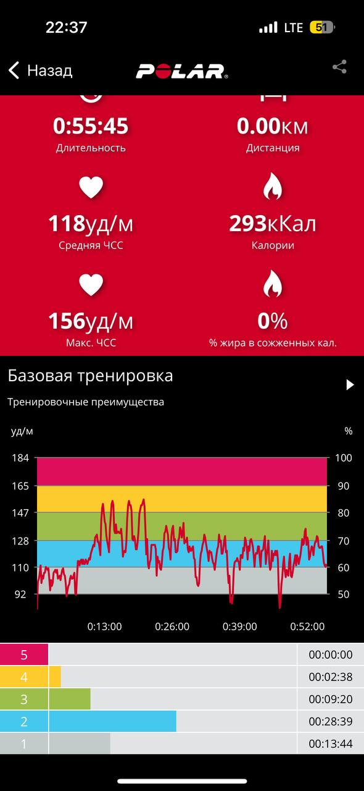

Самая опасная ошибка в расчёте активности выглядит очень прилично.

Вы открываете шагомер: за день 12 000 шагов. Потом открываете тренировку: ещё 500 ккал. Складываете всё с базовым метаболизмом и радуетесь, какой вы двигатель внутреннего сгорания.

Только часть этих 12 000 шагов могла появиться во время той самой тренировки. Вы уже посчитали её как тренировку, а потом второй раз — как повседневную ходьбу.

Так рождается двойной расход, которого организм не совершал.

Наша задача — зафиксировать одно простое личное правило:

> Что входит в базу, как я считаю шаги, как считаю тренировки и чего не прибавляю второй раз.

Не самое точное правило на свете. **Одно непротиворечивое правило**, которым вы пользуетесь из недели в неделю.

## Сначала разделим две активности

### Повседневная активность

Это ходьба и движение, которые происходят в обычной жизни: дорога, работа, магазин, дом, лестницы, прогулка с собакой, бытовые дела.

В калькуляторе эту часть мы описываем средним количеством шагов и долей активной ходьбы.

### Тренировочная активность

Это отдельное занятие с началом и концом: пробежка, танцы, силовая тренировка, велотренировка, плавание, групповое занятие и так далее.

В калькуляторе она попадает отдельной суммой за неделю.

Разделение нужно не потому, что организм умеет отличать поход в магазин от беговой дорожки. Оно нужно нам, чтобы одна энергия не оказалась в формуле дважды.

## Как выглядит двойной счёт

Допустим, утром было 6000 шагов. Потом час танцев, после которого стало 8000. К концу дня — 10 000.

Если тренировку по танцам вы считаете отдельно, то две тысячи шагов во время неё уже входят в тренировочный расход. Значит, для повседневной активности остаётся:

**10 000 − 2000 = 8000 шагов**, плюс отдельно одна тренировка.

Это старый авторский пример, и он до сих пор прекрасно объясняет механику.

Но если тренировку вы **не** считаете отдельно, можно оставить все 10 000 шагов в повседневной активности и не прибавлять тренировочные калории сверху. Такая оценка может быть грубее, зато она хотя бы не противоречит сама себе.

## Два допустимых способа

### Способ 1. Все шаги остаются в базе, тренировку отдельно не добавляем

Подходит, если:

- тренировки редкие;
- вы не доверяете расходу с часов;
- большая часть занятия — ходьба или бег, которые хорошо попадают в шаги;
- сейчас важнее получить консервативную стартовую оценку;
- вы готовы позже проверить модель по весу и питанию.

Плюс способа — простота. Минус — силовая, велосипед, плавание и часть других нагрузок отражаются шагами плохо или не отражаются вообще.

### Способ 2. Убираем тренировочные шаги из базы и добавляем тренировку отдельно

Подходит, если:

- тренировки регулярные;
- у занятия есть понятное начало и конец;
- вы можете определить шаги до и после;
- у вас есть хотя бы последовательный способ оценивать тренировочный расход;
- тренировочная часть заметно влияет на неделю.

Плюс — модель лучше разделяет быт и тренировку. Минус — появляется ещё одна оценка, которой тоже нельзя слепо доверять.

Нельзя одновременно использовать оба способа для одной активности. Именно это и есть двойной счёт.

## Как выбрать правило для шагов

Вам не нужен универсальный ответ для всех людей. Нужен ответ для ваших занятий.

### Обычная прогулка

Если это просто часть дня — оставляйте в шагах.

Если вы называете её тренировкой, отдельно записываете время и расход, тогда её шаги нужно убрать из повседневной суммы.

Не название решает, а способ учёта.

### Бег

Бег почти всегда добавляет много шагов. Если тренировочный расход считается отдельно, беговые шаги надо вычесть из повседневных.

Самый простой способ:

1. Зафиксировать шаги перед стартом.
2. Зафиксировать после окончания.
3. Вычесть разницу из итоговых шагов дня.
4. Саму тренировку внести отдельно.

### Танцы и активные групповые занятия

Логика та же. Если браслет насчитал шаги, а занятие идёт отдельной тренировкой, разницу убираем из бытовой активности.

### Силовая тренировка

Шагов там обычно немного, а расход создаётся не только перемещением по залу. Можно оставить обычную дневную сумму шагов и отдельно добавить тренировку. Если за занятие набежали тысячи шагов из круговой работы, дорожки и длинной разминки, ситуация уже ближе к бегу — проверьте разницу.

### Велосипед и велотренажёр

Шагомер такую работу почти не отражает. Тренировку учитываем отдельно, а повседневные шаги оставляем как есть.

### Плавание

Тоже отдельная тренировка. Шаги до бассейна и обратно остаются бытовыми, само плавание — тренировочным расходом.

### Домашняя тренировка

Смотрите на характер занятия. Спокойная короткая разминка может почти не влиять на модель. Длинное активное занятие лучше учитывать отдельно. Если вы не уверены — используйте консервативное правило и не добавляйте расход до проверки.

## Не пытайтесь заработать еду приседаниями

Раньше в курсе были схемы, где можно было пересчитывать упражнения почти до одного приседания и потом «отыгрывать» ими калории.

В обязательном маршруте этого больше нет.

Причина не в том, что приседания не тратят энергию. Причина в ложной точности и пищевой логике: сделал упражнения — заработал еду, не сделал — должен отказаться. В такой системе и расход сомнительный, и отношения с едой становятся ещё запутаннее.

Короткие активности могут быть полезны для движения и здоровья. Но не надо превращать каждый подъём по лестнице в финансовую операцию между телом и печеньем.

## Почему нельзя просто верить таблице тренировки

В интернете полно обещаний: «Сожги 300 калорий за десять минут», «минус 500 ккал за домашнюю тренировку», «эта тренировка заменит час бега».

У таких цифр есть одна забавная особенность: расход почти всегда завышают. Я ещё не встречал ролик «Потрать жалкие 73 калории за двадцать минут и немного устань». Это плохо продаётся.

Одинаковое упражнение можно выполнять с разной техникой, амплитудой и темпом. В часовом занятии один человек сделает пять полноценных упражнений с короткими паузами, другой — три упражнения и большую часть времени проведёт в телефоне. Название тренировки одинаковое, расход — нет.

На оценку влияют:

- вес и другие параметры человека;
- продолжительность;
- фактическая интенсивность;
- подготовленность;
- техника;
- паузы;
- тип нагрузки;
- способ, которым устройство считает калории.

Поэтому готовая таблица по названию активности — слабая база для точного решения.

## Часы и тренажёр показывают оценку

Спортивные часы знают часть ваших данных, видят пульс, движение и иногда GPS. Это делает их полезнее случайного ролика. Но цифра калорий всё равно остаётся результатом закрытого алгоритма, а не прямым измерением энергии: при проверке нескольких популярных устройств [ни одно не показало ошибку оценки расхода ниже 20%](https://pubmed.ncbi.nlm.nih.gov/28538708/).

Разные устройства могут показывать:

- общий расход за время занятия;
- только дополнительный расход;
- оценку с учётом базового метаболизма;
- значение, скорректированное неизвестным алгоритмом;
- смесь тренировки и повседневного движения.

Отсюда важное различие.

### Брутто

Весь расход за время тренировки, включая энергию, которую организм потратил бы за этот час даже в покое.

### Нетто

Дополнительный расход именно из-за тренировки сверх базового расхода.

Если базовый метаболизм уже входит в суточную модель, а устройство добавляет его внутрь тренировки ещё раз, появляется маленький двойной счёт даже без шагов.

Что именно показывает конкретный бренд — не всегда понятно. Поэтому устройство удобно использовать **последовательно**, а не считать его абсолютной истиной.

## Что брать с часов

Полезно сохранять:

- тип тренировки;
- дату;
- полную продолжительность;
- средний пульс, если он записан без явных провалов;
- расстояние для бега, ходьбы или велосипеда;
- оценку калорий устройства;
- субъективную тяжесть занятия;
- шаги до и после, если они нужны для вычитания.

Но не обязательно использовать все данные в формуле. Даже если позже вы решите, что калорийности часов доверять нельзя, продолжительность и повторяемость занятий всё равно останутся полезными.

## Сначала посмотрите на график пульса

Средняя цифра пульса может выглядеть убедительно, даже если датчик половину тренировки терял сигнал.

Вот так выглядит запись с очевидными провалами и ступеньками:

Если график прыгает вертикальными стенами, надолго замирает на одной линии или исчезает, расчёт калорий на его основе тоже нельзя воспринимать всерьёз.

Это не означает, что нужно немедленно покупать самый дорогой датчик. Это означает: **качество входных данных надо хотя бы посмотреть**.

## Нагрудный датчик, часы или ничего

Для расчёта расхода нагрудный датчик обычно даёт более стабильную запись пульса, чем датчик на запястье. Часы удобнее и уже могут быть у вас. Отсутствие датчика не запрещает тренироваться и не останавливает курс.

Если измерения нет или оно плохое:

- не придумывайте точную калорийность;
- запишите вид и продолжительность занятия;
- используйте консервативную оценку или временно не добавляйте тренировку;
- проверьте общую модель позже по фактическим данным.

Лучше честная недооценка с пометкой, чем 800 калорий, взятые из описания видео.

## Как обращаться с оценкой часов

Не сравнивайте одно занятие на часах с одной цифрой из таблицы и не выводите коэффициент навсегда.

Соберите несколько похожих тренировок:

- один тип нагрузки;
- похожая продолжительность;
- примерно одинаковые условия;
- исправный график пульса;
- один и тот же способ записи.

Посмотрите, насколько стабилен результат. Если сегодня устройство показывает 280, завтра 310, а в похожий день 295 — это хотя бы последовательная оценка. Если значения скачут в два раза без понятной причины, использовать их как основание для питания рано.

[Даже стабильное устройство может систематически ошибаться](https://pubmed.ncbi.nlm.nih.gov/29942628/). Но эту ошибку позже можно поймать при калибровке всей модели. Случайный способ учёта, который меняется каждую неделю, откалибровать сложнее.

## Не компенсируйте тренировку автоматически едой

Часы показали 430 ккал — не значит, что теперь нужно немедленно съесть ровно 430 ккал сверху.

Во-первых, оценка может быть завышена. Во-вторых, суточная калорийность и дефицит ещё не назначены. В-третьих, тренировка может влиять на голод, движение после занятия и восстановление не так прямолинейно, как строка «сожжено».

На этом этапе мы добавляем тренировку в **модель расхода**, а не выдаём разрешение на конкретную еду.

Старые точные лимиты, после которых надо компенсировать определённый процент тренировочных калорий, не переносим без современного фактчека. Позже решение будет приниматься по среднему расходу недели, состоянию, голоду, восстановлению и динамике веса.

## Шаги тоже не универсальная норма

Число 10 000 известно всем, но для нашей задачи оно не является магической границей.

Нам важнее три вещи:

1. Каков ваш фактический средний уровень.
2. Насколько он стабилен между неделями.
3. Не включаем ли мы одни и те же шаги в тренировку и повседневную активность.

Человек с 5000 шагов и регулярным велосипедом живёт не так же, как человек с 5000 шагов и полным отсутствием другой нагрузки. Человек с 12 000 шагов на работе может не нуждаться в дополнительной прогулке только ради красивого счётчика.

Сейчас мы не ставим цель шагов. Мы описываем базу, на которой затем будем проверять расход.

## Как считать неделю, где тренировки меняются

Если у вас есть стабильный план, всё просто: суммируйте обычный тренировочный расход недели и внесите его в калькулятор.

Если неделя каждый раз другая, есть три варианта.

### Взять среднее нескольких недель

Подходит, если занятия нерегулярны, но в среднем повторяются. Чем больше хаоса, тем шире должна быть оценка.

### Считать два сценария

- неделя без тренировок или с минимальным объёмом;
- обычная тренировочная неделя.

Так вы увидите диапазон, а не будете притворяться, что оба режима одинаковы.

### Не включать будущую тренировку заранее

Если вы не уверены, что занятие состоится, не закладывайте его как гарантированный расход. Провели — записали. Не провели — модель не требует потом «отрабатывать долг».

## Консервативное допущение — нормальный выбор

Когда расход неизвестен, люди часто выбирают более высокую цифру. Она позволяет больше есть и приятнее выглядит в расчёте.

Но стартовой модели полезнее быть немного консервативной. Не настолько, чтобы искусственно посадить себя на голодный рацион, — дефицит мы вообще пока не назначаем. Просто не надо прибавлять то, в чём вы не уверены.

Если позже фактические данные покажут, что расход выше, диапазон легко поднять. Это не экзамен, где первая цифра должна навсегда остаться правильной.

## Четыре типовых сценария

### Сценарий 1. Нет регулярных тренировок

- В базу идут все обычные шаги.
- Тренировки — ноль.
- Ничего отдельно не прибавляется.

### Сценарий 2. Силовые тренировки, мало шагов внутри

- Обычные дневные шаги остаются в базе.
- Силовые занятия считаются отдельно консервативным способом.
- Дорожка или длинная активная разминка проверяется отдельно, чтобы не задвоить шаги.

### Сценарий 3. Бег или танцы

- Шаги занятия вычитаются из дневной суммы.
- Тренировка вносится отдельно.
- Если тренировочному расходу нельзя доверять, используйте сценарий без отдельного добавления и сохраните все шаги.

### Сценарий 4. Велосипед плюс обычная ходьба

- Повседневные шаги остаются в базе.
- Велотренировка учитывается отдельно.
- Не прибавляйте сверху ещё «общую активность» из часов, если она уже включает и ходьбу, и велосипед.

## Запишите личное правило

Заполните четыре строки.

> **В базу моей повседневной активности входят:** ___
>
> **Шаги во время таких тренировок я вычитаю:** ___
>
> **Тренировки я считаю так:** ___
>
> **Второй раз я не прибавляю:** ___

Пример:

> В базу входят все шаги вне бега. Беговые шаги вычитаю по показаниям до и после тренировки. Бег считаю по одной и той же консервативной оценке часов, если график пульса записан нормально. Общую строку «активные калории» из часов сверху не прибавляю.

Или ещё проще:

> Пока оставляю все шаги в базе, тренировки отдельно не прибавляю. Через две недели проверяю модель по среднему питанию и весу.

Оба правила могут быть рабочими. Плохое правило — сегодня считать бег отдельно, завтра оставить его в шагах, послезавтра прибавить ещё «активные калории» часов и потом удивиться, почему расчёт не сходится.

## Что сохранить для следующего этапа

- стартовый диапазон расхода;
- средние шаги;
- список тренировок за неделю;
- источник оценки каждой тренировки;
- личное правило двойного счёта;
- сомнения и допущения;
- отдельную пометку, если неделя была нетипичной.

Дальше мы наконец перейдём к дефициту. Но сначала убедимся, что у него есть нормальная база. Иначе можно очень точно вычесть 20% из цифры, которая изначально была взята с потолка.

## Где заканчивается Калорийный курс

Здесь мы обсуждаем только вклад нагрузки в общий расход.

Как выбрать упражнения, сколько делать подходов и повторений, тренироваться до отказа или нет, строить прогрессию, пульсовые зоны, интервалы и тренировочный цикл — всё это принадлежит тренировочному курсу.

Короткая граница такая:

> Калории отвечают, куда движется масса тела. Тренировки — чем становится тело и что оно умеет.

Если задача — не только менять вес, но и развивать мышцы, силу, выносливость, скорость или готовиться к дистанции, одного подсчёта тренировочных калорий недостаточно. Там нужен тренировочный план, а не ещё одна строка в калькуляторе.

## Источники

- [Accuracy in Wrist-Worn, Sensor-Based Measurements of Heart Rate and Energy Expenditure in a Diverse Cohort](https://pubmed.ncbi.nlm.nih.gov/28538708/)
- [Validity of wrist-worn consumer products to measure heart rate and energy expenditure](https://pubmed.ncbi.nlm.nih.gov/29942628/)
- [Accuracy of Wearable Devices for Estimating Total Energy Expenditure: Comparison With Metabolic Chamber and Doubly Labeled Water Method](https://pubmed.ncbi.nlm.nih.gov/26999758/)
- [2011 Compendium of Physical Activities: a second update of codes and MET values](https://pubmed.ncbi.nlm.nih.gov/21681120/)
