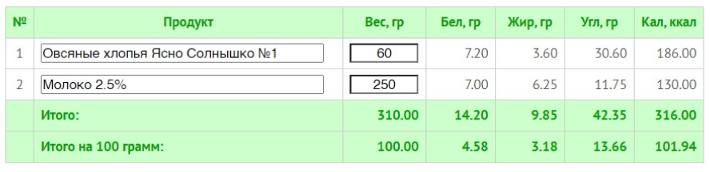
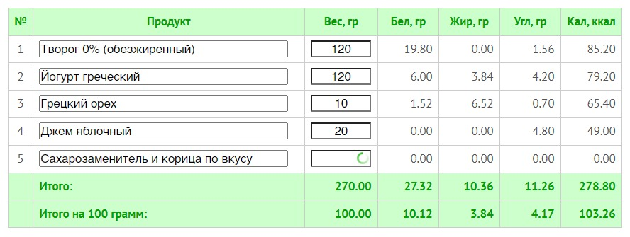
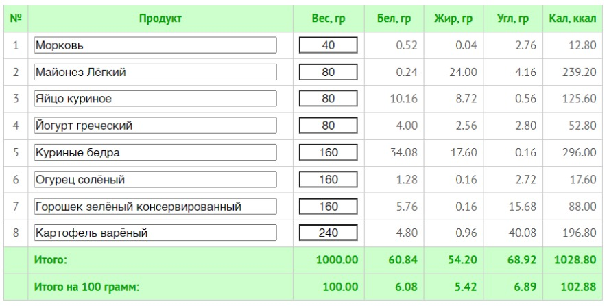
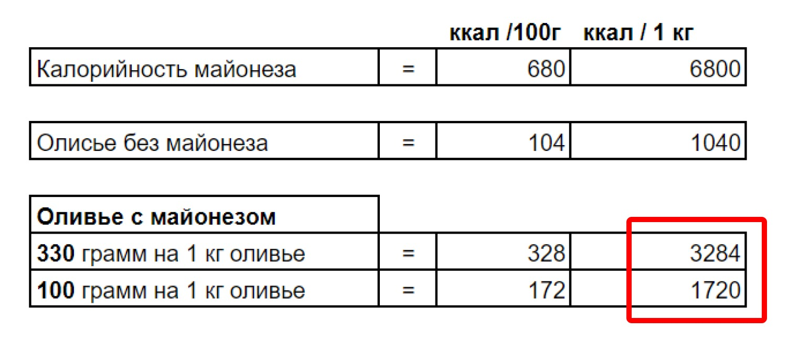
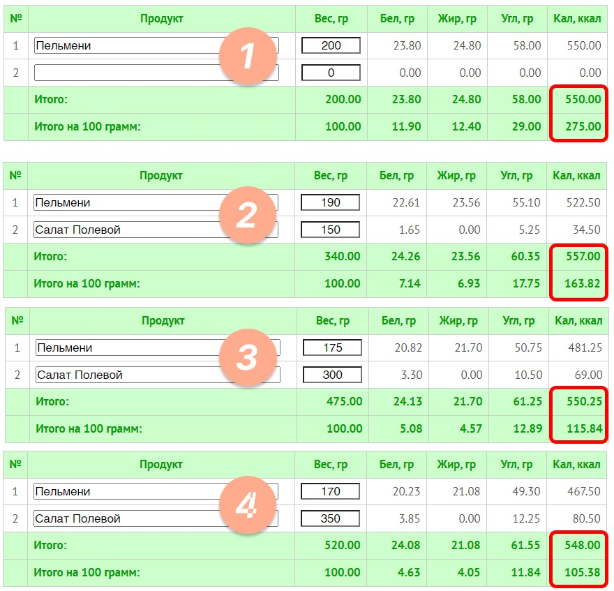
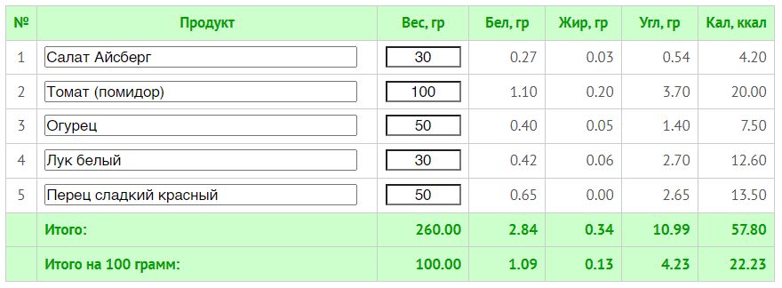

### Мерные емкости

Как альтернативу весам, иногда удобно использовать мерные стаканчики, для сыпучих и текучих продуктов. Когда вы изо дня в день будете мерить одни и те же продукты одними и теми же способами — это вопрос времени, когда начнет получаться определять большую их часть на глаз.

Вот мой вариант их использования с пресловутой овсянкой. Я подобрал стакан, который, если набрать доверху будет ровно 80г хлопьев, мешаю туда пополам рисовые и овсяные. Молоко беру 1 к 1 по объёму, то есть меряю тем же стаканом. Сверху у меня идут орехи, я их взвешиваю раз в неделю и кладу в небольшой органайзер сразу по 15 грамм в ячейку, пока готовится каша я их нарезаю. Также в кашу идёт мерная чайная ложка сахара. При приготовлении завтрака я не прикасаюсь к весам, на измерения трачу дополнительно 5 секунд, но при этом заранее гарантированно знаю калорийность блюда.

Со временем так будет проходить почти 80% приёмов пищи. Ищите возможности для оптимизации всех процессов на кухне. Некоторые продукты, например, яйца вообще можно взвесить один раз в жизни, естественно, без скорлупы, а потом просто покупать того же производителя, той же категории, и вопрос закрыт.

Короче, мерные емкости у вас обязаны появиться, я не представляю себе человека, который может все-все мерить без них и не сойти с ума. Есть три варианта:

- Покупные наборы мерных ложек, бывают пластиковые, бывают из нержавейки, размеры представлены от чайной ложки, до объема в 100мл.
- Один большой мерный стакан, желательно в стекле (прозрачный) с отметками в миллилитрах.
- Ну и любимый колхоз. После переезда я первое время пользовался именно им (первое время это полтора года). Мерная ложка из протеина, два отрезанных донышка разного размера от бутылки из-под кока-колы и стаканчик от йогурта — отличная компания! Я просто подогнал свои порции под то что есть, а не наоборот. Мне норм.

Учитывая последний вариант, не выйдет отвертеться и сказать, что вы не хотите тратиться или не можете найти. Это первое, что вы должны приобрести после весов, а потом плавно переводить на них все измерения, ну или почти все.

### Ещё несколько ЦУ по измерениям:

1. Важно, что разные крупы имеют разное отношение объема к весу, а некоторые — одинаковое, потратьте время, взвесьте их все, запишите и повесьте на холодильник и учитывайте в дальнейших измерениях.
2. Растительное масло мы заносим в приложение только в граммах, а отмерять только ложками, которые вмещают конкретные граммы, не перепутайте.
3. Сахар тоже стоит мерить только мерными ложками, это даже не обсуждается. Лучший лайфхак по упрощению таких подсчетов — отказаться от сыпучего сахара и использовать только по праздникам в разной выпечке, где без него порой совсем никак.
4. Сливочное масло измеряем кубиками. Раскройте пачку и визуально разметьте её на квадратики, которые похожи на вашу минимальную порцию, которую привыкли использовать. У меня минимум — это 3г, их я кладу в порцию макарон и использую для жарки яичницы, когда хочется дискотеки и корочки по краям — использую два таких кубика(параллелепипеда, если быть точным). Разметьте на глаз, а потом взвесьте один кубик и запомните. Можете первое время даже линейкой расчерчивать кусок масла. На второй пачке можете сделать их меньше или больше, смотрите по опыту. При готовке просто используйте по обстоятельствам х1 кусок х2, х3 или даже половинку. Поэтому я не рекомендую делать каждый больше, чем 5 грамм. Весы опять не нужны — здорово!

Конкретно здесь кубик по 5г. сетка просто нарисована ножом сверху.

**Как упростить подсчет сложных блюд я расскажу чуть дальше, а с "простыми" делайте вот так. **

1. Знать, сколько грамм каждой крупы или хлопьев в сухом виде вам нужно на одну порцию (примерно).
2. Знать вес каждой емкости или до какой отметки её нужно заполнить, чтобы в граммах все это ровнялось одной порции.
3. Планировать еду желательно на 1 раз (макароны, овсянка), если нет, то на 1 день (почти все крупы) ну или на два дня...
4. Насыпать нужное количество мерных емкостей в расчете на ваше количество человек и порций/дней. К весам прикасаться не нужно. Если готовим на воде, и у нас одна порция, то в приложение спокойно заносим калорийность сухого продукта.
5. После приготовления: гарнир на 1 раз — съесть, на два раза — разделить пополам, в приложении заносить каждый раз калорийность порции из прошлого пункта, на два дня — тоже разделить пополам и вторую половину сразу убрать на завтра, с обоими половинами повторить, как я только что описал. Ничего взвешивать не нужно!
6. Если получится так, что оставленное на сегодня недоели, вот тогда это можно взвесить и вычесть, если собираетесь выкинуть. А если отложите и съедите завтра до конца, то можно и не взвешивать. Напомню, что нам неважно, что калораж будет неверно записан (в первый день чуть меньше, во второй чуть больше) ведь от суммы слагаемых сумма не меняется. Тем более, это будут десятки калорий, явно не сотни.
7. Фрукты. Я всегда рекомендую есть их почаще, а значит, и чаще придется их взвешивать. Я не буду советовать записывать средний вес, чтобы избавить себя от взвешивания, но это зависит от конкретных фруктов. Например у киви обычно погрешность мизерная, а вот яблоки и апельсины бывают очень разные.
8. Но я могу сказать, запишите себе средний вес огрызков и кожуры. Актуальное у меня — это сердцевина из яблок (10г), кожура от банана (50) и апельсина (60г). Это мои цифры, как и чего я обгладываю, вы запоминайте ваши. Я взвешиваю целый фрукт и сразу записываю его за вычетом отходов, а потом могу съесть его на улице, в дороге, или почистить позже и просто уже не взвешивать.

Важно, все эти упрощения должны быть не раньше чем со второй или третьей недели подсчетов — держитесь!! Немного утрируя, могу сказать, что первое время важно, чтобы вы видели, как гречка падает в стакан и как одновременно прибавляются цифры на весах (это касается всего, кроме масла, его сразу ложками).

### Опорные точки

**Но кроме этих мелочей**, я знаю ещё, как минимум, два более глобальных способа упростить вам жизнь с подсчетами. Они пригодятся на любом этапе учета (кроме самого первого), но особую пользу принесет после того, как вы перестанете все вносить в приложение, но ещё не перейдете на "интуитивное" питание на 100%.

Используя эти два способа вместе, вы сможете на интуитивном уровне без подсчетов закрывать для себя 60-80, а иногда и 90% калорийности на день! А благодаря знаниям, полученным при изучении калорийности продуктов, остальные 10-30% будет нетрудно соблюдать даже на глаз из любой еды, хоть сладкой, хоть вредной. Первый способ - это опорные точки, о них мы поговорим в отдельном посте, а сейчас...

### "Рецепты за 100" или идеальная калория

Вот было бы здорово, если бы весы сразу показывали калории, правда? Вот поставили вы тарелку оливье и там сразу видно не граммы, а калории — красота! А что, если я скажу, что такое вполне можно устроить?

Для этого нам всего лишь понадобится отдельное блюдо или целый прием пищи, где средняя калорийность на 100 грамм будет равна 100 ккал. Давайте покажу как:

Начнем с простого, вот та же овсянка аскета, никому не рекомендую, но так... для примера. Заходим в калоризатор и подбираем соотношения молока и овсянки так, чтобы калорийность на 100 грамм была 100 калорий.

Вместо овсянки могут быть хлопья, мюсли, а вместо молока йогурт или кефир, общая модель от этого не меняется. Теперь это блюдо можно легко готовить хоть на всю семью и раскладывать по тарелкам без долгих подсчетов, остается только взвесить — 239г = 239 ккал, 340г = 340 ккал, 415г = 415 ккал, ну вы поняли. Главное, запомнить и соблюдать пропорцию в весе между ингредиентами 1к4. Одна часть хлопьев и 4 части молока по весу. Чуть ниже скажу, как это делать без весов.

Теперь сделаем шаг вперед и добавим ещё немного ингредиентов.

Конкретно овсянка и десерт из творога — это хорошие примеры, чтобы показать принцип этого правила, но такие блюда часто готовятся на один раз. Тогда на одну порцию их удобнее оформить как опорную точку и не морочить себе голову. А на полную силу "Рецепты за 100" раскрываются для сложных однородных блюд, которые вы готовите на несколько дней и несколько человек, например, оливье:

Один раз составили такой рецепт, подшаманив его за пару попыток, записали все пропорции и больше НИКОГДА не считаем его калории. Я советую рассчитывать рецепты для таких блюд либо отталкиваясь от веса самого мелкого ингредиента (в данном случае это морковка на 40 грамм, специально, чтобы не брать половину или полторы) либо рассчитывать для общего веса в 1000г. Тогда если вам понадобится приготовить не 1 кг оливье, а 1,4кг, просто умножайте все цифры исходного рецепта на 1.4, а если надо 643г (мало-ли) то умножайте на 0.643.

Как вы могли догадаться, оливье в классическом исполнении совсем не тянет на 100 калорий, скорее на 160-180 и то в лучшем случае. Бывает, что некоторые блюда нельзя дотянуть до целевой 100ккал, а бывает, что можно, но при этом, есть их уже не очень хочется. Ничего страшного! Потому что есть их даже не обязательно и не обязательно доводить именно до 100ккал тоже не обязательно, 148 — тоже красивая цифра.

Главное, что с помощью такого упражнения вы сможете очень быстро сделать для себя несколько полезных наблюдений, как на картинке ниже, и поймете, за счет каких ингредиентов в вашем рационе вы набираете лишние калории, а значит, и лишний вес. Это уже второй повод использовать эту методику.

Здесь взят классический рецепт

Давайте я перечислю только несколько блюд, которые вы можете приготовить по такой схеме, а вы напишите мне, если сможете добавить что-то ещё:

- Супы — вообще просто созданы для этой идеи, особенно крем-супы. Подойдут совсем любые, но желательно те, в которых равномерное распределение начинки, а не одна баранья нога на ведро. Для супов можно взять целевую калорийность в 50ккал, умножить/поделить на два будет не сильно сложнее, чем со 100 ккал.
- Соусы — не кетчупы, а блюда наподобие чили с фасолью по-мексикански или пикадилио (кстати, тоже по-мексикански).
- Макароны по-флотски, холодные паста-салаты, плов, салат мимоза и аналогичные салаты, некоторые пироги, выпечка и даже шаурма!

Те блюда, что можно довести до сотни — тяните по тому же алгоритму, что и в примере с овсянкой на завтрак, когда мы стремились сделать прием пищи на 450 калорий, меняя в нем пропорции продуктов. В дополнение к перебору пропорций стандартных ингредиентов вы можете использовать добавление чего-то, что увеличит общий вес, но снизит калорийность, например:

- Лишняя луковица, томат или другой овощ;
- Фрукты или ягоды, если это десерт;
- Листовая зелень;
- Яичный белок;
- Тофу;
- Грибы;
- Греческий йогурт;
- Любой другой продукт с калорийностью ниже, чем 70-80 ккал.

А что делать, если все равно не получается ничего сделать без потери вкуса, и калорийность висит около 180ккал?

Тогда можно попробовать увеличить до 200 ккал на 100г. Как я сказал про супы — разделить/умножить на два, это не так трудно.

В таком случае используйте топинги и разные добавления в блюдо, которые имеют маленький вес и высокую калорийность, но используйте только "здорово-полезные" продукты, которые часто ещё бывают и вкусными, чтобы убить сразу трех зайцев сразу. Мне, например, трудно представить, в каком блюде могут помешать горсть дробленых орехов или щепотка пармезана:

- Орехи и семена;
- Оливковое или льняное масло;
- Твердые сорта сыра;
- Сухофрукты;
- Любой другой продукт с калорийностью выше, чем 400-500 ккал? Кроме сладостей и мясных полуфабрикатов.

А что делать, если никак-никак не получается уместиться ни в 100 ни в 200 ккал, но очень хочется? Например, пельмени на 270 ккал, из них, как говориться, слов не выкинешь.

А вот это, я считаю, отличный повод взглянуть не на отдельное блюдо, а на прием пищи целиком! Удобством подсчетов здесь уже и не пахнет, но мы сфокусируемся на снижении дневной калорийности и увеличение насыщаемости! И вот тут уже третий аргумент, почему стоит практиковать "рецепты за 100".

Мы никак не можем сделать пельмени на 100 калорий, но мы можем сделать среднюю калорийность "всего приема пищи вместе с пельменями" на 100 калорий! Поэтому выбираем в калоризаторе пельмени и добавляем "разбавитель" — что-то из низкокалорийного списка, который я приводил выше. В данном примере пусть это будет просто салат.

Понятия не имею, что такое "Салат Полевой", но в нем столько же калорий, как и в салате который я для себя рассчитал (см. следующий заголовок).

А дальше как в истории с овсянкой. Во всех случаях калорийность у нас одинаковая, но есть нюанс =) Общий вес приема пищи вырос в 2.5 раза с 200г до 500г. Не надо быть академиком, чтобы понять в каком случае насыщаемость будет лучше.

1. Это базовая комплектация, 90% людей не наедятся такой порцией и положат себе просто больше пельменей, калорий так на 650-700.
2. Уже лучше!
3. Ещё лучше!
4. Идеально (на самом деле нет). Мы достигли цели по средней калорийности, но я пробовал так есть — почти пытка.

Это тот путь, когда важна не победа, а участие и если мы выберем 2й или 3й вариант, то это уже отлично! Пельмени не самый удачный пример, а вот провернув такую схему с пловом и салатом 100 ккал на 100г — это легко, вкусно и круто!

### Итого:

Если представить, что все ваши приемы пищи будут по 100ккал/100г, то на рационе в 2000 ккал вам придется съедать по 2 килограмма еды, а это, пардон, дохрена(много). Понимаете, к чему я клоню?

Конечно, не надо стараться все приемы пищи подогнать под эту идею, да оно и не получится, но хотя бы двигаться в этом направлении раз от раза, будет очень полезно.

Я вас добью, но тут есть четвертый повод со всем этим заморочиться! Пока вы будете делать разные вычисления в калоризаторе и планировать свои "Рецепты за 100", у вас просто не будет шанса, чтобы НЕ натренироваться, вы будете обречены на успех!

### Одинаковые продукты

Заканчивая тему упрощения подсчетов, вот ещё один метод, который иногда будет полезен. Ищите сочетания продуктов и блюда, в которых большинство ингредиентов примерно одинаковой калорийности, тогда вы сможете взвешивать только конечное блюдо, не заморачиваясь с пропорциями и ингредиентов.

Даже если на глаз получится промахнуться идеальных пропорций, то на общей калорийности это никак не отразится. Лучший пример, это салат, но не любой, а вот такой:

Уменьшив или увеличив вес чего угодно в этом наборе в целых два раза (нарубили совсем на отвали), то общая калорийность на 100г будет меняться в пределах от 21.3ккал до 24.4 ккал. Если взять среднее значение, то на тарелку в 250грамм это будет погрешность в 4-5 калорий, что просто смешно, даже на первом этапе подсчетов. Правда, масло и топинги в виде кунжута или ещё чего, придется считать отдельно.

### Выводы:

Как вы заметили, почти весь пост сегодня состоит из скриншотов калоризатора. Это не с проста. Чтобы научиться составлять собственное меню - вам нужен опыт работы в калоризаторе, чтобы уметь подстраивать приемы пищи под нужную калорийность - вам нужен калоризатор, чтобы рассчитывать сложносоставные блюда и опорные точки - вам нужен калоризатор.

### 💪 Дорогу осилит идущий.

Да, поначалу, вы реально будете стоять над своими котлетами и всхлипывая вспоминать, сколько вы там в них лука натёрли, истекая уже слюной. Но ни вы первый(-ая), ни вы последний, пройдёт время и всё будет происходить на автомате и взвешивание, и подсчёт, и потеря веса.

Главное, помните, что вы всеми этими подсчетами занимаетесь не для того, чтобы свой жир на боках удивлять математическими способностями, а чтобы научиться выбирать более подходящие блюда, продукты для вашего питания и ловко распределять их по времени внутри дня.

Держите это всегда в голове, иначе считать калории можно очень долго, даже какой-то вес потерять, но в глубине души остаться без изменений. Но если вы осилили весь мой материал до этого момента — это явно не ваш случай и у вас все получится!
