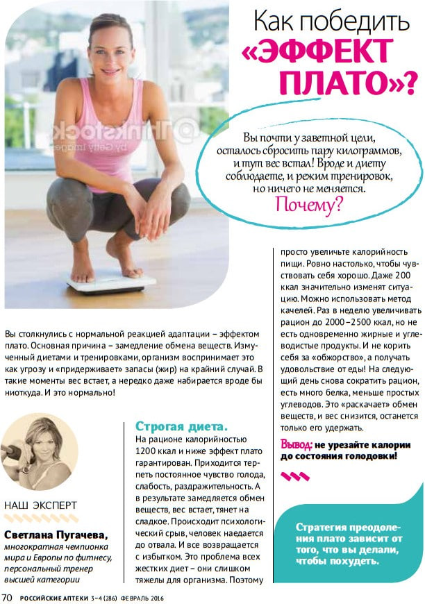

Лишний раз обозначу приоритеты вашем похудении, которые стоит соблюдать при использовании учета калорий. Успех похудения зависит только от того, на сколько комфортно будет держать конкретный рацион на длительном отрезке времени. Существует всего три столпа, на которых держится этот комфорт.

### 1️⃣ Знать свои цифры

Если вы не знаете свой энергобаланс и предполагаете, что он "ну... может 1800 ккал, а может, где то 2400 ккал", то для похудения вам нужно выбирать рацион хотя бы на 1400 ккал, а то и 1300 ккал, чтобы "гарантированно", с запасом оказываться в дефиците.

По такой схеме проводят все марафоны похудения, которые невероятно успешны (еще бы... с таким дефицитом!), точно так же устроены готовые меню или рационы с КБЖУ на минималках.

Но именно этот "запас на гарантированность" и приводит сначала к срывам, а потом к прекращению похудения и возврату в старый образ жизни. Нам этого не надо!

### 2️⃣ Избегать орторексии

Орторексия — это только название страшное, на самом деле ей болеют чаще чем насморком. Сухие термины можно найти в Википедии, а я вам расскажу, как протекает такое заболевание.

Определяются категории еды по принципу "чёрное и белое", "полезное и вредное". Всё, что полезное вносится в меню, а всё, что вредное — вычёркивается. На поддержание такого рациона тратиться огромное количество силы воли и моральных сил, ведь часто в категории "вредное" находилось ещё много из категории "любимое" 🤷‍♂️

Терпение заканчивается, происходит срыв, во время которого съедается объём вредного на пол года вперёд (срыв может быть как 2 дня, так и 2 месяца).

Начинается самоистязание на этой почве, затем приходит решение начать всё сначала, но теперь ещё строже. Круг замыкается.

В итоге получается ситуация тупая до слёз. Мы мучаемся, при этом не худеем, так ещё и удовольствия от любимой пищи не получаем, поточу, что её употребление несёт за собой чувство вины. Такими условиями нужно пытать особо опасных преступников (и то по особым случаям), а не себя любимого в добровольном порядке.

**Вывод:** есть можно всё, вредная еда не такая страшная, страшная — бесполезная еда (см. Мастер-класс). Идеально придерживаться соотношения 80:20, когда большая часть калорий поступает из здоровой еды, а меньшая из пустой.

Примечание: к сожалению, этому правилу невозможно следовать при заниженном рационе "с запасом", потому что если в меню на 1200-1300 ккал позволять себе 20-40% пустых калорий, то это всё равно будет как комариный укус в плане удовольствия, а для нормальной еды останется калорийности только на понюхать. Витамины, минералы, клетчатка, разнообразие — говорят пока.

### 3️⃣ Держать высокий оборот калорий

Все последние исследования сходятся во мнении, что стоит фокусироваться не только на дефиците калорий, но и на общем их количестве, которое проходит через наше тело. Для похудения это более эффективно, чем полагаться только на дефицит.

Вы могли заметить, что это идет в разрез с популярными вирусными роликами, где транслируется идея, что для похудения нужно "Меньше есть и больше двигаться"... Это прямой путь в госпиталь или в дурку (на выбор)

Простыми словами — лучше поддерживать потерю веса при более высоком уровне активности и более высоком рационе, чем при меньшей активности и меньшем рационе, даже если дефицит будет одинаковым.

**Для этого есть вполне объективное и наглядное объяснение:**

20% дефицита от 2800 ккал = 560 ккал

20% дефицита от 1900 ккал = 380 ккал

В одном случае вы будете терять 2.12 кг/мес, а в другом 1.48 кг/мес, при одинаковом комфорте. Пример утрированный, но вы поняли.

Есть ещё субъективный довод — чем больше ваш энергетический баланс, тем больше всяких "вредностей" вы можете себе позволить без вреда для качества основного рациона, см. пункт #2.

Примечание: а как сделать общий оборот калорий высоким, если не знать, как правильно считать калории? Правильно, никак... см. пункт #1.

Вы заметили, что все три основы комфортного похудения переплетены между собой? Поэтому неудивительно, что если забить болт на одну из них, то другие могут не выдержать лишнего веса, простите за каламбур.

### Дефицит калорий

Теперь посмотрев на ваши собственные цифры, вам нужно выбрать, какой дефицит калорий вы будете удерживать следующие 1-2 недели сверки цифр и корректировки калорийности.

Дефицит калорий это единственная переменная, которую нельзя универсально рассчитать для всех подряд. Уровень в 20% действительно является хорошей отправной точкой, но важно здесь, что это лишь отправная и она может меняться со временем.

Пока это не будет вашим идеальным режимом похудения, а лишь хорошей отправной точкой. Нужно будет совместить ваш комфорт от такого питания, ваш вес и ваши записи по калориям. Да, звучит не сильно быстро, но только такой подход позвонит взять цифру не с потолка, а ту, которая реально вам поможет худеть комфортно и столько по времени, сколько необходимо.

Многие захотят поставить дефицит больше и похудеть быстрее, но чаще всего приходится людей одёргивать и уговаривать на более низкий дефицит, чтобы не променять конечный результат на краткосрочные достижения.

Какая разница насколько эффективна диета и сколько она поможет вам сбросить за один год, если вы не можете продержаться на ней больше месяца?

### Какие существуют ориентиры

Когда я делаю подбор калорийности на консультации, то вот список того на что я ориентируюсь:

Есть нижние границы потребления калорий, за которые я стараюсь не заходить. Для женщин это 1200 ккал, для мужчин — 1500 ккал, и то это крайние случаи. В большинстве историй я стараюсь не опускаться ниже 1350 ккал в среднем за неделю для женщин 60–80 кг и не ниже 1500 ккал для женщин 80 кг+. Если при такой калорийности снижение идёт слишком медленно, я чаще увеличиваю расход за счёт активности, а не продолжаю “резать” еду. И нет, это не значит, что нужно умирать на тренировках.

верхним порогом дефицита калорий я называю дефицит меньше 200 ккал (для девушек от 70кг), в таком случае временные затраты на все эти подсчеты не окупаются в виде скорости снижения веса и есть смысл потратить силы на перестройку питания и потом уже худеть в более серьезным дефицитом калорий.

С учётом этих ограничений я обычно ориентируюсь на средний дефицит порядка 400–500 ккал в день. Для большинства людей до 100кг после наведения порядка в питании это комфортная величина: не валит с ног, не вызывает постоянного голода и при этом даёт заметную динамику за несколько недель. Но бывают ситуации, когда человек может худеть быстрее без увеличения дискомфорта — тогда я аккуратно увеличиваю дефицит, чтобы сократить срок снижения веса.

Я также обязательно учитываю качество питания и субъективный комфорт с тем дефицитом, который уже был в последние недели. Иногда после всех расчётов приходится сказать честно: с текущим качеством питания человек пока не готов к адекватному похудению. И тогда мы делаем шаг назад — наводим порядок в структуре рациона, прежде чем углублять дефицит. Это не откат, а подготовка. Если этот этап пропустить, проблем потом будет больше.

В итоге всей этой работы появляется конкретная цифра, которой стоит придерживаться ближайшие 1–2 недели. Дальше мы смотрим на динамику веса, при необходимости подключаем или корректируем активность и, если нужно, вносим изменения в расчёты.

### Алгоритм назначения дефицита и корректировок

- Сначала вы смотрите, сколько вы в принципе ели раньше. Если у вас уже был учёт 1–2 недели — отлично. Берёте среднее потребление за этот период и сопоставляете его с рассчитанным энергобалансом: понимаете, был ли это профицит, поддержание или дефицит и какого размера.
- Дальше важно не делать резких движений. Если до этого питание было в профиците, не стоит обрушивать калорийность слишком сильно — организм уже привык к определённому уровню энергии, и резкое урезание почти всегда ухудшает соблюдаемость.
- Если вы уже находитесь в разумном дефиците, который укладывается в те рекомендации, о которых мы говорили выше, и динамика веса устраивает — не нужно ничего выдумывать. Просто продолжайте худеть в этом режиме.
- Дальше обязательно посчитайте скорость похудения. Для этого есть отдельный пост с формулой расчёта сроков. Вы должны понимать, сколько времени займёт достижение цели при текущем дефиците. Если сроки вас устраивают — отлично. Если не устраивают, смотрим, можно ли расширить дефицит, не выходя за рамки разумных ограничений.
- Расширить дефицит можно двумя способами: Либо есть меньше. Либо двигаться больше. Но снижать калории можно только до определённого предела — нельзя упираться в нижние лимиты и пытаться “дожать” процесс через голод. Поэтому чаще разумнее увеличивать расход.
- Увеличивать расход — это либо повседневная активность (шаги), либо тренировочная активность. Посчитайте в калькуляторе, сколько дополнительных калорий дадут дополнительные шаги. Отдельно посчитайте, сколько даст конкретная тренировка.
- Вы можете добирать дефицит шагами, тренировками или комбинацией. С тренировками всё сложнее — это отдельная большая тема, и именно поэтому для них будет отдельный материал. Если вам нужна помощь в построении тренировок так, чтобы они помогали похудению и не усиливали голод — это уже работа на консультации.
- При этом есть и верхний лимит тренировочной активности за неделю (считается в количестве потраченных калорий на тренировках). Тут очень много зависит от вашей тренированности и веса, но часто для первых тренировок для девушек около 80кг я ориентируюсь на верхнюю планку в 1500-1800 ккал в неделю на тренировки.

**После того как вы определили: **сколько калорий вы едите, сколько шагов делаете, сколько калорий тратите на тренировки (если они есть), какой итоговый дефицит у вас получается, и сколько килограммов вы должны потерять за ближайшие 1–2 недели. Вы в таком режиме живёте минимум неделю, а лучше две.

Никаких изменений в середине периода. Никакой паники из-за одного дня. Собираете данные — и цифры, и ощущения. Через 7–14 дней вы сравниваете:

- Сходится ли фактическая динамика веса с расчётной?
- Комфортно ли вам так худеть?
- Готовы ли вы держать такой режим столько времени, сколько требуется?

Если всё сходится и вам комфортно — продолжаете. Если не сходится — возвращаетесь к расчётам и корректируете модель. Возможно, вы решите замедлить снижение, но меньше времени проводить в зале. Возможно, наоборот — ускорить процесс, потому что у вас высокий оборот калорий и вы можете позволить себе чуть больший дефицит без дискомфорта.

Я понимаю, что это может казаться сложным. Но на самом деле это управляемая система: вы задали параметры — проверили — скорректировали.

Если цифры “не бьются” и вы не понимаете, где ошибка, можно разбираться глубже. Я работаю с этими цифрами на разных людях буквально каждый день и понимаю, как влиять на них — и через качество питания, и через активность, и через корректировку самого дефицита. Если вам нужна помощь — обращайтесь.

### Эффекта плато. Его не существует.

Обычно эффектом плато называют состояние, когда вы вроде был делаете всё как и раньше, но почему-то перестали худеть. Вроде бы в дефиците калорий, а вес не снижается. Ключевое слово "вроде бы"...

Якобы организм переходит в режим "голодовки" или "сбережения энергии". От этого замедляется метаболизм и похудение останавливается, что бы вы не делали.

А раз так, то для преодоления "плато" нужны какие-то особые танцы с бубном. То шоковое повышение калорийности, то шоковое понижение, то поесть куркумы, то сходить в баню, какой дичи я только не встречал.

В прошлом посте я уже писал, что метаболизм не замедляется и не ускоряется! А так называемый "режим голодовки" не подтверждается ни одним мало-мальски авторитетным исследованием. Эта информация гуляет только в поверхностном научпоп-контенте.

Каждый раз, когда ко мне обращаются с жалобами на плато, выясняется, что человек просто перестал быть в дефиците и не заметил этого. Всё.

**Вот несколько примеров: **

1️⃣ Девушка начала ходить тренироваться в зал. Но после зала и в дни отдыха из за усталости стала реже гулять и больше лежать. В итоге на круг за неделю расход калорий даже немного уменьшился. Вот и замедление похудения.

2️⃣ Мужчина с большого веса сел на диету, отказался от мучного. Всего за неделю с небольшим он скинул почти пятилитрушку жидкости. Ведь один грамм углеводов может удерживать в организме до 4г воды.

3️⃣ А потом, когда он начал худеть адекватными темпами и чистым жиром, то просто не хотел верить, что вес теперь так медленно двигается. Жаловался на эффект плато. Хотя там было не медленно, а нормально, просто не соотносилось с его ожиданиями.

**Вторая категория ситуаций **— когда жир уходит, но вес временно это не показывает. Тут тоже ничего магического не происходит.

Это либо водный баланс. В первый месяц часто уходит и жир, и жидкость. Один грамм гликогена удерживает до 3–4 г воды. Поэтому сначала минус 4–5 кг, а потом “всего” 2 кг в месяц. Это не замедление жиросжигания — это стабилизация воды.

Либо рекомпозиция. Вес может стоять, но объёмы уменьшаться, если жир снижается, а мышечная ткань сохраняется или немного увеличивается. Если вы девушка, это скорее всего не ваш случай.

### Что из этого следует?

Если вы правильно посчитали энергобаланс, назначили адекватный дефицит и регулярно отслеживаете вес, вам не страшен никакой “эффект плато”. Вес остановился — вы не паникуете. Вы проверяете:

- Не выросло ли фактическое потребление
- Не просели ли шаги
- Не изменилась ли тренировочная нагрузка
- Достаточно ли длительный период наблюдения

И почти всегда находите причину. Иногда корректировать нужно калории или активность. Иногда — собственные ожидания. Плато — это не мистическое состояние организма. Это сигнал проверить модель похудения. Если цифры под контролем, вы всегда понимаете, что именно нужно исправить.

Я в этом материале описал реально всё, чем руководствуюсь на консультациях. Вы можете попробовать сделать всё это самостоятельно, а можете обратиться ко мне за разбором дневника и полноценной консультацией по всем вашим вопросам. Чтобы я смог применить не только калькулятор и общие принципы, но и свой опыт работы с людьми для решения лично ваших сложностей в похудении.
