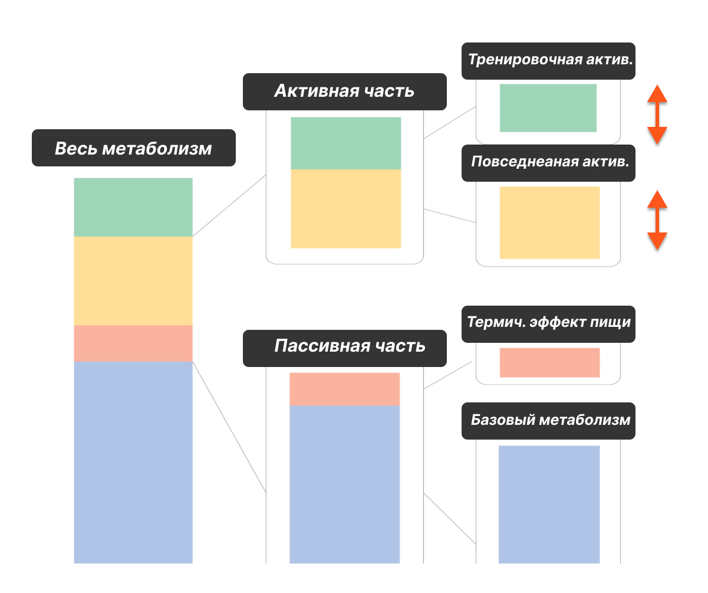
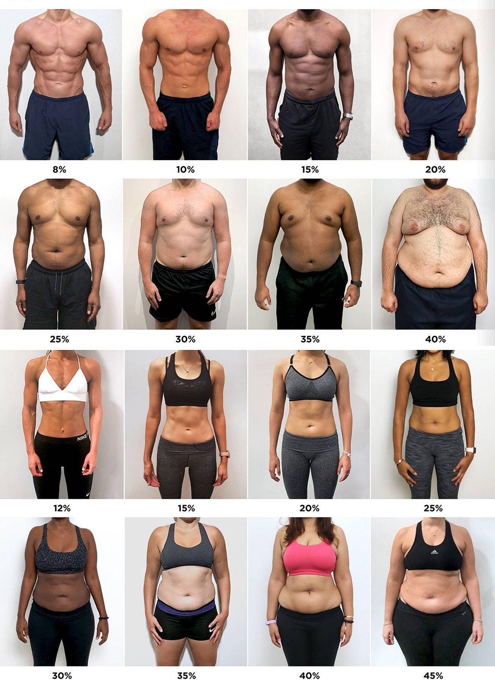

До этого момента мы считали только ту половину энергобаланса, которую можно положить на весы: еду.

С расходом всё веселее. Нельзя утром встать на прибор и узнать: «Сегодня вы потратите 2147 ккал, хорошего дня». Организм не выдаёт чек. Поэтому любой бытовой калькулятор расхода — это не измерительный прибор, а **модель**, собранная из нескольких оценок. Даже базовый обмен в таких расчётах получают через [прогностическое уравнение, а не прямое измерение вашего организма](https://pubmed.ncbi.nlm.nih.gov/2305711/).

Модель может быть очень полезной. Но только если не путать хорошую отправную точку с точным знанием.

Наша задача на этом шаге:

1. Понять, из каких частей складывается расход.
2. Внести в актуальный калькулятор исходные данные.
3. Получить не священную цифру, а рабочий диапазон.
4. Записать допущения, из-за которых диапазон может сдвинуться.
5. Позже проверить расчёт по фактическому питанию и динамике веса.

Дефицит пока не выбираем. Сегодня мы ищем приблизительный уровень поддержания — сколько энергии вы в среднем тратите при своём нынешнем образе жизни.

## Что такое энергобаланс

Метаболизм — это всё, что организм делает с энергией. Мы получаем её из еды и тратим на поддержание жизни, движение, тренировки, переваривание пищи и тысячу процессов, которые не требуют нашего сознательного участия.

**Энергетический баланс** — соотношение потребления и расхода энергии.

- Когда в среднем потребление примерно равно расходу, вес остаётся относительно стабильным.
- Когда расход устойчиво выше потребления, возникает дефицит.
- Когда потребление устойчиво выше расхода, возникает профицит.

Слово «в среднем» здесь важнее всей остальной формулировки. Ни питание, ни расход, ни вес не повторяются с точностью до калории и грамма каждый день. Нам нужна модель недели и нескольких недель, а не математическая драма по итогам одного вторника.

## Из чего складывается расход

В калькуляторе расход разделён на четыре части:

- базовый метаболизм;
- повседневная активность;
- тренировки;
- термический эффект пищи.

Разделение нужно не ради терминов. У этих частей разная предсказуемость.

Базовый метаболизм меняется относительно плавно. Повседневная активность может заметно гулять даже между двумя похожими днями. Тренировки бывают по плану и не по плану, короткие и длинные. Термический эффект пищи зависит от состава рациона, но в бытовом расчёте учитывается приблизительно.

Если сложить всё в один коэффициент «я умеренно активный», мы не понимаем, где ошиблись. Если части разделены, модель можно проверять и поправлять.

## Базовый метаболизм

Базовый метаболизм — энергия, которую организм тратит в состоянии покоя: на дыхание, работу сердца и органов, поддержание температуры и сам факт того, что вы живы.

Это не «сколько можно есть, если лежать весь день». Даже в самый ленивый день вы встаёте, ходите по квартире, перевариваете еду и совершаете хоть какие-то действия. Базовый метаболизм — только нижний компонент общего расхода.

В текущем калькуляторе основа расчёта зависит от:

- пола;
- возраста;
- роста;
- веса;
- приблизительной поправки на процент жира.

Формулу вручную считать не нужно. Тем более не нужно выбирать между десятком формул в интернете, пока не найдётся та, которая покажет самую приятную цифру. Калькулятор использует одну модель, а наша задача — дальше проверить её на ваших данных.

## Метаболизм не сломан

Люди часто объясняют расхождение расчёта с весом словами «у меня медленный метаболизм».

Иногда на расход действительно влияют заболевания, лекарства и индивидуальные особенности. Но бытовая модель чаще ломается в более прозаичных местах:

- часть еды не учтена;
- масло и напитки записаны не полностью;
- активность взята из слишком оптимистичного коэффициента;
- шаги и тренировки посчитаны дважды;
- вес измерялся редко и в разных условиях;
- наблюдение было слишком коротким;
- обычная неделя внезапно состояла из праздника, болезни и переезда.

Поэтому «метаболизм» не должен становиться объяснением до того, как мы проверили данные. И калькулятор не должен становиться доказательством, что организм обязан подчиниться полученной цифре.

## Поле «процент жира»

Два человека одного пола, возраста, роста и веса могут отличаться по составу тела. Калькулятор использует процент жира как небольшую поправку к базовой оценке.

Если у вас есть недавнее измерение, проведённое одним и тем же методом в сопоставимых условиях, можно использовать его как ориентир. Но бытовой биоимпеданс, весы с электродами и визуальная оценка не дают лабораторной точности. Не надо три дня выбирать между 30 и 35%, будто от этого зависит судьба курса.

Эта картинка тоже не измерительный прибор. Она нужна, чтобы не поставить очевидно случайное значение. Если сомневаетесь между двумя соседними вариантами, используйте их в двух расчётах и посмотрите, насколько меняется результат.

Именно для таких случаев в калькуляторе есть **два варианта**.

## Повседневная активность

Повседневная активность — всё движение вне отдельно учтённых тренировок:

- ходьба по улице и дому;
- дорога на работу;
- магазин;
- лестницы;
- перемещения по офису;
- бытовые дела;
- работа на ногах;
- движения, которые вы совершаете между делами и даже не называете спортом.

Это самая подвижная часть расчёта. Два человека одинакового роста, веса и возраста могут тратить по-разному просто потому, что один весь день сидит, а второй постоянно куда-то ходит.

Старые онлайн-калькуляторы предлагают выбрать «низкую», «среднюю» или «высокую» активность. Выбор выглядит просто, но люди вкладывают в эти слова что угодно. Для одного «средняя» — три прогулки по двадцать минут. Для другого — работа курьером и зал четыре раза в неделю.

В нашем калькуляторе повседневное движение привязано к шагам. Это не делает расчёт идеальным, зато превращает расплывчатое «я довольно активный» в наблюдаемое число.

## Какие шаги вводить

Берите **среднее количество шагов за обычный период**, а не рекорд выходного дня и не самый ленивый понедельник.

Лучше использовать данные хотя бы за семь дней, где ваш режим был похож на обычный. Если неделя была нетипичной, запишите это в допущениях.

Важная граница:

> В поле повседневных шагов не должны второй раз попадать те шаги, расход которых вы отдельно записываете как тренировку.

Как именно убрать двойной счёт, разберём в следующем материале. Пока сохраните исходное среднее и отметьте, входят ли туда бег, танцы, длительные прогулочные тренировки или другие занятия.

## Поле «активные шаги»

Текущий калькулятор отдельно спрашивает долю активных шагов: 0, 25, 50, 75 или 100%.

Сам смысл понятен: одинаковое количество медленных перемещений по квартире и бодрой ходьбы на улице не обязано давать одинаковый расход. Но точно вычислить эту долю по бытовым данным всё равно не получится.

Поэтому не изображайте точность. Если поле вызывает сомнение, сделайте два варианта с соседними значениями и сохраните получившийся диапазон. Это честнее, чем уверенно выбрать 75%, потому что сегодня вы шли в магазин довольно бодро.

## Тренировки

Тренировочная активность в текущем калькуляторе вводится как суммарная оценка за неделю, после чего распределяется в средний день.

Здесь сразу две сложности:

1. Часы, тренажёры, приложения и видео часто завышают или по-разному считают расход.
2. Часть тренировочного движения уже может сидеть в шагах.

Поэтому поле «тренировки» нельзя заполнять первой красивой цифрой с часов и одновременно оставлять в шагах всю пробежку или танцы. Это и есть двойной счёт.

В следующем материале мы отдельно соберём правило для тренировок. На этом шаге вы можете:

- указать консервативную оценку, если уже умеете отделять тренировки;
- либо временно поставить ноль и посчитать базу без тренировок;
- либо сделать два варианта: без тренировок и с осторожной оценкой обычной недели.

Для стартового диапазона последний вариант особенно нагляден.

## Термический эффект пищи

На переваривание и усвоение еды тоже расходуется энергия. Это называется термическим эффектом пищи.

Разные нутриенты требуют разного количества энергии на обработку, поэтому структура рациона немного влияет на общий расход. Но считать этот эффект вручную для каждого приёма пищи — работа ради работы.

В текущем калькуляторе термический эффект уже включён в расчёт и частично связан с количеством белка в рационе. Отсюда появляется ещё одно поле — **белок в граммах за день**.

Берите среднее фактическое значение из семидневного дневника, а не желаемую норму. Мы описываем нынешний расход, а не идеальную версию себя, которая с понедельника добирает всё до грамма.

Если данные сильно гуляют, можно использовать два близких средних значения в двух вариантах. Но не надо ради этого пересчитывать каждую крошку: вклад термического эффекта остаётся одной из приблизительных частей модели.

## Что вводить в калькулятор

Ниже — не новая анкета, а инструкция к полям актуального инструмента.

### Пол

Выберите значение, которое используется формулой расчёта. Это техническое поле модели.

### Возраст

Полных лет на момент расчёта.

### Рост

Рост в сантиметрах. Нет необходимости перемерять его каждый месяц.

### Вес

Используйте актуальный вес, лучше среднее нескольких сопоставимых утренних взвешиваний, а не случайную цифру после ресторана или сауны.

### Процент жира

Выберите ближайший разумный вариант. При сомнении между соседними значениями используйте два расчёта.

### Белок

Среднее фактическое потребление белка по дневнику в граммах за день.

### Шаги

Среднее количество повседневных шагов за обычную неделю. Пока отдельно отметьте, какие тренировки в них попали.

### Активные шаги

Если не можете уверенно оценить долю, используйте два соседних значения и сохраните диапазон, а не одну цифру.

### Тренировки

Суммарная консервативная оценка тренировочного расхода за обычную неделю. Если оценке пока нельзя доверять — ноль в первом варианте и осторожная оценка во втором.

### Дефицит

На этом шаге поставьте **0 ккал в день**. Мы пока считаем поддержание, а не выбираем ограничение.

### Срок

Срок нужен калькулятору для прогноза изменения веса при выбранном дефиците. При нулевом дефиците на расчёт энергобаланса он не влияет. Действующий калькулятор принимает `0` в поле дефицита и показывает энергобаланс; скорость и прогноз при этом становятся нулевыми. Выбор реального дефицита и срока относится к следующему этапу.

## Почему в калькуляторе два варианта

Два варианта нужны не только для будущего сравнения планов. Сейчас с их помощью мы честно оформляем неопределённость.

### Вариант 1 — консервативный

Используйте:

- более осторожную оценку активных шагов;
- тренировочный расход, которому вы точно доверяете, либо ноль;
- фактическое среднее белка;
- соседнее разумное значение процента жира, если сомневаетесь.

### Вариант 2 — реалистичный верхний

Используйте:

- соседнюю более высокую долю активных шагов;
- осторожную оценку обычных тренировок;
- второе разумное значение процента жира.

Не надо специально занижать первый вариант и раздувать второй. Диапазон должен описывать **ваши реальные сомнения**, а не все возможные жизни от полного постельного режима до экспедиции на Эверест.

## Пример двух сценариев

Допустим, вы точно знаете возраст, рост, вес, средний белок и среднее количество шагов. Но не уверены в двух местах:

- доля бодрой ходьбы может быть 25 или 50%;
- часы показывают расход тренировок, но вы пока не знаете, насколько ему доверять.

Тогда:

- в первом варианте ставите 25% активных шагов и не добавляете тренировочный расход;
- во втором — 50% активных шагов и добавляете консервативную часть тренировок.

Получаете две оценки уровня поддержания. Например, условно 2050 и 2220 ккал.

Это не означает, что ваш расход ежедневно прыгает строго между этими стенками. Это означает: **по текущей информации разумная стартовая область лежит примерно здесь**.

Все числа в примере условные. Не переносите их в свой расчёт.

## Полный пример заполнения

Допустим, человек собрал семь обычных дней и заранее выписал:

- актуальный средний вес;
- возраст и рост;
- среднее количество шагов;
- средний белок по дневнику;
- две силовые тренировки за неделю;
- предположение о доле активной ходьбы;
- два соседних варианта процента жира, между которыми он сомневается.

Перед калькулятором эта информация выглядит не как одна готовая цифра, а как набор данных разной надёжности.

| Поле | Первый вариант | Второй вариант | Почему два значения |
| --- | --- | --- | --- |
| Вес | Среднее сопоставимых взвешиваний | То же | Данные достаточно устойчивы |
| Процент жира | Нижняя разумная оценка | Соседняя более высокая | Бытовая оценка неточна |
| Белок | Среднее семи дней | То же | Описываем нынешний рацион |
| Шаги | Среднее обычной недели | То же | Количество известно |
| Активные шаги | Осторожная доля | Более высокая разумная доля | Интенсивность ходьбы неизвестна точно |
| Тренировки | Ноль или минимум, которому доверяем | Консервативная оценка обычной недели | Часы могут завышать расход |
| Дефицит | 0 | 0 | Сейчас ищем поддержание |

После расчёта человек получает не «истинные 2174 ккал», а две рабочие оценки. Допустим, они отличаются на 150–200 ккал. Это и есть полезный результат: теперь видно не только середину диапазона, но и причина разницы.

Плохая запись:

> Калькулятор сказал, что мне нужно 2174 ккал.

Рабочая запись:

> При осторожной оценке активности получилось около ___ ккал, при более высокой — около ___ ккал. Разницу создают активные шаги, тренировки и выбор процента жира. Оба варианта пока считаю стартовой гипотезой.

Такую запись можно проверить дальше. Первую — только защищать, потому что непонятно, откуда взялось число и какие сомнения в него уже зашиты.

## Что подготовить до открытия калькулятора

Не заполняйте поля по памяти в тот момент, когда уже хочется увидеть результат. Сначала соберите на одной странице:

1. Период, по которому считаете средние значения.
2. Все утренние сопоставимые взвешивания этого периода.
3. Среднее потребление калорий и белка.
4. Средние шаги и пометку, входят ли туда тренировки.
5. Тип, длительность и частоту тренировок.
6. Источник оценки тренировочного расхода.
7. Два разумных значения для каждого действительно неопределённого поля.

Если нужного значения нет, не подставляйте красивое. Запишите, чего именно не хватает, и используйте осторожный сценарий. Пустое знание, которое вы видите, лучше случайного числа, которое выглядит убедительно.

Расчёт стоит обновить, если заметно изменились вес, обычное количество шагов, частота тренировок или структура рациона, влияющая на средний белок. Но не надо пересчитывать модель после одной прогулки, одного праздника или одного пропущенного занятия. Модель описывает ваш обычный режим, а не каждый отдельно взятый вторник.

## Результат калькулятора

После заполнения инструмент показывает:

- базовый метаболизм;
- повседневную активность;
- средний тренировочный расход за день;
- термический эффект пищи;
- итоговый энергетический баланс;
- расчёты дефицита, потребления, скорости и срока.

На этом этапе сохраните только первые пять строк и особенно итоговый энергобаланс для двух вариантов.

Поля дефицита, потребления, скорости похудения и прогноза пока не используйте для решений. Технически калькулятор их показывает, методически мы до них ещё не дошли.

## Что калькулятор знает плохо

Любая бытовая формула делает допущения.

Она не знает точно:

- ваш реальный расход в конкретный день;
- насколько честно и полно записана еда;
- что именно часы называют «калориями тренировки»;
- сколько тренировочных шагов осталось в общей сумме;
- насколько типичной была выбранная неделя;
- как изменился аппетит и спонтанное движение после нагрузки;
- есть ли медицинские обстоятельства, которые меняют картину;
- сколько воды сейчас удерживает организм и почему вес шумит.

Поэтому результат не должен звучать так:

> Мой расход — 2137 ккал.

Нормальная формулировка:

> По текущим данным мой стартовый расход примерно в диапазоне от ___ до ___ ккал в день. Нижняя и верхняя границы отличаются из-за ___ и ___.

## Список допущений

Заполните его сразу, пока помните, откуда взялись поля.

| Часть модели | Что ввёл | Насколько уверен | Что надо проверить |
| --- | ---: | --- | --- |
| Вес |  | Высоко / средне / низко | Нужны ли ещё сопоставимые взвешивания |
| Процент жира |  |  | Какими двумя значениями ограничен разумный диапазон |
| Белок |  |  | Репрезентативны ли семь дней |
| Шаги |  |  | Есть ли нетипичные дни |
| Активные шаги |  |  | Нужен утверждённый критерий поля |
| Тренировки |  |  | Не завышают ли часы, убраны ли тренировочные шаги |

Если в строке «насколько уверен» везде стоит «высоко», либо вы действительно очень хорошо собирали данные, либо слишком оптимистично относитесь к бытовым измерениям. Небольшая неопределённость здесь нормальна.

## Сохраните исходную версию

Калькулятор хранит состояние, но рабочие цифры лучше дополнительно записать в дневник курса.

Зафиксируйте:

- дату расчёта;
- средний вес за выбранный период;
- среднее потребление калорий;
- средние шаги;
- тренировочный расход за неделю и его источник;
- оба результата энергобаланса;
- список допущений;
- какие тренировки и необычные дни были в периоде.

Нам нужна не только цифра, но и история её происхождения. Через несколько недель иначе очень легко сказать: «Калькулятор тогда показывал около двух тысяч», — и не вспомнить, были ли там тренировки, сколько шагов вы ввели и почему выбрали именно такой процент активности.

## Почему пока не проверяем модель по одному дню

Можно съесть ровно расчётную поддержку и наутро увидеть плюс килограмм. Можно устроить заметный дефицит и увидеть такой же плюс. Вес реагирует не только на изменение жировой массы: в нём есть вода, содержимое пищеварительной системы и другие колебания.

Поэтому один день ничего не подтверждает и не опровергает.

На этапе 4 мы соберём сопоставимые взвешивания, среднее питание и достаточно длинный период. Тогда калькулятор встретится с реальностью. Изменение веса в ответ на энергетический дисбаланс [происходит во времени и не сводится к линейному пересчёту одного дня](https://pubmed.ncbi.nlm.nih.gov/21872751/). Если расчёт и данные не совпадут, мы не будем решать, кто из них «врёт». Мы проверим, какая часть модели требует поправки.

## Что считать успехом этого шага

Не точную цифру до одной калории.

Успешный результат выглядит так:

> Мой стартовый диапазон расхода — от ___ до ___ ккал в день. В него включены базовый метаболизм, повседневная активность, термический эффект пищи и такая-то оценка тренировок. Главные неопределённости — доля активных шагов, точность тренировочного расхода и ___ .

Если диапазон получился широким — это не провал. Вы просто увидели, каких данных не хватает. Следующий материал поможет убрать одну из главных причин путаницы: отделить повседневные шаги от тренировок и не прибавить одну и ту же активность второй раз.

## Источники

- [A new predictive equation for resting energy expenditure in healthy individuals](https://pubmed.ncbi.nlm.nih.gov/2305711/)
- [Quantification of the effect of energy imbalance on bodyweight](https://pubmed.ncbi.nlm.nih.gov/21872751/)
- [NIDDK Body Weight Planner](https://www.niddk.nih.gov/bwp)
- [Variability in energy expenditure and its components](https://pubmed.ncbi.nlm.nih.gov/15534426/)
