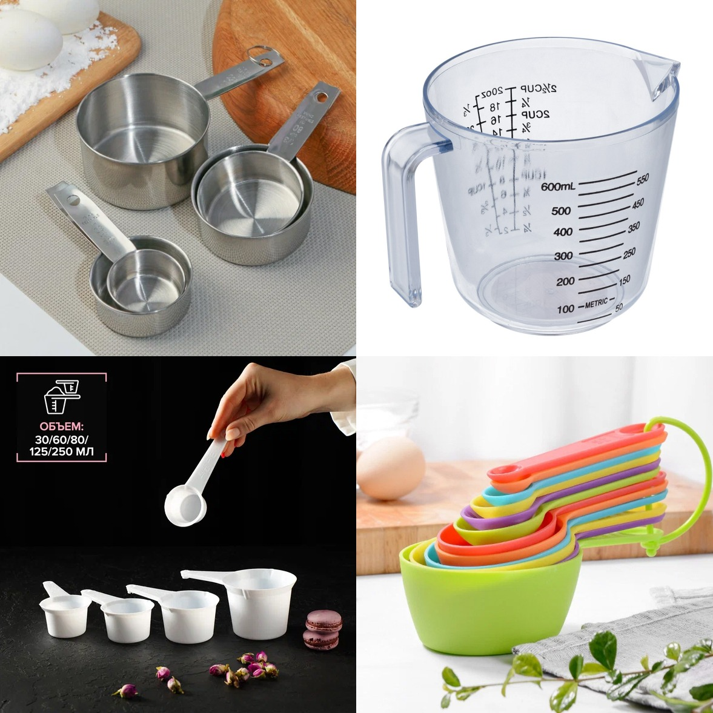
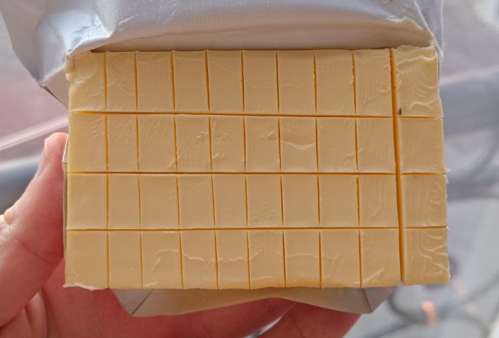

Вы уже умеете считать еду. Теперь пора сделать так, чтобы этим умением не приходилось пользоваться по сорок раз в день.

Цель курса никогда не была в том, чтобы вы быстрее всех взвешивали гречку. Калории нужны, чтобы один раз разобраться в собственной еде, найти работающие количества и потом перевести их в обычные бытовые действия.

В Мастер-классе мы собирали опорные точки: простые, вкусные и полезные приёмы пищи, которые можно регулярно повторять. Здесь не будем заново обсуждать, зачем нужна овсянка, как доводить блюдо до своего вкуса и почему хаос приходится чем-то подпирать.

Сегодня добавляем **количественный слой**:

- точную рассчитанную порцию;
- допустимые замены;
- бытовую меру вместо нового взвешивания;
- правило, по которому вы воспроизводите тарелку;
- личный каталог из 5–10 приёмов пищи.

Не каталог всей еды, которую вы когда-либо видели. Не семейную кулинарную энциклопедию. Пять-десять реально повторяемых тарелок, которые уже существуют в вашей жизни.

## Каталог — это не книга рецептов

Запись «борщ» бесполезна. Борщ бывает на разном мясе, с разным количеством масла, сметаны и хлеба рядом.

Запись «овсянка» тоже ничего не говорит. В одной тарелке хлопья, молоко, творог, яблоко и орехи. В другой — маленький пакет каши и три ложки арахисовой пасты.

Каталог хранит не название блюда, а **конкретный повторяемый приём пищи**.

Например:

> Овсянка: одна моя мерная ёмкость хлопьев, молоко до отметки, одна ёмкость творога, одно среднее яблоко, два грецких ореха. Примерная калорийность — 480–500 ккал.

Или:

> Обед с гуляшом: два моих половника гуляша, одна кружка готового гарнира, половина тарелки овощей. Примерная калорийность — около 600 ккал.

В этих записях уже можно повторить действие. В словах «овсянка» и «гуляш» — нельзя.

## Сколько приёмов пищи нужно

Начните с пяти. Если легко находятся десять — прекрасно.

Больше не запрещено, но не нужно ставить себе задачу каталогизировать вообще всё. Каталог должен сокращать работу, а не становиться второй работой.

Хороший стартовый набор:

- два завтрака;
- два-три обеда;
- два-три ужина;
- два варианта запланированного перекуса;
- один приём пищи для повторяющейся ситуации вне дома.

Это не обязательное распределение. У вас может быть один завтрак и пять ужинов. Может не быть перекусов. Может быть отдельная опорная точка «обед в офисный вторник» или «еда после тренировки».

Выбирайте то, что повторяется, а не то, что красиво смотрелось бы в меню.

## Где искать первые шаблоны

Откройте дневник за последние две-три недели и выпишите приёмы пищи, которые встречались несколько раз.

Спросите про каждый:

- мне действительно нравится это есть;
- могу ли я приготовить или купить это без подвига;
- подходит ли тарелка моей текущей калорийности;
- понимаю ли я её вклад в качество рациона;
- могу ли повторить порцию;
- есть ли ингредиенты, которые каждый раз меняют калорийность вдвое;
- в какой ситуации этот шаблон нужен.

Не тащите в каталог блюдо только потому, что оно «правильное». Если вы ели его два раза и оба раза мечтали о другой еде, оно не станет опорой.

## Сначала один раз считаем точно

Чтобы потом не считать, сначала придётся посчитать.

Для каждой тарелки:

1. Внесите все ингредиенты в приложение.
2. Проверьте карточки продуктов.
3. Если блюдо сложное, создайте рецепт и укажите фактический выход.
4. Соберите обычную порцию.
5. Посмотрите её калорийность и вклад ингредиентов.
6. При необходимости поменяйте не всю тарелку, а один самый влиятельный компонент.
7. Повторите порцию ещё несколько раз.

На этом этапе весы пока нужны. Мы не пытаемся на глаз угадать то, чего ещё не видели.

Смысл в другом: взвешивание должно закончиться **правилом воспроизведения**.

## Вес превращается в бытовую меру

На кухне уже полно измерительных приборов, просто на них не написано «для похудения»:

- кружка;
- стакан;
- половник;
- столовая и чайная ложка;
- контейнер;
- упаковка;
- кусок;
- штука;
- отметка на тарелке;
- ваша обычная горсть;
- количество одинаковых ломтиков.

Подойдёт даже отрезанное донышко бутылки, если оно удобно, моется и каждый раз даёт примерно одну порцию. Я какое-то время пользовался именно таким колхозом. Не обязательно покупать набор из двадцати дизайнерских ложек, чтобы наконец отмерить овсянку.

### Мерная ёмкость

Выберите продукт, который часто отмеряете: хлопья, крупу, молоко, йогурт.

Один раз:

1. поставьте ёмкость на весы;
2. наберите привычное количество;
3. запишите вес;
4. при необходимости сделайте отметку;
5. повторите два-три раза, чтобы понять разброс.

Разные крупы при одинаковом объёме могут весить по-разному. Поэтому нельзя решить, что «эта кружка всегда сто граммов всего». Кружка становится мерой конкретного продукта или заранее проверенной смеси.

### Ложка

Ложкой удобно отмерять масло, сахар, соус, семена и другие небольшие повторяемые добавки.

Важно один раз проверить именно свою ложку и способ набора. Ложка без горки и ложка с горой — два разных действия.

В приложение масло всё равно записывается в граммах. Но на кухне вы можете знать: одна ровная моя ложка — столько-то граммов.

### Упаковка

Иногда лучшая мера уже сделана производителем.

Например:

- одна баночка йогурта;
- половина пачки творога;
- один порционный сыр;
- одна треть упаковки готового продукта;
- два одинаковых хлебца;
- один пакет замороженных овощей на два приёма пищи.

Проверьте массу и этикетку один раз. Если производитель, упаковка или состав поменялись, шаблон нужно сверить заново.

### Штуки

Яйца, киви, мандарины, небольшие одинаковые яблоки и порционные продукты иногда проще считать штуками.

Но сначала посмотрите, насколько они действительно похожи. Яйца одной категории обычно повторяются лучше, чем случайные яблоки размером от теннисного мяча до головы младенца.

### Половник и тарелка

Для супа, гуляша, рагу и других относительно однородных блюд можно один раз посчитать рецепт, затем проверить, сколько граммов в вашем обычном половнике.

Половник не обязан быть точным до грамма. Он должен воспроизводить порцию достаточно стабильно для вашей задачи.

Запись в каталоге выглядит так:

> Один половник гуляша — примерно 180 г и около ___ ккал. Моя порция — два половника.

Если в кастрюле одна баранья нога на ведро бульона, половник не спасёт: компоненты распределены неравномерно. Тогда мясо и жидкую часть лучше учитывать отдельно или заранее делить блюдо на порции.

## Масло кубиками

Сливочное масло удобно разметить прямо в пачке.

Разделите пачку ножом на небольшие одинаковые части, взвесьте один кубик и запомните. Потом используйте один, два или половину кубика.

Не нужно устраивать инженерное производство. На следующей пачке сетка может быть чуть другой. Нам важно убрать бесконтрольное «отрезал сколько получилось», а не получить государственный эталон масла.

## Готовим на один раз, день или два

Простой гарнир не обязательно взвешивать после каждой варки.

Например, вы знаете, сколько сухой крупы нужно на одну порцию.

- Готовите одну порцию — отмерили сухой продукт и съели готовый.
- Готовите две порции — отмерили двойное количество и разделили готовое пополам.
- Готовите на два дня для двух человек — отмерили четыре порции и сразу разложили.

Если сегодня съели чуть меньше, а остаток завтра — сумма за два дня не изменилась. Не нужно переносить три ложки риса через лабораторию, если они всё равно будут съедены вами завтра.

Но это работает, пока кастрюлю не делят пять человек с разными порциями. В таком случае проще взвесить общий выход и свои части либо разложить их заранее.

## Фрукты и отходы

Фрукты неудобны тем, что часть веса не съедается.

Есть два нормальных способа:

1. взвесить съедобную часть;
2. один раз узнать свой средний вес кожуры или сердцевины и вычитать его из целого фрукта.

Второй способ особенно удобен, если яблоко или банан вы будете есть в дороге.

Это должна быть ваша цифра для ваших фруктов и вашей манеры всё обгрызать, а не чужая универсальная таблица огрызков.

## Разрешите шаблону небольшую гибкость

Повторяемый приём пищи не обязан быть копией до последней ягоды.

Разделите его на три части:

- **ядро** — то, что определяет калорийность и функцию тарелки;
- **замены** — продукты с понятным сопоставимым вкладом;
- **свободные добавки** — небольшие изменения, которые не требуют нового полного расчёта.

Пример:

| Часть | Овсянка |
| --- | --- |
| Ядро | мерная ёмкость хлопьев, молоко до отметки, порция творога |
| Замены | яблоко ↔ апельсин; грецкие орехи ↔ заранее посчитанный кусочек шоколада |
| Свободные добавки | корица, сахарозаменитель, немного цедры |

Если вы заменили яблоко на половину банки арахисовой пасты, это не гибкость шаблона. Это новый приём пищи, который нужно посчитать.

## Рецепт с удобной калорийностью на 100 граммов

Иногда сложное однородное блюдо можно один раз подогнать под удобную калорийность на 100 г.

Идея из старого курса называлась «Рецепты за 100»: если блюдо содержит около 100 ккал на 100 г, вес порции почти напрямую показывает калории. 340 г — примерно 340 ккал.

Но ровно сто — не религия.

Суп может быть удобен на 50 ккал/100 г. Другое блюдо — на 150 или 200. Иногда попытка дотянуть рецепт до красивой цифры убивает вкус, и тогда упражнение надо остановить.

Главная польза здесь даже не в арифметическом фокусе. Пока вы меняете пропорции, становится видно, какой ингредиент двигает калорийность сильнее всего.

Например, в салате оливье небольшое изменение майонеза способно повлиять больше, чем заметное изменение огурца. Вы не обязаны после этого готовить «диетический оливье». Вы просто начинаете понимать цену конкретного решения.

## Когда ингредиенты похожи по калорийности

Если большинство компонентов блюда близки по калорийности, их точные пропорции меньше влияют на итог.

Хороший пример — овощной салат без масла. Помидора сегодня чуть больше, огурца чуть меньше, лук нарезали щедро — итог почти не меняется. Масло и плотные топинги считаются отдельно, потому что как раз они могут изменить картину.

Это полезное правило точности:

> Там, где ингредиенты похожи и малокалорийны, можно расслабиться. Там, где небольшой компонент приносит много калорий, нужна повторяемая мера.

## Каталог создаётся вместе с мерой

Не откладывайте перевод в действия на потом.

Плохо:

> Рис с курицей — 560 ккал.

Лучше:

> Одна кружка готового риса + два заранее нарезанных куска курицы + большая горсть овощей + одна ложка соуса — около 560 ккал.

Ещё лучше, если вы допишете:

- какая кружка;
- до какой отметки;
- какого размера куски;
- какой именно соус;
- что можно заменить без нового расчёта;
- когда этот приём пищи используется.

## Карточка приёма пищи

Скопируйте шаблон для каждой позиции каталога.

### Название

Не «завтрак №1», а понятное вам название: «овсянка с яблоком», «офисный обед с шаурмой», «быстрый ужин с гуляшом».

### Ситуация

Когда вы его используете: обычное утро, день в офисе, после тренировки, нет времени готовить, семейный ужин.

### Состав и точная порция

| Компонент | Вес при исходном расчёте | Калории | Бытовая мера |
| --- | ---: | ---: | --- |
|  |  |  |  |
|  |  |  |  |
|  |  |  |  |

### Общий ориентир

- Калорийность порции: ___;
- Размер порции: ___;
- Как собираю без весов: ___;
- Какие замены разрешены: ___;
- После какой замены пересчитываю: ___;

### Проверка качества и удобства

- Мне нравится: да / нужно доработать;
- Готовится за: ___;
- Насыщает до следующего приёма: да / нет / зависит;
- Какие продуктовые категории закрывает: ___;
- Что должно всегда быть дома: ___;

## Пять стартовых карточек: пример набора

Ниже не меню, которое нужно скопировать. Это пример того, насколько разными могут быть шаблоны.

### 1. Завтрак дома

**Овсянка с творогом и фруктом.**

- Мера: одна ёмкость хлопьев, молоко до отметки, половина пачки творога, один фрукт, два ореха.
- Что меняется: фрукт и небольшая сладкая добавка.
- Что не меняется без пересчёта: количество хлопьев, молока и творога.
- Зачем нужен: быстрый первый приём, который закрывает несколько продуктовых категорий.

### 2. Завтрак без готовки

**Йогурт, мюсли, ягоды и бутерброд.**

- Мера: одна баночка йогурта, одна проверенная ложка мюсли, одна горсть ягод, один бутерброд из конкретного хлеба и сыра.
- Что меняется: ягоды ↔ фрукт.
- Когда пересчитать: другая марка мюсли, йогурта или заметно другой хлеб.
- Зачем нужен: запасной вариант, когда нет времени варить.

### 3. Домашний обед

**Курица, крупа и салат.**

- Мера: два одинаковых куска курицы, одна кружка готовой крупы, салат до края свободной половины тарелки, одна ложка заправки.
- Что меняется: вид крупы только после проверки объёма; овощи внутри салата свободнее.
- Когда пересчитать: курица приготовлена с другой частью, кожей или большим количеством масла.
- Зачем нужен: обычный повторяемый обед.

### 4. Покупной приём пищи

**Знакомая шаурма плюс фрукт или овощи.**

- Мера: одна конкретная шаурма из конкретного места, при необходимости заранее выбранная часть порции, один фрукт.
- Что меняется: напиток без калорий.
- Когда пересчитать: другой размер, заведение, соус или состав.
- Зачем нужен: повторяющаяся еда вне дома, когда задача — нормально поесть, а не устроить ресторанный вечер.

Точный состав еды вне дома вы уже разбирали в Мастер-классе. Здесь важно другое: если сценарий повторяется, ему тоже можно дать количественную опору.

### 5. Вечерний перекус

**Йогурт с шоколадом.**

- Мера: одна баночка или одна кружка йогурта, один заранее размеченный кусочек шоколада.
- Что меняется: шоколад ↔ небольшая порция орехов, если обе замены заранее посчитаны.
- Когда пересчитать: есть из общей пачки вместо своей порции.
- Зачем нужен: запланированное завершение дня вместо нескольких случайных подходов к кухне.

Пять карточек уже способны закрыть заметную часть недели. Дальше добавляйте только то, что действительно повторилось. Сам принцип заранее собирать несколько повторяемых вариантов не взят с потолка: [планирование еды связано с более высоким качеством и разнообразием рациона](https://pubmed.ncbi.nlm.nih.gov/28153017/), хотя само по себе такое наблюдение ещё не доказывает причинность.

## Шаблон для семейной еды

Самая частая проблема: вы посчитали свою порцию, но готовите на всех.

Есть три варианта.

### Разложить до подачи

Посчитали общий рецепт, взвесили выход и сразу разложили на четыре контейнера или части.

Это лучший вариант для однородного блюда и семьи, где порции примерно известны.

### Иметь свою меру

Вся кастрюля остаётся общей, но вы знаете, что ваша порция — два половника. Это работает для супа, рагу, гуляша и похожей еды с достаточно равномерным составом.

### Считать компоненты отдельно

Если один забирает из плова в основном мясо, другой — рис, а третий выковыривает морковь, средняя калорийность всей кастрюли хуже описывает каждую тарелку.

Тогда используйте отдельную меру для плотного компонента и общую — для остального либо заранее делите ключевые части.

Не нужно добиваться семейного равенства по граммам. Нужно выбрать метод, который не врёт систематически именно в вашей тарелке.

## Шаблон для еды вне дома

Каталог не обязан заканчиваться у входной двери.

Если вы два раза в неделю едите в одной столовой, найдите несколько повторяемых комплектов:

- суп + кусок хлеба + йогурт;
- мясо + конкретный гарнир + овощная нарезка;
- определённый бургер + фрукт + напиток без калорий;
- готовый салат + дополнительный белковый продукт.

Один раз разберите порядок калорийности, сохраните разумную оценку и дальше не устраивайте расследование каждую среду.

Если порции заведения заметно гуляют, сохраните диапазон, а не одну точную цифру. Бытовое правило может звучать так:

> Выбираю один из трёх комплектов, соус беру отдельно, напиток без калорий. Если порция явно больше обычной, оставляю часть или учитываю верхнюю границу.

Это тоже шаблон действий.

## Что делать с заменами

Замена считается удобной, когда она сохраняет хотя бы две вещи:

- общий порядок калорийности;
- функцию продукта в приёме пищи.

Если творог заменили на сопоставимую порцию йогурта, функция может сохраниться. Если на шоколад — калории можно подогнать, но тарелка уже работает иначе.

Не пытайтесь создать таблицу всех возможных замен во вселенной. Для каждой карточки достаточно двух-трёх тех, которыми вы реально пользуетесь.

| Что меняю | На что | Как сохраняю порцию |
| --- | --- | --- |
| Яблоко | апельсин | одна штука сопоставимого размера |
| Гречка | рис | отдельная проверенная отметка на кружке |
| Орехи | шоколад | один заранее посчитанный кусочек |

Если новая замена начинает появляться каждую неделю, посчитайте её один раз и официально добавьте. Не держите постоянное исключение «на глаз».

## Что чаще всего ломает каталог

### Слишком много карточек

Человек вдохновляется, выписывает сорок рецептов, устает на шестом и больше не открывает файл. Начните с пяти. Только после использования добавляйте следующую.

### Карточки из желаемой, а не реальной жизни

Каталог состоит из киноа, запечённой рыбы и салатов, а человек реально ест макароны, пельмени и бизнес-ланчи. Сначала оцифруйте то, что уже повторяется. Потом улучшайте по одному шаблону.

### Нет меры

Калорийность посчитана, но каждый раз всё снова взвешивается. Карточка не готова, пока у неё нет бытового действия.

### Слишком свободная «гибкость»

Яблоко меняется на банан, орехи на пасту, творог на сыр, а шаблон всё ещё хранит старые калории. Определите ядро, допустимые замены и точку пересчёта.

### Порция не насыщает

Математически тарелка подходит, но через час снова хочется есть. Не держитесь за красивую цифру. На следующем материале проверьте состав, объём и место этого блока в дне.

### Ингредиенты заканчиваются

Самый прекрасный шаблон не работает, если дома никогда нет половины состава. Добавьте продукты в постоянный список закупки и имейте один запасной вариант.

## Пример карточки с гуляшом

**Ситуация:** быстрый ужин после работы.

**Исходный расчёт:** один раз посчитан весь рецепт гуляша, взвешен выход, определена калорийность половника. Гарнир и овощи считаются отдельно.

| Компонент | Исходная порция | Бытовая мера |
| --- | ---: | --- |
| Гуляш | 360 г | два моих половника |
| Готовая крупа | 170 г | одна кружка до отметки |
| Овощи | 250 г | заполнить оставшуюся часть большой тарелки |
| Соус | 15 г | одна ровная ложка |

**Правило:** два половника гуляша, одна кружка гарнира, овощи до края свободной части тарелки, одна ложка соуса.

Если гуляш приготовлен по другому рецепту, карточка не притворяется действующей. Новый рецепт один раз пересчитывается.

## Не убирайте весы слишком рано

Старая версия курса предлагала довольно быстро переводить большую часть еды на глаз. Сейчас мы сделаем аккуратнее.

Бытовая мера считается готовой, когда:

- вы несколько раз собрали её с весами;
- разброс не меняет решение;
- вы не начали незаметно насыпать всё более щедро;
- продукт или рецепт остаётся тем же;
- порция действительно насыщает и помещается в ваш план.

После этого знакомую тарелку можно собирать без весов. Но неизвестная еда, новый рецепт и изменившаяся упаковка снова временно возвращаются в учёт.

Это не шаг назад. Так и должен работать инструмент.

## Проверка шаблона

Раз в несколько недель или при заметном расхождении модели соберите один знакомый приём пищи на глаз, а потом взвесьте.

Не чтобы поймать себя на преступлении. Чтобы убедиться, что ваша кружка всё ещё означает то, что вы думаете.

Если порция немного гуляет, а вес и питание остаются управляемыми, ничего исправлять не надо.

Если каждый месяц «одна ложка» становится всё больше, правило нужно обновить или выбрать меру с физической границей.

## Задание

1. Откройте дневник и выберите пять повторяемых приёмов пищи.
2. Один раз точно рассчитайте каждый.
3. Для каждого найдите бытовую меру.
4. Запишите допустимые замены.
5. Два-три раза соберите тарелку с весами и проверьте воспроизводимость.
6. Добавьте в каталог только те варианты, которые реально готовы повторять.

:::note
**Результат материала**

У вас есть личный каталог из 5–10 рассчитанных приёмов пищи. У каждого — конкретная порция и бытовое правило: упаковка, кружка, ложка, половник, количество кусков или понятная сборка тарелки.
:::

В следующем материале мы разложим по блокам уже не только состав тарелки, но и весь день: куда уходят калории, где появляется голод, чем запланированный перекус отличается от кусочничества и почему вечерний дожор часто начинается ещё утром.

## Источники

- [Meal planning is associated with food variety, diet quality and body weight status in a large sample of French adults](https://pubmed.ncbi.nlm.nih.gov/28153017/)
- [Healthy habits: efficacy of simple advice on weight control based on a habit-formation model](https://pubmed.ncbi.nlm.nih.gov/18071344/)
- [Portion-controlled meals provide increases in diet quality during weight loss and maintenance](https://pubmed.ncbi.nlm.nih.gov/25664818/)
- [What helps to form a healthy nutrition habit? Daily associations of intrinsic reward, anticipated regret, and self-efficacy with automaticity](https://pubmed.ncbi.nlm.nih.gov/35580819/)
