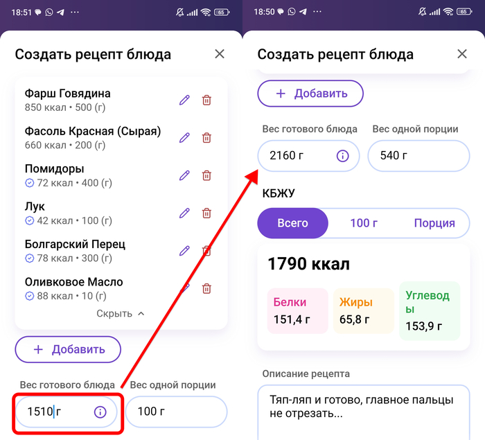
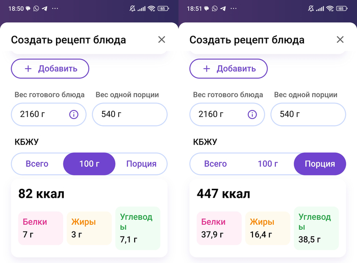

Чаще всего человек бросает учёт не на морковке и не на «Сникерсе». Там всё просто: взвесил, нашёл, записал.

Проблемы начинаются возле беляша без этикетки, тарелки с пятью продуктами и общей кастрюли, из которой сегодня поел ты, завтра ребёнок, а послезавтра кто-то заботливо долил воды. В этот момент кажется, что считать калории могут только люди, которым больше нечем заняться.

На самом деле почти вся бытовая еда укладывается в пять сценариев. К каждому нужен свой способ записи — не идеально лабораторный, а достаточный для конкретной задачи.

1. Еда вне дома или продукт без этикетки.
2. Отдельный продукт или продукты, собранные на тарелке.
3. Разовое сложное блюдо.
4. Повторяемое блюдо, которое готовится и съедается за один раз.
5. Блюдо на несколько дней или людей, где важны усушка и уварка.

Если пока непонятно, к какому сценарию относится ваша еда, не пытайтесь угадать правильное название блюда. Ответьте на три вопроса:

1. Я знаю фактический состав и вес?
2. Я съем всё приготовленное сам и за один раз?
3. Я буду готовить это ещё раз примерно в тех же пропорциях?

| Что происходит | Как считать |
| --- | --- |
| Состав неизвестен, еда куплена вне дома | Найти несколько похожих вариантов, выбрать разумную оценку и пометить её |
| На тарелке лежат отдельные продукты | Внести каждый продукт отдельно |
| Блюдо сложное, но разовое | Внести ингредиенты отдельно и не сохранять рецепт |
| Рецепт повторяется, вся порция съедается целиком | Сохранить фиксированную основу или собственный продукт |
| Из общей кастрюли берут разные порции | Создать рецепт, указать вес готового блюда и взвешивать каждую порцию |

Иногда один приём пищи требует сразу двух способов. Например, вы точно знаете вес домашней крупы и мяса, а соус взяли в кафе. Крупу и мясо записываете точно, соус — оценкой. Не надо из-за одного неизвестного компонента превращать всю тарелку в неизвестность.

Перед тем как переходить дальше, откройте приложение. Этот материал лучше читать не как приключенческий роман, а сразу с телефоном и кухонными весами.

:::note [Важно]
На этом этапе мы учимся считать еду, а не исправлять рацион. Даже если в процессе вы увидите странную порцию или очень калорийный рецепт, сначала нормально запишите его. Разбирать, что с ним делать, будем дальше.
:::

## 1. Еда вне дома или продукт без этикетки

Начните с самого точного варианта: спросите.

В ресторанах, кафе, на фудкортах и в гипермаркетах часто можно узнать вес порции, состав и калорийность. При покупке выпечки и кондитерских изделий эта информация тоже обычно где-то есть — у сотрудника, в технологической карте, на сайте или в приложении заведения. Если данных нет, разброс действительно может быть большим: [даже внешне похожие ресторанные блюда заметно различаются по фактической калорийности](https://pubmed.ncbi.nlm.nih.gov/23700076/).

Если узнать не получилось, ищем похожий продукт и делаем разумную оценку. Не надо устраивать расследование на три часа, но и первый вариант из базы брать нельзя. Там легко встретить домашний ПП-беляш на 114 ккал рядом с нормальным беляшом, который даже внешне вдвое тяжелее.

В старом материале я искал средний вес беляша с мясом. По разным запросам выпадало примерно от 80 до 120 граммов, а калорийность гуляла ещё сильнее.

В такой ситуации порядок следующий:

1. Найдите несколько значений веса обычной порции.
2. Найдите несколько вариантов калорийности на 100 г.
3. Сравните описание с тем, что лежит перед вами.
4. Если продукт явно жирный, берите значение ближе к верхней границе; если выглядит суше и легче — ближе к нижней.
5. Запишите выбранное значение и отметьте, что это оценка.

Почему я предлагаю смотреть прежде всего на жирность? Потому что [в расчётах пищевой ценности грамм белка и углеводов даёт по 4 ккал, а грамм жира — 9 ккал](https://docs.cntd.ru/document/902320347/titles/8P20LS).

Это не превращает вас в передвижную лабораторию. Но если с беляша стекает масло, брать самый низкокалорийный вариант из базы — довольно смелый способ договориться с реальностью.

Если еда из одного места повторяется регулярно, один раз разберите её подробнее. Купите обычный заказ, принесите домой и посмотрите, сколько там булки, мяса, соуса и других крупных частей. Делать так с каждой ресторанной тарелкой не нужно. А вот заказ, который появляется у вас несколько раз в месяц, уже стоит одного вечера любопытства.

:::note [Рабочий принцип]
Неизвестная калорийность — не повод сделать вид, что еды не было. Внесите разумную оценку и пометьте её. Пустое место в дневнике почти всегда хуже честного приблизительного значения.
:::

## 2. Отдельный продукт или собранная тарелка

С отдельными продуктами всё скучно — и это прекрасно.

Морковь, яблоко, пустой рис, шоколадный батончик: взвешиваете съедобную часть, находите продукт и заносите фактический вес. Для упаковки сначала сверяете карточку приложения с этикеткой. Если данные расходятся, верьте упаковке и создавайте собственный продукт.

Собранная тарелка считается точно так же, просто записей будет несколько. Например:

- 140 г готовой крупы, для которой вы заранее знаете калорийность.
- 120 г приготовленного мяса.
- 180 г овощей.
- 15 г соуса.
- 8 г семян или орехов.

Не надо превращать это в «гречку с курицей» из общей базы, если вы знаете составляющие. В чужой карточке может быть другая часть курицы, другое количество масла и совсем другая порция.

Разница между цельным продуктом и продуктом в упаковке простая. Для яблока нам обычно хватает среднего значения из базы. Для конкретной гранолы, котлет, сыра или мороженого бренд и рецепт могут заметно менять цифры — там нужна этикетка.

## 3. Разовое сложное блюдо

Сложное блюдо — это всё, что состоит хотя бы из двух значимых ингредиентов. Даже овсянка на молоке уже сложное блюдо.

Я категорически против выбирать в базе абстрактную «овсяную кашу на молоке». Я добавляю хлопья и молоко в одной пропорции, вы любите жидкую кашу и делаете в другой, третий человек незаметно положил туда масло и сахар. Название одно, а внутри три совершенно разные истории.

Если вы готовите блюдо редко и съедаете его сейчас, не создавайте большую систему. Просто внесите ингредиенты отдельно:

- Хлопья.
- Молоко.
- Фрукты.
- Шоколад.
- Орехи.

Так же считается бутерброд, салат, домашний бургер или тарелка с йогуртом и добавками. Один раз записали по частям — и забыли.

Если половина вашего рациона состоит из новых сложных блюд, которые каждый раз приходится разбирать заново, проблема уже не в приложении. Это хороший повод постепенно найти несколько повторяемых оснований: знакомый завтрак, один омлет, понятный суп, любимую шаурму. Но полный каталог такой еды мы будем собирать позже. Сейчас достаточно увидеть, где у вас каждый день начинается новая бухгалтерия.

## 4. Повторяемое блюдо на один раз

«Повторяемое» означает, что вы знаете состав и воспроизводите примерно те же пропорции. «На один раз» — что блюдо или его фиксированная часть съедается целиком, поэтому нам не нужно вычислять калорийность произвольных 100 граммов из общей кастрюли.

Это может быть:

- Домашняя шаурма.
- Омлет из постоянного набора продуктов.
- Йогурт с орехами и шоколадом.
- Порционная выпечка.
- Основа завтрака, к которой каждый день добавляется что-то новое.

В моей овсянке такой основой могут быть хлопья, молоко и творог. Состав базы не меняется, а сверху сегодня появляются яблоко и орехи, завтра — ягоды и печенье. В дневнике это выглядит не как семь заново введённых ингредиентов, а как **«моя овсянка» + сегодняшние добавки**.

Другой пример — омлет из яиц, творога, небольшого количества муки и сыра. Сам омлет повторяется. Овощи, фрукт и десерт рядом меняются.

Для такой базы можно создать собственный продукт с готовыми КБЖУ одной фиксированной порции.

Ключевое условие: вы действительно повторяете рецепт. Если вчера было два яйца и 20 г сыра, а сегодня четыре яйца, 60 г сыра и масло «на глаз», старая карточка уже не описывает новое блюдо.

Если готовите одинаковую основу сразу на двух-трёх человек и делите поровну, сначала считайте весь состав, затем делите итог на число равных порций. Но как только люди берут разное количество или блюдо остаётся на завтра, начинается следующий сценарий.

## 5. Блюдо на несколько дней или людей

Допустим, вы готовите чили с говядиной на всю семью на несколько дней. Здесь будут усушка, утруска, доедание остатков и, возможно, человек, который решил снять пробу пять раз подряд.

Как посчитать и не сойти с ума?

### Шаг 1. Взвесить посуду

Сначала взвесьте пустую кастрюлю или форму и запишите её вес. Не надейтесь, что вспомните его после приготовления.

### Шаг 2. Внести все ингредиенты

Добавляйте продукты в сухом или сыром виде — в том виде, для которого берёте данные с упаковки или из базы. Фасоль из банки учитывайте по данным банки и фактическому съедобному весу. Масло, соус и другие калорийные жидкости тоже входят в рецепт.

Вода калорий не добавляет, но меняет вес готового блюда. Поэтому её количество можно не превращать в отдельную пищевую ценность, однако итоговый вес после приготовления нам всё равно понадобится.

### Шаг 3. Взвесить готовое блюдо

После приготовления взвесьте кастрюлю целиком и вычтите вес пустой посуды. Получится вес готового блюда.

В приложении этот вес указывается в поле **«Вес готового блюда»**.

### Шаг 4. Сохранить результат

Приложение рассчитает общую калорийность, калорийность 100 г и выбранной порции.

Теперь каждый человек может положить себе любое количество. Вы взвешиваете свою готовую порцию и добавляете её как вес уже сохранённого блюда.

### Зачем вообще нужен вес после приготовления

Калории не испаряются вместе с водой. Вес — меняется.

Возьмём старый пример плова:

- Говядина — 250 г, 467,5 ккал.
- Рис — 500 г, 1720 ккал.
- Лук — 150 г, 70,5 ккал.
- Морковь — 150 г, 48 ккал.
- Подсолнечное масло — 15 г, 135 ккал.
- Чеснок — 75 г, 107 ккал.
- Вода — 1000 г, 0 ккал.

Общая калорийность — около 2548 ккал, исходный вес вместе с водой — 2140 г.

До приготовления это примерно:

`2548 ÷ 2140 × 100 = 119 ккал на 100 г`.

После приготовления часть воды испарилась, и готовое блюдо стало весить 1850 г. Калорий осталось столько же:

`2548 ÷ 1850 × 100 = 138 ккал на 100 г`.

В старой версии этого примера результаты стояли наоборот. Здесь математика исправлена: когда вода уходит, калорийность 100 граммов **увеличивается**, потому что те же калории распределяются по меньшему весу.

:::note [Формула]
Калорийность 100 г готового блюда = общая калорийность всех ингредиентов ÷ вес готового блюда × 100.
:::

Для салата, где ничего заметно не испарилось и не добавилось, разница между исходным и готовым весом может быть несущественной. Для супа, плова, тушёного мяса, запеканки и любой большой кастрюли итоговый вес лучше внести.

## Один день — пять способов записи

Разберём не отдельные правила, а обычный день, в котором они встречаются вперемешку.

### Завтрак: повторяемая основа и разные добавки

Каждое утро вы готовите одну и ту же овсянку: 50 г хлопьев, 150 г молока и 100 г творога. Это сохранённая основа. Сегодня сверху добавили 120 г яблока и 12 г орехов — их записали отдельно. Завтра будут ягоды и кусок шоколада — основа останется прежней, поменяются только добавки.

Если молока сегодня стало вдвое больше, а вместо творога появился йогурт, не надо убеждать приложение, что это та же самая овсянка. Либо исправьте сохранённый рецепт на этот день, либо внесите ингредиенты отдельно. Смысл шаблона — сокращать повторяющуюся работу, а не защищать старую цифру от реальности.

### Обед: тарелка из готовых компонентов

На обед лежат 160 г готовой гречки, 130 г курицы, 200 г овощей и 18 г соуса. Если гречка и курица уже сохранены как ваши готовые блюда, просто внесите четыре позиции с фактическим весом.

Не создавайте рецепт «мой обед», если завтра гречки будет 90 г, курицы — 180 г, а вместо соуса появится сыр. Здесь повторяется идея тарелки, но не её состав. Готовые компоненты удобнее оставить отдельными: тогда дневник показывает, что именно изменилось.

### Перекус: продукт без этикетки

Коллега принёс кусок домашнего пирога. Вес можно узнать, рецепт — уже нет. Взвесьте кусок, найдите несколько похожих пирогов и выберите не самый приятный, а самый похожий вариант. Если пирог явно масляный, с орехами и плотной начинкой, карточка «лёгкий яблочный пирог» не подойдёт только потому, что там меньше калорий.

В комментарии оставьте: «домашний пирог, оценка». Если потом выяснится рецепт, запись можно уточнить. Если не выяснится, она всё равно останется полезнее пустого места между обедом и ужином.

### Ужин: семейная кастрюля

На ужин приготовили рагу на два дня. Здесь нельзя заранее поделить продукты на четыре порции, если никто не собирается накладывать их по линейке.

Порядок такой:

1. Взвесить пустую кастрюлю.
2. Внести сырое мясо, овощи, масло, соус и другие ингредиенты.
3. После приготовления взвесить кастрюлю ещё раз.
4. Вычесть вес посуды и указать вес готового рагу.
5. Взвесить собственную порцию и внести её из сохранённого рецепта.

Завтра рагу станет гуще или кто-то добавит немного воды. Если изменение заметно, лучше снова узнать общий вес или хотя бы отметить, что расчёт стал приблизительным. Калории в кастрюле не появились, но их распределение на 100 г изменилось.

### Чай: мелочь, которая повторяется

В чай ушли две ложки сахара, рядом — три печенья. Это не сложное блюдо и не повод создавать рецепт «вечерний чай». Сахар и печенье записываются отдельно.

Если такой чай повторяется каждый вечер, сохраните набор для скорости, но не склеивайте его с ужином. Иначе через неделю будет невозможно понять, что именно происходило вечером: большой ужин, напиток, печенье или всё сразу.

:::note [Что здесь важно]
Мы не искали один волшебный способ считать всю еду. Мы выбрали самый простой способ для каждого объекта: повторяемую основу сохранили, тарелку разобрали, неизвестное оценили, кастрюлю рассчитали по готовому весу, мелочи записали отдельно.
:::

## Когда сохранённый рецепт уже нельзя использовать

Собственный рецепт не становится правильным навсегда только потому, что вы однажды аккуратно его посчитали.

Пересчитайте или создайте новый вариант, если:

- заметно поменялись пропорции основных ингредиентов;
- вместо нежирного продукта появился более жирный или наоборот;
- добавилось масло, сыр, сливки, орехи или другой калорийный компонент;
- блюдо стало сильно гуще или жиже;
- вы начали готовить в другой посуде и больше не знаете итоговый вес;
- прежняя карточка описывает порцию, а теперь рецепт делится между несколькими людьми.

Небольшие изменения не требуют каждый раз строить новый космодром. Пять граммов яблока не превращают кашу в новое блюдо. А дополнительные 40 г орехов превращают — хотя внешне миска называется так же.

Если у блюда есть два постоянных варианта, сохраните оба: например, «овсянка обычная» и «овсянка выходного дня», «чили постное» и «чили с сыром». Две честные карточки удобнее одной усреднённой, которая не совпадает ни с одним реальным рецептом.

## Крупы, макароны и мясо после приготовления

### Крупы

Если варите сухую крупу только себе на один раз, можно внести сухой вес и затем съесть всю приготовленную порцию. Вода ничего не добавит к калорийности.

Если готовите общую кастрюлю на несколько дней, узнайте калорийность именно вашей готовой крупы. Внесите сухую крупу, масло и другие добавки, после приготовления укажите итоговый вес. Сохраните как собственное блюдо — и дальше взвешивайте уже готовую порцию.

Соотношение воды имеет значение не потому, что вода «добавляет калории», а потому, что 100 г более разваренной и менее разваренной крупы будут содержать разное количество сухого продукта.

### Макароны

Логика та же. Самый простой сценарий — взвесить сухую порцию и приготовить её целиком. Для общей кастрюли используйте рецепт с сухим весом и итоговым весом готовых макарон, особенно если добавляете масло или соус.

### Мясо и птица

Сырое и приготовленное мясо — ещё один вариант той же задачи. Вы покупаете продукт сырым, он теряет воду при приготовлении, а порцию взвешиваете уже готовой.

Если готовите всю упаковку на несколько дней:

1. Внесите сырой вес мяса и всё добавленное масло.
2. Приготовьте.
3. Взвесьте готовое мясо.
4. Сохраните результат как собственное блюдо.
5. В следующие дни добавляйте фактический вес готовой порции из этого рецепта.

Не ищите каждый раз чужую «куриную грудку жареную». Вы не знаете, сколько воды потерял чужой кусок и сколько масла было на чужой сковороде.

## Что делать с маслом, соусами и «мелочами»

Масло, орехи, семечки, шоколадная присыпка, сахар в напитках и соусы легко исчезают из памяти, но не из блюда. Особенно в начале их нужно учитывать отдельно.

Тут не требуется ловить каждую молекулу. Смысл в другом: проверить, это действительно была капля масла или «капля» весом в столовую ложку.

Зелень, специи и некалорийные добавки можно не превращать в отдельный проект, если их вклад ничтожен. Но одинаковый объём петрушки и кунжута — не одно и то же. Смотрите не на размер щепотки, а на то, что именно вы насыпали.

## Сначала усложняем, потом упрощаем

В начале это может выглядеть как гимнастика для пальцев и калькулятора. Так и есть.

Но мы делаем это не потому, что от неучтённых десяти калорий случится катастрофа. Мы знакомимся с продуктами, рецептами и собственными порциями. После нескольких повторений вам уже не нужно каждый раз заново вычислять омлет, кашу, крупу или семейную кастрюлю: они сохранены.

> Сначала мы максимально всё усложняем, чтобы лучше изучить логику подсчётов и сами продукты, а потом начинаем упрощать, чтобы не сойти с ума. Не наоборот.

## Практика после материала

Посчитайте по одному примеру каждого сценария:

1. Еду вне дома или продукт без этикетки — с пометкой, что это оценка.
2. Тарелку из нескольких отдельных продуктов.
3. Разовое сложное блюдо по ингредиентам.
4. Повторяемую фиксированную порцию и сохраните её.
5. Общее блюдо с весом пустой посуды и готового результата.

Не обязательно съедать всё это за один день. Цель — один раз пройти каждый путь руками, чтобы следующий беляш или кастрюля плова не выглядели как основание удалить приложение.

## Источники

- [ТР ТС 022/2011 «Пищевая продукция в части её маркировки». Приложение 4. Коэффициенты пересчёта энергетической ценности](https://docs.cntd.ru/document/902320347/titles/8P20LS)
- [The Energy Content of Restaurant Foods Without Stated Calorie Information](https://pubmed.ncbi.nlm.nih.gov/23700076/)
- [Measured energy content of frequently purchased restaurant meals: multi-country cross sectional study](https://pubmed.ncbi.nlm.nih.gov/30541752/)
- [Accuracy of the Atwater factors and related food energy conversion factors with low-fat, high-fiber diets when energy intake is reduced spontaneously](https://pubmed.ncbi.nlm.nih.gov/18065582/)
