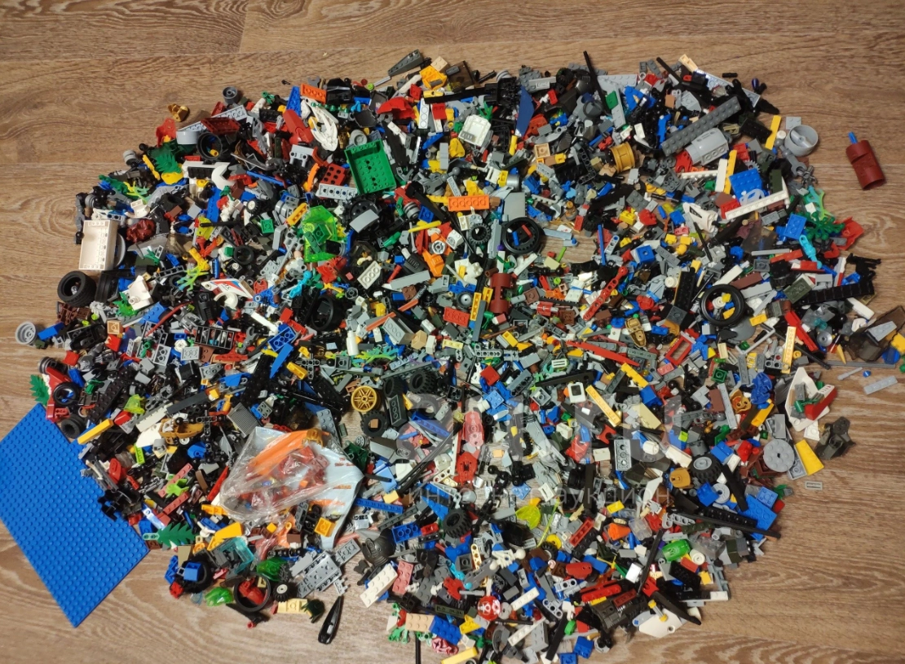

Когда я смотрю дневники людей, которые успешно худеют и потом удерживают результат, у них очень часто встречаются две общие характеристики.

Первая — они могут достаточно долго питаться примерно одной и той же едой. Не в смысле, что всю жизнь едят один суп, а в том, что у них есть небольшой набор привычных завтраков, обедов и ужинов, вокруг которых строится питание.

Вторая — у этих приёмов пищи есть более-менее понятный ритм. Не обязательно по минутам и не обязательно из какой-то высокой осознанности. Иногда просто потому, что на работе можно поесть только в определённое время. Но между едой есть понятные промежутки, а кусочничество не происходит непрерывно.

И вот почему это важно. Два человека могут съедать одинаковые 1900 ккал и проживать совершенно разные дни.

Первый нормально завтракает, обедает, ужинает и оставляет место для запланированного десерта.

Второй до четырёх часов держится на кофе, потом съедает огромный «перекус», вечером пытается быть молодцом, а перед сном доедает всё, что не было прикручено к холодильнику.

Сумма может совпасть. Переносимость, голод и вероятность повторить такой день — нет.

Поэтому сегодня смотрим не только **сколько**, но и **куда по дню ушли калории**.

## Не существует правильной частоты еды для всех

Три приёма пищи не обладают магией. Пять тоже не разгоняют метаболизм.

Перекусы не становятся полезными только потому, что там орехи. И не становятся вредными просто по факту существования.

Частота еды — это способ организовать свой день.

Рабочий вариант отвечает трём условиям:

- вы попадаете в нужное среднее потребление;
- голод остаётся предсказуемым и переносимым;
- схема повторяется в вашей реальной жизни.

У кого-то это три больших приёма. У кого-то два основных и два перекуса. У кого-то четыре примерно равных блока. В контролируемом сравнении [восемь небольших приёмов не уменьшали аппетит по сравнению с тремя](https://pubmed.ncbi.nlm.nih.gov/26561409/), поэтому нам не нужно выиграть спор о режиме. Нам нужно собрать ваш.

## Зачем делить день на блоки

Когда питание хаотично, оно похоже на огромную гору LEGO.

Представьте, что у вас есть «Сокол тысячелетия» из 7451 детали. Вы раздобыли новый радар, пару пушек и закрылки. В собранном корабле вы видите, что заменить, а потом сразу понимаете, стало лучше или хуже.

А теперь попробуйте добавить те же детали и оценить результат, когда вся конструкция выглядит так:

Это всё ещё тот же набор деталей. Белок где-то был, овощи тоже, калории в среднем посчитаны. Но что именно менять и помогло ли изменение — хрен поймёшь.

Блоки не делают питание идеальным. Для начала они просто собирают его в форму, которую уже можно анализировать, настраивать и улучшать.

Блок — это отдельный приём пищи или группа еды с одной задачей:

- завтрак;
- обед;
- ужин;
- запланированные перекусы;
- вечерняя еда, если она у вас регулярно существует.

Если у вас два основных приёма или четыре — ничего страшного. Названия нужны не для соблюдения этикета, а чтобы увидеть структуру.

Круассан с кофе на 500 ккал через четыре часа после завтрака — это не «маленький перекус». По функции и размеру это ещё один основной приём пищи. Называть его перекусом можно, но анализировать тогда неудобно.

## Сначала разложите фактический день

Возьмите 3–4 обычных дня из дневника. Не лучший день для отчёта и не воскресенье после свадьбы.

Для каждой еды запишите:

- время;
- калорийность;
- что это было;
- голод перед едой;
- сытость после;
- что происходило вокруг;
- была ли еда запланирована;
- когда снова появился голод.

Шкалу голода и сытости вы уже проходили в Мастер-классе. Здесь не нужно заново учиться различать все оттенки. Используйте её как измерение рядом с калориями.

## Карта ритма дня

| Время | Блок | Калории | Голод до | Сытость после | Следующий голод | Событие и задача |
| --- | --- | ---: | --- | --- | --- | --- |
|  |  |  |  |  |  |  |
|  |  |  |  |  |  |  |
|  |  |  |  |  |  |  |

Заполните такую таблицу минимум для трёх дней.

Не пытайтесь сразу исправлять. Сначала найдите повтор.

## Пример: вечерний дожор начинается утром

Выдуманный день:

| Время | Что произошло | Калории | Голод до | Что было дальше |
| --- | --- | ---: | --- | --- |
| 08:30 | кофе и маленький йогурт | 180 | 4 | к 11:00 сильный голод |
| 11:20 | печенье у коллег | 240 | 2 | голод приглушился ненадолго |
| 14:30 | салат и суп | 420 | 2 | торопился, белка мало |
| 17:00 | орехи «полезный перекус» | 260 | 3 | съел из пачки, порцию не планировал |
| 20:30 | ужин | 650 | 1–2 | ел быстро, остановиться трудно |
| 22:30 | сладкое и остатки ужина | 430 | голода почти нет | хотелось наконец получить удовольствие |

Можно посмотреть только на последние 430 ккал и решить: проблема в отсутствии силы воли вечером.

Но весь день готовил этот вечер:

- завтрак почти не дал еды;
- первый перекус появился уже на сильном голоде;
- обед был небольшим и быстрым;
- орехи добавили калорий, но не решили задачу;
- к ужину человек пришёл на уровне, где особенно осознанно выбирать трудно;
- удовольствие весь день откладывалось на потом.

Поэтому эксперимент «просто не есть после девяти» здесь слабый. Он убирает последний симптом и оставляет весь механизм.

## Перекус и кусочничество

И то и другое происходит между основными приёмами пищи. Но функции разные.

### Перекус

Запланирован заранее и решает понятную задачу:

- помогает спокойно дотянуть до позднего ужина;
- поддерживает энергию в длинном рабочем промежутке;
- закрывает умеренный голод;
- помещает любимое лакомство в день без ощущения запрета;
- добавляет продуктовую категорию, которой иначе не хватает.

Вы знаете, что именно съедите, примерно когда и чем это поможет.

### Кусочничество

Еда возникает по ходу дела:

- печенье к случайному чаю;
- конфета, потому что угостили;
- остатки детской еды;
- кусочки во время готовки;
- горсть орехов из открытой пачки;
- покупка на кассе;
- «только попробовал» несколько раз.

Задача придумывается уже после: «мне, наверное, нужна была энергия».

Главное отличие не в продукте. Шоколад может быть запланированным перекусом. Морковка может быть кусочничеством.

:::note
**Проверка:** если бы вы заранее знали про эту еду и спокойно внесли её в структуру дня — это перекус. Если она появилась сама и вы только потом объяснили зачем — скорее всего, кусочничество.
:::

## Полезный перекус тоже приносит калории

Орехи, сухофрукты, хлебцы и сыр могут быть хорошими продуктами. Но слово «полезный» не делает порцию невидимой.

Несколько горстей орехов между обычными обедом и ужином легко добавляют заметную часть дневной калорийности. При этом человек не считает их отдельным приёмом пищи, потому что «это же для здоровья».

Вопрос не «можно ли орехи». Вопрос: **какую задачу они сейчас выполняют и какую часть дня занимают?**

Если перекус помогает держать план и не приходить к ужину в состоянии «сейчас съем стол», оставляйте. Если он просто добавился поверх прежних порций, его полезность не отменяет сумму.

## Запланированный перекус может убрать переедание

В одной истории девушка старалась не есть после шести. Несколько дней держалась, потом вечером переедала чем попало, снова ужесточала правило и повторяла круг.

Мы добавили ей запланированный второй ужин. Формально еды стало больше: появился новый приём пищи. Фактически среднее потребление уменьшилось, потому что исчезла часть хаотичных вечерних эпизодов.

Вот почему запрет перекусов сам по себе ничего не решает. Иногда именно перекус создаёт структуру.

## Что искать в распределении калорий

### Очень маленькое начало дня

Не все обязаны плотно завтракать. Но если маленький завтрак изо дня в день приводит к сильному голоду, случайной еде и большому вечеру, это не личная особенность характера. Это проверяемая связь.

### Огромный разрыв между едой

Длинный промежуток сам по себе не проблема, если вы переносите его спокойно и потом едите управляемо.

Если к концу промежутка появляется слабость, раздражительность и желание съесть всё быстро, возможно, вам нужен другой размер предыдущего блока, запланированный перекус или другое время еды.

### Калории есть, насыщения мало

Кофе с сиропом, выпечка, орехи, сладкие напитки и небольшие плотные продукты могут набрать значительную сумму, но не дать того объёма и процесса еды, которых человек ожидал. В контролируемом исследовании сочетание [высокой калорийной плотности и высокой скорости еды заметно увеличивало количество съеденных калорий](https://pubmed.ncbi.nlm.nih.gov/40516651/).

Не делайте вывод, что эти продукты запрещены. Посмотрите, с чем они стоят рядом и какую функцию должны были выполнить.

### Вся вкусная еда оставлена на вечер

Если днём вы питаетесь только «правильно», а вечером наконец разрешаете себе нормальный вкус, дожор может решать не только физиологический голод.

Добавьте часть удовольствия в более ранние приёмы. Сладкое может стоять рядом с основной едой, а не ждать момента, когда весь контроль уже закончился.

### Перекусы не видны как блок

Пять маленьких эпизодов могут выглядеть незначительно по отдельности. Сложите их в одну строку «все перекусы за день» и сравните с обедом.

Иногда окажется, что человек съел второй полноценный обед, только кусочками и без ощущения, что поел.

## Не начинайте с универсальной схемы

В старом курсе был пример: завтрак 450, обед 450, ужин 550, перекусы 150 и вечерняя еда 200 ккал.

Это был пример, а не правильное распределение.

В новом курсе стартуем от факта. Сначала считаем, как калории распределены сейчас. Потом меняем один блок под конкретную проблему.

Если ваш завтрак 700 ккал и после него вы спокойно живёте до позднего обеда, не нужно уменьшать его ради симметричной таблицы.

Если ужин 800 ккал, но весь день устойчив, общее среднее подходит, а вечер не превращается в потерю контроля, большая цифра сама по себе не приговор.

## Один эксперимент, а не новый режим жизни

Выберите повторяющуюся проблему и одну гипотезу.

### Проблема: сильный голод перед ужином

Возможные гипотезы:

- мал обед;
- обед плохо насыщает;
- слишком длинный промежуток;
- после тренировки нужен отдельный перекус;
- весь дневной план слишком низкий;
- мало сна и нагрузка нетипичная.

Не проверяйте всё сразу.

Эксперимент может выглядеть так:

> Три дня добавляю к обеду рассчитанную порцию гарнира, общую калорийность дня не меняю: убираю ту же сумму из хаотичных вечерних перекусов. Смотрю на голод перед ужином и вечернюю еду.

Или:

> Четыре рабочих дня ставлю запланированный перекус в 17:00 и уменьшаю на сопоставимую сумму ужин. Проверяю, прихожу ли домой спокойнее.

## Четыре типичных карты дня

### Карта 1. Большой завтрак работает

Человек ест около 650 ккал утром, потом спокойно доживает до позднего обеда и не кусочничает.

Проблемы нет. Не нужно уменьшать завтрак до «правильных» 400 ккал только потому, что он выглядит большим.

Проверяем лишь, помещаются ли остальные блоки и повторяется ли день.

### Карта 2. Калории размазаны

Основные приёмы небольшие, зато между ними семь эпизодов по 80–200 ккал. К концу дня человек не может сказать, когда был сыт, а когда ел по привычке.

Первый эксперимент — не обязательно убрать всю еду между приёмами. Сложите её в один блок и выберите два понятных перекуса из того, что уже было. Остальное три дня только отмечайте.

Задача — превратить россыпь в конструкцию.

### Карта 3. Тренировочный день

В обычный день обед и ужин работают. После вечерней тренировки появляется сильный голод и дополнительная еда.

Не делайте вывод, что тренировки мешают худеть. Сравните:

- что было до тренировки;
- сколько времени прошло после еды;
- какова нагрузка;
- уменьшились ли шаги в остальной день;
- является ли вечерняя еда хаотичной или повторяемой.

Экспериментом может стать один рассчитанный приём до или после тренировки, а не запрет на вечерний голод.

### Карта 4. Выходной без структуры

Будни повторяются, а в выходной завтрак поздний, затем несколько совместных чаепитий, доставка и еда под фильм.

Не нужно делать субботу копией рабочего дня. Найдите одну опору:

- знакомый первый приём;
- заранее выбранный ресторанный сценарий;
- одна порция еды под фильм вместо общей упаковки;
- запланированное место сладкого.

Иногда одной опоры достаточно, чтобы выходной остался свободным, но перестал быть невидимым для модели.

## Как оценивать голод без нового культа цифр

Шкала нужна, чтобы сравнивать похожие ситуации, а не чтобы найти идеальную оценку.

Полезнее написать:

> Три дня подряд через два часа после этого обеда голод возвращается и к ужину становится сильным.

Чем спорить с собой, это была двойка или тройка.

Фиксируйте:

- когда голод появился;
- насколько быстро рос;
- мешал ли работать;
- привёл ли к незапланированной еде;
- чем отличался день;
- повторилось ли это.

Если сигнал появляется один раз после бессонной ночи, это контекст. В рандомизированном перекрёстном исследовании [ограничение сна усиливало голод и увеличивало потребление энергии из перекусов](https://pubmed.ncbi.nlm.nih.gov/37562755/). Если один и тот же сигнал появляется после одного и того же обеда четыре раза — уже гипотеза.

## Физиологический голод, аппетит и задача еды

В Мастер-классе вы уже разбирали физиологический и эмоциональный голод. Здесь добавляем калорийный вопрос: **какой блок способен решить именно эту задачу?**

Физиологический голод после длинного промежутка вряд ли удовлетворит одна конфета. Желание сладкого после сытого ужина не обязательно требует второго полноценного ужина.

Иногда человеку нужны обе вещи: нормальная еда и вкусное завершение. Тогда лучше собрать их вместе, чем сначала пытаться задавить голод маленькой сладостью, а потом всё равно поесть.

Перед незапланированной едой спросите:

- я сейчас физически голоден;
- мне нужен конкретный вкус;
- я устал и хочу сделать паузу;
- еда просто находится перед глазами;
- предыдущий блок был слишком маленьким;
- это повторяющееся время и ему нужен план.

Ответ не запрещает есть. Он помогает выбрать еду, которая действительно выполнит задачу.

## Почему запрет кусочничества не всегда срабатывает

Если кусочничество — следствие скуки и доступной еды, изменение среды может помочь сразу.

Если оно компенсирует недобор нормальной еды, просто убрать кусочки значит усилить голод.

Если это единственный разрешённый источник удовольствия, запрет добавит ещё больше напряжения.

Поэтому последовательность такая:

1. увидеть эпизоды;
2. сложить их калории;
3. определить повторяющуюся функцию;
4. решить: убрать, перенести, объединить в перекус или усилить основной приём;
5. проверить несколько дней.

Не нужно объявлять каждую конфету вредной привычкой до анализа.

### Проблема: кусочничество во время готовки

Эксперимент:

> Три дня фотографирую и записываю всё, что пробую во время готовки. Перед готовкой ем запланированный фрукт с йогуртом, если действительно голоден. Проверяю, исчезли ли случайные кусочки.

### Проблема: вечернее сладкое растягивается на несколько подходов

Эксперимент:

> Заранее выбираю одну порцию сладкого и ем её вместе с ужином или сразу после. Остальное не запрещаю навсегда, но убираю с видного места. Проверяю, нужен ли через час второй заход.

## Ритм — это не расписание по секундомеру

Понятный ритм означает, что у еды есть примерное место и функция.

Он может сдвигаться из-за работы, семьи и поездок. Не обязательно завтракать в 08:02 всю оставшуюся жизнь.

Полезно знать:

- какой приём пищи обычно первый;
- после какого блока чаще появляется голод;
- где нужен запасной вариант;
- какая еда должна быть доступна в дороге;
- что происходит в тренировочный день;
- чем выходной отличается от буднего;
- в какой момент чаще всего начинается кусочничество.

Чем меньше решений приходится принимать уже голодным, тем легче системе работать.

## Нужно ли создавать «окно голода»

В старой версии курса я предлагал специально выделять длинный промежуток без еды и учиться доходить к его концу до определённого уровня голода.

Сейчас я не хочу выдавать эту схему за обязательный маршрут для всех. Вам не нужно выдерживать шесть-восемь часов без еды, отказываться от перекусов или подгонять день под интервальное голодание только потому, что так красивее выглядит система.

Но полезную часть этой идеи можно взять и без методики целиком:

- заранее понимать, когда будет следующая еда;
- наблюдать, как развивается голод;
- не размазывать случайную еду по всему дню;
- подготавливать следующий приём до того, как голод станет неуправляемым;
- сравнивать ощущения с фактической калорийностью.

Если длинный промежуток вам естественно удобен и не приводит к перееданию, не нужно его ломать. Если он делает день хуже, терпеть ради красивой системы тоже не нужно.

От интервального голодания нам здесь нужна одна здравая идея: когда у еды появляются понятные границы, её проще планировать и анализировать. Ограниченное окно может кому-то помогать именно за счёт структуры и меньшего количества решений. Но оно не отменяет общую калорийность, качество питания и переносимость.

Поэтому один график я вам продавать не буду. У вас уже есть более точный инструмент — карта собственного дня.

## Как выходить к ужину без атаки на холодильник

Если вы регулярно приходите домой очень голодным, подготовьте ужин заранее.

- Выберите блюдо, которое можно разогреть или собрать за 10–15 минут.
- Не начинайте готовить сложный рецепт, стоя рядом с открытой едой на сильном голоде.
- Сразу соберите весь приём пищи, чтобы видеть его объём.
- Если пауза из Мастер-класса вам помогает, используйте её.
- Оставьте возможность для заранее выбранной вечерней еды, если она реально нужна.

Сильный голод не делает вас плохим человеком. Но он ухудшает условия для тонких решений. Лучше изменить условия, чем ежедневно проверять силу воли.

## Вечерняя еда: запланировать или убрать

Иногда после ужина человек действительно снова голоден. Иногда ему хочется вкуса, отдыха, завершения дня или привычного ритуала.

Не надо заранее объявлять любой второй ужин срывом.

Сделайте его отдельным блоком и посмотрите:

- как часто он появляется;
- есть ли физиологический голод;
- сколько калорий туда уходит;
- что было в ужине;
- хватает ли удовольствия в дне;
- не слишком ли рано заканчивается основная еда;
- не является ли этот блок серией случайных подходов.

Запланированный вариант легче анализировать, чем «по чуть-чуть до сна».

Например: греческий йогурт с фруктом и небольшим количеством шоколада, творог с ягодами, попкорн и фрукт, обычный бутерброд, который заранее помещён в день. Конкретный продукт выбирается по вашей задаче, а не по списку разрешённого.

## Управление средой

Не ставьте себя в обстоятельства, где удержаться от случайной еды — ежедневный подвиг.

- Не ходите в магазин очень голодным.
- Используйте список.
- Не покупайте недельный запас любимого продукта, если он стабильно заканчивается за два дня.
- Не вываливайте сладкое на самое видное место только потому, что конфетница красивая.
- Держите доступной еду, которая входит в ваши шаблоны.
- Подготовьте запасной приём пищи для дня, когда план развалился.
- Разложите рассчитанные перекусы порциями, если из общей пачки мера исчезает.

Это не бегство от еды и не запрет. Это нормальная организация условий.

## Разбор трёх дней

После заполнения карт ответьте:

1. Какие блоки повторяются?
2. Где калорийность сильнее всего гуляет?
3. После какой еды голод приходит слишком быстро?
4. В какой момент вы чаще всего едите незапланированно?
5. Есть ли один «перекус», который по размеру является основным приёмом?
6. Сколько калорий суммарно приходится на кусочничество?
7. Что происходит перед вечерним дожором?
8. Отличаются ли рабочие и выходные дни?
9. Как влияют тренировки и недосып?
10. Какой один эксперимент даст самый понятный ответ?

## Не оценивайте день только по сумме

После разбора может оказаться, что средняя калорийность уже подходит. Тогда задача не «срезать ещё», а сделать ту же сумму удобнее.

Перенести часть еды из вечера в обед. Собрать случайные кусочки в один перекус. Добавить к маленькому приёму объём и белковый продукт, убрав сопоставимую калорийность из добавки, которая почти не насыщала.

А может быть наоборот: распределение выглядит разумно, но вся сумма слишком мала и поэтому любой график заканчивается сильным голодом. Тогда перестановка блоков не исправит исходный дефицит — нужно вернуться к карточке этапа 4.

Карта ритма нужна не для того, чтобы обязательно найти ошибку. Иногда она подтверждает, что текущая система уже работает и её лучше оставить в покое.

## Карточка эксперимента с распределением

| Поле | Что записать |
| --- | --- |
| Проблема | Конкретный повтор: сильный голод, кусочничество, вечерний дожор |
| Наблюдение | В какие дни и после какого блока возникает |
| Гипотеза | Одно наиболее вероятное объяснение |
| Что меняю | Один блок, время, состав или заранее выбранный перекус |
| Что не меняю | Общую калорийность, активность и остальные блоки — насколько возможно |
| Срок | 3–7 сопоставимых дней |
| Что оцениваю | Голод, фактические калории, вечернюю еду, удобство |
| Решение после | оставить / отменить / изменить и повторить |

:::note
**Результат материала**

У вас есть карты ритма нескольких дней и один эксперимент с распределением калорий. Он решает конкретную проблему, а не заставляет всех питаться одинаковое количество раз.
:::

В следующем материале будем выключать постоянный учёт. Не одним прыжком «теперь питаюсь интуитивно», а по лестнице: сначала знакомые шаблоны, потом только неизвестная еда, контрольные дни и заранее определённые причины снова временно включить цифры.

## Источники

- [Higher Eating Frequency Does Not Decrease Appetite in Healthy Adults](https://pubmed.ncbi.nlm.nih.gov/26561409/)
- [Irregular meal-pattern effects on energy expenditure, metabolism, and appetite regulation: a randomized controlled trial in healthy normal-weight women](https://pubmed.ncbi.nlm.nih.gov/27305952/)
- [Effects of sleep restriction on food intake and appetite under free-living conditions: A randomized crossover trial](https://pubmed.ncbi.nlm.nih.gov/37562755/)
- [The Effect of Energy Density and Eating Rate on Ad Libitum Energy Intake in Healthy Adults—A Randomized Controlled Study](https://pubmed.ncbi.nlm.nih.gov/40516651/)
