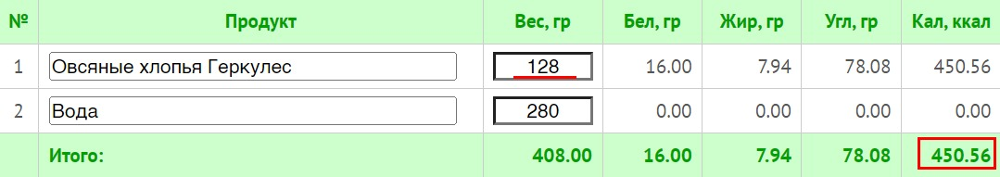
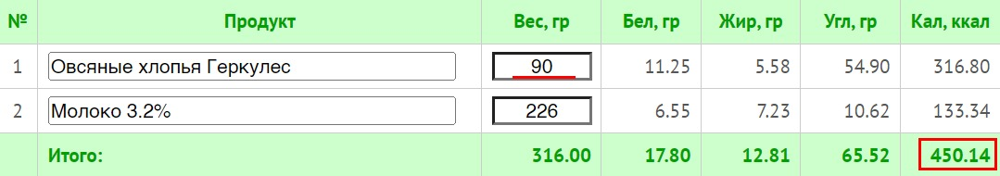
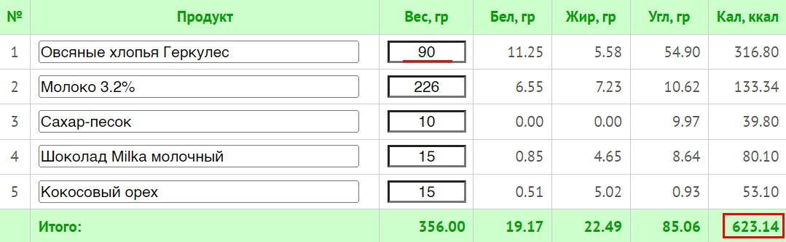
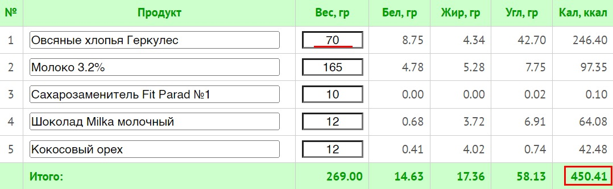
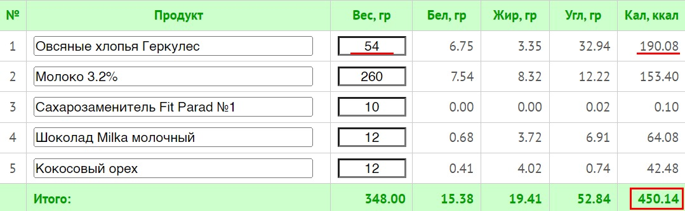

# Общие принципы составления меню и рецептов

> Исходник Tilda: курс 425521, лекция 7058441  
> Раздел: Часть 1. Потребление калорий  
> Статус на 2026-08-28: Опубликовано  
> Режим: архивная копия без содержательной редактуры. Порядок блоков сохранён; точная блочная топология находится в `raw-blocks.json`.

---

**Во-первых,** составление меню, как бы странно вам ни показалось — далеко не первая вещь, которой следует заняться. Эта процедура может подождать ещё пару недель как минимум.

**Во-вторых,** нам не нужны две крайности: ни рацион с креветками, единорогами и радугой, взятый из головы, ни готовое меню, скачанное из интернета, даже если оно от уважаемого человека и на нем написано "для похудения".

**В-третьих**, всегда присутствует вариант вообще не составлять меню, а питаться "пока не закончатся калории". То есть вы просто вносите в приложение все, что съедаете и когда приближаетесь к норме, то включаете режим "интервального голодания" до следующего солнцеворота.

Я не поддерживаю последний способ в долгосрочной перспективе, но на первых этапах так будет легче познакомиться со своим рационом. А главное, понять, на каких привычных продуктах вы перебираете. Да и легче это, чем сразу садиться за чистый лист и рисовать там свои представления о правильном питании.

По идее, через несколько дней вы интуитивно придете к тому, что будете растягивать вашу +/- норму до вечера, именно для этого я и настаиваю первые 1-2 недели не требовать от себя строгого **соблюдения **калорийности, тем более что мы пока даже не определили её. Но настаиваю на строгом **подсчете**.

**Подводя итог:** составив самостоятельно меню с нуля, можно очень сильно и больно оторваться от реальности, а чужой готовый рацион может не подходить под вашу личную калорийность, вкусы или потребности в нутриентах. Поэтому я рекомендую начать с сокращения порций вашей привычной еды и очень плавно заменять некоторую часть из нее на более полезные и здоровые блюда/продукты. Это по сути то, чем мы начали заниматься в первой части Мастер-класса. Но это долгая дорога))

В долгосрочной перспективе выгоднее иметь хоть примерный план питания. Он может выглядеть как полностью прописанное меню со всеми приемами пищи и перекусами на день, так и лишь в виде некоторых опорных точек. Но оба варианта требуют времени на то, чтобы их проработать.

### Где планировать свой рацион?

Напомню главную идею этого курса — калории нужно считать не для того, чтобы похудеть, а для того, чтобы приобрести навыки управления питанием, которые потом будут помогать худеть без учета калорий. 

Поэтому планирование как целого меню так и отдельных рецептов и подгонка этих рецептов под нужные калории — это основа вашего обучения. Планировать рацион можно и в тетрадке в клеточку и в гугл табличке, но есть полезный сайт [Calorizator.ru](https://calorizator.ru/), где это всё в 100 раз удобнее. Я человек-компьютер — пользуюсь им очень активно и вам советую, потому что такого функционала нигде не встречал в бесплатном доступе.

Планировать рацион в приложении — совершенно не удобно. Я сейчас тестирую новое отечественное приложение и если они примут все мои правки, то там это будет делать удобно. Но пока все приложения по учету калорий заточены, чтобы просто записывать еду. А это лишь часть того, чем мы будем заниматься. 

В своей работе я иногда использую [Health-diet.ru](https://health-diet.ru/), но там без 100г не разберешься, нужен хоть и дешевый, но всё же платный аккаунт, поэтому для "домашнего" использования я бы советовал только FatSecret и [Calorizator.ru](https://calorizator.ru/).

### Как составить свое личное меню

**Шаг №1. Выбираем основу рациона**

- Если вы хорошо (качественно) питались до этого , то возьмите за основу текущий рацион. Это одна из причин, почему я настаиваю первые 1-2 недели считать рацион, который был "до" похудения, чтобы его можно было хоть как-то оценить.
- Если питались относительно плохо, но уже прошли мой Мастер-класс по организации качественного питания, то уже знаете, что из вашей "базы" нужно убрать, а что добавить, осталось подогнать калорийность.
- В крайнем случае можно взять за основу один из готовых рационов. Любой, что встретите в интернете и он будет близок к вашим целевым цифрам калорийности. Точность чужих подсчетов и детальный выбор блюд нам не важны, все равно вы будете переписывать его чуть менее чем полностью, нам нужна лишь отправная точка.

**Никогда не начинайте планировать просто с чистого листа, ничего хорошего и долгосрочного из этого не выйдет, поверьте моему опыту.*

Сейчас наша задача некоторое время питаться привычным для вас способом, не переедая, но и не недоедая. Поэтому пока стоит использовать эту инструкцию, прежде всего чтобы просто поиграться с составлением меню и понять как меняются цифры от изменений конкретных блюд и замены продуктов. А использовать эту последовательность действий для снижения калорийности мы будем через недельку. Пока ваша задача поиграться с калоризатором и понять как всё устроено.

**Шаг №2. Заносим в калоризатор один конкретный день. **

Берем рацион, который вы будете модифицировать можете взять что-то из своего дневника, заносим его в калоризатор в разделе ["Анализатор продуктов"](https://calorizator.ru/analyzer/products) и видим там удобное отображение всех параметров — вес, калории БЖУ. Если вы использовали за основу текущий рацион, в котором присутствуют сложные блюда, то не стоит вносить их в калоризатор по запчастям (морковка, лук, картошка и пр.).

Вносите сразу как "плов", главное — подберите из списка то, что будет совпадать с калорийностью на 100гр готового продукта лично вашего "плова", даже если придется выбрать не совсем плов. Старайтесь, чтобы разница была не более пары процентов, чтобы не накапливать сильную погрешность.

В готовых рационах часто отсутствуют сладости, либо используются разные ПП-заменители со спорным вкусом, и специально заниженными цифрами калорийности. Поэтому вам их стоит добавить сладкое/вкусное самостоятельно и желательно на свой вкус, потому что, например, я — хз, что вам нравится, а добавлять сладости, которые вам не нравится, даже звучит как-то тупо. В итоге смотрим, что получается, и делаем выводы.

**У нас есть 3 действия на выбор: **

- Полностью убрать один из продуктов/блюд;
- Добавить новый дополнительный продукт, можно даже сладости в разумных пределах;
- Заменить продукт на похожий (белок на белок, углевод на углевод, одну крупу на другую и т.д.), но с сохранением примерного веса и калорийности;
- Оставить продукт, но уменьшить вес порции.

*Соответственно, в зависимости от того надо ли вам снизить калорийность меню или повысить, вы делаете одно или несколько из этих действий. *

**Например**

Изначально у нас был +/- попсовый рацион на 1500 ккал. Линиями отделены приемы пищи для наглядности. Завтрак/полдник/перекус(яблоко)/ужин/перекус.

Жиров маловато.

Хотя бы несколько раз вы должны посмотреть на свой план питания именно вот в таком виде, а не по факту на цифру калорийности в приложении по итогам дня. Тут вы ещё на что-то влияете. Вечером в конце дня -- уже нет.

Но нам нужен рацион, допустим, на 1768 ккал. Тогда к завтраку мы положим кусок сладкого рулета вместо груши, в обед уменьшим на самую малость гречку и рыбу, добавим второе яблоко на перекус, увеличим количества сыра и хлеба на ужин и засунем куда-то 10г миндаля. В процессе сверяемся с минимальными потребностями в белках и жирах, если все оk, то в итоге получились искомые 1766ккал. Ювелирной точности не нужно, это лишь пример, главное, чтобы по итогу недели выходил целевой калораж.

Вас не должно удивлять, что мы заменили грушу на сладкий рулет, потому что в данной ситуации вред от нескольких грамм сахара будет гораздо меньше, чем вред от недоедания, которое рано или поздно приведет к срыву. Причем часто срывы бывают такими, что несчастный рулетик на 133 ккал покажется безобидной шалостью. Короче, мыслите дальновидно. В итоге получилось вот так вот:

По жирам на волоске, но в рамках нормы

**Шаг №3. Финализируем.**

**Прогнав так через калоризатор несколько вариантов своих или чужих меню у вас, может получиться:**

- Набор стандартизированных приемов пищи, на которые будет приходиться основная нутриативная польза, и которые будете чередовать изо дня в день (например используя конструктор). А остаток калорийности набирать ситуативно, чем получится, не планируя ничего заранее, выбирая из того, что подвернется под руку, пока не кончится калорийность на день. Это называется метод свободных калорий.

**или**

- Несколько шаблонов (хоть три, хоть 23) на целый день от корки до корки так, чтобы был минимум свободы для маневра и максимум понимания, что вас ждет дальше.

Любой из этих вариантов или их комбинация сильно упростят вам не только головную боль по поводу "что приготовить", но и учет калорий в приложении, так как у вас уже будут готовые калорийности собственных блюд, останется только взвесить.

Поздравляю, вы только что сами составили себе меню для похудения!

### Как есть сладкое и худеть

Ну или хотя бы не толстеть. Для этого нужно всего два пункта:

1. Считаем калории;
2. Едим, что хотим.

**А теперь чуть подробней, на примере моей любимой овсянки: **

Пустыми овсяными хлопьями долгой варки на воде без сахара можно пытать людей. Снимаю шляпу перед теми, кто имеет выдержку так питаться регулярно и даже получать какое-то удовольствие (ну или делать вид, что получают). Давайте начнем с такого варианта...

Дано: мы решили, что завтрак должен быть, например, на 450 ккал, чтобы он хорошо вписывался в дневное потребление.

**Ситуация #1 **— Я ❤️ ПП

Приятного аппетита, он тут точно пригодится

**Ситуация #2.**

А если я хочу хотя бы на молоке? — Тогда нужно уменьшить количество хлопьев, чтобы калорийность осталась той же.

Уже лучше

**Ситуация 3.**

Всё! я так больше не могу хочу вкусную и сладкую кашу со всеми ништяками.

Упс...

**Ситуация 4. **

Я все ещё хочу вкусную кашу, но, наверное, сахар можно убрать, полностью заменив на сахарозаменитель, его привкус на фоне шоколада и кокоса будет незаметным. Ещё уменьшу количество хлопьев и положу на пару грамм меньше топингов.

Идеально!

**Ситуация 5. **

Все здорово, но мне не нравится каша в соотношении 1 к 1 с молоком, я хочу более жидкую!

Ну такое...

В таком сценарии овсяная каша занимает лишь 40% калорийности в "овсяной" каше. Не то что бы это сильно плохо, но и шикарным завтраком уже тоже не назовешь. Однако если такой прием пищи будет умещаться в вашу дневную норму и именно он поможет придерживаться плана в долгую, то никаких проблем.

Не фокусируйтесь на пункте, где я уменьшил кокос и шоколад на несчастные 3г — это лишь иллюстрация принципа управления своим рационом.

Надеюсь, теперь вы понимаете, почему я не поддерживаю идею готовых рационов (как тех, которые привозят, так и тех, которые вы сами готовите по чужому готовому меню). В питании так много индивидуальных вкусов и переменных, что нет другого выхода, как экспериментировать самостоятельно. 

Ведь с овсянкой можно кушать фрукты, овощи на завтрак, можно добавлять в нее протеиновый порошок или подавать с яйцом (яичница, скрэмбл, вареное). И каждый из этих вариантов можно уместить в **любую **выбранную калорийность. Ограничениями в виде "нельзя" здесь и не пахнет — наслаждайтесь!

В этом примере мы подгоняли то блюдо, которое хотим под рамки конкретного приема пищи, но точно по такому же принципу можно управлять и всем своим рационом на горизонте дня/недели, встраивая в него все, что хочется.

