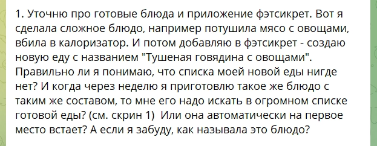
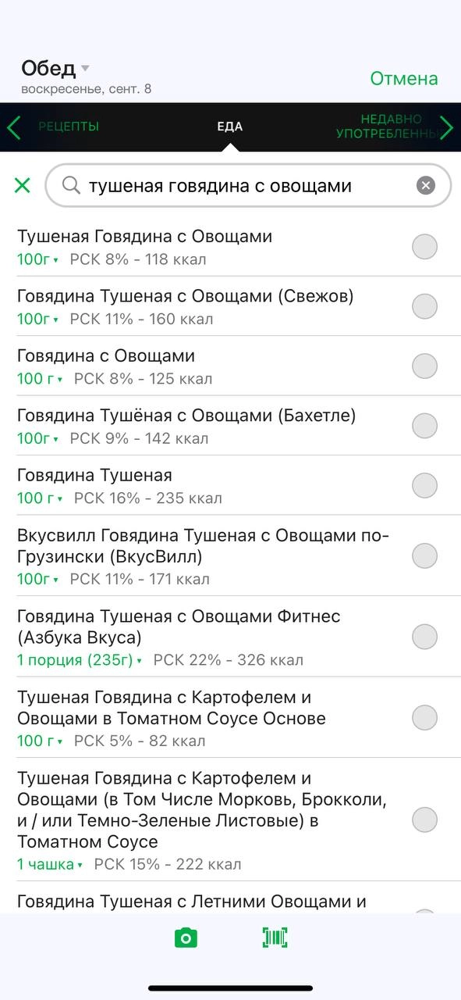
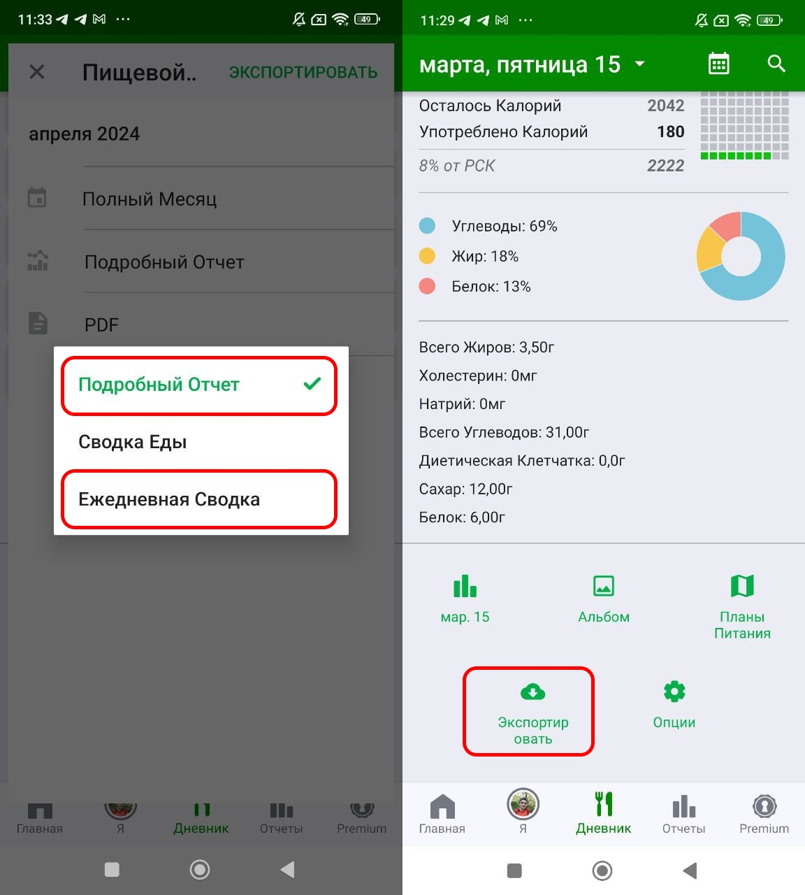
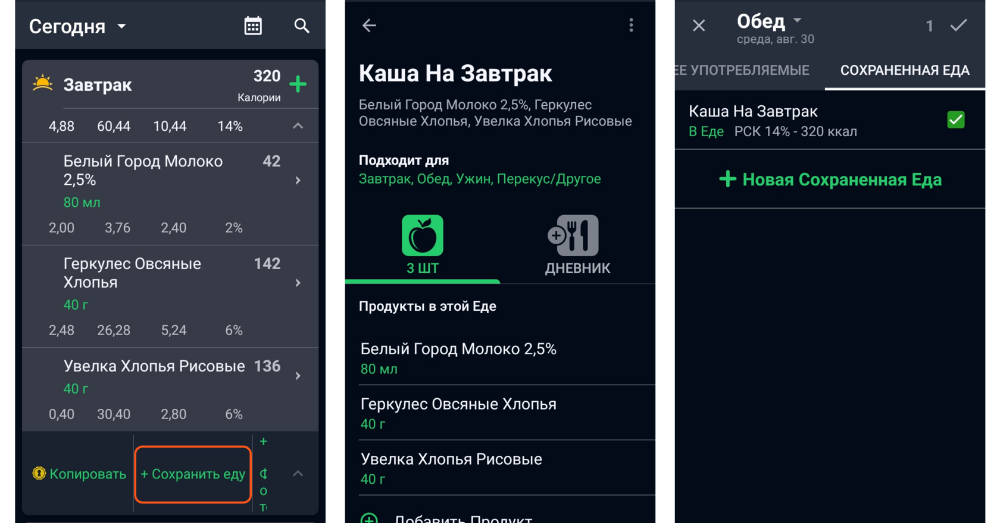
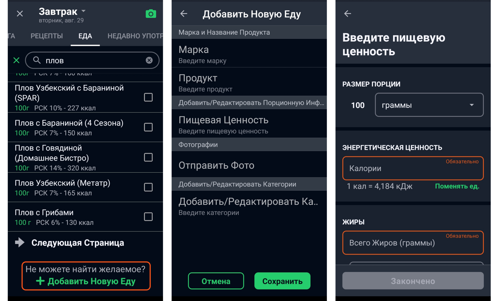
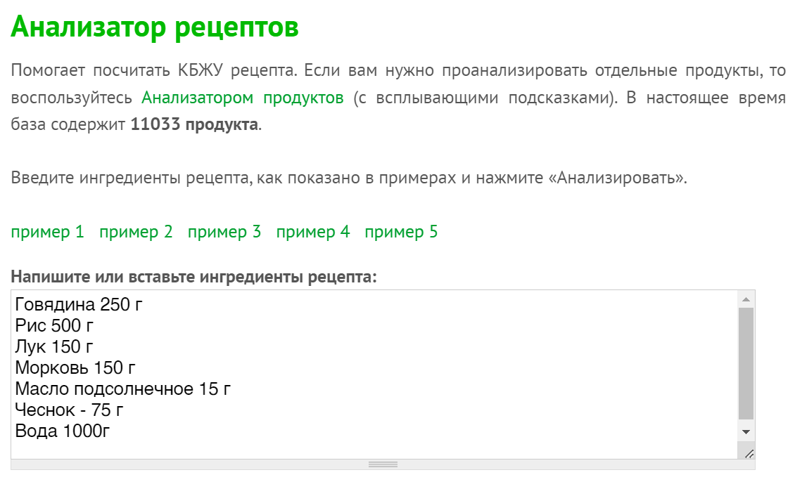
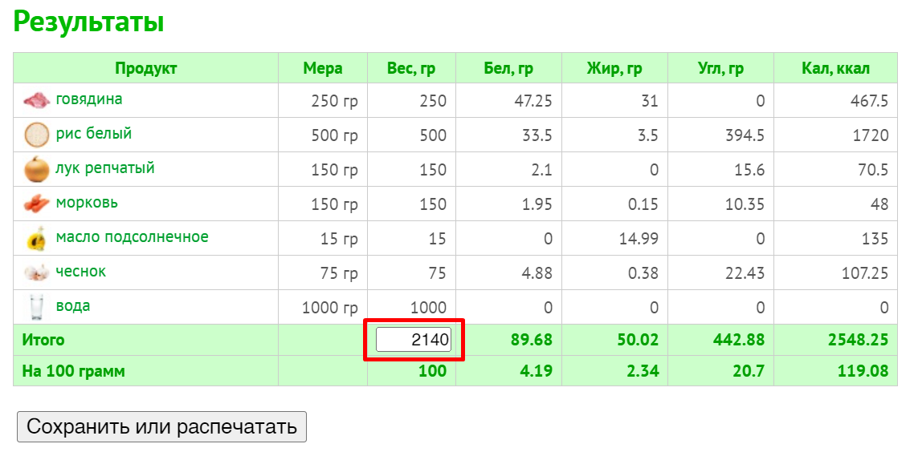

# Как правильно пользоваться приложением. И каким?

> Исходник Tilda: курс 425521, лекция 7058293  
> Раздел: Часть 1. Потребление калорий  
> Статус на 2026-08-28: Опубликовано  
> Режим: архивная копия без содержательной редактуры. Порядок блоков сохранён; точная блочная топология находится в `raw-blocks.json`.

---

### Куда записывать?

Можно хоть в столбик на бумаге (это не шутки), в гугл-таблицах (кстати, удобно), но для среднестатистического человека — лучше в приложении. Приложений много, самые популярные FatSecret, My Fitness Pal и YAZIO.

Кстати, в столбик на бумаге — это действительно не шутка, я так иногда для себя делаю, когда возвращаюсь к учету калорий, это быстрее и удобнее. Я совсем не использую приложение и могу достаточно точно знать, сколько калорий потребляю, но это потом, об этом мы поговорим через пару недель.

Но вернемся к приложениям. В YAZIO нельзя создать свои блюда и удобно выгружать отчеты в удобном виде, чтобы я мог их увидеть. А еще там куча рекламы. My Fitness Pal — не совсем заточен под российские продукты. Раньше я рекомендовал всем FatSecret, потому что это тупо самое популярное приложение. Но потом оно немного сломалось...

А потом FatSecret перестал делать выгрузку калорий в пдф, начал страшно глючить и вообще с ростом количества клиентов у меня накопилась целая жалобная книга к этому приложению. Вот вам просто для примера, какие иногда нужны костыли. Ну а если пользутесь фэтсикретом, то ловите лайфхак.

**Был такой вопрос:**

В таком случае стоит к названию вашего рецепта приписывать приставку с вашим номером из Мастер-класса или любое другое трехзначное или четырехзначное число и тогда вы точно не потеряете и сможете найти именно ваше "тушеное мясо 6661" среди сотен других рецептов. Просто вбивая в поиск ключевое слово и ваши цифры.

## Альтернатива

И тут как кстати мне написали отечественные разработчики со своим приложением. Протестировав его пару недель я могу смело его рекомендовать. А если они примут все правки что я им написал — вообще буду готов набить ссылку с их приложением у себя на лбу.

Приложение называется «Худеем вместе» и название — пожалуй единственная его слабая сторона)) 

Скачать можно в [AppStore](https://apps.apple.com/ru/app/%D1%81%D1%87%D0%B5%D1%82%D1%87%D0%B8%D0%BA-%D0%BA%D0%B0%D0%BB%D0%BE%D1%80%D0%B8%D0%B9-%D1%85%D1%83%D0%B4%D0%B5%D0%B5%D0%BC-%D0%B2%D0%BC%D0%B5%D1%81%D1%82%D0%B5/id889574511), [Google Play](https://play.google.com/store/apps/details?id=ru.hudeem.adg&hl=ru), [RuStore](https://www.rustore.ru/catalog/app/ru.hudeem.adg). Для тех, кто напрягся — расслабьтесь, приложение бесплатное и ссылке не реферальные. Мне оно реально просто нравится. 

**Самые главные плюсы, которые я выписал: **

1. Очень удобный экспорт истории дневника. Вы даже не представляете как это важно!!! И какая это теперь редкость. Это обязательное условие, если вы худеете вместе со мной, но даже если сами — то иметь историю похудения отдельным файлом потом на всякий случай — очень полезно. Вы мучаетесь, считаете вот это всё, а потом просто можете потерять аккаунт, удалить приложение и всё. Сколько раз я такое видел. А вдруг понадобится?
2. Минималистичный дизайн. После фэтсикрета у меня прям слезы радости были. Тут буквально нельзя заблудиться. Инструкция по использованию приложения которою я сейчас пишу теперь в 4 раза короче чем раньше была для фэтсикрета.
3. Удобное окошко создания собственных рецептов. Прямо в одном окне можно указывать усушку/уварку, видеть КБЖУ на всё блюдо, на 100г и на 1 порцию. А если они доработают функционал как я им расписал в обратной связи — тогда вообще можно будет отказаться от использования калоризатора и УДОБНО разрабатывать рецепты прямо в приложении.
4. Бесплатное и без рекламы.
Поэтому в этом курсе (в следующем материале) будет обновленная инструкция по работе именно с этим приложением, но в архиве вы сможете найти старую статью про фэтсикрет, если вы старовер и не хотите менять. В любом случае принцип расчета блюд, их сохранения и выгрузки дневника — одинаковый. Отличаются они лишь дизайном и удобством. Главное озаботьтесь, как вы будете выгружать данные из фэтсикрета, если мы худеем с вами вместе.

### Как выгрузить отчет из приложения

Это для фэтсикрета: мне нужны все три отчета за каждый отдельный временной промежуьток.

А это для "Худеем Вместе": (на главном экране мотайте вниз и будет кнопка - экспорт). А тут просто выбрать дату и доступен лишь один вариант отчета в котором всё есть.

## Для чего приложение нужно использовать, а для чего НЕ нужно.

Главное, не забывайте зачем вы там. Нормы калорий и шагов мы считаем сами, активность тоже сами, планирование рациона и анализ веса тоже сами. Если приложение или сайт хорошо и удобно считает съеденные калории, это не значит, что там будут крутые готовые рационы, подходящий калькулятор расхода калорий, классные диеты или офигенные советы по похудению, которыми обязательно нужно воспользоваться. Скорее даже наоборот.

Из реально полезного — трекер воды и возможность подключить счетчик шагов, чтобы шаги сразу подгружались в выгрузку. Можно там же вводить вес, чтобы приложение строило красивые графики и подбадривало вас, но если мы худеем вместе мне в любом случае нужны будут данные веса в дневнике, потому что я их анализирую по своей методике. 

### Когда записывать еду?

Есть 3 базовых сценария: сразу в моменте, одним махом вечером или даже заранее на день вперёд. Я советую сразу во время приготовления еды и** до того как начать трапезу **либо в крайнем случае сразу после еды.

1. Это повышает вовлечённость и управляемость вашим рационом. Сразу видно объём еды и есть понимание, сколько в нём калорий. Именно так мозг и тренируется для перехода на интуитивное питание. А ещё удобно на ходу подстраивать питание, если к вечеру что-то идёт не по плану.
2. Садиться вечером и пытаться вспомнить, что было за день — очень плохая идея. Хорошо помогает в моменте просто делать фото еды или, то лучше, записать короткое аудио с перечислением того, что вы съели, весом или его примерной оценкой. Занимает 20-30 секунд, вечером сэкономит кучу времени и минимально повредит точности. Но по такому сценарию всегда есть шанс перебрать или недобрать свою норму, что плохо в обоих случаях. На ночь глядя это уже не исправить и придётся переносить дефицит/профицит на следующий день, что как минимум стресс.
3. Записывать наперёд можно, но только в особых случаях, когда у вас, например, заготовлены порции в контейнерах на работу или есть фиксированный набор снеков, которые вы берёте с собой. Тогда часть рациона можно занести наперед, чтобы сэкономить время, но я считаю это нерациональным и применимым лишь в редких случаях. И уж тем более не стоит вносить в приложение ваши планы — то, что вы лишь ХОТЕЛИ бы съесть завтра.

Повторюсь, лучше всего в моменте. Записали, потом поели. Сделал дело — ешь смело. К другим формам записей переходите, только когда заматереете, ориентировочно через 3-4 недели.

### Как считать?

Перед тем как перейти дальше обязательно возьмите в одну руку телефон с открытым приложением, а в другую телефон (компьютер), на котором будет этот текст. В общем придумайте что-то, чтобы видеть их одновременно и сразу нажимать куда надо. Иначе через пару абзацев у вас просто лопнет мозг, я предупредил.

Начнем с того, что в бесплатной версии программы Fatsecret доступно только три приема пищи + перекус, а в других приложениях даже платно нельзя добавить прием пищи. Поэтому давайте определимся с терминами:

1. Завтрак обед и ужин — это запланированные приемы пищи (основные приемы пищи), даже если они выглядят как перекус или сделаны на бегу фаст-фудом, а не за столом. Все что относится к запланированным приемам пищи мы вносим соответственно времени в графу завтрак/обед/ужин, туда же и все, что было за 10-15-20 минут до или после (напитки, сладости фрукты). Это все считается как один прием пищи. Это не значит, что вам нужно обязательно трехразовое питание. Это значит что если вы пропустили завтрак и первый раз едите в 14-00, то эту еду надо записать в графу обеда.
2. Все что происходит между такими приемами пищи или вместо них по импульсивным порывам - это перекусы и кусочничество их мы записываем в отдельную графу. Это будет полезно и для вас самих и для меня, если я буду смотреть ваши отчеты.

Я постарался систематизировать все варианты того, как мы можем что-то посчитать, а потом записать в приложение по учету калорий. У меня получился список длинной плюс-минус километр.

Затем я убрал от туда совсем уж редкие сценарии, а для часто повторяющихся постарался оставить только один вариант записи, чтобы сильно вас не путать. (если хотите запутаться, то почитайте старый пост про запись рецептов в фэтсикрет).

У меня получилось всего 5 сценариев использования приложения и к каждому я приведу всего один (единственно правильный по моему личному мнению) вариант как нам стоит вносить еду в приложение в каждом конкретном сценарии.

1. Еда из общепита
2. Штучный продукт или продукты собранные на тарелке
3. Разовое "сложное" блюдо, которого редко повторяется.  
4. Повторяемое "сложное" блюдо, которое готовится на ОДИН раз.
5. Сложное блюдо, которое готовится на НЕСКОЛЬКО дней/человек.

**Показывать это всё буду на приложении "Худеем вместе"**, на которое я потихоньку перевожу своих клиентов. Если вы старовер и сидите в фэтсикрете, то прочитайте архивный пост. Принципы везде одинаковые, просто в новом приложении от вас потребуется чуть меньше телодвижений.

**Примечание!** Если на ваш взгляд я пропустил какой-то сценарий использования или у вас есть ну ооооочень сложное блюдо, которое вам ну ооооочень неудобно считать — напишите мне в личные сообщения, я помогу вас разобраться и может внесу дополнения в этот материал.

### 1️⃣ Еда из общепита

Не стесняйтесь задавать вопросы о калорийности еды не только в ресторанах, но и на фудкортах и в гипермаркетах, покупая выпечку и кондитерские изделия. Эту информацию вам должны сказать, тем более она всегда в доступе — никому не жалко сказать вам пару слов. Если не хотите этим заниматься или вдруг забыли, то можно внести примерное значение похожего продукта из каталога приложения, только не увлекайтесь этим, ведь в приложении много самописных ПП аналогов покупной еды, где калорийность будет сильно другой. В таком случае советую округлять значения веса и калорийности в большую сторону.

А если у вас есть какое-то постоянное место фаст-фуда, то воспользуйтесь моим советом из видео про DQS - купите ваш регулярный заказ, принесите его домой, распотрошите на запчасти и отдельно взвесьте мясо, котлету, булку, овощи, если есть и примерно оцените количество соуса. Так вы сможете понять что там овощи внутри, сколько оно весит и соответствует ли калорийность на бирке реальному положению дел или там расхождение в полтора раза. Это не обязательно, но если вы покупаете что-то одно и то же чаще чем 3 раза в месяц - оно того стоит.

Если спрашивать не хотите, забыли или речь идёт о совсем забегаловке — тогда стоит прибегнуть к простому гуглению размера средней порции, для того, что вы выбрали и средней калорийности на 100г. Раз уж другого выхода нету, это всё ещё лучше, чем написать совсем от балды или сделать вид, как будто ничего и не было.

По нескольким запросам мне выпадали результаты от 80г до 120г, можно тупо взять среднее в 100г или довериться ощущениям. С калорийностью та же история, разброс от 180 до 290 калорий по разным источникам, я бы взял ближе к 250 ккал. Итого 250 калорий. При этом Fatsecret на первом месте предлагает вариант один беляш за 114 калорий. Не знаю какой добряк его писал, но думаю, что это популярный выбор, по понятными причинам. Не надо так.

А еще лучше спросить у ИИ от чего зависит разница в калорийности того или иного блюда, послушать его, посмотреть на то, что у вас в тарелке или в руках и основываясь на этом выбрать в приложении либо более калорийный вариант либо менее. 

При учете покупной еды без этикеток (хоть беляш, хоть пирожное) всегда обращайте внимание не на сладость, а на жирность:

- 1г белка = 4 ккал;
- 1г углеводов = 4 ккал;
- 1г жира = 9 ккал.

Если жир прямо стекает, то стоит брать калорийность по верхней границе того, что найдёте в поисковике, а если все более менее прилично, то по нижней.

Если повторять такие округления лишь раз от раза, то проблем не будет, а вот если вы питаетесь так регулярно, то это само по себе не здорово уже со стороны качества питания, даже в отрыве от калорийности. Помните про пропорции. Мы можем позволить себе абсолютно любую еду, если её удельный вес в процентах от всего рациона находится в адекватных значениях.

### 2️⃣ Штучный продукт или собранные на тарелке продукты

Самое простое, что может сделать любой, кто впервые откроет приложение — вбить условные морковку, пустой рис или сникерс. Для этого их надо лишь взвесить, а данные о калорийности и БЖУ уже есть в приложении, причем как бы морковки не отличались между собой, на 100г погрешности в средней калорийности там смешные, так что этим цифрам можно доверять.

Для продуктов в упаковке разница между брендами может быть заметной, а может и нет, вам как раз предстоит это выяснить. Есть удобная функция "сканер штрих-кода", она находится под иконкой фотоаппарата в правом верхнем углу и работает для всех продуктов в упаковке, которые уже есть в базе, попробуйте. Но только перепроверьте потом, а сходится ли то, что на коробке с тем, что в приложении. Помните, что вся база продуктов - это плод работы таких же худеющих, как и вы. 

Я часто тестирую разные овсянки и там бывает на упаковке написано 350 ккал, а в приложении 380 ккал. Будьте внимательны и всегда ориентируйтесь на то, что написано на упаковке. Если покупаете это часто, то проще взять и добавить свой продукт, чем искать аналоги.

В фэтсикрете в начале поста я писал, как ишфровать ваши продукты, чтобы потом их находить, а в "худеем вместе" все ваши продукты и рецепты просто хранятся на отдельной вкладке.

С цельными продуктами и тем, что в упаковках почти нет сложностей учета, но что делать со блюдами которые состоят из кучи всего и как максимально упросить весь процесс?

### 3️⃣ Разовое "сложное" блюдо, которое редко повторяется

В принципе, пустая овсянка на молоке — это уже сложное составное блюдо. Я категорически против брать табличные значения из тех же приложений "овсяная каша на молоке". Потому что я, например, добавляю хлопья и молоко в пропорции 1к1 по объему, а вы, может быть, любите жидкую кашу и делаете 1к2. Так как готовые блюда вбивают такие же люди, как и мы, то рассчитывать на их вкусы не стоит.

Поэтому когда вы решаете приготовить что-то, что готовите не каждый день и оно состоит из любого количества ингредиентов больше двух — вы просто не паритесь и прям так по ингредиентам и записываете в приложение. Пока всё банально, никаких откровений.

Больше всего жалоб на учет калорий от людей у кого именно такой сценарий занимает 50% приемов пищи. В таком случае это хороший повод заняться организацией питания и шаблонизировать в нем хотя бы что-то по примеру из следующих сценариев. 

### 4️⃣ Повторяемое "сложное" блюдо, которое готовится на ОДИН раз.

"Сложное" — потому что состоит из двух и более продуктов. "Повторяемое" — потому что вы часто его готовите, заранее знаете пропорции и каждый раз получается одинаковый рецепт на выходе (см. опорные точки). 

Это может быть готовый прием пищи от и до, например шаурма, йогурт с орехами, домашняя выпечка — что-то что готовится только порционно или поштучно. В таком случае я рекомендую создать в приложении ОТДЕЛЬНЫЙ ПРОДУКТ. Не как рецепт, а как продукт. И потом просто повторять его не отклоняясь от рецепта, чтобы не пришлось править БЖУ.

А еще это может быть база для основного приема пищи, например, в моей опорной точке с овсянкой база — это овсяные хлопья + молоко + творог. Это основа никогда не меняется, но каждый раз в зависимости от обстановки я добавляю туда разные фрукты, ягоды, сладкое или орехи. В дневнике питания это выглядит как Завтрак = "моя овсянка" + орехи, протеиновое печенье, яблоко.

Другой пример — омлет. В моем случае омлет — это яйцо, творог, немного муки и сыр. Всегда известные пропорции и БЖУ. Но я никогда не ем просто омлет, рядом обычно овощи, фрукты, десерт.

Вот эта вот "неизменяемая" база тоже должна быть определена в вашем питании, зафиксирована, обсчитана, оцифрована и занесена в приложение как ОТДЕЛЬНЫЙ ПРОДУКТ. Не как рецепт, а как продукт.

А в фэтсикрете вы сначала набираете нужные продукты в прием пищи, а потом нажимаете сохранить как продукт.

И далее в процессе сбора завтрака вы добавляете туда вашу базу + поштучно другие продукты как в прошлом сценарии "сложного" блюда.

Ключевое условие, что такой способ подходит чего-то что, что вы съедаете здесь и сейчас сразу (типа шаурмы) или "база", но которая съедается сразу. Причем не важно готовите вы его на 1-2-3 человека. Вы просто готовите эту "базу" по рецепту, а потом делите на число людей, поровну.

Но если это еда, которую вы сначала готовите из сырых продуктов, а потом отмеряете себе порцию в граммах уже готовой еды — нам понадобится расчёт усушки и уварки.

## 5️⃣ Сложное блюдо, которое готовится на НЕСКОЛЬКО дней

Этот вариант решает вопросы с блюдами на несколько дней или когда их ест несколько человек, а калории считает только один из них. Мы заранее создаем рецепт (или просто рассчитываем имеющийся) и добавляем его в приложение только в виде названия и общей (средней) калорийности на 100г и БЖУ.

В фэтсикрете это можно сделать с помощью вкладки "Рецепты", но функционал там очень кривой, нельзя указать граммы, только-только порции, которые нужно считать отдельно, приходится выкручиваться, округляя вес, или приравнивать порции к фиксированным граммовкам, короче лишний геморрой, без дополнительных выгод. Я советую эту вкладку даже не открывать и предлагаю рассчитывать рецепты в калоризаторе из прошлого поста и заносить в фэтсикрет тоже как еду.

А теперь в приложении "Худеем Вместе". Допустим готовка на всю семью на несколько дней, усушка, утруска, доедание остатков. Как посчитать, но не сойти с ума?

Взвешиваете пустую кастрюлю, потом взвешиваете все ингредиенты в приложение в СУХОМ или в СЫРОМ виде. Если фасоль из банки, то естественно берите значения с банки. Получаете общую калорийность люда и его вес. Уже на этом этапе можно прикинуть по общему количеству калорий на сколько раз или дней вам хватит того, что вы себе намешали и может стоит чего-то добавить.

Дальше в процессе готовки заливайте водой на глаз, но запоминайте, сколько в итоге налили, а после приготовления снова взвесьте кастрюлю и вычитаете пустой вес посуды и введите его в приложение, чтобы сохранить шаблон.

Удобно что и дорабатывать рецепт и вносить вес блюда и смотреть итоговую калорийность можно на одном экране. А в следующий раз как будете готовить у вас уже все сохранено и остались лишь повторить граммовки при готовки, чем вы и так бы занимались в любом случае. 

Можно либо не глядя кинуть себе порцию на заранее известную калорийность, либо положить меньше и помножить на калорийность на 100г. и доложить рядом что вам там обычно нравится с чили.

### Подробнее про усушку и уварку в рецептах

Выше я уже показал, что в рецепте нужно корректировать вес готового блюда, а сейчас на примере покажу почему и как именно это делать, если вы считаете не в этом приложении. Покажу на примере плова. В другом блюде может быть хоть в 10 раз больше ингредиентов — принцип тот же. Приведу, как работает математика таких расчётов, чтобы вы поняли логику.

**Мы нашли где-то рецепт или подобрали по наитию вот такой состав:**

- Говядина — 250 гр. = 467.5 ккал
- Рис — 500 г = 1720 ккал
- Лук — 150 гр. = 70,5 ккал
- Морковь — 150 гр. = 48ккал
- Масло подсолнечное — 15 гр. = 135 ккал
- Чеснок — 75 гр. = 107 ккал

Если в составе есть вода, можно её не считать, если бульон или другая калорийная жидкость, то учитываем в общем составе, в любом случае общий вес мы поправим позже.

**Итого: 2548 ккал и / 2140 г.**

Если бы это был салатик или что-то такое, то на этом всё. Мы можем посчитать калорийность блюда на 100г. Для этого общую калорийность разделим на общий вес и умножим на 100 = (2548/2140*100) = 137ккал/100г.

**Но так как с супом у нас будет выпаривание воды, то в готовом продукте калорийность на 100г будет меньше. Сейчас мы это посчитаем. **

После приготовления, когда выпарится часть жидкости, а калорийность останется прежней, мы можем вычислить итоговую калорийность **готового **блюда на 100г. Для этого узнаем итоговый вес **готового **блюда (вес с кастрюлей минус вес кастрюли). В моем примере выпарилось 290 грамм воды, и вес блюда стал 1850г. Теперь общую калорийность разделим на общий вес и умножим на 100 = (2548/1850г*100) = 117ккал/100г.

Если это разовая акция, или ингредиентов мало, то можно всё так и вбить по отдельности в FatSecret, а если собираетесь это блюдо повторять и список большой, то лучше один раз заморочиться. Открываем Анализатор рецептов от calorizator.ru и вводим список продуктов туда.

Просто скопируйте где-то в интернете или из своих заметок как есть, программа должна распознать, в крайнем случае по месту поправите.

А он нам выдаёт вот такой результат:

Если блюдо предполагало выпаривание воды, то в графе "итого" нужно ввести актуальный вес блюда (вес посуды с блюдом минус вес посуды). В моем примере выпарилось 290 грамм воды, и вес блюда стал 1850г, именно его нужно ввести в красный квадрат. Если выпаривания точно не было, и вы в составе указали воду, то оставьте как есть.

**С уваркой есть ещё пара нюансов:**

Крупы на воде, вроде не многосоставной продукт, но многое решает, сколько они впитают воды. Пока вы готовите на один раз только на себя — проблем нет, можно указать вес сухой гречки и всё. Но если готовить на несколько дней (а только так можно не сойти с ума от готовки), то придётся узнать вес ВАШЕЙ готовой гречки/риса/чего угодно.

Поэтому выясните для каждой крупы любимое соотношение воды и один раз прогоните такой "рецепт" через калоризатор как в примере с пловом, если используете масло, тоже укажите. Запомните полученное значение в калориях и либо создайте свой продукт с каждой крупой, либо найдите уже созданный с похожей калорийностью и добавьте в сохранённые. Один раз сделали и забыли, потом останется взвешивать только готовый продукт из общей кастрюли.

С макаронами чуть сложнее — их можем считать только как сухой продукт, невозможно определить, сколько воды впиталось при варке (точнее, можем, но это уже перебор). Предлагаю элегантное решение: готовьте макароны только на один раз, в крайнем случае делить на несколько порций, вес считаем только сырых.

**Менее очевидный пример — сырое и приготовленное мясо/птица.**

В этом случае нам тоже нужно учитывать усушку и в сохраненных РЕЦЕПТАХ должны появится собственные грудки, ножки, стейки и прочее, что вы покупаете сырым, готовите, а потом взвешиваете и учитываете уже в готовом виде. Принцип тот же как и с кучей ингредиентов.

Создаете рецепт, вводите туда вес сырого мяса. Потом готовите его, взвешиваете, получаете вес готового. Вносите вес готового "блюда" в приложение и оно вам выдает калорийность на 100г. Далее от вас просто требуется повторять процедуру готовки максимально близко и всегда взвешивая готовое мясо использовать его сохраненный реепт а не полагаться на цифры, которые кто-то за вас добавил в приложение.

### Вместо выводов

Как я и сказал в начале, сначала мы максимально все усложняем, чтобы лучше изучить логику подсчетов и сами продукты, а потом начинаем упрощать, чтобы не сойти с ума. Не наоборот. 

