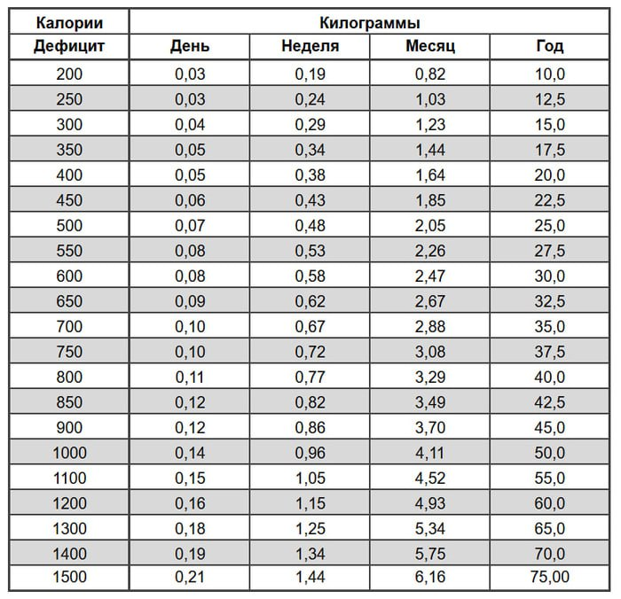

# Считаем скорость вашего похудения

> Исходник Tilda: курс 425521, лекция 7058513  
> Раздел: Часть 2. Расход калорий и энергетический баланс  
> Статус на 2026-08-28: Опубликовано  
> Режим: архивная копия без содержательной редактуры. Порядок блоков сохранён; точная блочная топология находится в `raw-blocks.json`.

---

Сколько времени нужно на похудение?⁠ Ответ на этот вопрос либо поставит жирный крест на вашем похудении, либо заложит крепкий фундамент для изменений в жизни.

Мне на запомнился один звонок в прошлом году, когда женщина просила волшебные советы по питанию, чтобы похудеть на 10кг за 6 недель к свадьбе дочери.

Выслушав прошлый опыт её диет, я деликатно попытался объяснить, что для успешного похудения ей нужно работать не с питанием, а с адекватностью своих ожиданий. Больше она мне не звонила ¯\_(ツ)_/¯

**Главная формула похудения:**

<!-- tilda-callout {"background":"rgb(235, 235, 235)","color":"rgb(0, 0, 0)","fontSize":"18px","iconColor":"rgb(255, 0, 0)"} -->
> [нужно сбросить кг] * 7300 ккал / [за сколько дней] = [ежедневный дефицит калорий]

**Примечание, когда я сам считаю ваши цифры, я использую 7500-7700 ккал на 1 кг сброшенного веса. Но если вы будете считать сами, то скорее всего не обратите внимания на разные детали и лучше используйте в расчетах 7300-7400. *

Когда собираетесь серьезно худеть — дольше, чем пару недель, то стоит рассматривать здоровый дефицит не сильно больше чем +/- 500 ккал.

По моему опыту 600+ дневников питания, если начальный вес менее 100кг то мало кому удается стабильно держать дефицит больше 500-600ккал без слёз, срывов, потери мышц и поиска психолога.

Да, есть уникумы, которые могут в дефицит и 900 и 1100 ккал, знаю таких людей, тоже работал с ними.

Если в ваших влажных мечтах чтобы сбросить желаемые килограммы до дня рождения, годовщины или просто до лета, вам нужно быть на дефиците типа 800-900 ккал или больше, то задайте себе вопрос, а вы считаете себя уникумом, который входит в топ 5% всех худеющих или нет?

**Помните женщину из начала поста?**

Каждый божий день ей надо быть в дефиците 1700 ккал, чтобы похудеть на 10 кг за 42 дня. 

> 10кг * 7300ккал / 42 дня = 1738ккал

По моим прикидкам энергетический баланс у неё 1800 ккал. Если постараться, то реалистично, нам бы удалось поднять его до 2000 ккал в день, но даже так пришлось бы питаться всего на 300 ккал в день!!!

В анамнезе у той женщины 4 похудения за прошлые 4 года и + 5кг за это время... Совпадение? Ну хз...

Успешное похудение — это не 12 кг за 2 месяца, это когда 12кг пофигу за сколько, но которые больше НИКОГДА не возвращаются.

Я составил наглядную табличку используя эту формулу. Обратите внимание, что если смотреть сколько килограмм вы можете скинуть за 1-2 недели, то не так важно какой дефицит вы возьмёте, хоть смешные 200 ккал, хоть серьезные 700-800 ккал.

Это в любом случае будут жалкие крохи, которые вы даже ее заметите в зеркале! Напомню, я говорю про реальный жир, а не героическую победу над отеком после пьянки!

С другой стороны, если взять даже самые маленькие значения дефицита, такие как 200, 300 или 400 ккал, но умножить их на целый год, то цифры буквально шокируют!!! 10!! 15!! 20 килограмм!!! Многим столько даже и не надо.

Бесполезно усираться на большом дефиците калорий (на низкой калорийности), если вы не можете держать этот дефицит хоть сколько-нибудь долго!

А чтобы держать дефицит долго, надо чтобы ОН ВАМ ПОДХОДИЛ!! Причем тот, который вам хочется и тот, который вам подходит — очень редко совпадают...

**Итого:**

1️⃣ Если для достижения ваших целей нужен дефицит 800ккал и больше — окститесь!

2️⃣ Если вы тот уникум, которому и 1000 ккал дефицита как слону комариный укус — отметьтесь в комментариях, мы на вас хоть посмотрим.

3️⃣ Если не можете держать даже 450-600 ккал дольше пары недель — скорее всего это НЕ ваша личная особенность, а просто несбалансированное питание, в котором негде взять насыщение. О том как это исправить — 80% моего контента))

4️⃣ Если понятия не имеете, какой дефицит для вас окей, а какой не окей, то советую уделить 2 недели подсчету калорий и ещё 2 недели формированию целей похудения на основе этих подсчетов, а потом дальше можно и без калорий. Об этом остальные 20% моего контента))

