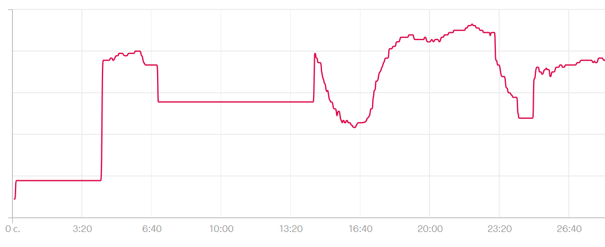
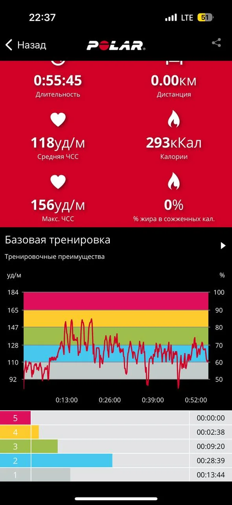
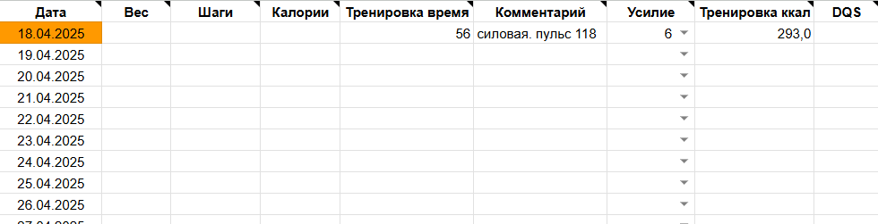
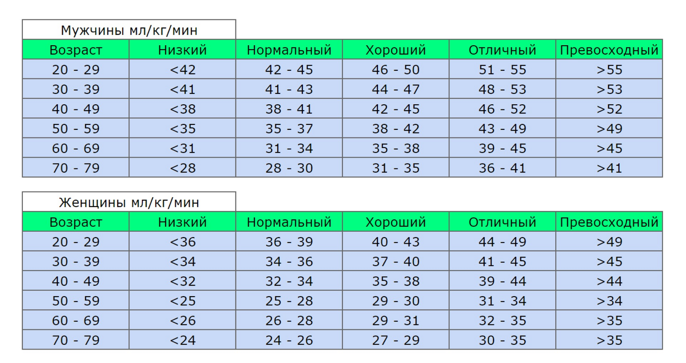
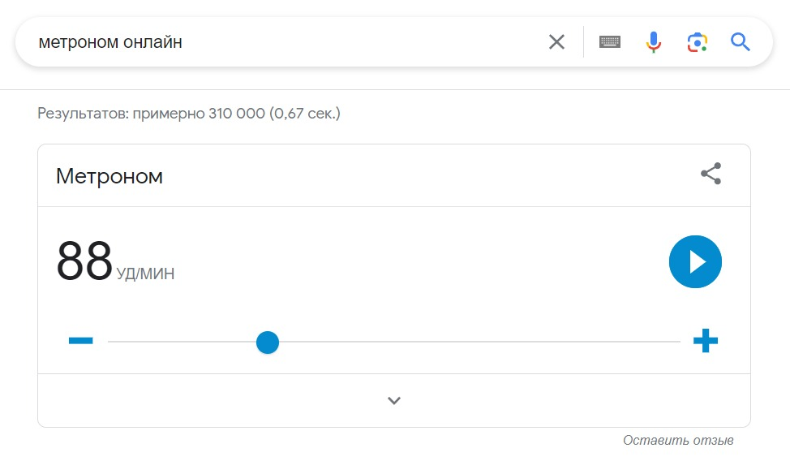

# Дополнительные материалы по тренировкам

> Исходник Tilda: курс 425521, лекция 7058541  
> Раздел: Часть 2. Расход калорий и энергетический баланс  
> Статус на 2026-08-28: Опубликовано  
> Режим: архивная копия без содержательной редактуры. Порядок блоков сохранён; точная блочная топология находится в `raw-blocks.json`.

---

Для тех, кто раньше не особо вникал в тренировки информация в этом посте может показаться излишней для простого человека, желающего скинуть вес, но в этом-то и проблема. Мы пытаемся что-то изменить, не понимая как это работает, поэтому я за то, чтобы иметь хотя бы общее представление о том как функционирует ваш организм, когда вы гоняете его по залу или на пробежке.

### Оглавление:

- Как измерять пульс
- Как записывать тренировки
- Немного про VO2max/МПК
- VO2max — опросник
- Тест #1 Легкий — ходьба
- Тест #2 Cложный — степ-тест
- Источники:

### Как измерять пульс

Мерить его придется много: для тестирований, пульс в покое и пульс для расчета тренировок. Если у вас пока нету пульсометра, то для тестирования степ-тест и измерения пульса в покое, можно воспользоваться методом пальца. Для этого нащупайте у себя сонную артерию, придавите её пальцами и считайте удары на протяжении 15 секунд, затем умножьте на 4. Считать 10 секунд слишком мало, 20 слишком много, а вот 15 в самый раз.

**Пульс в покое. **На этот показатель влияет не только общая тренированность, но и усталость со стрессом. Поэтому мерить стоит утром, сразу после того, как проснётесь, не вставая с кровати, желательно чтобы накануне не было больших нагрузок и недосыпа. Для этого положите с вечера рядом часы (или спите с ними) значение пульса нужно не во сне, а после пробуждения, когда вы спокойного лежите в кровати, максимум залипаете телефон.

**Пульс на тренировке. **Сделайте общую разминку, затем запустите тренировку на часах, тренируйтесь без нажатия паузы, затем если в конце тренировки у вас какая-то растяжка или что-то слишком лёгкое, остановите тренировку в часах перед этим. Не используйте кнопку паузы на часах или другом устройстве, где вы замеряете время и пульс во время тренировки. Важно общее время и средний пульс за всё время тренировки. Если пауза на тренировке вышла случайно, например пришлось куда-то отойти, тогда да. Но между подходами не останавливайте запись.

Мой калькулятор в отличие от других, выдает Нетто расхода калорий, вы можете не переживать, если посреди занятий будете отдыхать хоть 5минут хоть 10 минут.

Адекватная точность расчета в моем калькуляторе достигается при среднем пульсе от 105-110 и до 170 ударов в минуту. Если ваш пульс ниже, то нужно уже смотреть внимательнее, так, без консультации я не могу подсказать точнее. Но как минимум это означает что тренировка совсем низкоинтенсивная и это "проблема" само по себе. Вспоминайте требования ВОЗ... у нас должны быть и высокоинтенсивные нагрузки хоть иногда.

Если вы, к сожалению, используете какой угодно датчик пульса, кроме нагрудного, то прежде чем считать энергозатраты, просто проверьте в часах или приложении, как выглядит кривая пульса. Среднее значение в виде цифр может выглядеть адекватно, а вот график как-то так:

Это значит, что половину данных не записалось со всеми вытекающими последствиями. С датчиками на запястье такое бывает случается, с грудным датчиком почти нет.

**Если вы измеряете пульс пальцем** то засекайте время тренировки на секундомере и измеряйте пульс пальцем 4-8 раз за тренировку.

Для силовых = 2-4 раза сразу после очередного подхода и 2-4 раза после периода отдыха перед очередным подходом, а потом возьмите среднее значение. Это, конечно, будет очень примерно, но лучше, чем ничего.

Для кардио = просто 3-5 раз в случайных местах тренировки.

### Куда записывать тренировки

Подробно этот блок я расписал в первой части курса в материале [«Техническая подготовка»](https://telegra.ph/Povelitel-cifr-01-30) под заголовком «Куда записывать тренировки». Там я привел список приложений, их краткое описание и ссылки на магазины приложений для скачивания.

Дальше у вас глобально два варианта, как я и говорил в видео.

- Брать из записанных тренировок только пульс и продолжительности тренировок и вбивать это в мой калькулятор в таблице.
- Или полагаться на готовые цифры расхода из приложения.

Если цифры отличаются не более чем на 10%, то ориентируйтесь по приложению и не заморачивайтесь, а на мою таблицу смотрите лишь когда планируете свои тренировки наперед, чтобы посчитать итоговый расход калорий, к примеру, за следующую неделю.

Ведь если у вас есть тренировочный план, то вы примерно понимаете какое время и на каком пульсе вы проведете в каждой тренировке.

После тренировки сделайте скриншот и выложите его у себя в дневнике день в день прямо в том же сообщении, где фотографии с едой.

Когда работаю с человеком индивидуально, я всегда беру из приложения только время тренировки и пульс. А калории считаю по своему калькулятору. Иногда значения совпадают, иногда отличаются совсем немного, а иногда цифры совсем-совсем разные. Это зависит и от индивидуальных особенностей и от вида тренировки и от датчика пульса. В идеале моя задача сводится к тому, чтобы сказать:

Вот видите цифру расхода калорий в приложении -- ей можно доверять. Либо берёте эту цифру и умножаете на определенный коэффициент. Иногда это +20-30% иногда минус 20-30%.

Затем раз в неделю, когда заполняете табличку "взвешивания" вносите туда и ваши тренировки. Указывайте время, пульс и расход калорий.

### Компенсация калорий после тренировки

Если за тренировку вы тратите 350-400 ккал или меньше, то вы можете вообще никак не корректировать ваше питание в этот день. Ну то есть если мы договорились питаться в среднем на 1700 ккал, то вы и в день тренировки так питаетесь и в день без тренировки точно так же.

Отклик голода не будет слишком большим. Нас ведь интересует средненедельный дефицит, а не каждого отдельного дня. 

А если вы тренируетесь на 400+ккал за один конкретный день, то в этот конкретный день вам необходимо потребить дополнительно 30-50% от потраченных калорий. Например потратили 500 ккал, а ваша норма на день была 1700 ккал в среднем. Значит в этот конкретный день вам нужно съесть 1850-1950ккал. 

Эти цифры про больше или меньше 400 ккал за день и про 30-50% компенсации калорий — это не фундаментальный закон вселенной и не единственно правильные цифры, но ориентироваться надо на что-то вокруг них.

Отсюда и простой совет. Не стремитесь делать тренировки сильно больше 400 ккал, если вы девушка и работаете на похудение, а не на спортивный результат. Для мужчин это может быть 450-500 или даже 550ккал за раз.

Тем более более высокий расход будет иметь меньший SFR (см. стрим). А если этот расход так повышен из за интенсивности, не из за времени, то тем более.

### Какие нормы активности существуют

Я всегда работаю с первоисточниками и моя основная работа — это переводить с непонятного язык теории на понятный язык действий. Но сегодня тот случай, когда пересказывать первоисточник — что портить. Частично этот вопрос я затрагивал в стриме, но тут отвечу чуть подробнее:

На скриншотах выше — основные выжимки из материала ВОЗ под названием "РЕКОМЕНДАЦИИ ВОЗ ПО ВОПРОСАМ ФИЗИЧЕСКОЙ АКТИВНОСТИ И МАЛОПОДВИЖНОГО ОБРАЗА ЖИЗНИ".

И мне мало что есть к этому добавить, очень рекомендую к прочтению весь документ, он не очень большой и с картинками — вам понравится. Там рекомендации и для детей и для взрослых и для пожилых и минимальные рекомендации и максимальные, всё прям по полочкам. 

От себя добавлю лишь только то, что это требования грубо говоря, чтобы вы не померли раньше времени от мышечной атрофии или других сопутствующих проблем. А для похудения у нас будут свои критерии того сколько надо и сколько достаточно двигаться. Но это мы будем определять уже на следующих консультациях индивидуально. А пока — почитайте обзор от ВОЗ, они старались 🙂

Полный файл можете скачать по ссылке: [https://iris.who.int/server/api/core/bitstreams/ce209301-5480-48f4-827d-5edd9ea0a6c2/content](https://iris.who.int/server/api/core/bitstreams/ce209301-5480-48f4-827d-5edd9ea0a6c2/content)

### Немного про VO2max/МПК

Это максимальный объем кислорода, который организм может потребить из вдыхаемого воздуха за 1 минуту при максимальной нагрузке. Количество кислорода измеряется в мл на кг массы тела в минуту. МПК определяет, насколько эффективно сердце, легкие и сосуды обеспечивают организм кислородом во время любых нагрузок, а значит, отражает аэробную производительность и общую выносливость человека. 

С 2016 года Американская **кардиологическая **ассоциация использует МПК для оценки состояния сердечно-сосудистой системы. Это как бы намекает, что его важность простирается далеко за пределы определения уровня физического развития и имеет значение абсолютно для каждого.

Таблица из видео со средними значениями

Многие исследования продемонстрировали сильную связь между высоким VO2max и снижением риска хронических заболеваний, улучшением сердечно-сосудистого здоровья и увеличением продолжительности жизни.

Там, конечно, замешаны генетические факторы, но не стоит воспринимать, будто есть волшебный параметр, который определяет всё это, скорее наоборот. Здоровый образ жизни и занятия спортом влияют на продолжительность жизни, а МПК, лишь является индикатором этого процесса.

Короче, неплохо было бы сначала узнать свой МПК, а потом начать что-то делать для его улучшения. Причем отлично подойдут как силовые тренировки, так и аэробные и даже простые домашние, главное, чтобы были тренировки. А подобрав правильную программу и уровень нагрузок, можно будет добиться успеха не только в похудении, но и в развитие этого показателя.

**для справедливости надо сказать, что в плане продолжительности жизни потеря лишних 10кг, повлияет ничуть не хуже, чем улучшение МПК на несколько пунктов. *

### Тестирование VO2max — опросник

Выберите утверждение, которое лучше всего описывает ваши отношения со спортом

Не занимаюсь активным отдыхом, спортом или физической активностью

**0 —** Любыми способами избегаю перемещения пешком, лифт, эскалатор, использую машину или такси везде, где можно, либо просто не выхожу из дома.

**1 —** Немного хожу в удовольствие, иногда могу подняться по ступенькам, бывает достаточно немного поупражняться и поваляется пот и одышка.

Бывает занимаюсь активным отдыхом: выход на природу, боулинг, настольный теннис, йога, пилатес или что-то сравнимое по нагрузке. Иногда могу потренироваться дома.

**2 — **Да, от 15 до 60 минут в неделю.

**3 —** Даже больше часа в неделю.

Регулярно тренируюсь, например, бегаю, езжу на велосипеде (не прогулка), плаваю, большой теннис, футбол, силовые тренировки в зале.

**4 —** Бегаю 1-2 километра в неделю или 30 минут другой сопостовимой нагрузки.

**5 —** Бегаю по 8 км в неделю или 30-60 минут другой сопоставимой нагрузки.

**6 —** Бегаю по 8-15 км в неделю или 1-3 часа другой сопоставимой нагрузки

**7 —** Бегаю 15 и более км в неделю или более трех часов другой сопоставимой нагрузки

### Тест №1 Легкий — ходьба

Вам потребуется:

1. Пройти пешком 1600м.

2. Засечь время, которое на это потребуется.

3. Измерить пульс сразу после теста. 

4. Ввести в калькулятор время и пульс.

Маршрут должен быть ровным, без перепадов высоты, по возможности прямой, без множества поворотов. Желательно, чтобы вам не приходилось преодолевать перекрёстки, ступеньки или другие препятствия. 

Для определения расстояния используйте часы в режиме тренировки или спортивное приложение на телефоне (важно учитывать метры, а не шаги). Если такой возможности нет, можно заранее отмерить по карте точное расстояние.

Тестирование займёт от 12 до 17 минут. Необходимо выбрать максимально высокий темп без перехода на бег и преодолеть расстояние как можно быстрее.

Перед началом рекомендую размяться пару минут. А в конце важно зафиксировать пульс сразу после завершения активности, пока он не начал снижаться. Адекватная погрешность 4-5 ударов.

### Тест №2 Cложный — степ-тест

Вам потребуется:

1. Делать подъёмы на возвышенность 3 минуты.

2. Соблюдать заданный темп.

3. Замерить пульс в конце активности.

4. Внести в калькулятор ваш пульс.

Нужно подобрать возвышенность высотой в 40 см. Лучше всего использовать стул нужной высоты. Если стул выше на несколько сантиметров можно подложить что-то рядом на пол под ноги. Тестирование с возвышенностью ниже 38 см или выше 43 см — может дать некорректные результаты. 

Открыть любой метроном онлайн, например, просто введите запрос в google. Для девушек выставьте частоту метронома на 88, для мужчин — 96 ударов в минуту.

Перед выполнением теста немного разомнитесь и отрепетируйте действия, чтобы во время тестирования чувствовать себя уверенно и не сбивались с ритма. Если у вас нет уверенности в движениях или вы испытываете дискомфорт, лучше отказаться от выполнения и теста и вернуться к нему позже.

На каждый удар метронома необходимо совершать один шаг в следующей последовательности:

- Обе ноги на полу;

- Левая нога на стуле;

- Обе ноги на стуле;

- Левая нога на полу;

- Обе ноги на полу...

Раз в 30-40 секунд можно пропустить пару ударов метронома, чтобы поменять ногу, которая первой поднимается на стул, это не страшно.

Значения пульса стоит взять за последние 20-30 секунд выполнения теста, если вы используете пульсометр или измерьте его пальцем сразу после окончания 3-х минут.

### Источники:

[Assessment of Physical Activity and Energy Expenditure: An Overview of Objective Measures](https://www.ncbi.nlm.nih.gov/pmc/articles/PMC4428382/)

[Accuracy in Wrist-Worn, Sensor-Based Measurements of Heart Rate and Energy Expenditure in a Diverse Cohort](https://www.mdpi.com/2075-4426/7/2/3)

[A Theoretical Method of Using Heart Rate to Estimate Energy Expenditure During Exercise](https://www.researchgate.net/publication/228510492_A_Theoretical_Method_of_Using_Heart_Rate_to_Estimate_Energy_Expenditure_During_Exercise)

[Simple Prediction of Metabolic Equivalents of Daily Activities Using Heart Rate Monitor without Calibration of Individuals](https://www.researchgate.net/publication/338208689_Simple_Prediction_of_Metabolic_Equivalents_of_Daily_Activities_Using_Heart_Rate_Monitor_without_Calibration_of_Individuals)

[Wearable activity trackers–advanced technology or advanced marketing?](https://www.ncbi.nlm.nih.gov/pmc/articles/PMC9022022/)

[Validity of Wrist-Worn Activity Trackers for Estimating VO2max and Energy Expenditure](https://pubmed.ncbi.nlm.nih.gov/31443347/)

[Energy expenditure of nonexercise activity](https://pubmed.ncbi.nlm.nih.gov/11101470/)

[Accuracy and Acceptability of Wrist-Wearable Activity-Tracking Devices: Systematic Review of the Literature](https://www.jmir.org/2022/1/e30791)

[Survival of the fittest: VO2max, a key predictor of longevity?](https://pubmed.ncbi.nlm.nih.gov/29293447/)

[Рекомендации ВОЗ по вопросам физической активности и малоподвижного образа жизни ](https://apps.who.int/iris/bitstream/handle/10665/337001/9789240014909-rus.pdf)

*Fahey, T., Insel, P., Roth, W., Fit & Well: Core Concepts and Labs in Physical Fitness and Wellness 7th Edition*

