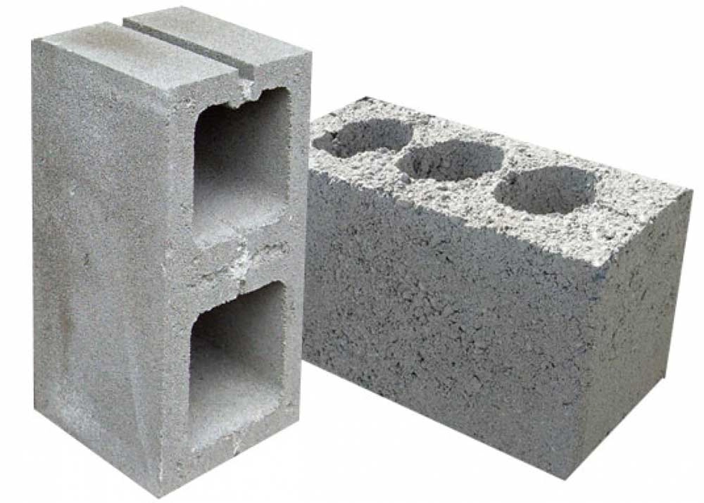

# Блоки в питании и каталог приемов пищи

> Исходник Tilda: курс 425521, лекция 7058577  
> Раздел: Часть 3. Переход на интуитивное питание  
> Статус на 2026-08-28: Опубликовано  
> Режим: архивная копия без содержательной редактуры. Порядок блоков сохранён; точная блочная топология находится в `raw-blocks.json`.

---

Если мы хотим отказаться от учета калорий, то мы просто обязаны как-то станддартизировать хотя бы часть наших приемов пищи и обсчитать их калорийность заранее. Чтобы потом либо повторять 1 в 1, либо знать, как измениться калорийность при замене чего-то в тарелке.

Поэтому чтобы построить систему питания, давайте разобьём всё, что мы едим за день на блоки и будем оперировать именно таким понятием. Всего существует лишь пять блоков:

1. Завтрак
2. Обед
3. Ужин
4. Все перекусы по ходу дня вместе взятые
5. Дожор вечером (опционально)

Если у вас два основных приема пищи или четыре — это не имеет никакого значения и тоже нормально, значит у вас будет чуть больше или меньше блоков. Вся остальная логика остается неизменной.

#### Блоки в питании

Блок — это всё что вы съедаете за один приём пищи в рамках 15-20 минут — это либо завтрак либо обед, либо ужин, либо второй ужин (ну мало ли). А всё, что вы съедаете между этими приемами пищи — перекусы.

Причем перекусы могут быть, могут не быть, их может быть 2-3-4 или один — неважно. Важно, посчитать их все вместе в один блок, даже если по факту они будут разбросаны по всему дню.

Особняком стоит вечерний дожор. Технически, это тоже перекус, это не обязательный элемент питания, но если он есть, то учитывать его стоит отдельно — в следующем материале (про окна голода) вы поймете для чего именно.

Что здесь важно — называть все своими именами. Если у вас есть завтрак, а после завтрака через 4 часа — круассан с кофе, то это что угодно, но точно не перекус, потому что 450-500 ккал примерно в районе обеда — это (сюрприз) обед! В каждый момент времени вы четко должны понимать, это у вас перекус или основной прием пищи. Кстати о перекусах:

#### Перекус vs Кусочничество

И то и другое — еда между основными приёмами пищи. Но с точки зрения системы питания это две разные вещи.

**Перекус** — это запланированный приём пищи между основными. Он заранее вписан в день и выполняет конкретную задачу:

- Помочь спокойно дотянуть до следующего приёма пищи;
- Поддержать энергию;
- Pакрыть небольшой голод;
- Иногда просто быть запланированным лакомством.

Главный признак перекуса — о нём известно заранее. Он не возникает случайно. Он повторяется изо дня в день и вписан в структуру питания.

**Кусочничество** — это хаотичное поедание мелких кусочков на автомате и между делом. Печенька с чаем. Горсть конфет. Остатки ужина. Что-то попробовать во время готовки. Импульсивная покупка на кассе.

Обычно это происходит от скуки, привычки, стресса, из-за того что угостили или потому что «жалко выбрасывать». Иногда мы даже пытаемся объяснить это какой-то целью, но эта цель обычно декларируется постфактум уже после произошедшего.

Если бы вы заранее знали, что по ходу дня вам понадобится этот бутерброд, и он был бы учтён в структуре дня — это был бы перекус. Если он появился внезапно и никак не связан с планом питания — это кусочничество.

Попробуйте сделать простой эксперимент. Возьмите 3–4 случайных дня вашего дневника питания и посмотрите на всю еду между основными приёмами пищи. Что это было: перекусы или кусочничество? Была ли у каждого из них понятная задача? Можно ли было бы их запланировать заранее или вообще обойтись без них?

Если вся еда между основными приёмами пищи — это перекусы, ими можно управлять: заранее посчитать, запланировать, изменить. Если же это кусочничество, которое возникает внезапно и по настроению, то никакая система питания с ним работать не сможет.

Поэтому первый шаг очень простой: превратите всё ваше кусочничество в запланированные перекусы.

#### Размер блоков

**Смысл разделения питания на блоки** — чтобы мы могли изолировать их и посчитать, а сколько нам примерно нужно еды на завтрак, чтобы мы комфортно дотянули до обеда.

Если раньше вы считали калорийность всего дня и пытались понять, сколько калорий вам нужно на сутки, то теперь задача становится точнее. Нужно понять, сколько калорий вам нужно:

- На завтрак, чтобы спокойно дожить до обеда
- На обед, чтобы нормально дотянуть до ужина
- На ужин, чтобы не сорваться вечером

Зная свою целевую калорийность, разбить её по блокам довольно просто. Например, если ваша целевая калорийность — 1800 ккал, начальное распределение может выглядеть так:

1. Завтрак = 450
2. Обед = 450
3. Ужин 550
4. Все перекусы днем = 150
5. Дожор = 200

Это не строгая схема, а лишь стартовая точка. Дальше вы начинаете подгонять блоки под себя.

Например, если к обеду вы приходите слишком сытым — значит завтрак был слишком большим. Убираете из него 50–100 ккал и смотрите, что происходит на следующий день. Если же к ужину вы приходите уже очень голодным — значит обед был слишком маленьким, и его стоит немного увеличить.

Так постепенно вы находите такой размер блоков, при котором голод между приёмами пищи становится предсказуемым и управляемым. Чтобы понять, как это выглядит у вас сейчас, откройте приложение с калориями и посмотрите:

- Насколько сильно у вас отличаются завтраки день ото дня?
- Сколько калорий обычно приходится на перекусы?
- Повторяются ли эти цифры или каждый день получается совершенно разная картина?

Если окажется, что ваши приёмы пищи по калорийности и так примерно похожи друг на друга — значит вы уже почти всё делаете правильно. Осталось лишь это зафиксировать и превратить в систему.

#### Каталог приемов пищи

Логичным продолжением темы блоков становится создание собственного каталога приёмов пищи. Это не книга рецептов вроде «борщ, плов, салат оливье». Каталог — это список конкретных приёмов пищи, которые вы регулярно повторяете.

Для этого откройте свой дневник питания и посмотрите, какие блюда у вас появляются снова и снова. Какие завтраки, обеды или ужины вы готовы спокойно есть неделями и месяцами.

Если таких приёмов пищи наберётся хотя бы несколько — это уже хорошо. В идеале их должно быть 10–15. Этого достаточно, чтобы питание оставалось разнообразным и при этом не превращалось каждый день в новый эксперимент.

Каждый такой шаблон — это не просто рецепт, а конкретная тарелка. Нужно зафиксировать, что именно в неё входит: сколько граммов мяса, сколько крупы, сколько овощей. Если блюдо сложное — просто расписываете его состав.

Все необходимые цифры у вас уже есть. Вы уже знаете свою калорийность для похудения и для поддержания веса. Теперь задача — собрать из знакомых блюд такие приёмы пищи, чтобы их сумма давала нужную калорийность дня.

Технически всё делается очень просто: вы берёте самые популярные блюда из своего питания, один раз считаете их калорийность в приложении и фиксируете их как готовые шаблоны приёмов пищи.

#### А теперь самое интересное

После того как вы определили нужную калорийность и подогнали под неё рецепты по граммам, следующий шаг — постепенно перевести эти рецепты из языка граммов и калорий в язык действий.

То есть не просто помнить, что в тарелке 120 граммов крупы, 150 граммов мяса и 200 граммов салата. А понимать, какие конкретные действия вы делаете, чтобы собрать этот приём пищи.

**Для примера возьмём мою опорную точку овсянки на утро.**

Чтобы собрать завтрак примерно на 500 калорий, я беру одну мерную ёмкость. Этой ёмкостью зачерпываю овсянку, в неё же наливаю молоко до определённой отметки, затем этой же ёмкостью добавляю творог, беру одно яблоко среднего размера и два грецких ореха.

И всё. Это можно сделать практически на автомате. Я не думаю о граммах и калориях, я просто повторяю набор действий и понимаю, что в тарелке у меня примерно те же 500 ккал, которые я и ожидаю.

После этого приём пищи превращается в шаблон. В опорную точку. Я просто повторяю действия, а не считаю калории заново. При этом внутри шаблона остаётся небольшая гибкость: яблоко можно заменить на другой фрукт, орехи — на кусочек шоколада или что-то похожее по калорийности.

Та же логика работает и с более сложными блюдами. Например, вы приготовили гуляш. Один раз посчитали калорийность на один половник. Дальше вам не нужно помнить точные цифры — достаточно понимать, сколько половников вы кладёте в тарелку и какого размера гарнир или бутерброд идёт рядом.

Чтобы это работало, важны визуальные ориентиры. Постепенно вы начинаете оценивать порции не в граммах, а на глаз.

**Например:**

- Сколько помещается в вашу обычную кружку.
- Сколько помещается в вашу любимую тарелку и до какого уровня в нее стоит положить суп.
- Как это выглядит стандартная порция мяса по отношению к вашей ладони
- Какому количеству соответствует фрукт размером с ваш кулак и на сколько больше там калорий, если фрукт больше кулака.

Вы один раз всё это измеряете, запоминаете и фиксируете для себя. После этого многие блюда можно собирать уже без весов и без приложения.

То же самое можно сделать и с перекусами. Сначала вы понимаете, какой у вас лимит калорий на перекусы в течение дня. Потом считаете в приложении, что можно себе позволить на эти калории, делаете несколько вариантов перекусов и переводите их в простые ориентиры: штуки, половинки, кусочки.

После этого они просто добавляются в ваш каталог приёмов пищи.

Когда таких шаблонов становится достаточно, структура питания сильно упрощается. Основные приёмы пищи становятся повторяемыми и понятными, а в течение дня остаётся всего один-два приёма пищи, где калорийность заранее неизвестна. Именно здесь и начинается постепенный отказ от подсчёта калорий.

Если большая часть дня уже занята шаблонными приёмами пищи, вы примерно понимаете, сколько калорий они дают. Например, если около 70% дневной калорийности уже закрыто такими шаблонами, то оставшийся приём пищи довольно легко контролировать визуально.

**Сегодня: **

- Завтрак — шаблон.
- Обед —** купить где-то фаст-фуд.**
- Перекусы — шаблон.
- Ужин — шаблон.
- Дожор — **смотреть на глаз по голоду**

**Завтра**:

- Завтрак — шаблон.
- Обед — шаблон.
- Перекусы — **на глаз.**
- Ужин — **на глаз.**
- Дожор — шаблон, если будет голод

**Послезавтра:**

- Завтрак — **из того, что было.**
- Обед — шаблон.
- Перекусы — **на глаз.**
- Ужин — шаблон.
- Дожор — не понадобился

И вот за три дня вместо того, чтобы считать в приложении все 5400 ккал, вам приходится считать только то, что не попало в шаблоны — примерно 1800–1900 ккал за три дня. То есть всего по 500–600 ккал в день.

Такую величину уже можно оценивать на глаз, даже без записи в приложение. И даже если ошибка составит 5–10%, то на уровне всей дневной калорийности это будет всего около 1–2%.

В этот момент можно сказать, что вы перестали считать калории, но при этом продолжаете контролировать питание.

#### План отказа от учета съеденной еды

Чтобы было понятно, как происходит этот переход, можно описать его по пунктам:

1. Несколько недель вы считаете калории и находите комфортный уровень потребления, который даёт нужную скорость снижения веса. (я надеюсь этот этап у вас уже пройден)
2. Делите целевую калорийность дня на блоки питания: завтрак, обед, ужин, перекусы и при необходимости дожор.
3. Корректируете размер этих блоков так, чтобы голод между приёмами пищи был предсказуемым и управляемым (подробнее об этом — в следующем материале про окна голода).
4. Начинаете фиксировать повторяющиеся приёмы пищи и формируете каталог шаблонов. Сначала в виде точных рецептов с граммами и калорийностью.
5. Постепенно переводите эти шаблоны из языка граммов в язык визуальных ориентиров и действий.
6. Постепенно увеличиваете количество приёмов пищи, которые собираете по этим шаблонам.
7. Сокращаете долю еды, которая не входит в шаблоны, примерно до 30% дневной калорийности.
8. Эти оставшиеся 30% калорий уже можно спокойно оценивать на глаз и считать в уме, ориентируясь на накопленный опыт и чувство голода.

И в какой-то момент обнаруживаете, что калории вы больше не считаете, но питание всё равно остаётся под контролем.

