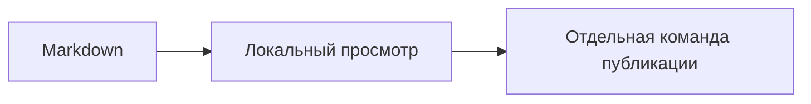

# Возможности Obsidian — лаборатория

Это отдельный непубликуемый технический образец. Откройте его в режиме чтения
Obsidian. Здесь показана дополнительная базовая разметка; это не обещание, что
сайт уже понимает её. Произвольные возможности всех community plugins сюда не входят.

## Все уровни заголовков

### Третий уровень

#### Четвёртый уровень

##### Пятый уровень

###### Шестой уровень

На сайте статьи сейчас используют только второй и третий уровни; главный
заголовок хранится отдельно от тела.

## Дополнительные выделения

~~Зачёркнутый текст~~, ==выделенный маркером текст==, ***жирный курсив***,
__жирный с подчёркиваниями__, _курсив с подчёркиванием_.

## Плашки Obsidian

> [!note] Обычная заметка
> Этот callout рисует сам Obsidian.

> [!warning] Предупреждение
> На сайте такой отдельный цвет ещё не согласован.

> [!info]- Скрываемое пояснение
> Разворачивается в Obsidian. Наш сайт не должен молча терять этот текст.

## Чекбоксы и вложенные списки

- [x] Прочитать пример.
- [ ] Проверить поведение в Obsidian.

1. Первый пункт.
   - Вложенный пункт.
   - Ещё один вложенный пункт.
2. Второй пункт.

Это не задания реального участника: отметки здесь не сохраняются в ЛК.

## Разделитель

---

Текст после горизонтальной линии.

## Код

Название файла в строке: `program.md`.

```text
Это пример текстового блока.
Он ничего не запускает.
```

## Сноска

У этой фразы есть пояснение[^demo].

[^demo]: Сноска тестового документа, не внешнее доказательство.

## Внутренняя ссылка и вставка заметки

[[01-99 — Тест переноса Markdown]]

![[01-99 — Тест переноса Markdown#Списки]]

## Формула

Пример записи: $2 + 2 = 4$.

$$
a + b = c
$$

## Диаграмма



## Комментарий и экранирование

Перед комментарием %%это редакторская заметка, не текст для сайта%% и после него.

\*Звёздочки в этой фразе не должны создавать курсив\*.

<!-- Пример технического комментария: сайт не должен выводить его читателю. -->

## Медиа и расширения

PDF, звук, видео, Canvas, Bases, Dataview и другие плагины требуют отдельных
контрактов. Они не становятся обычной статьёй и не публикуются этим стендом.

[Базовая разметка Obsidian](https://obsidian.md/help/syntax).
